# Tìm hiểu về giao diện quản trị của mailserver Kerio Connect

## 1. Accounts

#### a. Users

- Tại đây, người quản trị có thể thêm, sửa, xóa các tài khoản user cũng như nhiều chức năng nâng cao khác liên quan đến user

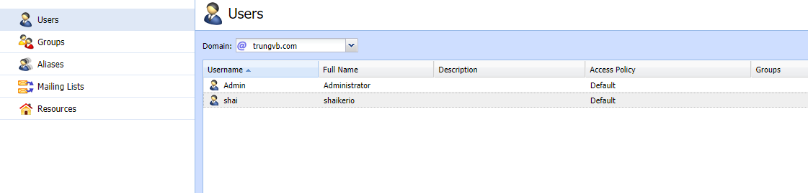

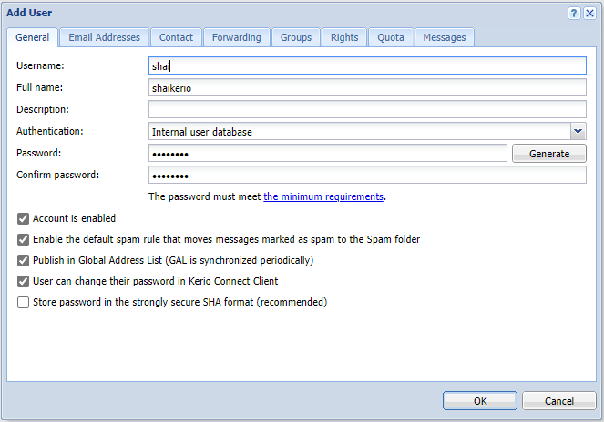

#### b. Groups

- Giao diện quản lý Groups, cho phép tạo, sửa, xóa group theo tên miền, gán group cho user

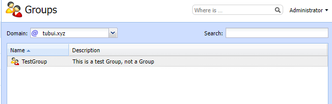

#### c. Aliases

- Giao diện quản lý Aliases (bí danh), có thể thêm/sửa/xóa bí danh cho user


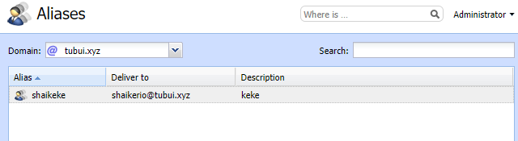

#### d. Mailing Lists

- Mailing Lists là nhóm những địa chỉ email, nếu có email nào được gửi đến mailing list, nó sẽ được gửi tới toàn bộ thành viên của mailing list đó

- Giao diện quản lý Mailing Lists cho phép thêm sửa xóa danh sách thư, cho phép gán moderator/user vào danh sách thư

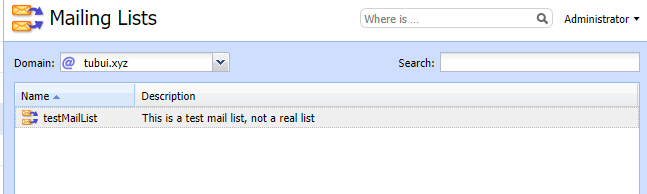

#### e. Resources

- Nơi quản lý các tài nguyên lập lịch như phòng họp, phòng hội nghị, bãi đậu xe và nhiều tiện ích khác

- Giao diện quản lý Resources cho phép thêm sửa xóa Resource

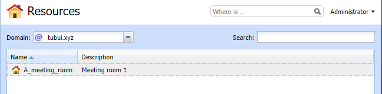

## 2. Status

#### a. Dashboard

- Hiển thị thông tin về server, bao gồm:
    - Kerio News: giới thiệu về các chức năng mới trong phiên bản hiện tại
    - System: hiển thị thông tin phiên bản Kerio Connect, hđh và hostname
    - System status: hiển thị trạng thái của hệ thống
    - License Details: thông tin giấy phép bản quyền kerio
    - Kerio Antivirus: hiển thị trạng thái hiện tại của Kerio Antivirus
    - System Health: hiển thị RAM, CPU, Disk của hệ thống dưới dạng biểu đồ (%, time)
    - Disk Storage Info: hiển thị dung lượng disk tổng và dung lượng disk đang được sử dụng

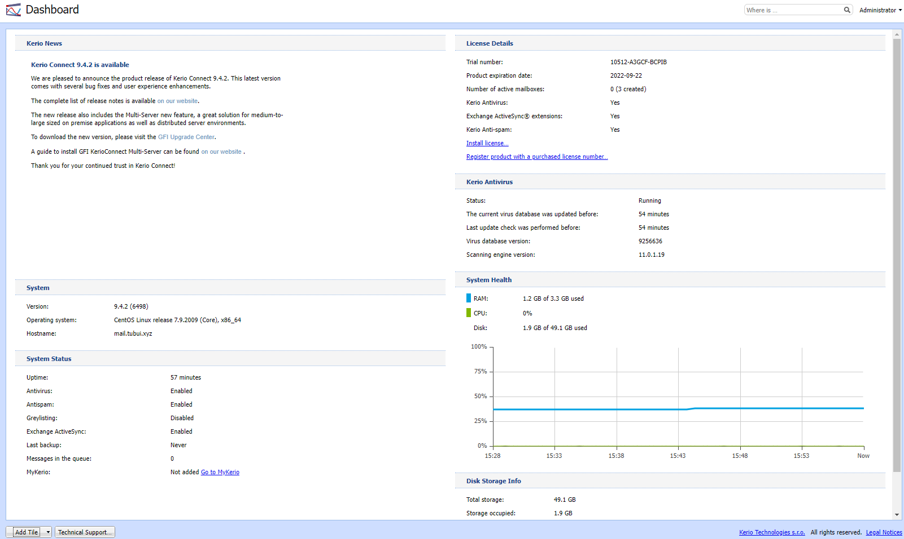

#### b. Message Queue

- Messages in Queue: hiển thị các thư đang được chờ trên hàng đợi để được gửi ra bên ngoài
- Message Queue Processing: tiến trình xếp hàng thư

#### c. Traffic Chart

- Traffic Chart: cho phép hiển thị các thông tin ```Connection``` hoặc các ```Message``` trong một khoảng thời gian (có thể tùy chỉnh tối đa 30 ngày)

#### d. Statistics

- Hiển thị các số liệu thống kê của hệ thống

#### e. Active Connections

- Hiển thị các ```Connection``` và các ```Session``` đang hoạt động

#### f. Opened Folders

- Hiển thị các thư mục đã mở 

#### g. System Health

- Hiển thị mức độ sử dụng RAM, CPU của hệ thống
- Hiển thị tổng dung lượng disk và dung lượng disk đã sử dụng

## 3. Configuration

#### a. Services

- Hiển thị các dịch vụ, port và trạng thái các dịch vụ của mail server


#### b. Domains

- Hiển thị các domain đã được tạo. Tại đây có thể tạo, sửa, xóa domain và thiết lập các tùy chọn cho domain đó

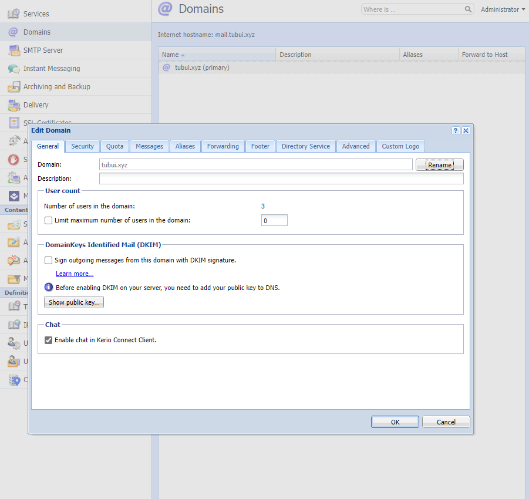

#### c. SMTP server

- Máy chủ SMTP xác định ai có thể gửi thư đi qua Kerio Connect và họ có thể thực hiện những hành động nào
- Để thiết lập gửi tin nhắn ra bên ngoài server Kerio Connect ta làm như sau:
    - Trong giao diện ```Configuration``` chọn ```SMTP server``` -> ```Relay Control```
    - Nhấp vào option ```Allow relay only for```
        - Để chỉ định một nhóm địa chỉ IP mà từ đó người dùng có thể gửi đi, chọn ```Users from IP address group``` và thiết lập như mong muốn
        - Để cho phép người dùng đã xác thực gửi thư đi, chọn ```User authenticated through SMTP for outgoing mail```
        - Để cho phép người dùng đã xác thực trước đó qua POP3 gửi thư đi từ cùng 1 địa chỉ IP, chọn ```Users previously authenticated through POP3 from the same IP address```
        - Nhấp ```Apply``` để lưu thiết lập

#### d. Instant Messaging

- Dịch vụ trò chuyện tức thời trên Kerio Connect

#### e. Archiving and Backup

- Kerio Connect hỗ trợ ```Full Backup``` và nó cũng hỗ trợ ```Differential Backup``` - lưu các tệp đã được thêm vào hoặc thay đổi kể từ lần sao lưu đầy đủ nhất
- Các thao tác để lên lịch sao lưu:
    - Trong giao diện quản trị, vào ```Configuration``` -> ```Archiving and Backup``` -> ```Backup```
    - Chọn ```Enable message store and configuration recovery backup```
    - Chọn ```Add```
    - Nhập mô tả cho bản sao lưu trong ```Description```
    - Chọn thời gian và loại sao lưu và nhấp vào ```ok```

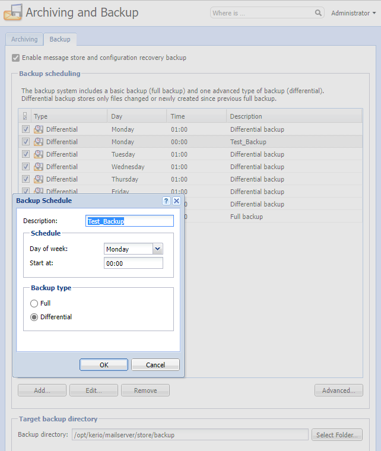

- Nhấp ```Advanced``` để tùy chỉnh 1 số tùy chọn nâng cao

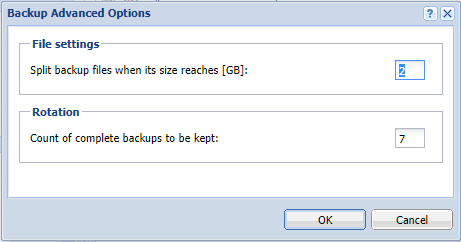

- Trong phần ```Target backup directory```, chỉ định thư mục nơi lưu trữ tất cả các bản sao lưu

- Trong phần ```Notification```, nhập địa chỉ email để nhận thông báo về các bản sao lưu

- Để sao lưu đầy đủ ngay lập tức, chọn ```Start Now```

- Cuối cùng nhấn ```Apply``` để áp dụng những thiết lập

- Kerio Connect tự động lưu trữ tất cả các tin nhắn trò chuyện của người dùng được gửi qua Kerio Connect client

- Để tải xuống tệp lưu trữ trò chuyện từ giao diện quản trị, ta làm như sau:
    - ```Configuration``` -> ```Archiving and Backup``` -> ```Archiving```
    - Trong phần ```Chat archiving```, chọn thời gian cho các tin nhắn muốn xem
    - Nhấp vào ```Download archive```
    - Lưu tệp vào máy tính

- Để khôi phục dữ liệu, giả sử ta đã có 1 bản sao lưu ở đường dẫn ```/opt/kerio/mailserver/store/backup```, thực hiện các thao tác sau:
    - Stop Kerio Connect: ```systemctl stop kerio-connect```
    - Vào thư mục Kerio Connect: ```cd /opt/kerio/mailserver```
    - Chạy lệnh: ```./kmsrecover /opt/kerio/mailserver/store/backup```

#### f. Delivery

- Trong Kerio Connect, ta có thể lên lịch để:
    - Tải xuống thư từ máy chủ POP3 từ xa
    - Nhận thông báo bằng lệnh ETRN đến các máy chủ xác định
    - Gửi tin nhắn từ hàng đợi tin nhắn

- Cấu hình ```Scheduling```:
    - Trong giao diện quan trị, chọn ```Configuration``` -> ```Delivery``` -> ```Schduling```
    - Chọn ```Add```
    - Chỉ định ```Time condition```
    - Để giới hạn việc lập lịch trong 1 phạm vi thời gian cụ thể, hãy chọn ```Valid only at time``` và chọn 1 phạm vi thời gian
    - Chỉ định ```Action``` để quy định hành động
    - ```OK``` để xác nhận


#### g. SSL Certificates

- SSL hỗ trợ việc cài đặt chứng chỉ SSL miễn phí Let's Encrypt cho mail.domain. Tại đây ta có thể tạo mới và xóa chứng chỉ

#### h. Advanced Options

- Kerio Connect bao gồm 2 giao diện:
    - Quản trị Kerio Connect dành cho quản trị viên
    - Kerio Connect Client dành cho người dùng

Để thiết lập 1 số tùy chọn cho Kerio Connect Client ta làm như sau:

- Trong giao diện quản trị, vào ```Configuration``` -> ```Advanced options``` -> ```Kerio Connect Client```
- Trong phần ```Maximum size limit```, thiết lập kích cỡ tin nhắn có thể được gửi từ ```Kerio Connect Client```
- Trong phần ```Session security```, hãy đặt thời gian chờ cho:
    - ```Session expiration timeout```: là thời gian không có bất kỳ hoạt động nào trong giao diện mà sau đó Kerio Connect kết thúc phiên. Thời gian chờ được đặt lại mỗi khi người dùng thực hiện 1 hành động
    - ```Maximum session duration```: là thời gian mà sau đó người dùng bị đăng xuất ngay cả khi họ vẫn đang hoạt động
    - Để bảo vệ, chống lại việc chiếm quyền điều khiển phiên, ta có thể thiết lập buộc đăng xuất sau khi người dùng Kerio Connect thay đổi địa chỉ IP của họ, chọn ```Force logout from Kerio Connect Client```
    - Trong phần thiết lập ```Custom logo```, ta có thể thiết lập logo cho Kerio Connect Clients

#### i. Security

- Kerio Connect cung cấp chức năng yêu cầu xác thực ```Require secure authentication```. Người dùng cần phải xác thực an toàn khi họ truy cập Kerio Connect
- Có thể chọn bất cứ phương thức xác thực nào sau đây:
    - ```CRAM-MD5```: xác thực mật khẩu bằng cách sử dụng thông báo md5
    - ```DIGEST-MD5```: xác thực mật khẩu sử dụng thông báo md5
    - ```LOGIN```
    - ```PLAIN```

- Nếu mật khẩu người dùng ở định dạng SHA thì nên chọn ```LOGIN``` hoặc ```PLAIN```. Nếu chọn nhiều phương phát, Kerio sẽ thực hiện phương pháp khả dụng đầu tiên

#### j. Administration Settings

- Trong Kerio Connect, ta có thể kích hoạt 1 tài khoản quản trị viên đặc biệt. Tài khoản này được tích hợp sẵn để truy cập giao diện quản trị
- Để kích hoạt giao diện quản trị ta làm như sau:
    - Đi tới phần ```Configuration``` -> ```Administration Settings```
    - Chọn ```Enable built-in administrator account```
    - Nhập password cho tài khoản. Tên tài khoản mặc định là ```Admin``` và không thể thay đổi

#### k. MyKerio

- MyKerio là dịch vụ đám mây cho phép quản lý nhiều phiên bản của các thiết bị Kerio Connect thông qua giao diện web tập trung

#### l. Spam filter

- Để phát hiện và loại bỏ thư rác, Kerio sử dụng những phương pháp sau:
    - ```Kerio Anti-Spam```: bộ lọc nâng cao các tin nhắn spam bằng các dịch vụ trực tuyến của Bitdefender
    - ```Blacklists```: ta có thể tạo danh sách địa chỉ IP và đưa vào Blacklists để chặn tất cả các thư từ địa chỉ đó
    - ```Caller ID``` và ```SPF```: lọc ra các thư có địa chỉ giả
    - ```Greylisting```: phương pháp greylisting chỉ gửi tin nhắn từ những người đã biết
    - ```Spam Repellent```: đặt SMTP greeting trì hoãn để ngăn việc gửi thư được gửi từ máy chủ thư rác

- Để đặt giới hạn cho việc đánh dấu thư là thư rác hay không phải thư rác, ta làm như sau:
    - ```Tag Score```: nếu tin nhắn đạt đến giới hạn **"Tag score"**, Kerio Connect sẽ đánh dấu nó là thư rác
    - ```Block Score```: nếu tin nhắn đạt đến giới hạn **"Block score"**, Kerio Connect sẽ hủy tin nhắn đó

#### m. Antivirus

- Kerio Connect bao gồm Kerio Antivirus, một biện pháp bảo vệ tích hợp chống lại các email độc hại có chứa virus. Virus có thể lây nhiễm vào máy tính gây hại cho các tệp hoặc cho hệ thống máy tính

- Cấu hình Antivirus:
    - Trong giao diện quản trị, chuyển đến ```Configuration``` -> ```Antivirus```
    - Để tự động cập nhật cơ sở dữ liệu virus, hãy chọn ```Check for update every [hours]```. Nếu có bất kỳ bản cập nhật vào, nó sẽ tự động được tải xuóng
    - Chọn hành động cho các thư có chứa virus. Kerio Connect có thể ```Discard the message``` (hủy tin nhắn) hoặc ```Deliver the message with the malicious code removed``` (gửi tin nhắn khi đã loại bỏ mã độc)
    - Ngoài ra, ta có thể chọn 2 tùy chọn để forward tin nhắn: ```Forward the original message to an administrator address``` để chuyển tiếp thư gốc đến địa chỉ của quản trị viên, hoặc ```Forward the filtered message to an administrator address``` để chuyển tiếp thư đã lọc tới địa chỉ của quản trị viên
    - Đối với bất kỳ tin nhắn nào mà Kerio Antivirus không thể quét (toàn bộ hoặc 1 phần), Kerio Connect có thể ```Deliver the original message with a warning prefixed``` để gửi tin nhắn gốc nhưng có cảnh báo hoặc ```Reject the message as if it was a virus``` để loại bỏ tin nhắn nếu nó là virus

#### n. Attachment Filter

- Nhiều loại virus được ẩn dưới dạng tập tin đính kèm. Kerio Connect có thể lọc ra các tập tin đính kèm email theo cài đặt. Nếu Kerio Connect phát hiện 1 tập tin đính kèm có vấn đề, nó sẽ xóa tập tin đính kèm và gửi tin nhắn mà không có tệp đó

- Thiết lập bộ lọc các tập tin:
    - ```Configuration``` -> ```Attachment Filter``` -> ```Add```
    - Nhập mô tả
    - Chọn điều kiện lọc
    - Chọn hành động với những tệp này

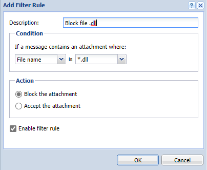

#### o. Message Filter

- Kerio Connect cho phép thiết lập quy tắc nhận (Incoming rules) và quy tắc gửi (outgoing rules)

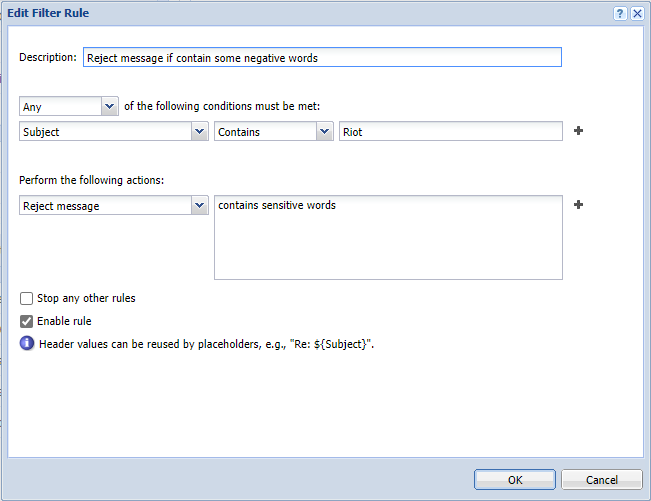

*Luật trên chặn tất cả các thư có tiêu đề chứa từ "Riot"*

#### p. Time Ranges

- Kerio Connect cho phép tạo time ranges để hạn chế tất cả các tác vụ đã lên lịch trong khoảng thời gian nhất định

- Tạo ```Time Ranges```:
    - ```Configuration``` -> ```Time Ranges``` -> ```Add```
    - Thiết lập thông tin Time Ranges
    - ```OK```

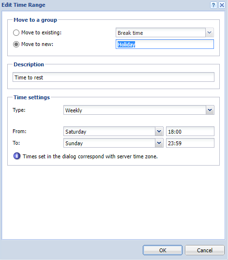

#### q. IP Address Groups

- Nhóm địa chỉ IP giúp dễ dàng xác định ai có quyền truy cập như quản trị từ xa

- Để thêm IP vào 1 IP Address Group mới ta làm như hình dưới

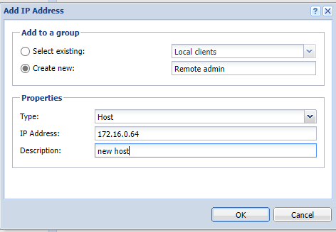

#### r. User Access Policies

- ```User Access Policies``` cho phép thiết lập quyền truy cập đối với một số dịch vụ dành cho người dùng cụ thể. Có thể hạn chế quyền truy cập vào bất kỳ người dùng nào từ một nhóm địa chỉ IP nhất định
- ```Add policy``` chỉ cho phép WebDAV, CalDAV (Đồng bộ hóa lịch), CardDAV (Đồng bộ hóa danh bạ), POP3

#### s. User Templates

- Tạo các mẫu user. Nếu ta cần tạo nhiều tài khoản cục bộ với các thiết lập tương tự, ta nên tạo 1 mẫu cho nhanh

#### t. Company Locations

- Trong Kerio Connect, ta có thể thêm thông tin liên hệ về công ty của mình

## 4. Log

- ```Config log```: lưu giữ lịch sử các thay đổi điều chỉnh config. Nó cho ta biết người dùng nào đã thực hiện các tác vụ quản trị cá nhân và thời gian người đó thực hiện
- ```Debug log```: giám sát nhiều loại thông tin khác nhau và được sử dụng để giải quyết vấn đề
- ```Error log```: hiển thị các lỗi có ý nghĩa quan trọng, thường ảnh hưởng đến hoạt động của mailserver. Thông báo lỗi điển hình được hiển thị trong lần khởi tạo dịch vụ liên quan đến Error log, phân bổ dung lượng đĩa, khởi tạo kiểm tra chống virus, xác thực người dùng không đúng cách,...
- ```Mail log```: chứa thông tin về các thư riêng lẻ được Kerio Connect xử lý
- ```Operations log```: thu thập thông tin về các mục đã loại bỏ và di chuyển (thư mục, tin nhắn, danh bạ, sự kiện, tác vụ và ghi chú) trong hộp thư người dùng. Nó rất hữu ích, đặc biệt nếu người dùng không thể tìm thấy 1 thư cụ thể trong hộp thư của họ
- ```Security log```: chứa thông tin liên quan đến bảo mật của Kerio Connect. Nó cũng chứa các bản ghi về tất cả các thư không gửi được
- ```Spam log```: hiển thị thông tin về tất cả các email spam được lưu trữ (hoặc được đánh dấu) trong Kerio Connect
- ```Warning log```: hiển thị các thông báo cảnh báo về các lỗi có ý nghĩa nhỏ. Các sự kiện hiển thị trong Security log không ảnh hưởng nhiều đến hoạt động của Kerio Connect
- ```Autdit log```: hiển thị thông tin về tất cả các lần xác thực thành công tài khoản Kerio Connect, bao gồm quản trị Kerio Connect, Kerio Connect Client, Microsoft Outlook,...