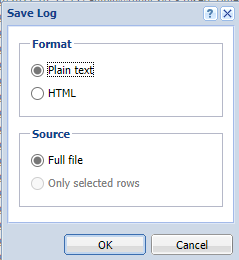
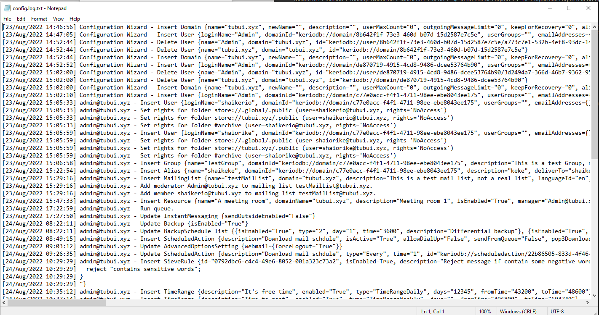
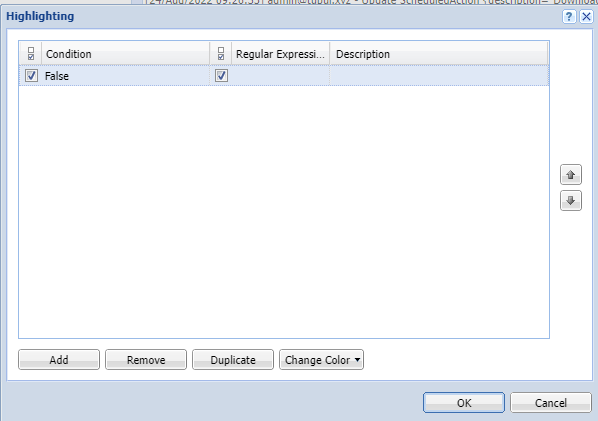
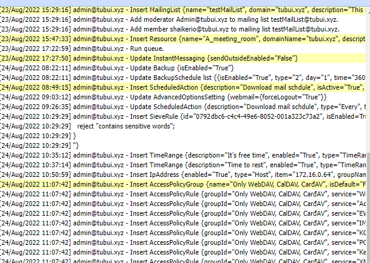
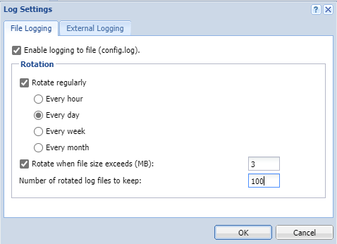
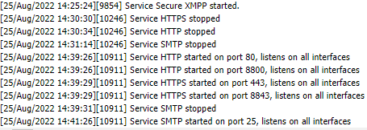

# Ý nghĩa của Log trên Kerio mailserver

Log là những tệp tin mà Kerio Connect ghi lại thông tin về những sự kiện, ví dụ như lỗi, cảnh báo và thông tin debug. Nhìn chung, mỗi loại log đều có 1 cột ghi lại timestamp và đều được ghi bằng tiếng anh bất kể ngôn ngữ hay phiên bản Kerio Connect nào

Dựa vào log, ta có thể biết được trạng thái của server cũng như của email và tìm đươc nguyên nhân dẫn đến lỗi như việc mail không được gửi đi. Từ đó tìm ra giải pháp khắc phục

### Thiết lập log

Log luôn có thể được đọc ở giao diện quản trị của Kerio Connect tại phần ```Logs```

Khi click chuột phải vào khu vực log, ta có thể thiết lập 1 tùy chọn sau:
- ```Save log```: lưu lại toàn bộ logs hoặc phần được chọn vào 1 file txt hoặc html



*Sau đó log được tải về máy*



- ```Highlighting```: highlight phân đoạn nào đó để dễ nhìn. Bằng việc chỉ định 1 xâu con hoặc 1 regex, toàn bộ những dòng chứa từ/hoặc match vs regex đó sẽ được highlight





- ```Log Settings```: thiết lập độ lớn mỗi file và số lượng file save log, ngoài ra cũng có thể cho phép log ra 1 server Syslog bên ngoài khác



Vị trí lưu file log mặc định:
- Windows: C:\Program Files\Kerio\MailServer\store\logs
- Mac OS X: /usr/local/kerio/mailserver/store/logs
- Linux: /opt/kerio/mailserver/store/logs

### Các loại log trong mail server Kerio Connect

#### 1. Log Config

Lưu lại toàn bộ các thay đổi trên server

Log Config có 3 loại:
- Lưu lại các thông tin đăng nhập trang quản trị Kerio Connect
- Lưu lại các thông tin thay đổi cấu hình trên database, nói cách khác là thay đổi cấu hình của user có liên quan đến database
- Những thay đổi khác trong cấu hình

**VD:** [24/Aug/2022 10:35:12] admin@tubui.xyz - Insert TimeRange {description="It's free time", enabled="True", type="TimeRangeDaily", days="12345", fromTime="43200", toTime="48600"}

- Thời gian: 10:35, ngày 24 tháng 8 năm 2022
- Người thực hiện: admin@tubui.xyz
- Hành động: thêm TimeRange có tên "It's free time", áp dung cho các ngày thường trong tuần, bắt đầu từ 12h đến 13h30

#### 2. Log Debug

Sử dụng để giám sát các loại thông tin nhất định, theo mặc định nó sẽ hiển thị các thông tin liên quan đến khởi động và dừng dịch vụ, giao thức trên Mail server Kerio Connect. Liệt kê các dịch vụ và port kết nối phục vụ cho quá trình vận hành của Mail server và các thông tin khác mô tả quá trình xử lý của mail server



#### 3. Error Log

Hiển thị những lỗi lớn mà có thể ảnh hưởng đến sự vận hành của mailserver. Điển hình của tin nhắn log hiển thị ở đây là về việc khởi tạo dịch vụ bị lỗi (thường do xung đột port), phân phát không gian ổ đĩa, sự khởi động kiểm tra antivirus, sự xác thực bất hợp lệ của người dùng,...

#### 4. Mail Log

Ghi lại tiến trình xử lý Email bao gồm:
- Mail gửi đến: [25/Aug/2022 15:31:39] Sent: Queue-ID: 63073369-00000003, Recipient: <shaiorike@tubui.xyz>, Result: delivered, Status: 2.0.0 , Remote-Host: 127.0.0.1, Msg-Id: <CAOmjrtRRy5Sv5E8U1s1nTYApW0gPb+jeKSwTa5QmWzHhny5qjA@mail.gmail.com>

- Mail gửi đi: [24/Aug/2022 16:28:11] Recv: Queue-ID: 6305ef2b-00000003, Service: Kerio Connect Client, From: <shaikerio@tubui.xyz>, To: <shaiorike@tubui.xyz>, Size: 958, Sender-Host: 0.0.0.0, User: shaikerio@tubui.xyz, SSL: yes, Subject: ghkaownglj, Msg-Id: <3475915060-20326@mail.tubui.xyz>

- Mailing list: [25/Aug/2022 15:31:37] Recv: Queue-ID: 63073369-00000003, Service: SMTP, From: <shaidokun@gmail.com>, To: <shaiorike@tubui.xyz>, Size: 3687, Sender-Host: 209.85.208.180, SSL: yes, Subject: Fwd: gjbasebgarjb, Msg-Id: <CAOmjrtRRy5Sv5E8U1s1nTYApW0gPb+jeKSwTa5QmWzHhny5qjA@mail.gmail.com>

Quá trình gửi/nhận mail qua Kerio Connect server:
- Gửi mail: Kerio Connect Client đưa email được gửi vào hàng đợi mail, với đầy đủ thông tin về địa chỉ người gửi, địa chỉ người nhận, tên người thực hiện thao tác, tiêu đề email và ID của email -> Sau đó, Kerio Connect server kiểm tra thiết lập relay xem email đó có được phép thông qua hay không, nếu có thì chuyển tiếp nó đến máy chủ POP3/IMAP để người dùng nhận thư về
- Nhận mail: dịch vụ SMTP đưa email nhận được vào hàng đợi mail, với các thông tin về người gửi, người nhận, tiêu đề, địa chỉ IP người gửi và ID email -> Kerio mailserver sau đó kiểm tra địa chỉ người nhận và chuyển thư về hòm thư của người này

#### 5. Operations Log

Lưu lại những thay đổi như xóa và di chuyển các email/danh bạ/sự kiện/nhiệm vụ/ghi chú trong hộp thư của người dùng. Trong trường hợp các email bị đánh dấu spam và di chuyển vào hòm thư spam cũng sẽ được ghi log tại đây

- Removed/moved item: [23/Aug/2022 16:56:27] {MOVE} Protocol: HTTP/WebMail, User: shaikerio@tubui.xyz, IP: 117.4.255.125, Folder: ~shaikerio@tubui.xyz/Drafts, Destination Folder: ~shaikerio@tubui.xyz/Sent Items, From: "shaikerio" <shaikerio@tubui.xyz>, Subject: "test kerio", Msg-Id: <<3391200620-10745@mail.tubui.xyz>>, Delivered: 23/Aug/2022 16:56:27, Size: 735

    - [23/Aug/2022 16:56:27]: thời gian khởi tạo log
    - {MOVE}: loại hành động
    - Protocol: giao thức kết nối
    - User: tên user trực tiếp thao tác
    - IP: địa chỉ IP của user thao tác 
    - Folder: đường dẫn thư mục cũ
    - Destination Folder: đường dẫn thư mục mới (được chuyển đến)
    - From: người gửi
    - Subject: tiêu đề
    - Msg-Id: ID của Email
    - Delivered: thời gian nhận trong hòm thư
    - Size: kích thước email

- Folder movement: [11/Sep/2015 16:22:00] {MOVE_FOLDER} Protocol: HTTP/WebMail, User: user1@quangduy.ga, IP: 42.118.38.255, Old location: ~user1@quangduy.ga/move folder/Email Test, New location: ~user1@quangduy.ga/Deleted Items/Email Test, Items count: 1
    
    - [11/Sep/2015 16:22:00]: thời gian tạo log
    - {MOVE_FOLDER}: loại hành động
    - Protocol: giao thức kết nối
    - User: tên user trực tiếp thao tác
    - IP: địa chỉ IP của user
    - Old location: đường dẫn thư mục cũ
    - New location: đường dẫn thư mục mới
    - Items count: tổng số lượng tệp tin ảnh hưởng

- Folder removal: [11/Sep/2015 16:22:13] {DELETE_FOLDER} Folder: ~user1@quangduy.ga/Deleted Items/Email Test deleted

#### 6. Security Log

- **Viruses and forbidden attachments detected:** [11/Sep/2015 16:44:13] Found virus in mail from <user1@quangduy.ga> to <user2@quangduy.ga>: PHP/C99Shell-B

    - PHP/C99Shell-B: loại mã độc được liệt kê trong mail

- **Failed login attempts:** [25/Aug/2022 16:44:05] HTTP/WebMail: Invalid password for user shaikerio@tubui.xyz. Attempt from IP address 117.4.255.125

*Ngoài sai password thì còn nhiều nguyên nhân dẫn đến việc đăng nhập không thành công như username và password không tồn tại, thiếu dữ liệu xác thực trong Active Directory*

- **Antibombing:** chống bom mail

- **Anti-spoofing:** chống nghe lén

- Và nhiều loại security log khác

#### 7. Spam Log

- **Email spam được phát hiện bởi bộ lọc của Kerio Connect:** [11/Sep/2015 06:16:32] User user2@quangduy.ga moved a message to Junk E-mail folder, Folder: ~user2@quangduy.ga/Junk E-mail, Size: 1009, From: <user1@quangduy.ga>, Subject: đây là email test
    
    - [11/Sep/2015 06:16:32]: thời gian khởi tạo log
    - User user2@quangduy.ga: Email người nhận
    - moved a message to Junk E-mail folder: đánh dấu spam, hay theo nội dung là di chuyển Email đến thư mục rác
    - Folder: ~user2@quangduy.ga/Junk E-mail: folder lưu trữ email vừa di chuyển
    - Size: 1009: kích thước Email, hay là dung lượng Email
    - Subject: đây là email test: Tiêu đề Email

- **Email trong hộp thư spam được đánh dấu không phải spam bởi user:** [11/Sep/2015 06:16:57] User user2@quangduy.ga marked a message as not spam, Folder: ~user2@quangduy.ga/Junk E-mail, Size: 1009, From: <user1@quangduy.ga>, Subject: đây là email test


## Một vài kỹ thuật check log bằng dòng lệnh trong linux

1. Cách xem file log

Sử dụng 1 vài lệnh đọc file cơ bản: ```vi```, ```cat```, ```tail```, ```grep``` để tìm kiếm

2. Grep

- Tìm 1 chuỗi trong file:

```sh
grep "chuoi" ten_file
```

- Tìm chuỗi trong nhiều file cùng lúc:

```sh
grep "chuoi" file_pattern
```

**VD:** ```grep "chuoi" mail_*.log```

- Tìm kiếm không phân biệt chữ hoa chữ thường

```sh
grep -i "chuoi" ten_file
```

- Tìm kiếm theo biểu thức chính quy

```sh
grep "regex_here" ten_file
```

- Tìm chính xác chuỗi được chỉ định

```sh
grep -i "is" ten_file
```

- Hiển thị dòng trước, sau, xung quanh dòng chứa kết quả với option A/B/C

```sh
grep -A 2 -B 3 "chuoi" ten_file
```

3. Tail

- Sử dụng để hiển thị 10 dòng cuối của file

```sh
tail ten_file
```

- Hiển thị k dòng cuối của file

```sh
tail -n k ten_file
```

- Hiển thị file real-time

```sh
tail -f ten_file
```