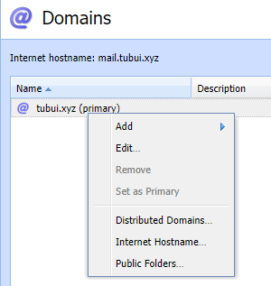
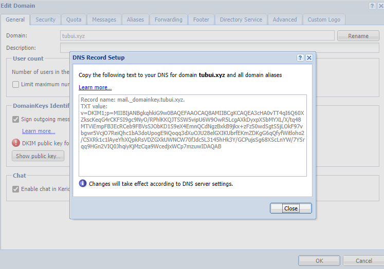
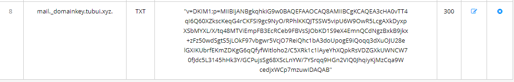
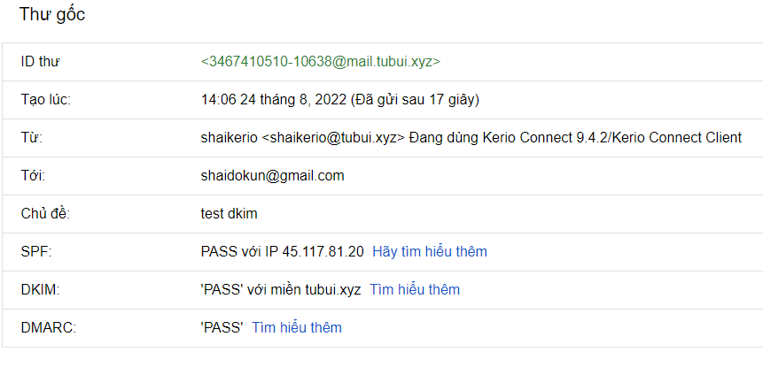

# Tạo bản ghi DKIM cho tên miền trong mailserver Kerio

- ```Configuration``` -> ```Domains``` -> Chuột phải vào domain muốn tạo DKIM -> ```Edit``` 



- Tại tab ```General``` -> ```DomainKeys Identified Mail (DKIM)``` -> ```Sign outgoing messages from this domain with DKIM signature``` -> ```Show public key```



- Tạo DNS bản ghi với DKIM trên



- Kiểm tra 



