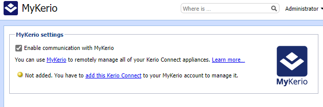
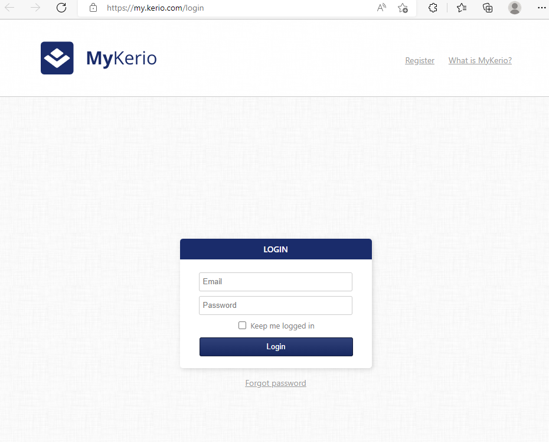
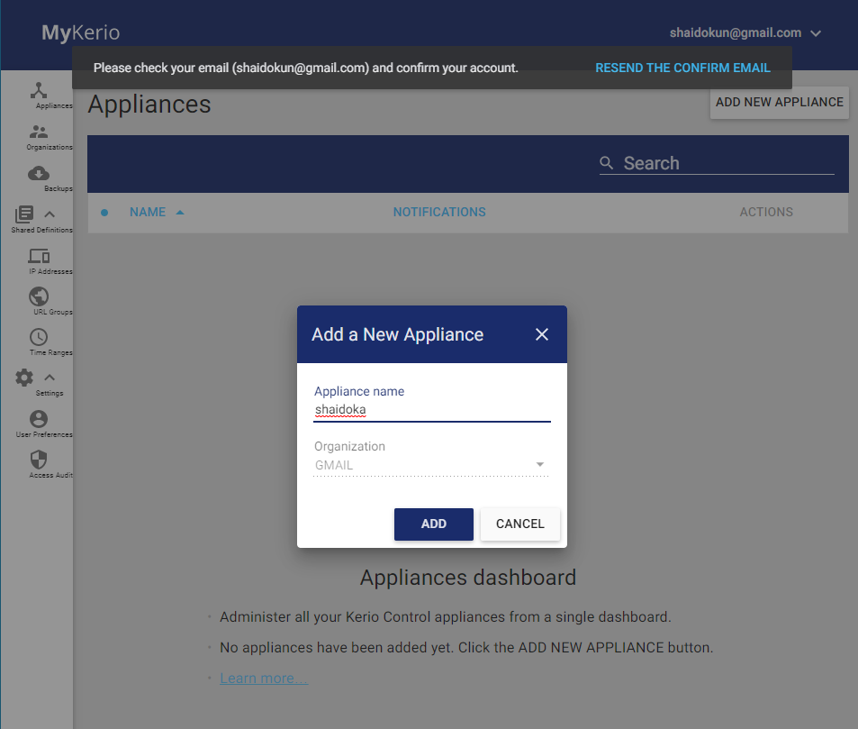
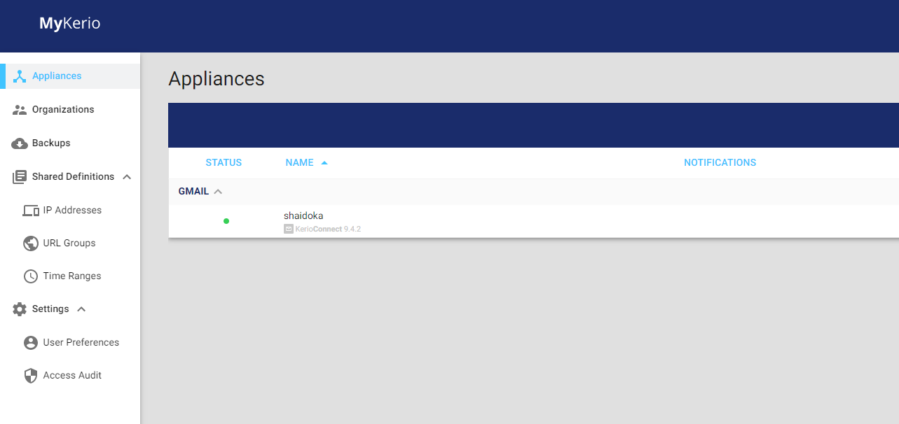
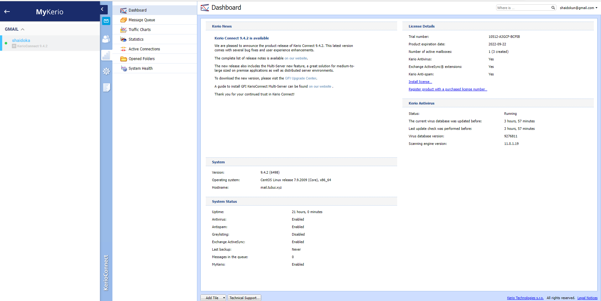

# Giới thiệu về MyKerio

MyKerio là dịch vụ đám mây cho phép quản lý nhiều phiên bản của các thiết bị Kerio Connect thông qua giao diện web tập trung 

Để liên kết Kerio Connect với MyKerio, ta cần phải kích hoạt quyền truy cập vào MyKerio trong Kerio Connect và đăng ký MyKerio: ```Configuration``` -> ```MyKerio``` -> ```Enable communication with MyKerio``` -> ```Apply``` 



Sau đó truy cập ```my.kerio.com/login``` trên trình duyệt



Đăng nhập/đăng ký, sau đó tạo Appliance



Tại đây, ta có thể thấy mailserver Kerio Connect trong trang tổng quan của MyKerio



Chọn server muốn đăng nhập và giờ ta có thể dễ dàng quản trị server từ xa

