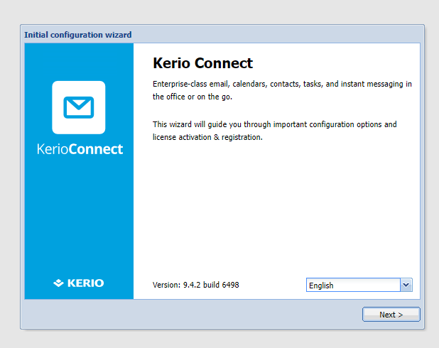
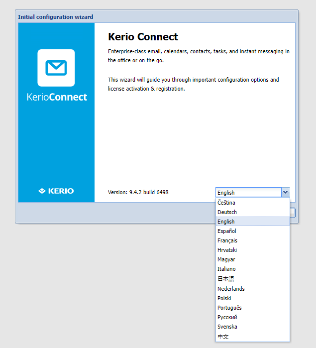
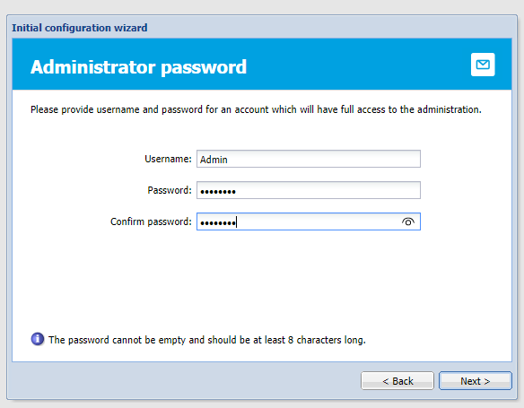
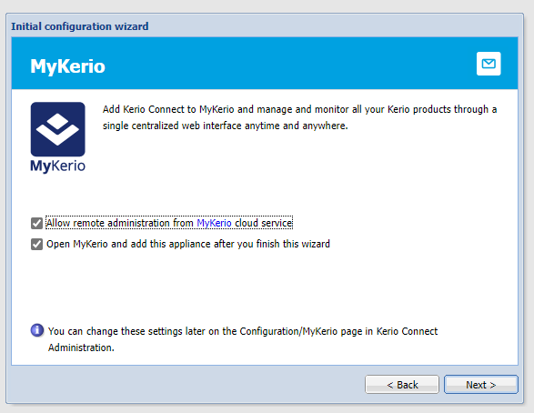
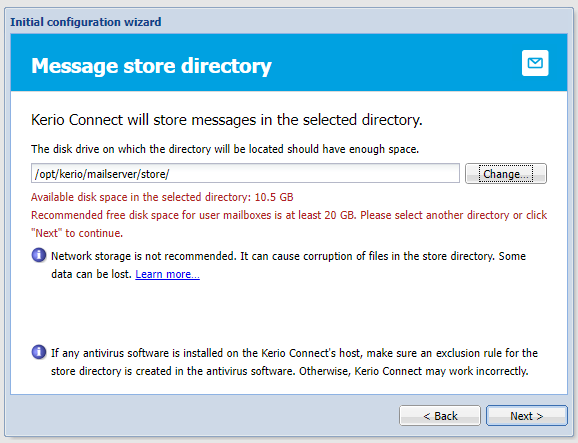
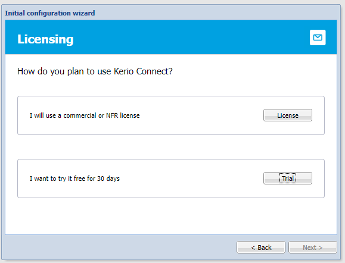
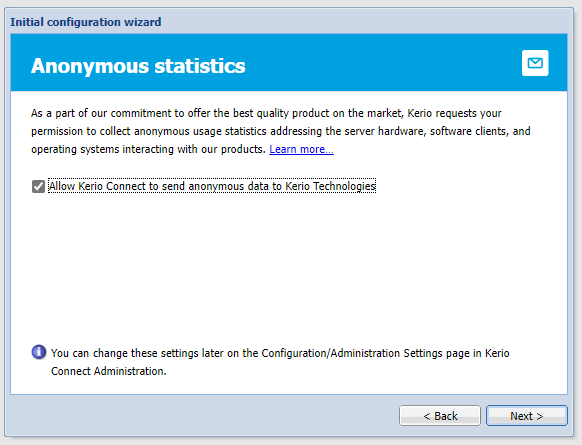
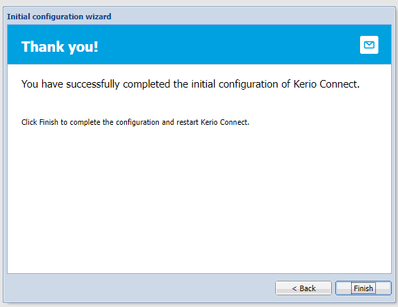
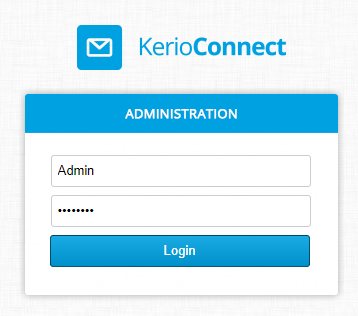
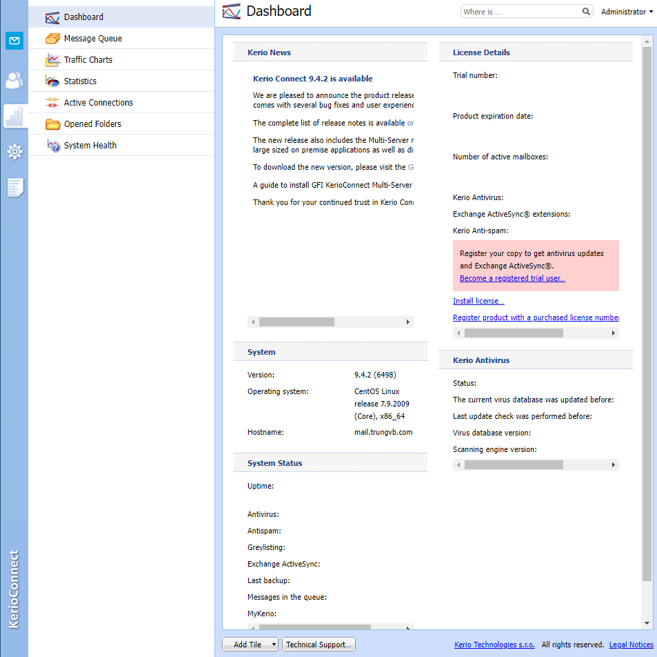

# Cài đặt mailserver Kerio-connect trên CentOS 7

1. Chuẩn bị

```sh
yum -y update
ln -sf /usr/share/zoneinfo/Asia/Ho_Chi_Minh /etc/localtime
yum -y install epel-release wget
systemctl stop postfix
systemctl disable postfix
systemctl stop sendmail
systemctl disable sendmail
systemctl stop httpd
systemctl disable httpd
```

2. Tải file RPM của Kerio-connect

- Chọn phiên bản Kerio Connect muốn cài đặt và lấy liên kết tải tại [đây](http://download.kerio.com/archive/)

- Sử dụng ```wget``` để tải file RPM

```sh
wget https://cdn.kerio.com/dwn/connect/connect-9.4.2-6498/kerio-connect-9.4.2-6498-linux-x86_64.rpm
```

3. Cài đặt Kerio Connect

```sh
yum install kerio-connect-9.4.2-6498-linux-x86_64.rpm
```

4. Mở cổng 4040/tcp ở firewall

- Với Firewalld

```sh
firewall-cmd --zone=public --permanent --add-port=4040/tcp
```

- Với CSF, ta sửa file ```csf.conf```

```sh
vi /etc/csf/csf.conf
```

5. Truy cập trang quản trị Kerio Connect tại ```http://<your_domain>:4040/admin```



6. Khởi tạo thiết lập của Kerio Connect sau khi cài đặt (những thiết lập trong bước này có thể thay đổi ở giao diện administrator)

- Chọn ngôn ngữ và nhấn ```Next```



- Chấp nhận điều khoản dịch vụ và nhấn ```Next```

- Nhập hostname của mailserver và domain của email


- Đặt username và password cho tài khoản administrator



- Lựa chọn sử dụng các tùy chọn sau:
    - **Allow remote administration from MyKerio cloud service:** tùy chọn này cho phép bạn quản lý Kerio Connect từ dịch vụ đám mây MyKerio
    - **Open MyKerio and add this appliance after you finish this wizard:** tùy chọn này đưa bạn đến trang đăng nhập MyKerio sau khi hoàn tất quá trình thiết lập khởi tạo Kerio Connect



- Chọn thư mục lưu trữ mail



- Nhập key hoặc sử dụng bản trial



- Để mặc định cho phép Kerio thu thập dữ liệu ẩn danh



- Nhấn ```Finish``` để hoàn tất thiết lập



- Đăng nhập vào trang quản trị với tài khoản Admin vừa tạo



- Giao diện quản lý chính của Kerio




