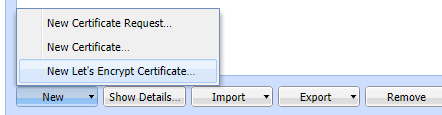
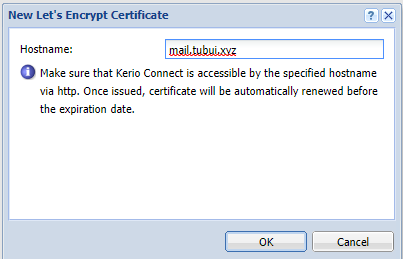
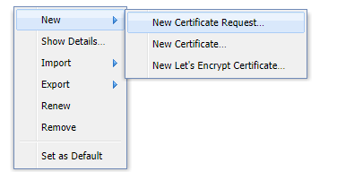
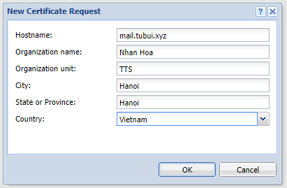
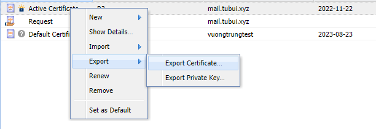
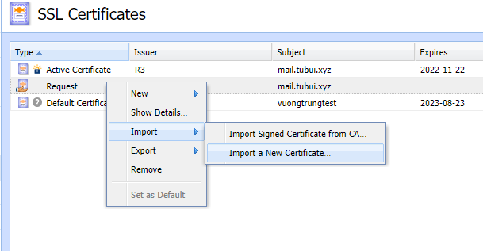
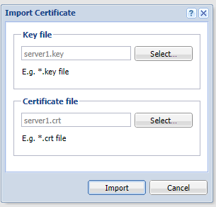
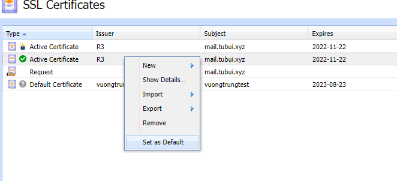
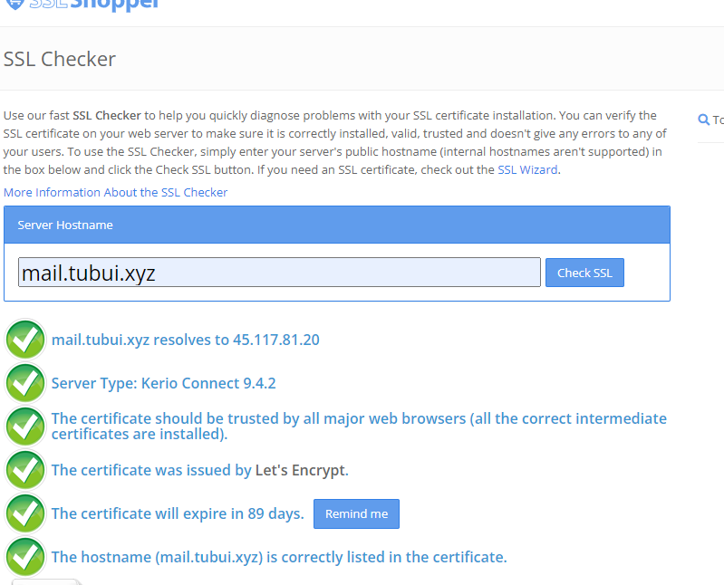

# Cài đặt SSL Let's Encrypt cho mailserver Kerio

- ```Configuration``` -> ```SSL Certificates``` -> ```New``` -> ```New Let's Encrypt Certificate```



- Điền hostname



- ```New``` -> ```New Certificate Request```



- Điền thông tin



- Chuột phải vào SSL Let's encrypt đã tạo trước đó, chọn ```Export``` và export cả key và certificate về máy



- Tại Request đã tạo trước đó, chuột phải chọn ```Import``` -> ```Import a New Certificate```



- Select và dẫn tới key cùng certificate vừa tải về



- Để máy chủ sử dụng chứng chỉ này, chuột phải vào certificate và chọn ```Set as Default```



- Kiểm tra



