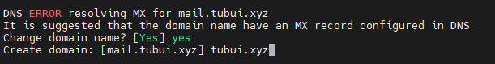
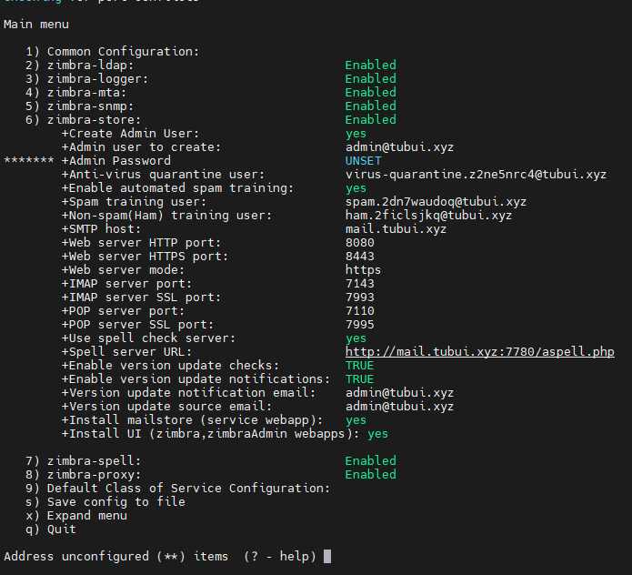
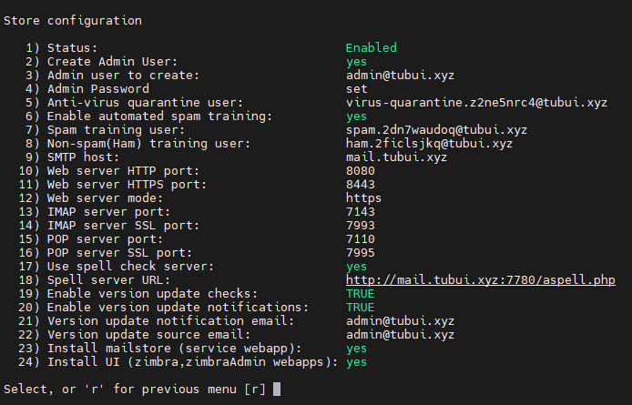
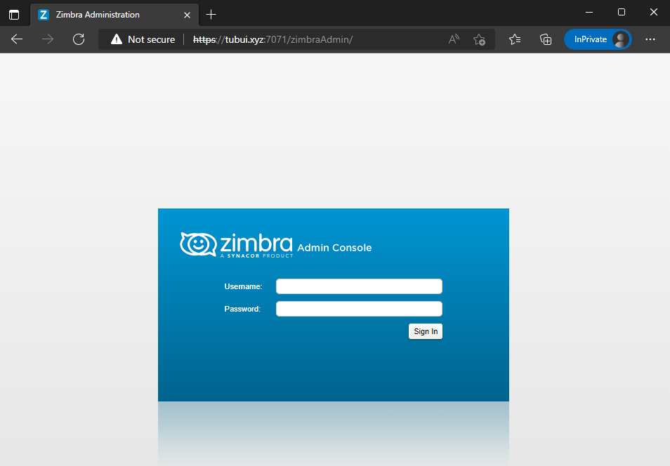
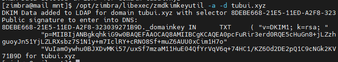

# Cài đặt Zimbra mailserver trên CentOS 7

### 1. Chuẩn bị

- Thiết lập các bản ghi cần thiết cho việc gửi nhận mail


- Cập nhật các package mới nhất

```sh
yum -y update
yum -y install epel-release
```

- Cài đặt đồng bộ thời gian

```sh
yum install -y chronyd
systemctl start chronyd
systemctl enable chronyd
ln -f -s /usr/share/zoneinfo/Asia/Ho_Chi_Minh /etc/localtime
```

- Tắt firewall, selinux, và 1 số dịch vụ khác

```sh
systemctl stop sendmail
systemctl stop httpd
systemctl stop firewalld
systemctl disable firewalld
systemctl stop iptables
systemctl stop ip6tables
```

### 2. Cài đặt email server Zimbra

- Cài đặt các package cần thiết

```sh
yum -y install unzip net-tools sysstat openssh-clients perl-core libaio nmap-ncat libstdc++.so.6 nano wget 
```

- Đổi hostname, add hostname

```sh
hostnamectl set-hostname mail.tubui.xyz
vi /etc/hosts
#Thêm dòng này vào cuối file
103.170.123.26 mail.tubui.xyz mail
```

- Tải zimbra về máy tại [đây](https://s3.beezim.fr/beebot/upload/09830127-c2f1-43cb-b3fa-c35fc514e539/zcs-9.0.0_GA_1.RHEL7_64.20200411070311.tgz) rồi chuyển qua VPS (hoặc sử dụng wget ở VPS)

- Giải nén và cài đặt file vừa tải

```sh
tar -xzvf zcs-9.0.0_GA_1.RHEL7_64.20200411070311.tgz
cd zcs-9.0.0_GA_1.RHEL7_64.20200411070311
./install.sh
```

- Cài đặt các tùy chọn như sau:

```sh
Do you agree with the terms of the software license agreement? [N] Y

Use Zimbra's package repository [Y] Y

Select the packages to install

Install zimbra-ldap [Y] Y

Install zimbra-logger [Y] Y

Install zimbra-mta [Y] Y

Install zimbra-dnscache [Y] N

Install zimbra-snmp [Y] Y

Install zimbra-store [Y] Y

Install zimbra-apache [Y] Y

Install zimbra-spell [Y] Y

Install zimbra-memcached [Y] Y

Install zimbra-proxy [Y] Y

Install zimbra-drive [Y] Y

Install zimbra-imapd (BETA - for evaluation only) [N] N

Install zimbra-chat [Y] Y

The system will be modified.  Continue? [N] Y
```

- Thay đổi domain



- Lúc này hệ thống sẽ báo là password cho admin chưa được thiết lập, ta tiến hành nhập password cho admin: ```Chọn 6 -> 4 -> Nhập pass -> Enter```



- Sau khi đặt xong mật khẩu, ta nhập ```r``` và ```a``` để quay lại và lưu cấu hình



- Xác nhận cấu hình và bắt đầu cài đặt


- Sau khi cài đặt xong, ta cài đặt block memcached exploit

```sh
/opt/zimbra/bin/zmprov ms zmhostname zimbraMemcachedBindAddress 127.0.0.1
/opt/zimbra/bin/zmprov ms zmhostname zimbraMemcachedClientServerList 127.0.0.1
```

- Cuối cùng, truy cập đường dẫn https://mail.tubui.xyz:7071/zimbraAdmin để vào trang quản trị của Zimbra



### 3. Thêm bản ghi DKIM

- Đầu tiên, active dkim cho domain tubui.xyz

```sh
su zimbra
/opt/zimbra/libexec/zmdkimkeyutil -a -d tubui.xyz
```



- Tạo bản ghi DKIM với host là phân đoạn đầu tiên, loại bản ghi là ```TXT```, giá trị là phần trong ngoặc đơn


