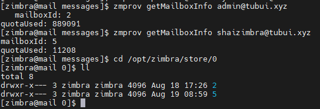

# Tìm ID mailbox account trong Zimbra

Mỗi account trong Zimbra mailserver đều có 1 ID định danh, ID này sinh ra ngẫu nhiên không theo thứ tự nào cả. Việc biết được mailbox nào có ID bao nhiêu có thể giúp ích trong trường hợp cần backup/restore

- Đầu tiên, ta lấy ID của user bất kỳ

```sh
su zimbra
zmprov getMailboxInfo shaizimbra@tubui.xyz
```

- Sau đó, ta truy cập mailbox qua đường dẫn

```sh
cd /opt/zimbra/store/0/
```



- Toàn bộ mail của 1 user được lưu giữ trong thư mục là ID user đó