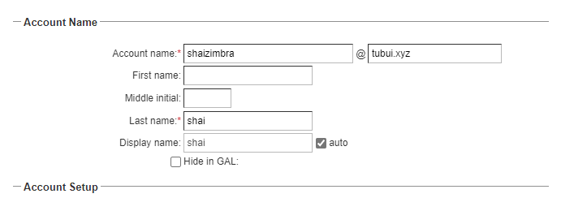
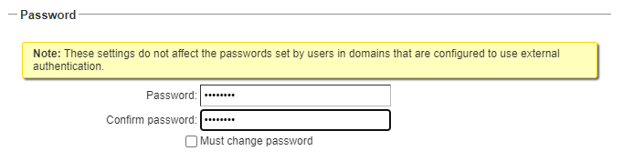

# Tạo user trong Zimbra

1. Tại menu chính sau khi đăng nhập, chọn ```Manage```


2. Nhìn vào góc phải trên màn hình, nhấp vào hình bánh răng và chọn ```New```


3. Điền các thông tin cơ bản cho user, chú ý phần password mà chọn ```Must change password``` thì user sẽ phải đổi pass vào lần đăng nhập đầu tiên





