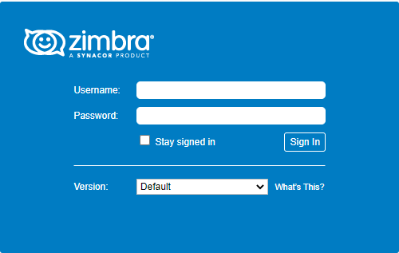
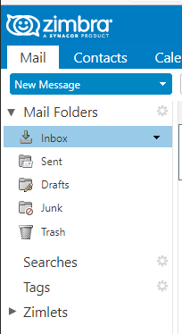
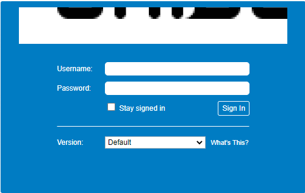
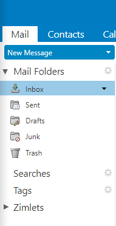

# Cách thay đổi logo trong Zimbra mailserver

Với phiên bản Zimbra Network Edition, ta có thể thay đổi logo thông qua giao diện admin, tuy nhiên với phiên bản Open Source, ta sẽ phải thay đổi logo trên server hosting

Logo trước khi thay đổi: 





1. Tạo thư mục chứa logo

```sh
su zimbra
mkdir /opt/zimbra/jetty/webapps/zimbra/logos/
```

Upload logo lên thư mục này và phân quyền cho nó

```sh
su root
chown zimbra:zimbra Logo.png
```


2. Sử dụng những lệnh sau để thay đổi logo

```sh
zmprov md tubui.xyz zimbraSkinLogoURL /logos/Logo.png
zmprov md tubui.xyz zimbraSkinLogoLoginBanner /logos/Logo.png
zmprov md tubui.xyz zimbraSkinLogoAppBanner /logos/logozimbra.png
zmmailboxdctl restart
```

3. Lên webapp và kiểm tra sự thay đổi





**Lưu ý:** Để logo sau khi thay thế được đẹp thì ta nên sử dụng ảnh có kích thước đúng theo khuyến nghị

