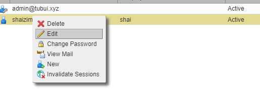

# Chỉnh sửa quota account trong Zimbra

Khi tạo 1 account trong mail server Zimbra, hệ thống sẽ tự động phân chia quota cho mỗi account theo mặc định. Trong thực tế việc thiết lập quota cho account khác nhau với giá trị khác nhau là cần thiết tùy thuộc vào nhu cầu sử dụng của account đó

1. Tại màn hình menu chính sau khi đăng nhập trang quản trị, chọn ```Manage Accounts```


2. Chuột phải vào tài khoản muốn chỉnh sửa, chọn ```Edit```



3. Vào ```Advanced``` -> ```Quotas```, các thông tin có thể tùy chỉnh ở đây như sau:

- Limit user-specified forwarding addresses field to (chars): giới hạn địa chỉ chuyển tiếp theo người dùng trong phạm vi (ký tự)
- Maximum number of user-cpecified forwarding addresses: số lượng tối đa các địa chỉ chuyển tiếp theo người dùng
- Account quota (MB): hạn mức tài khoản tính theo MB (giá trị "0" là không giới hạn)
- Maximum number of contacts allowed in folder: số lượng liên hệ tối đa cho phép trong thư mục
- Percentage threshold for quota warning messages (%): ngưỡng phần trăm cho các thư cảnh báo hạn mức
- Minimum duration of time between quota warnings: khoảng thời gian tối thiểu giữa các lần cảnh báo hạn mức
- Quota warning message template: mẫu thư cảnh báo hạn mức

