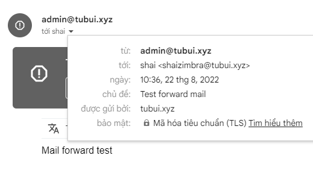

# Thiết lập forward mail trong Zimbra mailserver

- Login tài khoản muốn thiết lập foward mail

- Vào ```Preferences``` -> ```Mail``` -> ```Receiving Messages```

- Nhập vào địa chỉ email muốn forward thư đến


- Kiểm tra




