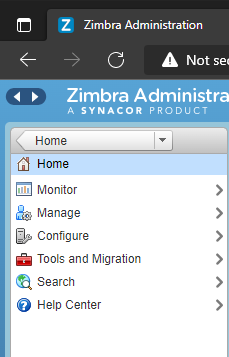

# Thiết lập chính sách về mật khẩu cho account email trong Zimbra

Khi mới cài đặt, chính sách về mật khẩu của zimbra mặc định sẽ khá lỏng lẻo, do đó, để tăng tính bảo mật cho account, ta nên thiết lập lại những chính sách này.

1. Tại giao diện menu chính của trang quản trị, chọn ```Configure```



2. Chọn ```default``` -> ```Advanced``` -> ```Password```


Các thiết lập về mật khẩu bao gồm:
- Prevent user from changing password: ngăn người dùng thay đổi mật khẩu
- Minimum password length: độ dài mật khẩu tối thiểu
- Maximum password length: độ dài mật khẩu tối đa
- Minimum upper case characters: số ký tự viết hoa tối thiểu
- Minimum lower case characters: số ký tự viết thường tối thiểu
- Minimum punctuation symbols: số ký hiệu chấm câu tối thiểu
- Minimum numeric characters: số ký tự số tối thiểu
- Minimum numeric characters or punctuation symbols: số ký tự số hoặc ký hiệu dấu chấm câu tối thiểu
- Minimum password age (days): thời hạn tối thiểu của mật khẩu (ngày)
- Maximum password age (days): thời hạn tối đa của mật khẩu (ngày)
- Minimum number of unique passwords history: số lượng tối thiểu của lịch sử mật khẩu duy nhất

