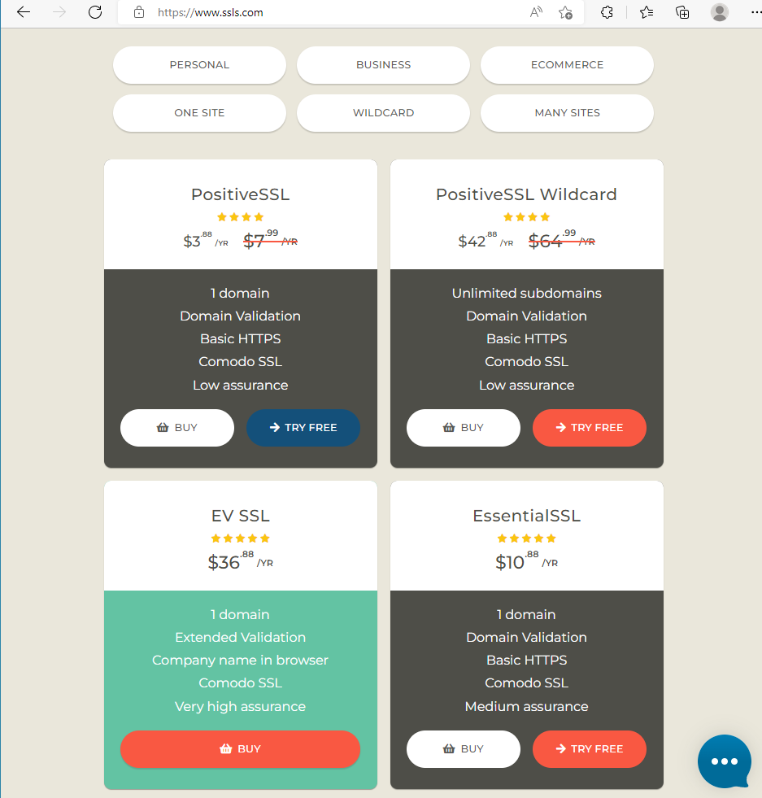
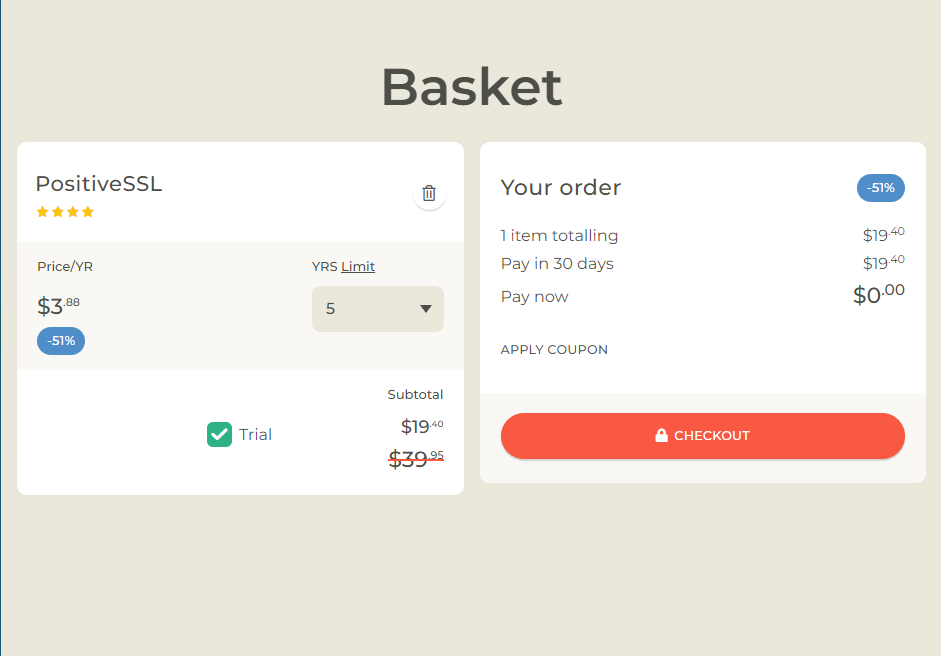
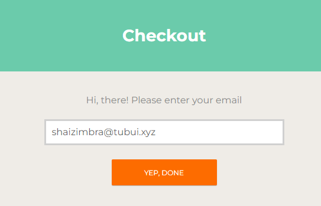
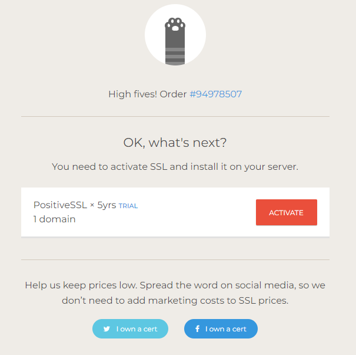
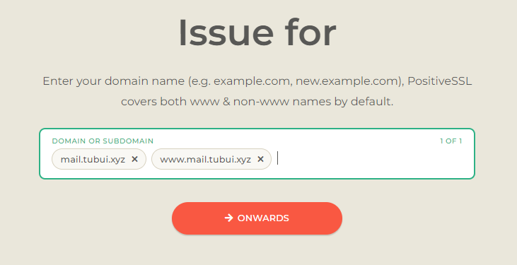
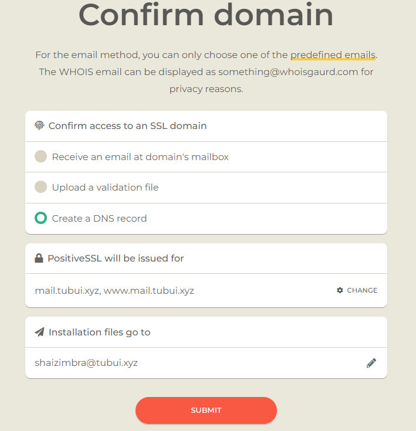
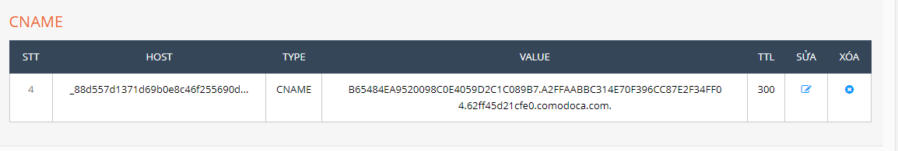
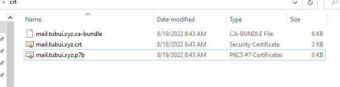
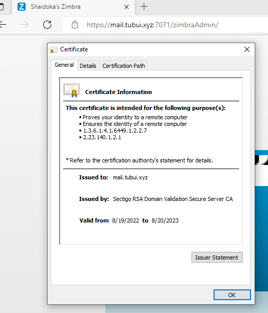

# Cài đặt chứng chỉ SSL có trả phí cho Zimbra mailserver

### Đăng ký chứng chỉ

- Truy cập trang https://www.ssls.com/

- Chọn 1 chứng chỉ bất kỳ, ```try for free```



- Checkout (bản dùng thử sẽ có tác dụng trong 30 ngày)



- Nhập email



- Nhập thông tin cá nhân


- Chọn ```ACTIVATE```



- Nhập vào tên miền của mailserver (lưu ý là cả www và không www)



- Chọn ```Use my CSR``` và copy dòng lệnh để tạo CSR bằng command line


- Chạy đoạn lệnh vừa rồi ở server


- Copy và paste CSR vào trình duyệt rồi nhấn ```ONWARDS```


- Chọn ```Create a DNS record``` và nhấn ```SUBMIT```



- Tạo bản ghi theo hướng dẫn




- Chờ đợi và tải file .zip về



- Tạo file commercial.crt và copy nội dung chứng chỉ vào

```sh
cd /opt/zimbra/ssl/zimbra/commercial/
vi commercial.crt
```


- Tạo file commercial_ca.crt và copy nội dung chứng chỉ vào

```sh
vi commercial_ca.crt
```


- Tạo file commercial.key lấy nội dung từ file mail_tubui_xyz.pem

```sh
cp mail_tubui_xyz.pem commercial.key
```


- Verify chứng chỉ

```sh
chown zimbra:zimbra * -R
su zimbra
/opt/zimbra/bin/zmcertmgr verifycrt comm
```


- Deploy chứng chỉ

```sh
/opt/zimbra/bin/zmcertmgr deploycrt comm commercial.crt ./commercial_ca.crt
```

- Khởi động lại Zimbra

```sh
zmcontrol restart
```

- Kiểm tra chứng chỉ

