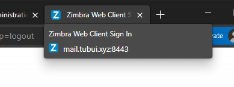
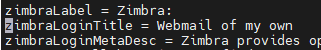

# Thay đổi title webapp của Zimbra

Sau khi cài đặt, webapp của Zimbra sẽ có phần title được set mặc định, điều này hoàn toàn có thể thay đổi để phù hợp hơn với những đơn vị, tổ chức riêng



### 1. Thay đổi title mailbox login webapp

- Chỉnh sửa file ```ZmMsg.properties```

```sh
cd /opt/zimbra/jetty/webapps/zimbra/WEB-INF/classes/messages
vi ZmMsg.properties
```

- Tìm và sửa trường ```zimbraLoginTitle```



- Khởi động lại ```mailboxd```

```sh
su zimbra
zmmailboxdctl restart
```

- Title của webapp sau khi đổi:


### 2. Thay đổi title của mailbox webapp


