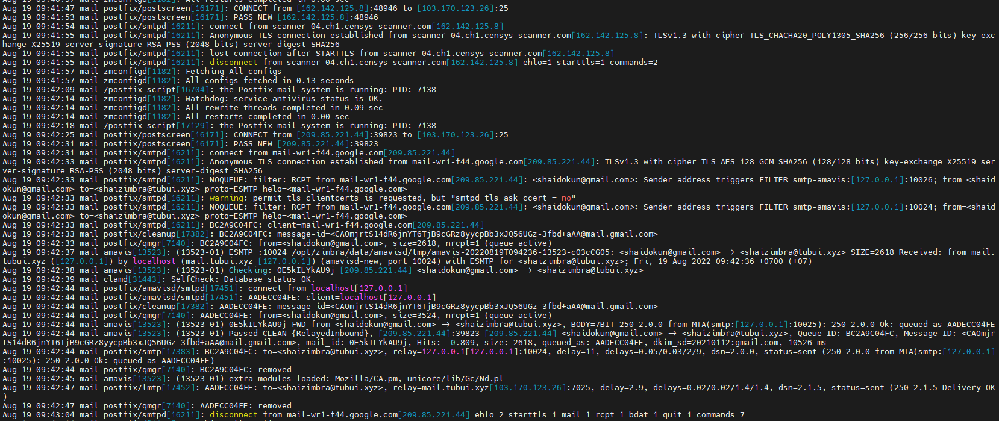

# Kiểm tra log gửi nhận mail trong Zimbra

Việc check log trong Zimbra mailserver giúp ta biết được mail có được gửi thành công hay không và nếu không thì lỗi ở đâu

Log file được lưu trữ ở đường dẫn ```/var/log/maillog```


Quá trình gửi mail được thực hiện như sau: Connect tới mailserver -> MTA kiểm tra địa chỉ người nhận -> Kiểm tra qua các rule filter, đánh giá spam, virus -> Xếp vào queue -> Gửi thư -> Xóa khỏi queue -> Thông báo "Message accepted for delivery"



Quá trình nhận mail được thực hiện như sau: Chấp nhận kết nối từ email server gửi -> Kiểm tra qua các rule filter, đánh giá spam, virus -> Xếp vào queue -> Nhận thư và xóa khỏi queue -> Thông báo nhận thư