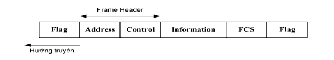
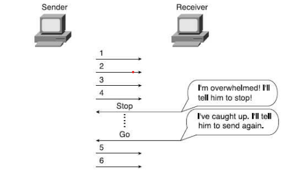
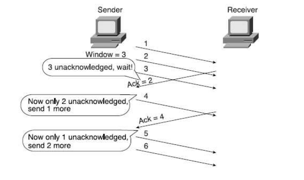
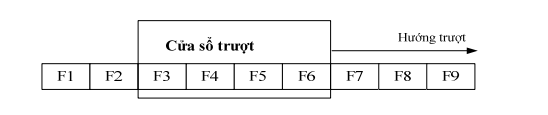

# Mô hình OSI (tiếp)

Khi xây dựng mô hình OSI, ISO xuất phát từ kiến trúc phân lớp như đã trình bày ở trên và dựa trên 1 số tiêu chí cơ bản: hạn chế số lượng các lớp, xác định rõ ranh giới giữa các lớp sao cho việc thay đổi 1 lớp ít ảnh hưởng nhất đến các lớp khác, luồng thông tin qua giao diện giữa các lớp đạt hiệu quả nhất

|Lớp|Chức năng|Ví dụ|
|:-|:-|:-|
|Ứng dụng(tầng 7)|Giao diện giữa mạng và phần mềm ứng dụng|Telnet, HTTP|
|Trình diễn(tầng 6)|Cách mà dữ liệu được biểu thị. Những xử lý đặc biệt, như mã hóa|JPEG, ASCII, EBCDIC|
|Phiên(tầng 5)|Giữ cho dữ liệu tách biệt với những ứng dụng khác|Hệ điều hành và ứng dụng lập lịch|
|Giao vận(tầng 4)|Giao vận tin cậy hoặc không tin cậy. Ghép kênh|TCP, UDP, SPX|
|Mạng(tầng 3)|Địa chỉ logic, thứ mà router sử dụng để định tuyến|IP, IPX|
|Liên kết dữ liệu(tầng 2)|Kết hợp bit thành byte và byte thành khung đữ liệu. Truy nhập vào truyền thông sử dụng địa chỉ MAC. Phát hiện và sửa lỗi|802.3/802.2, HDLC|
|Vật lý(tầng 1)|Truyền tải thông tin qua đường truyền vật lý, truy nhập đường vật lý dựa trên các giao diện cơ điện|EIA/TIA-232, V.35|

## 1. Lớp vật lý

Lớp vật lý cung cấp phương tiện diện, cơ, chức năng và thủ tục để thiết lập, duy trì và giải phóng liên kết vật lý giữa các hệ thống

Thuộc tính điện: biểu diễn các bit dữ liệu

Thuộc tính cơ: tính chất vật lý của giao diện đường truyền như kích thước, cấu hình, cách đấu nối...

Thuộc tính thủ tục: điều khiển đường truyền để truyền tải các chuỗi bit

Đặc điểm khác biệt cơ bản của lớp vật lý so với các lớp khác là không có PDU do là lớp thấp nhất, không có tiêu đề gói tin, dữ liệu được truyền đi theo từng bit

Môi trường truyền tin: đường truyền vật lý

**Về đường truyền vật lý**

Đường truyền vật lý dùng để truyền các tín hiệu điện tử giữa các máy tính. Tín hiệu biểu diễn giá trị nhị phân 0 và 1 trong máy tính

Các tín hiệu điện tử có thể truyền dưới dạng số hoặc dạng tương tự. Với khoảng cách gần, tín hiệu số có thể truyền trên cáp nối giữa các máy tính. Tuy nhiên với quãng đường dài, tín hiệu số bị suy giảm nhanh chóng tương ứng với khoảng cách truyền

Để truyền xa tín hiệu, tín hiệu số thường được chuyển sang các loại mã đường dây hoặc sóng điện từ

Sóng điện từ nằm trong khoảng tần số radio tới sóng cực ngắn và tia hồng ngoại. Tùy theo tần số sóng điện từ có thể dùng đường truyền vật lý khác nhau để truyền tín hiệu

Có thể chia đường truyền thành 2 loại: có dây và không dây
- Có dây: cáp đồng trục, cáp xoắn, cáp sợi quang
- Không dây: hồng ngoại, âm tần, cao tần, siêu cao tần

## 2. Lớp liên kết dữ liệu

Lớp liên kết dữ liệu cung cấp phương tiện để truyền thông qua liên kết vật lý, đảm bảo độ tin cậy nhờ các cơ chế đồng bộ, kiểm soát lỗi, kiểm soát luồng dữ liệu, điều khiển truy nhập đường truyền vật lý

**Giao thức hướng ký tự và hướng bit**

Giao thức hướng ký tự: dùng các ký hiệu đặc biệt để điều khiển truyền

Giao thức hướng bit: các giao thức loại này cho phép truyền với tốc độ cao hơn giao thức hướng ký tự

Hướng bit nghĩa là các bit truyền theo cấu trúc khung (frame), dùng các bit điều khiển việc truyền tin

Cấu trúc của 1 Frame:

Các giao thức hướng bit: HDLC (High Data Link Control), SDLC (Synchronous Data Link Control), LAP và LAPB (Link Access Procedure, Link Access Procedure Balanced) cho ISDN

**Điều khiển luồng**

Khi tốc độ phát thu dữ liệu của bên gửi và bên nhận không đồng bộ có thể dận đến máy bên nhận bị quá tải và tốc độ nhận giảm rõ rệt. Các khung dữ liệu gửi liên tiếp làm bên nhận không thể xử lý kịp thời dẫn đến mất dữ liệu và phải phát lại

Cơ chế điều khiển luồng có tác dụng điều chỉnh tốc độ gửi dữ liệu sao cho phù hợp với quá trình xử lý ở bên nhận. Điều đó cần có cơ chế phản hòi từ bên nhận để thông báo tình trạng hiện thời của mình 

Tuy nhiên, điều khiển luồng thường được thực hiện ở lớp giao vận.

**Kiểm soát lỗi, nhận biết và sửa lỗi**

1. Kiểm soát lỗi

Độ tin cậy của việc truyền tin được đảm bảo thông qua việc xác nhận. Bên nhận sẽ truyền lại cho bên gửi khung điều khiển đặc biệt để xác nhận các khung dữ liệu có đến đích hay không và có chính xác không. Nếu bên gửi nhận được phản hồi tiêu cực (negative ack), nó sẽ biết là khung truyền bị lỗi và tự động gửi lại khung đó 1 lần nữa

Bên gửi cần đếm thời gian quá hạn, nếu hết thời gian đó mà bên gửi vẫn chưa nhận được phản hồi thì bên gửi sẽ tự động truyền lại khung đó 1 lần nữa

Bên nhận sẽ dựa vào số hiệu của các khung (đánh theo số thứ tự trên mỗi khung) để nhận biết sự trùng lặp và loại bỏ khung thừa

2. Nhận biết và sửa lỗi

Có 2 cách để khắc phục lỗi: gửi lại gói tin bị lỗi hoặc sửa lỗi ở gói tin gặp vấn đề

Phương pháp đơn giản nhất để nhận biết lỗi là kiểm tra chẵn lẻ (parity check). Bên gửi và nhận sẽ thống nhất trước sử dụng phương pháp chẵn hay lẻ để kiểm tra. Nếu chuỗi bit cần gửi đi là 10110001, với parity chẵn sẽ chèn thêm 101100011, với parity lẻ sẽ chèn thêm 101100010. Nhờ đó, bất cứ lỗi bit nào cũng làm thay đổi checksum

Mỗi khung kèm theo một mã kiểm tra FCS (Frame Check Sequence) hay CRC trong tiêu đề cuối khung. FCS chứa thông tin kiểm tra áp dụng cho khung. Nơi nhận tính lại FCS và so sánh với trường FCS trong khung để phát hiện lỗi.

Phát hiện lỗi không có nghĩa là phục hồi lỗi, nhìn chung lớp liên kết dữ liệu ít cung cấp cơ chế này

**Nhận dạng dữ liệu đóng gói**

Mỗi tiêu đề khung bao gồm một hoặc 1 vài trường để nhận dạng các giao thức lớp trên (IP, IPX,...) nhằm chuyển dữ liệu của khung đến đúng lớp tương ứng

## 3. Lớp mạng

Lớp mạng có nhiệm vụ truyền gói tin qua các tuyến khác nhau để đi đến đích. Để thực hiện chức năng đó, lớp mạng cần biết thông tin về các nút mạng và chọn tuyến đường thích hợp qua mạng. Việc chọn tuyến phải đảm bảo phân phối lưu lượng hợp lý giữa các tuyến. Ngoài ra lớp mạng còn có một số nhiệm vụ khác như thiết lập, duy trì và hủy bỏ liên kết logic lớp mạng, kiểm soát luồng dữ liệu, ghép và phân kênh...

**Địa chỉ hóa và định tuyến**

*Địa chỉ hóa:* địa chỉ lớp mạng có cấu trúc phân cấp và có thể tạo nhóm dựa trên vị trí vật lý của mạng (địa chỉ lớp liên kết dữ liệu là địa chỉ phẳng)

VD: IP subnet, IPX network, AppleTalk cable range phải kết nối đến cùng 1 lớp liên kết dữ liệu

Địa chỉ lớp 3 được thiết kế dựa trên các tiêu chí:
- Không gian địa chỉ phải đủ lớn để hỗ trợ cho mạng cần nhiều địa chỉ
- Địa chỉ phải có tính duy nhất, không có sự trùng lặp
- Địa chỉ phải cho phép tạo nhóm
- Địa chỉ có thể cung cấp/ gán động cho các client

*Định tuyến:* xác định tuyến/ đường đi tối ưu của gói tin từ nút mạng (host, router, computer) này đến nút mạng khác và chuyển tiếp đến giao diện tương ứng

Xem thêm về định tuyến tại [đây]

[đây]: <https://github.com/shaidoka/thuctap-NhanHoa/blob/main/Routing/Routing.md>

## 4. Lớp giao vận

Chức năng quan trọng nhất của lớp giao vận là phục hồi lỗi và điều khiển luồng

**Giao thức kết nối và không kết nối**

Giao thức kết nối (Connected/Connection-Oriented Protocol): yêu cầu thiết lập kết nối trước khi chuyển giao dữ liệu. Việc thiết lập kết nối có thể thực hiện bằng bản tin (messages)

Giao thức không kết nối (Connectionless Protocol): Giao thức không yêu cầu thiết lập kết nối giữa hai điểm cuối (endpoint)

**Giao thức tin cậy và không tin cậy (reliable/ unreliable)**

Giao thức tin cậy đồng nghĩa với giao thức có cơ chế phục hồi lỗi (error recovery)

Giao thức không tin cậy không hỗ trợ cơ chế trên 

|Connected?|Reliable?|Examples|
|:-|:-|:-|
|Connection-oriented|Yes|LLC Type (802.2), TCP (TCP/IP), SPX (NetWare), X.25|
|Connection-oriented|No|Frame Relay virtual circuits, ATM virtual connections, PPP|
|Connectionless|Yes|TFTP, NetWare NCP (không có Packet Burst)|
|Connectionless|No|UDP, IP, IPX, AppleTalk DDP, hầu hết giao thức Layer 3, 802.3, 802.5|

**Điều khiển luồng (Flow Control)**

Như đã nói bên trên, điều khiển luồng là quá trình điều chỉnh tốc độ gửi dữ liệu của một máy tính. Tùy thuộc vào mỗi loại giao thức, cả bên gửi và bên nhận (cũng như các router trung gian, switch, bridge) có thể tham gia vào quá trình điều khiển luồng từ bên gửi đến bên nhận

Điều khiển luồng ngăn ngừa sự xảy ra tắc nghẽn gửi dữ liệu với tốc độ mạng có thể đáp ứng được. Trong quá trình truyền, dữ liệu có thể bị mất, gói tin cũng có thể bị thất lạc do lỗi truyền tin. Tần suất xuất hiện việc này phụ thuộc vào từng mạng và lưu lượng

Điều khiển luồng cố gắng giảm tỷ lệ mất dữ liệu và cho phép bên gửi truyền với tốc độ càng nhanh khi tình trạng tắc nghẽn của mạng đã giảm bớt

**Cơ chế điều khiển luồng**

*Dừng và đợi (Stop and Wait/Stop and Start)*

1 phương pháp khác: làm chậm thay vì dừng lại, ví dụ bản tin ICMP source-quench gửi từ nơi nhận hoặc các router trung gian để làm chậm tốc độ bên gửi. Bên gửi giảm dần tốc độ cho đến khi không còn nhận bản tin này nữa

*Cửa sổ/Cửa trượt (Window/Sliding Window)*

Cơ chế điều khiển lưu lượng bằng cửa sổ trượt cho phép bên gửi phát đi liên tiếp một số gói dữ liệu nhất định rồi mới phải dừng lại chờ thông báo về kết quả nhận. Bên bận điều khiển lưu lượng bằng cách hay gửi ACK

Tại mọi thời điểm. Bên gửi phải ghi nhớ một danh sách chứa số thứ tự liên tiếp các gói số liệu mà nó được phép gửi đi, các gói số liệu này được gọi là cửa sổ gửi. Tương tự, bên nhận cũng duy trì một danh sách được gọi là cửa sổ nhận, tương ứng với các gói số liệu được phép nhận

## 5. Lớp phiên

**Chức năng** của lớp phiên là cung cấp cho người dùng đầu cuối phương tiện để quản trị và đồng bộ các phiên ứng dụng của họ

Một phiên ứng dụng (session) là một cuộc trao đổi thông tin giữa 2 người dùng đầu cuối trong 1 khoảng thời gian. 1 phiên bao gồm tập hợp của nhiều kết nối phục vụ cho việc trao đổi dữ liệu và việc quản lý trao đổi thông tin nói chung giữa 2 người dùng đầu cuối

**Nhiệm vụ** của lớp phiên:
- Điều phối việc trao đổi dữ liệu giữa các ứng dụng bằng cách thiết lập và giải phóng (1 cách logic) giữa 2 phiên (hay còn gọi là các Dialog)
- Cung cấp các điểm đồng bộ để kiểm soát việc trao đổi thông tin
- Quy định quy trình tương tác giữa các ứng dụng và người dùng
- Cung cấp cơ chế giành quyền kiểm soát trong trao đổi dữ liệu

*Phương thức trao đổi dữ liệu:*
- Song công (FULL DUPLEX - 2 chiều): Cả 2 bên đều có thể gửi nhận đồng thời, không cần quản trị tương tác đặc biệt nào, là hình thức phổ biến nhất
- Bán song công (HALF DUPLEX - 2 chiều luân phiên): 2 bên luân phiên gửi dữ liệu. Điển hình cho các ứng dụng hỏi đáp. Phần quản trị tương tác báo cáo cho mỗi bên khi đến phiên gửi dữ liệu
- Đơn công (SIMPLEX): Chỉ truyền dữ liệu 1 chiều, bên nhận chỉ có nhiệm vụ nhận dữ liệu và lưu trữ (thí dụ các ứng dụng phim, radio, video)

## 6. Lớp trình diễn

**Chức năng** của lớp phiên là đảm bảo cho các hệ thống đầu cuối liên lạc trao đổi được với nhau trực tiếp ngay cả khi chúng sử dụng các cách biểu diễn khác nhau

**Nhiệm vụ** cơ bản của lớp trình diễn là xác định cú pháp và ngữ cảnh:

*Cú pháp (Syntax):* là phương thức biểu diễn dữ liệu và phương thức chuyển đổi cấu trúc dữ liệu thành các giá trị nhị phân để truyền đi

Có 3 dạng cú pháp: cú pháp dùng trong thực thể ứng dụng của máy bên gửi, cú pháp dùng trong thực thể của máy tính bên nhận và cú pháp truyền tải (Transfer Syntax). Các cú pháp này có thể giống nhau. Lớp trình diễn làm nhiệm vụ chuyển đổi biểu diễn thông tin từ dạng cú pháp này sang dạng khác khi cần thiết

Ngữ cảnh (Semantic): là bối cảnh được dùng để trao đổi dữ liệu. Lớp trình diễn là ranh giới giữa 2 lớp ứng dụng và lớp phiên. Phía lớp ứng dụng, dữ liệu được biểu diễn dưới góc độ người dùng, còn lớp phiên, dữ liệu ở dạng các giá trị nhị phân (các chuỗi byte)

## 7. Lớp ứng dụng

Đây là nơi cung cấp phương tiện để truy nhập môi trường OSI. Lớp ứng dụng là một thành phần trong môi trường OSI gồm các thực thể thực hiện việc xử lý thông tin cho các ứng dụng cụ thể. Nó chỉ xử lý các vấn đề ngữ nghĩa chứ không xử lý cú pháp như ở lớp trình diễn

Lớp ứng dụng cung cấp phương tiện để truy nhập môi trường OSI. Lớp ứng dụng là một thành phần trong mô hình OSI. Lớp ứng dụng là 1 thành phần trong mô hình OSI gồm các thực thể thực hiện việc xử lý thông tin cho các ứng dụng cụ thể. Nó chỉ xử lý các vấn đề ngữ nghĩa của dữ liệu chứ không xử lý cú pháp như ở lớp trên.

