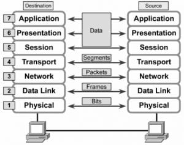
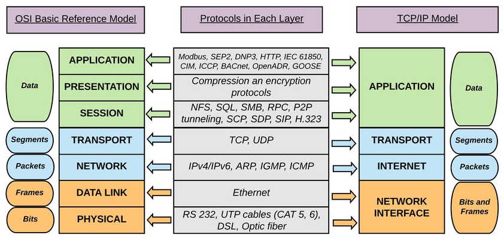
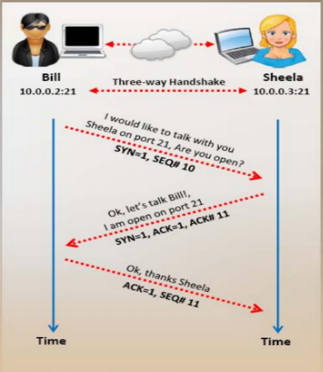

# Mô hình OSI

1. **Khái niệm cơ bản**
 
Mô hình OSI (hay Open System Interconnection Reference Model) là một mô hình kiến trúc mạng chuẩn mang tính tham chiếu cho các hệ thống mạng. Mô hình OSI gồm 7 tầng, lý giải một cách trừu tượng kỹ thuật kết nối truyền thông giữa các máy tính và thiết kế giao thức mạng giữa chúng.

2. **Nguyên tắc**
 
OSI mô tả chức năng theo dạng phân tầng. Mỗi tầng có 1 vai trò riêng, mỗi vai trò có 1 tập chức năng chuyên biệt.
Mỗi tầng chỉ tương tác với tầng trên và tầng dưới, tầng Application tương tác với user, tầng Physical tương tác với đường truyền vật lý.

3. **Vai trò của từng tầng trong mô hình OSI**
 
 
 - Tầng Application: giao tiếp với user thông qua giao diện. Cung cấp các chức năng truyền thông đáp ứng nhu cầu của user.
 - Tầng Presentation: mã hóa, định dạng các bản tin dữ liệu cho phù hợp.
 - Tầng Session: quản lý phiên truyền thông giữa các máy tính, bao gồm thiết lập, duy trì, đồng bộ hóa và hủy bỏ các phiên truyền thông giữa các ứng dụng.
 - Tầng Transport: thực hiện việc chuyển giao dữ liệu giữa các ứng dụng (end-to-end), đảm bảo dữ liệu chính xác, không bị mất mát, trùng lặp.
 - Tầng Network: quy định địa chỉ IP của các máy tính trong mạng, tìm đường đi và chuyển tiếp dữ liệu từ máy gửi đến máy nhận.
 - Tầng Data-Link: Kiểm soát việc truyền dữ liệu giữa các máy tính trên đường truyền vật lý. Đóng gói dữ liệu tầng trên gửi xuống vào trong frame, gửi frame từ tầng dưới lên tầng trên, kiểm tra lỗi frame dữ liệu.
 - Tầng Physical: quản lý truy nhập đường truyền. Chuyển đổi dữ liệu thành tín hiệu vật lý và phát trên đường truyền, chuyển tín hiệu vật lý nhận được thành frame dữ liệu và gửi lên trên.

4. **Quy trình truyền gói tin trong mô hình OSI**

 
 
 a. Phía máy gửi
  - Tầng Application: user đưa thông tin cần gửi vào máy tính
  - Tầng Presentation: mã hóa và nén dữ liệu trên
  - Tầng Session: bổ sung thông tin cần thiết cho phiên giao dịch
  - Tầng Transport: tách dữ liệu thành các Segment, bổ sung thêm thông tin về phương thức vận chuyển
  - Tầng Network: tách các Segment thành nhiều Package, bổ sung thêm thông tin về định tuyến
  - Tầng Data-Link: băm nhỏ các Package thành nhiều Frame, bổ sung thêm thông tin để máy nhận kiểm tra dữ liệu
  - Tầng Physical: các frame sẽ được chuyển thành một chuỗi các bit nhị phân và truyền đến máy nhận qua đường truyền vật lý
  
  **Mỗi gói dữ liệu khi gửi giữa các tầng đều được gắn header của tầng đó, với tầng Data-Link thì có thêm FCS để check lỗi**
 
 b. Phía máy nhận
 - Tầng Physical: kiểm tra quá trình đồng bộ, đưa dữ liệu nhận được vào vùng đệm, thông báo với tầng Data-Link là đã nhận được dữ liệu.
 - Tầng Data-Link: kiểm tra lỗi, nếu có lỗi thì frame đó sẽ bị hủy. Sau đó kiểm tra địa chỉ MAC Address xem có đúng địa chỉ của máy nhận hay không, nếu đúng thì gỡ bỏ Header của Data-Link và chuyển tiếp lên tầng Network.
 - Tầng Network: kiểm tra địa chỉ IP  trong gói tin này xem có phải địa chỉ của máy nhận hay không, nếu đúng thì gỡ bỏ Header của nó và chuyển lên tầng Transport.
 - Tầng Transport: phục hồi và xử lý lỗi bằng cách gửi các gói tin ACK, NAK. Sau khi sửa lỗi, tầng này sắp xếp lại thứ tự của các Segment và chuyển dữ liệu lên tầng trên.
 - Tầng Session: đảm bảo dữ liệu trong gói tin nhận được toàn vẹn. Sau đó gỡ bỏ Header của tầng Session và gửi lên trên.
 - Tầng Presentation: chuyển đổi định dạng dữ liệu cho phù hợp. Sau khi hoàn thành thì gửi lên trên.
 - Tầng Application: gỡ bỏ Header cuối cùng. Khi đó ở máy nhận sẽ nhận được dữ liệu của gói tin được truyền đi.

# Bộ giao thức TCP/IP
1. **Khái niệm cơ bản**
 
TCP/IP (hay Tranmission Control Protocol/ Internet Protocol) là một bộ các giao thức truyền thông được sử dụng để kết nối các thiết bị với nhau trên Internet.
Bộ giao thức TCP/IP gồm một tập hợp các quy tắc và thủ tục, song TCP và IP là 2 giao thức chính.
Hai giao thức chính trong TCP/IP phục vụ các chức năng cụ thể. TCP xác định cách các ứng dụng có thể tạo ra các kênh truyền thông qua mạng. Nó cũng quản lý cách một thông điệp được tập hợp thành các gói nhỏ hơn trước khi chúng được truyền qua Internet và tập hợp lại theo đúng thứ tự tại địa chỉ đích. Trong khi đó IP xác định địa chỉ và định tuyến từng gói để đảm bảo rằng nó đến đúng đích. 

2. **Bốn lớp của mô hình TCP/IP**
 - Lớp Application: cung cấp cho ứng dụng sự trao đổi dữ liệu được chuẩn hóa.
 - Lớp Transport: chịu trách nhiệm duy trì thông tin liên lạc end-to-end trên mạng. TCP xử lý thông tin liên lạc giữa các máy chủ, các giao thức truyền tải bao gồm TCP và UDP.
 - Lớp Internet: xử lý các gói tin và kết nối các mạng độc lập để vận chuyển các gói tin trên mạng. Giao thức của lớp mạng là IP, ARP, ICMP và IGMP.
 - Lớp Network Interface: bao gồm các thiết bị mạng và các chương trình cung cấp các thông tin cần thiết cho hoạt động, truy nhập đường truyền vật lý qua các thiết bị mạng đó.

3. **Quy trình bắt tay 3 bước (Three-way handshake)**

- Thiết lập phiên TCP: Quy trình bắt tay 3 bước

   - Khi một máy A muốn khởi tạo phiên làm việc với máy tính B, máy A sẽ gửi tín hiệu với SYN = 1 và SEQ#10 đến máy B

   - B khi nhận được tín hiệu và chấp nhận kết nối sẽ gửi trả lại tín hiệu phản hồi với SYN = 1, ACK = 1 cùng ACK#11

   - Khi nhận được tín hiệu trên, A sẽ đáp lại bằng việc gửi tín hiệu ACK = 1 và SEQ#11. Lúc này phiên làm việc giữa 2 máy sẽ được thiết lập

- Ngừng phiên làm việc TCP:

   - Sau khi máy A gửi dữ liệu xong cho máy B, máy A muốn ngắt kết nối sẽ gửi tín hiệu với FIN = 1 và SEQ#50

   - Khi nhận được tín hiệu trên, máy B sẽ gửi phản hồi lại với ACK = 1, ACK#51, SEQ#170. Sau khi máy B nhận được đầy đủ dữ liệu từ máy A, B sẽ gửi tín hiệu FIN = 1 và SEQ#171

   - A nhận được phản hồi và gửi trả lại tín hiệu kết thúc với ACK = 1, ACK#172, SEQ#51
 
4. **Ưu nhược điểm của TCP/IP**
 - Ưu điểm:

   - Giúp thiết lập kết nối giữa các loại máy tính

   - Hoạt động độc lập với HĐH

   - Hỗ trợ nhiều giao thức định tuyến

   - Sử dụng kiến trúc client-server cho khả năng mở rộng cao

   - Nhẹ và không gây áp lực không cần thiết cho mạng máy tính

- Nhược điểm:

   - Phức tạp để thiết lập và quản lý

   - Lớp vận chuyển không đảm bảo việc phân phối các gói tin

   - Không dễ thay thế các giao thức trong TCP/IP

   - Không tách bạch rõ ràng các khái niệm dịch vụ, giao diện và giao thức nên không phù hợp để mô tả công nghệ mới trong mạng mới

   - Dễ bị tấn công DDOS

5. **TCP/IP và OSI**
- Giống nhau:

   - Cả 2 đều là mô hình logic
   
   - Đều là các tiêu chuẩn mạng

   - Chia quá trình tiếp nhận thành các lớp

   - Cung cấp các khuôn khổ để triển tạo và triển khai các tiêu chuẩn và thiết bị mạng

   - Cho phép một nsx tạo ra các thiết bị và thành phần mạng có thể cùng tồn tại và hoạt động với các thiết bị và thành phần do các nsx khác cung cấp

- Khác nhau:

|TCP/IP|OSI|
|:-|:-|
|Sử dụng **1** lớp để xác định chức năng của các lớp trên|Sử dụng **3** lớp để xác định chức năng của các lớp trên|
|Sử dụng **1** lớp để xác định chức năng của lớp dưới cùng|Sử dụng **2** lớp cho chức năng của lớp dưới cùng|
|Kích thước Header là **20** byte| Kích thước Header là **5** byte|
|Tiêu chuẩn hướng giao thức|Mô hình chung dựa trên chức năng của từng lớp|
|Cách tiếp cận ngang|Tiếp cận dọc|
|Các giao thức được phát triển đầu tiên, sau đó là mô hình được phát triển|Mô hình phát triển đầu tiên, sau đó là giao thức|
|Giúp thiết lập kết nối giữa các máy tính khác nhau|Giúp chuẩn hóa bộ định tuyến, thiết bị chuyển mạch,...|