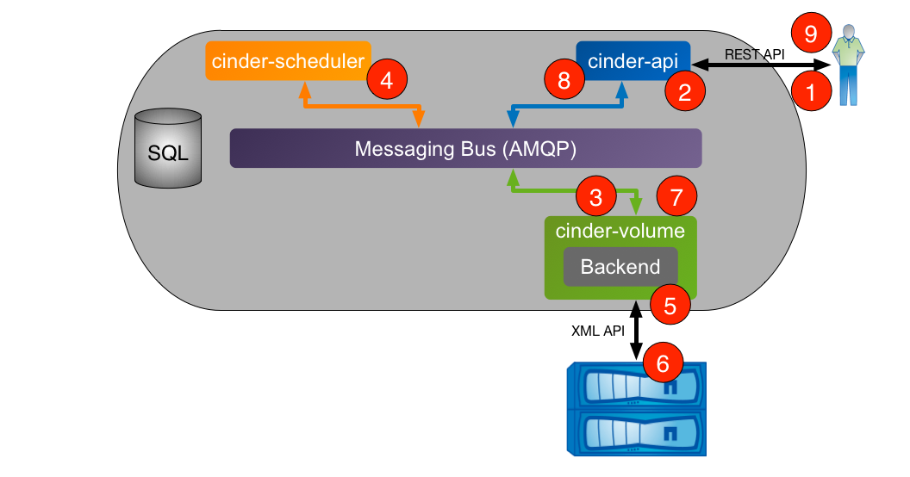
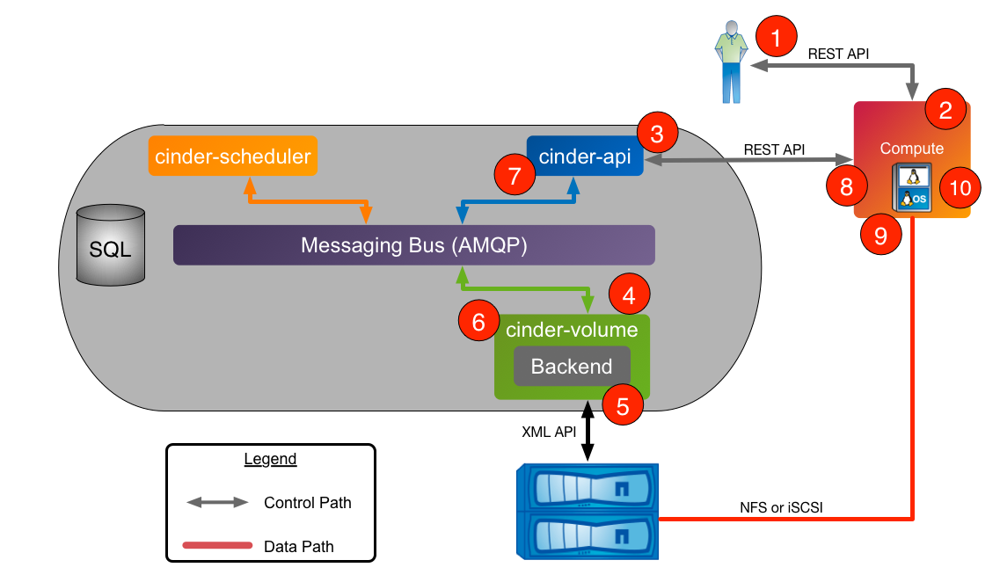
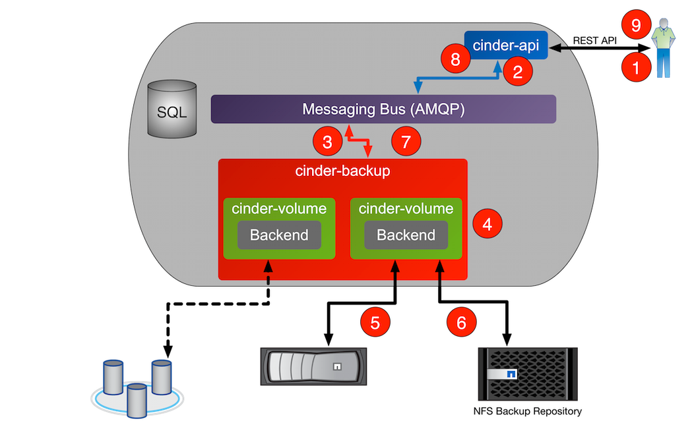
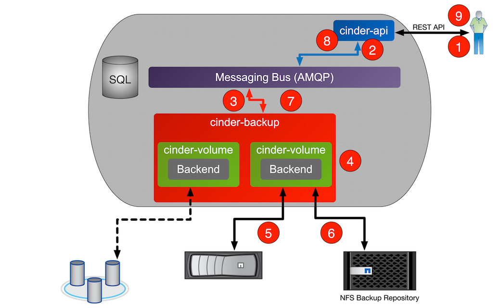

# Cinder workflow

## I. Khởi tạo volume mới



Quá trình tạo volume mới trên cinder:

1. Client yêu cầu tạo ra 1 Volume thông qua việc gọi REST API (Client cũng có thể sử dụng tiện ích CLI của python-client)

2. Cinder-api thực hiện xác nhận hợp lệ yêu cầu thông tin người dùng mỗi khi xác nhận được một message được gửi lên từ hàng chờ AMQP để xử lý

3. Cinder-volume đưa message ra khỏi hàng đợi, gửi thông báo tới cinder-scheduler để báo cáo xác định backend cung cấp volume

4. Cinder-scheduler thực hiện quá trình báo cáo sẽ đưa thông báo ra khỏi hàng đợi, tạo danh sách các ứng viên dựa trên trạng thái hiện tại và yêu cầu tạo volume theo tiêu chí như kích thước, vùng sẵn có, loại volume (bao gồm cả thông số kỹ thuật bổ sung)

5. Cinder-volume thực hiện quá trình đọc message phản hồi từ cinder-scheduler từ hàng đợi. Lặp lại qua các danh sách ứng viên bằng cách gọi backend driver cho đến khi thành công

6. Storage Cinder tạo ra volume được yêu cầu thông qua tương tác với hệ thống lưu trữ con (phụ thuộc vào cấu hình và giao thức)

7. Cinder-volume thực hiện quá trình thu thập dữ liệu và metadata volume và thông tin kết nối để trả lại thông báo đến AMQP

8. Cinder-api thực hiện quá trình đọc message phản hồi từ hàng đợi và đáp ứng tới client

9. Client nhận được thông tin bao gồm trạng thái của yêu cầu tạo, Volume UUID,...

## II. Attach volume



1. Client yêu cầu attach volume thông qua Nova REST API (Client có thể sử dụng tiện ích CLI của python-novaclient)

2. Nova-api thực hiện quá trình xác nhận yêu cầu và thông tin người dùng. Một khi đã được xác thực, gọi API Cinder để có được thông tin kết nối cho volume được xác định

3. Cinder-api thực hiện quá trình xác nhận yêu cầu hợp lệ và thông tin người dùng hợp lệ. Một khi được xác nhận, một message sẽ được gửi đến người quản lý volume thông qua AMQP

4. Cinder-volume tiến hành đọc message từ hàng đợi, gọi Cinder driver tương ứng với volume được gắn vào

5. Cinder driver chuẩn bị Cinder Volume chuẩn bị cho việc attach (các bước cụ thể phụ thuộc vào giao thức lưu trữ được sử dụng)

6. Cinder-volume thực hiện gửi thông tin phản hồi đến cinder-api thông qua hàng đợi AMQP

7. Cinder-api thực hiện quá trình đọc message phản hồi từ cinder-volume từ hàng đợi; truyền thông tin kết nối đến RESTful phản hồi tới NOVA

8. Nova tạo ra kết nối lưu trữ thông tin được trả về bởi Cinder

9. Nova truyền volume device/file tới hypervisor, sau đó gắn volume device/file vào máy ảo client như 1 block device thực tế hoặc ảo hóa (phụ thuộc vào giao thức lưu trữ)

## II. Backup volume



1. Client yêu cầu backup volume qua API

2. Cinder-api xác nhận yêu cầu, thông tin người dùng. Sau khi xác thực, gửi message qua AMQP

3. Cinder-backup đọc message từ hàng đợi, tạo 1 bản ghi trong DB để backup và tìm thông tin của volume cần được backup

4. Cinder-backup gọi phương thức ```backup-volume``` của Cinder volume driver tương ứng với volume thực hiện backup

5. Cinder-volume driver thích hợp sẽ được gán vào volume cần backup

6. Volume driver gọi phương thức ```backup``` cho backup service cấu hình, xử lý các volume gán vào

7. Backup service chuyển dữ liệu và metadata của volume sang backup repository (nơi lưu trữ các bản backup)

8. Backup service cập nhật DB với bản ghi đã hoàn thành cho bản backup và gửi message phản hồi lên Cinder-api qua hàng đợi AMQP

9. Cinder-api đọc message từ hàng đợi và chuyển kết quả cho client

## IV. Restore volume



1. Client gửi yêu cầu restore volume thông qua REST API

2. Cinder-api xác nhận yêu cầu, thông tin user. Sau khi xác nhận, nó sẽ gửi message vào AMQP

3. Cinder-backup đọc message từ hàng đợi, tìm bản ghi trong DB của bản backup

4. Cinder-backup gọi phương thức ```backup_restore``` của Cinder-volume driver tương ứng với volume được sao lưu. Kết nối volume với backup service được sử dụng (NFS,...)

5. Cinder-volume driver thích hợp sẽ được gán vào volume đích

6. Volume driver gọi phương thức ```restore``` để cấu hình backup service, xử lý các volume đính kèm

7. Backup service tìm vị trí và metadata của volume trong backup repository và sử dụng chúng để restore volume đến trạng thái khớp với bản backup

8. Sau khi restore xong, backup service gửi lại phản hồi về cho cinder-api qua AMQP

9. Cinder-api đọc thông điệp từ cinder-backup và chuyển kết quả cho client