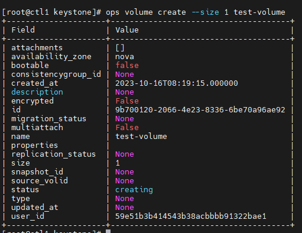
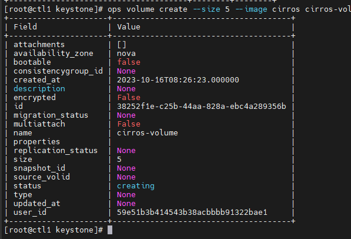
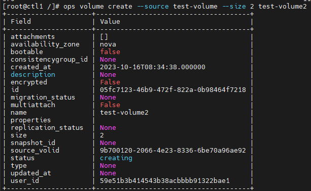
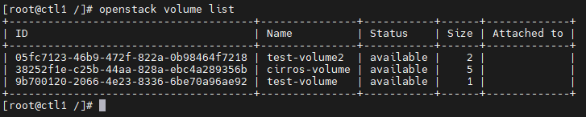
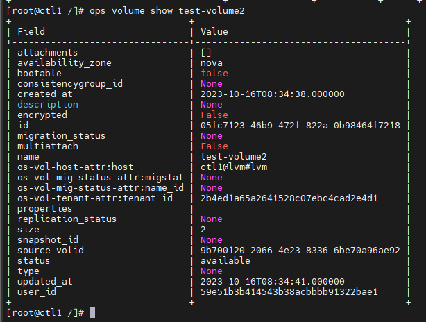
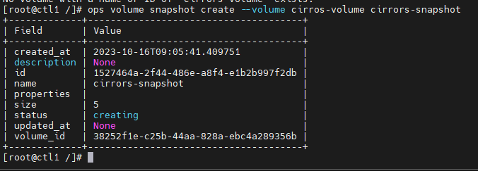
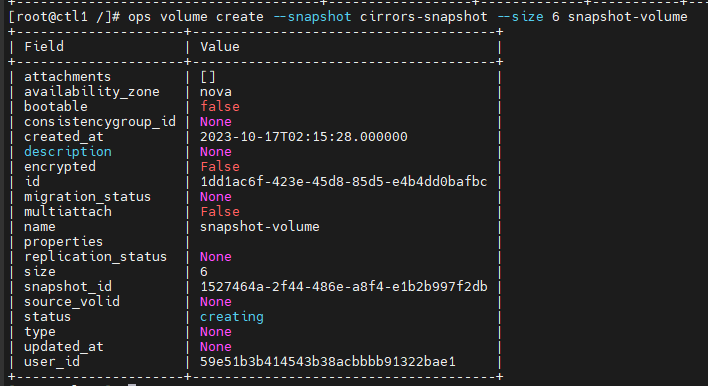

# Các lệnh thường dùng với Cinder

## I. Create Volume

### Tạo volume no-secure

```sh
openstack volume create --size <volume-size(GB)> <volume-name>
```



### Tạo 1 volume từ image

```sh
openstack volume create --size <volume-size> --image <image-name-or-id> <volume-name>
```

VD:

```sh
ops volume create --size 5 --image cirros cirros-volume
```



### Tạo 1 volume từ 1 volume khác

Volume mới sẽ chứa dữ liệu của volume khác, dung lượng của volume mới phải lớn hơn hoặc bằng volume cũ

```sh
ops volume create --source <volume-source-name> --size <volume-size> <volume-name>
```



## II. List volume, show volume

### List volume

```sh
openstack volume list
```



### Show volume

```sh
openstack volume show <volume-id-or-name>
```



## III. Snapshot volume

### Tạo snapshot

```sh
openstack volume snapshot create --volume <source-volume-name-or-id> <snapshot-name>
```



### Liệt kê snapshot

```sh
openstack volume snapshot list
```

### Xóa snapshot

```sh
openstack volume snapshot delete <snapshot-name>
```

### Tạo volume từ 1 bản snapshot

```sh
openstack volume create --snapshot <snapshot-name> --size <volume-size> <volume-name>
```



## Attach và Detach volume cho máy ảo

### Attach volume

```sh
openstack server add volume <VM-name> <volume-name> --device <added-device-name>
```

VD:

```sh
openstack server add volume vm01-test test-volume1 --device /dev/vdb
```

### Detach volume

```sh
openstack server remove volume <VM-name> <volume-name>
```

VD:

```sh
openstack server remove volume vm01-test test-volume1
```

## Resize volume

Để resize volume thì nó cần trạng thái ```available```. Tức là nếu volume đang được sử dụng thì ta cần detach nó khỏi server

Để resize volume (đã ở trạng thái ```available```): size của volume resize phải lớn hơn size ban đầu

```sh
openstack volume set <volume_ID> --size <size>
```

- Resize volume đang attach:
   - Với volume bootable (volume này không detach được): Không thực hiện resize được, nhưng khi chuyển trạng thái về ```available``` thì có thể resize (thêm dung lượng), thực hiện với LVM, sau khi resize, volume sẽ tự động chuyển về trạng thái ```In-use```. Khi kiểm tra bằng lệnh ```lsblk``` thì disk đã thay đổi kích thước, nhưng trên file hệ thống thực chất là chưa. Do thay đổi kích thước volume chứ không phải partition, vậy nên sau khi extent thì cần vào server để mount lại
   - Với volume non-bootable: Tương tự với volume bootable nhưng có thể detach khỏi instance
- Resize volume đã được detach, đang trong trạng thái available -> OK
- Sau khi resize volume **phải reboot** lại VM