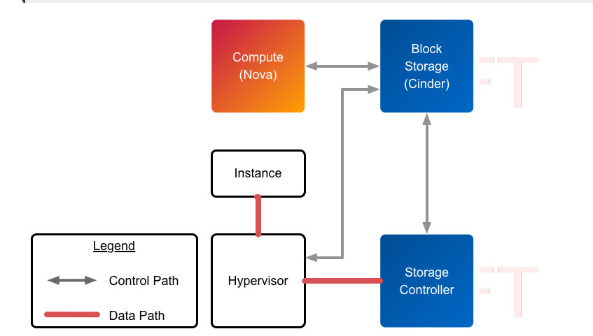
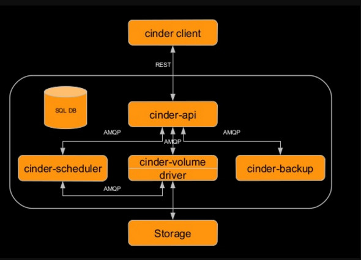

# Tổng quan về Cinder

## Giới thiệu

- Cinder là 1 dịch vụ lưu trữ khối (block storage service) cho OPS
- Mô tả ngắn gọn Cinder ảo hóa việc quản lý các block storage device và cung cấp cho end users API tự phục vụ để yêu cầu và sử dụng các tài nguyên đó mà không quan tâm đến về storage của họ được triển khai trên thiết bị nào
- Là 1 dịch vụ quản lý, Cinder kiểm soát việc cung cấp và quản lý block storage volumes
- Cinder và Nova Logical Architecture



## Các hình thức lưu trữ trong OPS

||Lưu trữ tạm thời|Block storage|Object Storage|
|:-|:-|:-|:-|
|Hình thức sử dụng|Dùng để chạy hệ điều hành|Thêm 1 persistent storage vào VM|Lưu trữ các VM image, disk volume, snapshot VM,...|
|Hình thức truy cập|Qua 1 file system|Một block device có thể là 1 partition, formated, mounted|Thông qua REST API|
|Có thể truy cập từ|Trong 1 VM|Trong 1 VM|Bất kỳ đâu|
|Quản lý bởi|NOVA|Cinder|Swift|
|Những vấn đề tồn tại|VM được kết thúc|Có thể được xóa bởi user|Có thể xóa được bởi user|
|Kích cỡ được xác định bởi|Người quản trị cấu hình hệ thống|Dựa theo yêu cầu của người dùng|Số lượng lưu trữ vật lý hiện có|

## Kiến trúc Cinder



- ```cinder-client```: User sử dụng CLI/UI để tạo request
- ```cinder-api```: Chấp nhận và định tuyến cho các request
- ```cinder-scheduler```: Lên lịch trình và định tuyến cho các request đến volume service thích hợp
- ```cinder-volume```: Quản lý thiết bị block storage
- ```driver```: Chứa các loại mã backend cụ thể để giao tiếp với các loại storage khác nhau
- ```storage```: Các thiết bị lưu trữ từ các provider khác nhau
- ```SQL DB```: Lưu lại thông tin về các volumes sử dụng
- ```cinder-backup```: Cung cấp phương pháp để backup 1 volume đến Swift/Ceph,...

## Các thành phần trong Cinder

- Backend Storage device:
  - Mặc định sử dụng LVM trên nhóm local volume (cinder-volume)
  - Hỗ trợ thiết bị như mảng external RAID hoặc các thiết bị lưu trữ
  - Kích thước Block có thể điều chỉnh khi dùng KVM hoặc QEMU
- Users / Project:
  - Dùng Role-based Access Control (RBAC) khi nhiều người sử dụng để kiểm soát các hành động mà người dùng được phép thực hiện
  - Sử dụng file "policy.json" để cấu hình các thiết lập cho mỗi vai trò
  - Volume được mở cho mỗi user truy cập vào và sử dụng Key Pairs, nhưng hạn ngạch để kiểm soát sự tiêu thụ tài nguyên trên các tài nguyên phần cứng đối với mỗi project
- Volumes, Snapshots và Backups:
  - **Volumes**: Phân bổ block storage resource có thể gắn liền với các trường hợp như lưu trữ thứ cấp hoặc chúng có thể được sử dụng là vùng lưu trữ cho root dùng để boot máy ảo. Là thiết bị lưu trữ RW gắn kết vào compute node thông qua iSCSI
  - **Snapshots**: Một bản copy trong 1 thời điểm nhất định của một volume. Các snapshot có thể được tạo ra từ volume đang sử dụng. Các snapshot có thể được sử dụng để tạo volume mới
  - **Backups**: Một bản sao lưu của volume được lưu trong OPS object storage