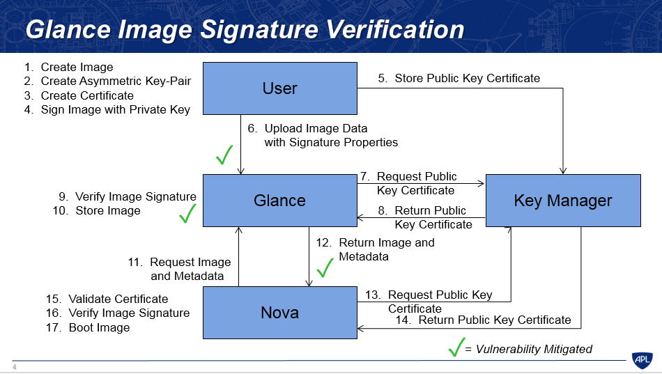
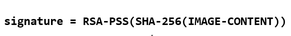

# Các trạng thái và luồng hoạt động của Glance

## Các trạng thái của image

- ```queued```: Định danh của image được reserved trong Glance registry. Không có dữ liệu nào của image được tải lên Glance và kích thước của image không được thiết lập về zero khi khởi tạo

- ```saving```: Biểu thị rằng dữ liệu của image đang được upload lên glance. Khi một image đăng ký với một lời gọi đến POST /image và có một x-image-meta-location header, image đó sẽ không bao giờ được trong tình trạng saving (dữ liệu image đã có sẵn ở vị trí khác)

- ```active```: Biểu thị một image đó là hoàn toàn có sẵn trong Glance. Điều này xảy ra khi các dữ liệu image đã được tải lên

- ```deactivated```: Trạng thái biểu thị việc không được phép truy cập vào dữ liệu của image với tài khoản không phải admin. Khi image ở trạng thái này, ta không thể tải xuống cũng như export hay clone image

- ```killed```: Trạng thái biểu thị rằng có vấn đề xảy ra trong quá trình tải dữ liệu của image lên và image đó không thể đọc được

- ```deleted```: Trạng thái này biểu thị việc Glance vẫn giữ thông tin về image nhưng nó không còn sẵn sàng để sử dụng nữa. Image ở trạng thái này sẽ tự động bị gỡ bỏ vào ngày hôm sau

- ```pending_delete```: Tương tự như trạng thái deleted, tuy nhiên Glance chưa vội gỡ bỏ dữ liệu của image ngay. Một image khi đã rơi vào trạng thái này sẽ không có khả năng khôi phục

## Glance Status Flow

Trạng thái image trong quá trình tải lên sẽ diễn ra như sau:


Khi tạo 1 image:
- Image sẽ được đưa vào hàng đợi và được nhận diện trong khoảng thời gian ngắn, được reserved và sẵn sàng tải lên (**Queued**)
- Quá trình upload image diễn ra (**Saving**)
- Upload hoàn tất (**Active**). Nếu upload thất bại thì trạng thái sẽ là **Killed** hoặc **Deleted**
- Người quản trị có thể tắt (deactive) hoặc bật (reactive) các image đã upload thành công (**Deactivated**)

## Image và Instance

Như đã đề cập, disk images được lưu trữ giống như các template. Image service kiểm soát việc lưu trữ và quản lý của các images. Instance là một máy ảo riêng biệt chạy trên compute node, compute node quản lý các instances. User có thể vận hành bao nhiêu máy ảo tùy ý với cùng 1 image. Mỗi máy ảo đã được vận hành được tạo nên bởi 1 bản sao của image gốc, bởi vậy bất kỳ chỉnh sửa nào trên instance cũng không ảnh hưởng tới image gốc. Ta có thể tạo bản snapshot của các máy ảo đang chạy nhằm mục đích dự phòng hoặc vận hành một máy ảo khác.

Khi ta vận hành một máy ảo, ta cần phải chỉ ra flavor của máy ảo đó. Flavor đại diện cho tài nguyên ảo hóa cung cấp cho máy ảo, định nghĩa số lượng CPU ảo, tổng dung lượng RAM cấp cho máy ảo và kích thước ổ đĩa không bền vững cấp cho máy ảo. OPS cung cấp một số flavors được định nghĩa sẵn, ta có thể tạo và chỉnh sửa các flavor theo ý mình

Sơ đồ dưới đây chỉ ra trạng thái của hệ thống trước khi vận hành máy ảo. Trong đó image store chỉ số lượng các images đã được định nghĩa trước, compute node chứa các vcpu có sẵn, tài nguyên bộ nhớ và tài nguyên đĩa cục bộ, cinder-volume chứa số lượng volumes đã định nghĩa trước đó


Trước khi vận hành máy ảo, ta phải chọn 1 image, flavor và các thuộc tính tùy chọn. Lựa chọn flavor nào cung cấp root volume, có nhãn là vda và một ổ lưu trữ tùy chọn được đánh nhãn vdb (ephemeral - không bền vững) và cinder-volume được map với ổ đĩa ảo thứ 3, còn gọi là vdc


Theo mô tả trên hình, image gốc được copy vào ổ lưu trữ cục bộ từ image store. Ổ vda là ổ đầu tiên mà máy ảo truy cập. Ổ vda là ổ tạm thời (không bền vững - ephemeral) và rỗng, được tạo nên cùng với máy ảo, nó sẽ bị xóa khi ngắt hoạt động của máy ảo. Ổ vdc kết nối với cinder-volume sử dụng giao thức iSCSI. Sau khi compute node dự phòng vCPU và tài nguyên bộ nhớ, máy ảo sẽ boot từ root volume là vda. Máy ảo chạy và thay đổi dữ liệu trên các ổ đĩa. Nếu volume store được đặt trên hệ thống mạng khác, tùy chọn ```"my_block_storage_ip"``` phải được đặc tả chính xác trong tệp cấu hình storage node chỉ ra lưu lượng image đi tới compute node

Khi máy ảo bị xóa, ephemeral storage (khối lưu trữ không bền vững) bị xóa, tài nguyên vCPU và bộ nhớ đc giải phóng. Image không bị thay đổi sau tiến trình này

## Glance image cache

Việc kích hoạt Glance cache thường được khuyên khi sử dụng hệ thống lưu trữ mặc định là file, tuy nhiên nếu sử dụng CEPH RBD backend sẽ có một số khác biệt

Kích hoạt Glance cache dẫn tới việc tạo ra cached của imaged đó trong thư mục ```/var/lib/glance/image-cache``` mỗi lần boot máy ảo lên. Giả sử ta có một máy ảo với kích thước VM image là cỡ 50 GB, nếu như mỗi lần boot mà lại tạo cached như vậy, hệ thống lưu trữ sẽ sớm bị cạn kiệt, trừ khi ta mount thư mục ```/var``` vào một ổ lưu trữ lớn

Glance API server có thể được cấu hình để có thư mục lưu trữ image cache local. Một thư mục local image cache lưu trữ một bản copy của các image, về cơ bản điều này cho phép API server phục vụ cùng các file image giống nhau, để mở rộng khả năng phục vụ của Glance

Local image cache là trong suốt với người dùng. Người dùng cuối không biết được Glance API đang chuyển các file image từ local cache hay từ hệ thống backend lưu trữ thực sự

## Glance Image Signing và Verification

### 1. Đặt vấn đề về bảo mật và toàn vẹn image

Trước bản phát hành Liberty, không hề có phương thức nào cho các user để xác nhận rằng image họ tải lên có bị thay đổi hay không. Một image bị thay đổi có thể xảy ra trong quá trình upload từ user lên Glance hoặc Glance chuyển image tới Nova, hoặc cũng có thể do chính Glance tự mình thay đổi mà không có tác động từ phía người dùng. Một image bị thay đổi có thể chứa mã độc. Bởi vậy việc cung cấp cơ chế chữ ký số cho image và xác nhận chữ ký số cho phép user xác nhận xem image có bị thay đổi không trước khi boot image tạo máy ảo.

Tính năng này hỗ trợ một số trường hợp như sau:
- Một image được ký bởi end user, sử dụng private key. Sau đó, user upload image lên Glance, cùng với chữ ký vừa tạo và public key certificate của user. Glance sử dụng thông tin này để xác thực chữ ký, và thông báo tới user nếu chữ ký không hợp lệ
- Một image được tạo trong Nova, và Nova ký lên image tại request của end user. Khi image được upload lên Glance, chữ ký và public key certificate cũng được cung cấp. Glance xác nhận chữ ký trước khi lưu trữ image, và thông báo với Nova nếu sự xác thực xảy ra lỗi
- Một image đã được ký được yêu cầu bởi Nova, và Glance cung cấp chữ ký và public key tới Nova cùng image để Nova có thể xác thực chữ ký trước khi booting image

### 2. Quá trình xác thực chữ ký image trong Glance

Những phiên bản triển khai đầu tiên trong Liberty, thay đổi này sử dụng tính năng của Glance để lưu trữ metadata cần thiết cho việc ký và xác nhận image. Những thông tin này bao gồm: 1 public key, 1 chữ ký (private key)

Những tính năng này được cung cấp khi image được tạo và có thể truy cập được khi image đã được upload. Lưu ý rằng tính năng này chỉ hỗ trợ upload image với Glance API v2 (và không hỗ trợ Glance API v1). Nhiều định dạng của key và chữ ký được hỗ trợ, định dạng chữ ký cũng được lưu trữ như là 1 thuộc tính của image. Certificate tham chiếu được sử dụng để truy cập tới certificate từ 1 key manager, nơi mà các certificate được lưu trữ. Certificate này được thêm vào trong key manager bởi end user trước khi upload image. Lưu ý là chữ ký được thực hiện offline

Sau đây là luồng thực hiện ký và xác nhận image trong trường hợp đề cập ở trên (bước 1 -> 10 là trường hợp user upload image lên Glance, bước 11 là trường hợp Nova request image từ Glance để boot máy ảo):



1. User tạo image để upload lên Glance

2. User tạo cặp key theo thuật toán mã hóa khóa công khai (khóa bất đối xứng)

3. User sử dụng các thông tin của mình để tạo Certificate xác minh bản thân

4. Ký lên image với private key (mã hóa image). Chú ý bước này có sự khác biệt giữa Liberty và các bản từ Mitaka về sau:

- **Liberty**: Trước khi ký lên image, dữ liệu của image sẽ được băm sử dụng thuật toán md5. Dữ liệu của image được chia thành từng phần nhỏ rồi băm. Cuối cùng ta sẽ thu lại được 1 mã băm gọi là **checksum_hash** của dữ liệu image. Tiếp đó mã này sẽ được sử dụng vào thuật toán băm thứ 2 là SHA-256


- **Mikata và các phiên bản về sau:** Không sử dụng thuật toán MD5 để băm dữ liệu của image. Tuy nhiên dữ liệu của image sẽ bị băm 1 lần sử dụng thuật toán SHA-256



5. Gửi public key certificate lên key manager để lưu trữ sử dụng giao diện Castellan (gửi thông certificate và public key), đồng thời thu lại giá trị ```signature_certificate_uuid``` sử dụng cho quá trình upload image và các đối tượng khác thu thập public key certificate sử dụng để xác thực sau này

6. Upload Image lên Glance kèm theo các thuộc tính liên quan tới chữ ký số (các signature metadata). Các thuộc tính này bao gồm:
- ```signature```: chính là chữ ký số ta thu được. Tùy thuộc phiên bản Liberty hay từ phiên bản Mitaka mà chữ ký số này có thể tjao ra khác nhau
- ```signature_key_type```: là loại key được sử dụng để tạo chữ ký số. VD: RSA-PSS
- ```signature_hash_method```: là phương thức băm được sử dụng để tạo chữ ký. VD: SHA-256
- ```signature_certificate_uuid```: chính là cert_uuid thu được ở bước 5 khi tiến hành lưu trữ cert
- ```mask_gen_algorith```: giá trị này chỉ ra thuật toán tạo mặt nạ được sử dụng trong quá trình tạo ra chữ ký số. VD: MGF1 - Giá trị này chỉ sử dụng cho mô hình RSA-PSS
- ```psa_salt_length```: định nghĩa salt length sử dụng trong quá trình tạo chữ ký và chỉ áp dụng cho mô hình RSA-PSS. Giá trị mặc định là ```PSS.MAX_LENGTH```

7. Glance gửi request public key certificate từ key manager để xác nhận lại chữ ký được upload lên cùng image (publickey được dùng để giải mã chữ ký). Để làm điều này Glance phải sử dụng ```signature_certificate_uuid``` thu được trong quá trình tải image lên của người dùng

8. Key manager trả lại public key certificate cho Glance

9. Xác nhận lại chữ ký của Image: sử dụng public key thu được cùng với các signature metadata khi image được upload lên. Việc xác thực này được thực hiện bởi module ```signature_utils```

10. Lưu lại image nếu chứng thực thành công. Nếu chứng thực thất bại, Glance sẽ đưa imnage đó vào trạng thái ```killed``` và gửi thông báo lại cho người dùng kèm theo lý do tại sao image upload bị lỗi

11. Nova gửi yêu cầu tới Glance để lấy Image và metadata để boot máy ảo

12. Glance gửi lại Nova image kèm theo metadata để chứng thực 

13. Nova yêu cầu Public key Certificate từ Key Manager bằng việc sử dụng ```cert_uuid``` tương tác với giao diện Castellan

14. Key manager trả về public key certificate cho Nova

15. Nova xác nhận chứng chỉ. Chức năng này được thực hiện nếu chỉnh sửa module ```signature_utils``` của Nova để kết hợp việc xác nhận chứng chỉ (certificate validation) vào workflow của tiến trình xác thực chữ ký (signature verification)

16. Xác thực chữ ký của image. Để làm điều này, ta phải cấu hình trong file ```nova.conf``` của nova, thiết lập giá trị ```verify_glance_signature = true```. Như vậy Nova sẽ sử dụng các thuộc tính của image, bao gồm các thuộc tính cần thiết cho quá trình xác thực chữ ký image (signature metadata). Nova sẽ đưa dữ liệu của image và các thuộc tính của nó tới module ```signature_utils``` để xác thực chữ ký

17. Nếu việc xác thực chữ ký thành công, nova sẽ tiến hành boot máy ảo sử dụng image đó và ghi vào log chỉ ra rằng việc xác thực chữ ký thành công kèm theo các thông tin về **signing certificate**. Ngược lại nếu xác thực thất bại, Nova sẽ không boot image và lưu lại lỗi vào log

## Một số giải pháp thay thế khác

Sử dụng cách tiếp cận **sign-the-data** (>= Mikata) thay cho **sign-the-hash**. Bởi MD5 về nguyên thủy thì không được sử dụng để xác thực mà là một hàm băm, nên nó không cung cấp giải pháp bảo vệ chống lại những thay đổi có hại như mã độc. Việc sử dụng hàm băm MD5 do đó gây ra sự phức tạp không cần thiết

Một giải pháp thay thế để lưu trữ public key certificate là sử dụng chính Glance. Tuy nhiên, hướng tiếp cận này không an toàn so với việc sử dụng Key manager, vì chính Glance cũng tiềm ẩn nguy cơ không tin cậy trong nhiều trường hợp, không sinh ra để lưu trữ key và các chứng chỉ gốc

Giải pháp thay vì sử dụng mã hóa khóa bất đối xứng là sử dụng mã hóa khóa đối xứng. Tuy nhiên cách này không an toàn, vì nếu Glance muốn xác thực image, nó cần có quyền truy cập vào key đã được sử dụng để tạo chữ ký. Việc truy cập này cho phép Glance chỉnh sửa image và tạo ra chữ ký mới mà không có tác động của người dùng. Sử dụng mã hóa khóa bất đối xứng cho phép Glance xác thực chữ ký mà không cần phải được cấp quyền chỉnh sửa image hay signature. Và vì buộc phải sử dụng public key cert từ key manager để xác thực nên việc chỉnh sửa của Glance sẽ là không hợp lệ nếu như chỉnh chữ ký bị chỉnh sửa

Một giải pháp đặt ra là sử dụng các thuộc tính của Glance để lưu trữ và thu thập signature metadata thông qua việc tạo các API mở rộng hỗ trợ chữ ký. Nghĩa là thay vì người dùng phải thiết lập metadata sử dụng các cặp key-value, các API mở rộng sẽ được sử dụng. Hiện tại, nếu một user được phép sử dụng metadata keys (cho các chứng chỉ và chữ ký) vì mục đích khác thì việc tải image lên sẽ gặp thất bại. Do đó các API mở rộng phải được phép quản lý nhiều chữ ký trên mỗi image một cách rõ ràng, nhưng điều này là không khả thi với hướng tiếp cận các thuộc tính. Tuy nhiên image API cũng không hỗ trợ các API mở rộng, nên hướng tiếp cận này không phù hợp.

Có một giải pháp khác để lưu trữ và thu thập metadata là sử dụng cú pháp thông điệp mật mã CMS (cryptographic message syntax) định nghĩa trong chuẩn RFC 5652 mục 5. Tuy nhiên, kích thước của định dạng sử dụng cho chuẩn này là biến số, không cố định và không thể sử dụng các thuộc tính hiện tại của Glance, điều này dẫn tới yêu cầu phải chỉnh sửa lại API. Việc chuyển sang sử dụng CMS trong tương lai sẽ được triển khai để đáp ứng nhu cầu tăng tính linh hoạt.

Hướng mở rộng trong tương lai là hỗ trợ triển khai trên hệ thống multi-cloud htay vì single-cloud, nếu như phát sinh nhu cầu trao đổi image giữa các cloud khác nhau, tiến trình xác thực chữ ký cũng có thể xác nhận các images có bị chỉnh sửa hay không.