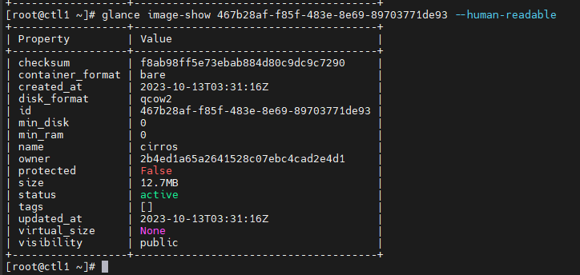
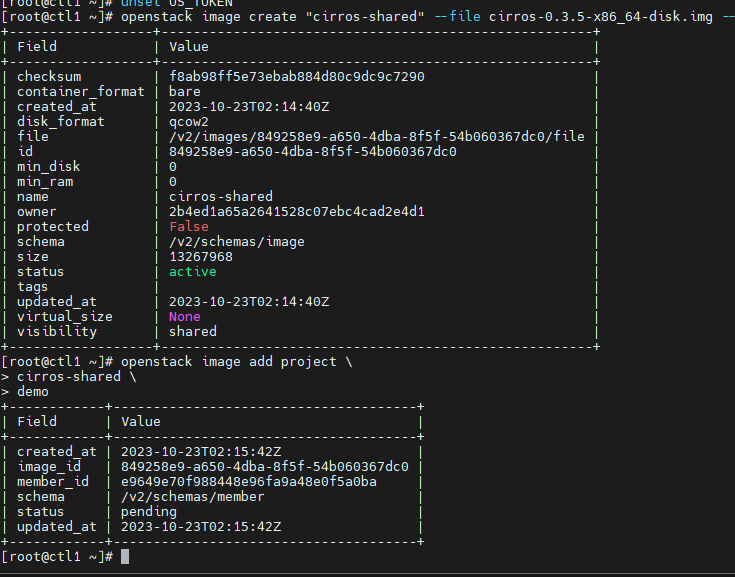

# Các lệnh thường sử dụng với Glance

Có thể thao tác với Glance CLI bằng 2 cách:
- Glance CLI
- OpenStack Client CLI

## Glance CLI

## List image

```sh
glance image-list
```

## Create image

```sh
glance image-create [--architecture <ARCHITECTURE>]
                           [--protected [True|False]] [--name <NAME>]
                           [--instance-uuid <INSTANCE_UUID>]
                           [--min-disk <MIN_DISK>] [--visibility <VISIBILITY>]
                           [--kernel-id <KERNEL_ID>]
                           [--tags <TAGS> [<TAGS> ...]]
                           [--os-version <OS_VERSION>]
                           [--disk-format <DISK_FORMAT>]
                           [--os-distro <OS_DISTRO>] [--id <ID>]
                           [--owner <OWNER>] [--ramdisk-id <RAMDISK_ID>]
                           [--min-ram <MIN_RAM>]
                           [--container-format <CONTAINER_FORMAT>]
                           [--property <key=value>] [--file <FILE>]
                           [--progress]
```

VD:

```sh
glance image-create --disk-format qcow2 --container-format bare --file cirros-0.4.0-x86_64-disk.img --name cirros-test
```

## Show image

```sh
glance image-show [--human-readable] [--max-column-width <integer>] <IMAGE_ID>
```

VD:

```sh
glance image-show 467b28af-f85f-483e-8e69-89703771de93 --human-readable
```



## Upload image

```sh
glance image-upload [--file <FILE>] [--size <IMAGE_SIZE>] [--progress] <IMAGE_ID>
```

Để upload image, ta cần 1 image rỗng trước. Tạo image rỗng như sau:

```sh
glance image-create --name cirros-upload --container-format bare --disk-format qcow2
```

Tiến hành upload image

```sh
glance image-upload --file cirros-0.3.5-x86_64-disk.img  --progress 10d94b6d-e009-441b-96d9-e61597a7b921
```

## Change image status

### Deactivate image

```sh
glance image-deactivate <IMAGE_ID>
```

### Delete image

```sh
glance image-delete <IMAGE_ID> [<IMAGE_ID> ...]
```

## Các lệnh Openstack liên quan đến image

### List image

```sh
openstack image list
```

### Show image

```sh
openstack image show [--human-readable] <ID | image_name>
```

- ```--human-readable```: định dạng kích thước của image để đọc

### Create image

```sh
openstack image create
    [--id <id>]
    [--container-format <container-format>]
    [--disk-format <disk-format>]
    [--min-disk <disk-gb>]
    [--min-ram <ram-mb>]
    [--file <file> | --volume <volume>]
    [--force]
    [--sign-key-path <sign-key-path>]
    [--sign-cert-id <sign-cert-id>]
    [--protected | --unprotected]
    [--public | --private | --community | --shared]
    [--property <key=value>]
    [--tag <tag>]
    [--project <project>]
    [--import]
    [--project-domain <project-domain>]
    <image-name>
```

VD:

```sh
openstack image create "cirros-2" --file cirros-0.3.5-x86_64-disk.img --disk-format qcow2 --container-format bare --public
```

### Delete image

```sh
openstack image delete <image-id | image-name>
```

### Update image information

```sh
openstack image set
    [--name <name>]
    [--min-disk <disk-gb>]
    [--min-ram <ram-mb>]
    [--container-format <container-format>]
    [--disk-format <disk-format>]
    [--protected | --unprotected]
    [--public | --private | --community | --shared]
    [--property <key=value>]
    [--tag <tag>]
    [--architecture <architecture>]
    [--instance-id <instance-id>]
    [--kernel-id <kernel-id>]
    [--os-distro <os-distro>]
    [--os-version <os-version>]
    [--ramdisk-id <ramdisk-id>]
    [--deactivate | --activate]
    [--project <project>]
    [--project-domain <project-domain>]
    [--accept | --reject | --pending]
    <image>
```

### Add project to image

```sh
openstack image add project
    [--project-domain <project-domain>]
    <image>
    <project>
```

Trong đó:
- ```--project-domain <project-domain>```: domain (tên hoặc ID)
- ```<image>```: image ở trạng thái shared (tên hoặc ID)
- ```<project>```: project (tên hoặc ID)

Để thêm project cho image thì image phải ở trạng thái ```shared```

VD:

```sh
openstack image create "cirros-shared" --file cirros-0.3.5-x86_64-disk.img --disk-format qcow2 --container-format bare --shared
```

```sh
openstack image add project \
cirros-shared \
demo
```



Để remove, ta đổi ```add``` -> ```remove```

```sh
openstack image remove project
    [--project-domain <project-domain>]
    <image>
    <project>
```