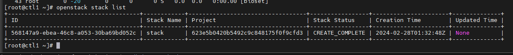
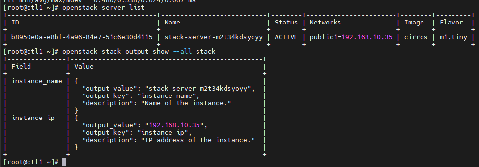

# Launch an instance

Bài này sẽ demo cách tạo stack để khởi chạy 1 instance

## Create a template

Orchestration service sử dụng templates để mô tả stacks. Để hiểu thêm về cú pháp của templates, hãy đọc thêm tại đây: [Template Guide](https://docs.openstack.org/heat/latest/template_guide/index.html#template-guide)

- Tạo ```demo-template.yaml``` với nội dung như sau:

```sh
heat_template_version: 2015-10-15
description: Launch a basic instance with CirrOS image using the
             ``m1.tiny`` flavor, ``mykey`` key,  and one network.

parameters:
  NetID:
    type: string
    description: Network ID to use for the instance.

resources:
  server:
    type: OS::Nova::Server
    properties:
      image: cirros
      flavor: m1.tiny
      key_name: mykey
      networks:
      - network: { get_param: NetID }

outputs:
  instance_name:
    description: Name of the instance.
    value: { get_attr: [ server, name ] }
  instance_ip:
    description: IP address of the instance.
    value: { get_attr: [ server, first_address ] }
```

## Create a stack

Tạo 1 stack sử dụng **demo-template.yaml** template

1. Source **demo** credentials để thực hiện các bước sau như 1 non-administrative project:

```sh
. demo-openrc
```

2. Xác định available network

```sh
openstack network list
```

3. Thiết lập biến môi trường **NET_ID** để ánh xạ ID của network. Ví dụ, sử dụng provider network:

```sh
export NET_ID=$(openstack network list | awk '/ provider / { print $2 }')
```

4. Tạo 1 stack của 1 CirrOS instance trên provider network

```sh
openstack stack create -t demo-template.yaml --parameter "NetID=$NET_ID" stack
```

5. Sau 1 khoảng thời gian ngắn, đảm bảo stack đã tạo thành công:

```sh
openstack stack list
```



6. Show tên và địa chỉ IP của instance và so sánh với output của OpenStack client:

```sh
openstack stack output show --all stack
```

```sh
openstack server list
```



7. Delete stack

```sh
openstack stack delete --yes stack
```