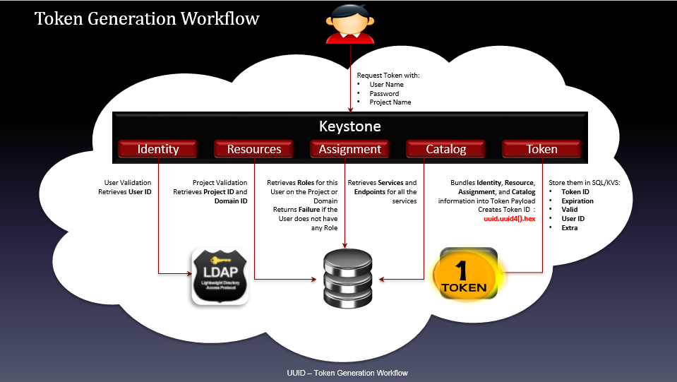
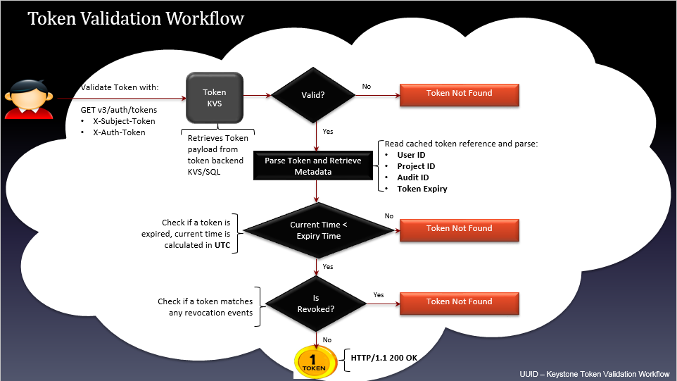
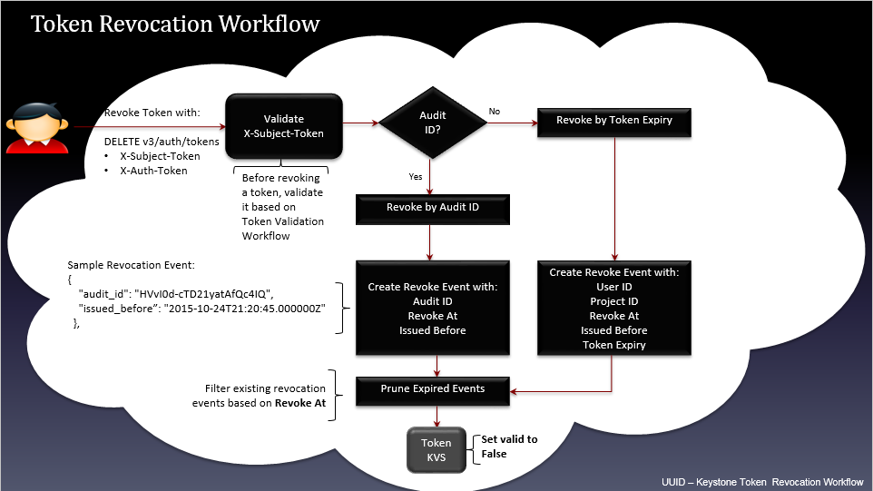
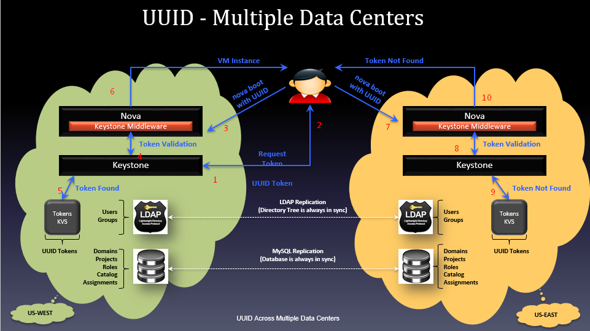
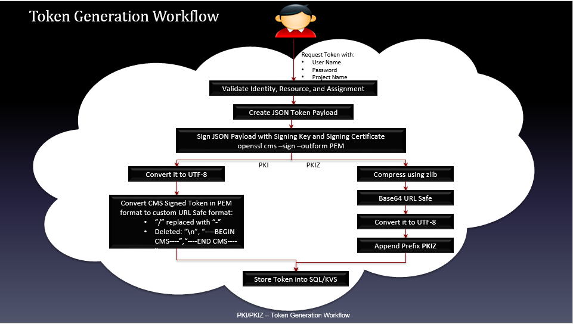
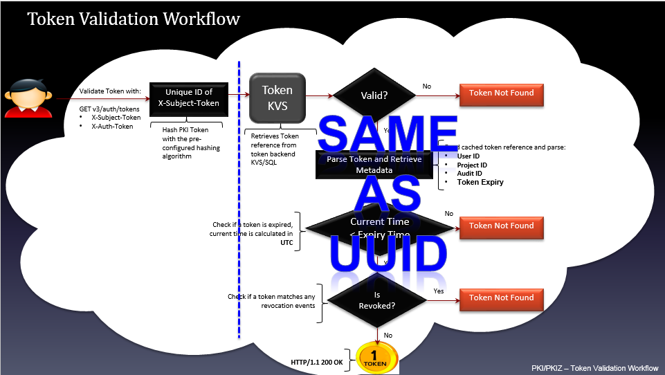
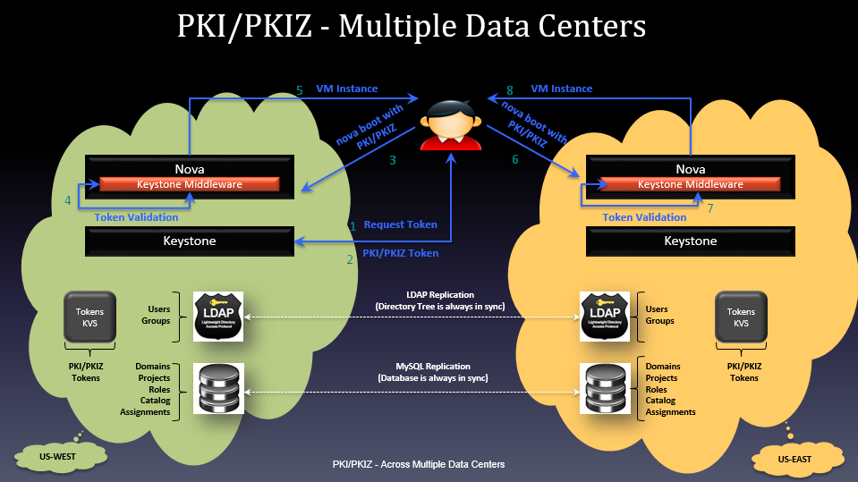
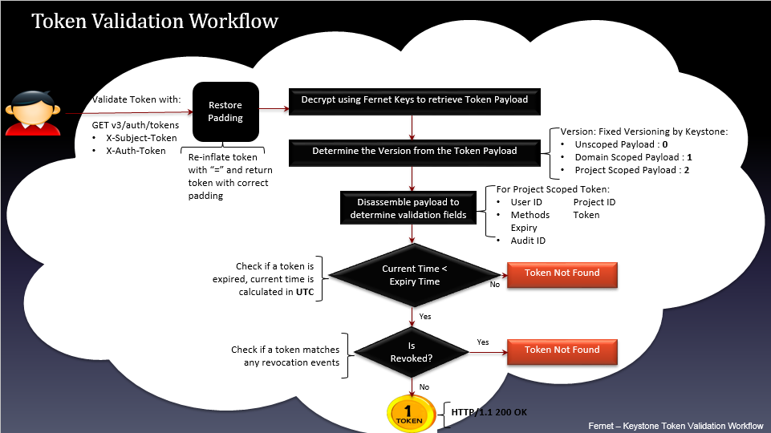

# Các loại TOKEN trong Keystone

## Quá trình phát triển

Keystone cho phép 1 vài loại token, và người dùng có thể băn khoăn tại sao lại có nhiều loại đến vậy. Để giúp hiểu sau hơn vấn đề này, sau đây sẽ cung cấp một cách vắn tắt về quá trình phát triển các loại token của Keystone

Trong những ngày đầu, Keystone hỗ trợ token **UUID**. Đây là loại token dài 32 ký tự và được sử dụng để xác thực và ủy quyền
- Ưu điểm: kích thước nhỏ, dễ sử dụng, đồng thời cũng dễ dàng để thêm vào 1 câu lệnh cURL
- Nhược điểm: không mang đầy đủ thông tin xác thực, các service của OPS sẽ luôn gửi lại token này tới Keystone server để kiểm tra xác thực. Điều này dẫ tới bất kỳ hoạt động nào của OPS đều phải hỏi lại về Keystone và nó dẫn tới Keystone trở thành nút thắt cổ chai của OPS

Để giải quyết các vấn đề với token UUID, đội ngũ Keystone đã tạo ra loại token mới là **PKI token**. Loại này chứa đầy đủ thông tin để thực hiện xác thực và cũng chứa tất cả những catalog dịch vụ
- Thêm vào đó, nó còn được đánh dấu và các dịch vụ có thể cache lại token và sử dụng nó cho đến khi hết hạn hoặc bị thu hồi
- Sử dụng Token PKI làm giảm lưu lượng trên Keystone server, nhưng vẫn có bất lợi là token này có kích thước lớn. PKI token có thể lên tới 8KB và nó làm cho khó khớp với HTTP header. Rất nhiều webserver không thể xử lý nổi những bản tin với dung lượng HTTP header lên tới 8KB mà không được cấu hình trước
- Hơn nữa token này khó để sử dụng với câu lệnh cURL
- Đội ngũ Keystone đã cải tiến PKI thành PKIz - nén lại của PKI (được khoảng 10%), tuy nhiên vẫn quá lớn

Do đó, một token mới gọi là **Fernet token** được tạo ra:
- Kích thước nhỏ (255 ký tự) nhưng lại chứa đủ thông tin để có thể xác thực tại các service local. Token này còn có nhiều lợi ích khác
- Mặc dù chứa đủ thông tin nhưng Keystone không cần phải lưu trữ dữ liệu token trong database (một trong những yếu nhược điểm của loại trước đó). Do database có thể bị tăng dung lượng khiến hiệu suất của Keystone giảm

## UUID token

### 1. Giới thiệu

Là loại token đầu tiên của Keystone

UUID Token đơn giản là một chuỗi 32 ký tự được sinh ra ngẫu nhiên. Được cấp phát và được xác nhận bởi dịch vụ Identity

Sử dụng phương pháp sinh chuỗi sử dụng các chữ số hệ hexa. Điều này làm UUID token trở nên thân thiện và an toàn cho việc truyền giữa các môi trường non-binary

Một UUID phải được lưu trữ lâu dài trong backend (thông thường là trong database) để có thể xác nhận sau đó

Token UUID có thể thu hồi bằng cách sử dụng 1 request DELETE với token ID. Khi đó, token không hẳn là bị xóa khỏi hệ thống backend mà chỉ đơn giản là làm cho nó bị thu hồi không còn hiệu lực

Do token dài 32 ký tự nên kích thuosc trong HTTP header là 32 byte

Một UUID token thường trông như sau: ```468da447bd1c4821bbc5def0498fd441```

Loại này có kích thước nhỏ và dễ dàng sử dụng khi truy cập Keystone thông qua câu lệnh cURL

Nhược điểm: Keystone có thể trở thành nút cổ chai do số lượng thông tin liên lạc rất lớn xảy ra khi Keystone cần để xác nhận token giữa các dịch vụ

Để sử dụng UUID token trong OPS, cấu hình Keystone trong file keystone.conf tại section token như sau:

```sh
provider = keystone.token.providers.uuid.Provider
```

### 2. Token Generation Workflow



User request tới keystone tạo token với các thông tin: username, password, project name (và domain name nếu cài multiple domain)

Chứng thực user, sau đó lấy UserID từ backend LDAP (dịch vụ Identity)

Chứng thực project, thu thập thông tin Project ID và Domain ID (Resource)

Lấy ra Roles từ Backend trên Project hoặc Domain tương ứng trả về cho user, nếu user không có bất kỳ role nào thì trả về Failure (dịch vụ Assignment)

Thu thập các Services và các Endpoints của các service đó (Catalog)

Tổng hợp các thông tin về Identity, Resources, Assignment, Catalog ở trên và đưa vào Token payload, tạo ra token sử dụng hàm uuid.uuid4().hex

Lưu thông tin của Token và SQL/KVS backend với các thông tin: TokenID, Expiration, Valid, UserID, Extra

### 3. Quá trình xác thực token - Token Validation Workflow



User gửi yêu cầu chứng thực token sử dụng ```GET v3/auth/tokens```

Thu thập token payloads từ token backend KVS/SQL kiểm tra trường valid:
- Nếu không hợp lệ trả về thông báo Token Not Found
- Nếu tìm thấy thì chuyển sang bước tiếp theo

Phân tích token và thu thập metadata: UserID, ProjectID, AuditID, Token Expire

Kiểm tra token đã expired chưa: Nếu "current time" < "expired time" theo UTC thì token chưa expired, chuyển sang bước tiếp theo, ngược lại trả về thông báo token not found

Kiểm tra xem token đã bị thu hồi chưa (kiểm tra trong bảng revocation_event của database keystone): Nếu token đã bị thu hồi (tương ứng với 1 event trong bảng revocation_event) trả về thông báo Token Not Found. Nếu chưa bị thu hồi thì trả về token (truy vấn HTTP thành công HTTP/1.1 200 OK)

### 4. Quá trình thu hồi Token



Gửi yêu cầu thu hồi token với API request ```DELETE v3/auth/tokens```. Trước khi thực hiện sự kiện thu hồi token thì phải chứng thực token nhờ vào tiến trình Token Validation Workflow đã trình bày ở trên

Kiểm tra trường Audit ID. Nếu có, tạo sự kiện thu hồi với **audit id**. Nếu không có audit id, tạo sự kiện thu hồi với **token expired**

Nếu tạo sự kiện thu hồi token với **audit ID**, các thông tin cần cập nhật vào **revocation_event table** của keystone database gồm: **audit_id**, **revoke_at**, **issued_before**.

Nếu tạo sự kiện thu hồi token với **token expired**, các thông tin cần thiết cập nhật vào **revocation_event table** của keystone database gồm: **user_id**, **project_id**, **revoke_at**, **issued_before**, **token_expired**

Loại bỏ các sự kiện của các token đã expired từ bảng **revocation_event** của database "keystone"

Cập nhật vào token database, thiết lập lại trường **valid** thành **false**

### 5. UUID - Multiple Data Centers



UUID Token không hỗ trợ xác thực và ủy quyền trong trường hợp multiple data centers

Như ví dụ mô tả ở hình vẽ, một hệ thống cloud triển khai trên 2 DC ở 2 nơi khác nhau. Khi xác thực với keystone trên datacenter US-West và sử dụng token để trả về request tạo 1 máy ảo với Nova, yêu cầu hoàn toàn hợp lệ và khởi tạo máy ảo thành công. Trong khi nếu mang token đó sang DC US-East yêu cầu tạo máy ảo thì sẽ không được xác nhận do token trong backend database US-West không có bản sao bên US-East

## PKI Token

### 1. Giới thiệu

PKI Token chứa toàn bộ thông tin xác thực nhận được từ Keystone. Điều này có nghĩa là token chứa lượng lớn các thông tin: thời gian cấp phát, thời gian hết hạn, định danh user, thông tin project, domain, và role cho user, catalog dịch vụ, và nhiều thông tin khác

Các thông tin trả về được biểu diễn dưới dạng payload định dạng json. Và payload được đánh dấu sử dụng mã hóa

Với định dạng PKIz, việc đánh dấu payload được nén lại sử dụng thư viện nén zlib

Kích tương đối lớn: 8KB

Chứa nhiều thông tin: thời điểm khởi tạo, thời điểm hết hạn, user id, project, domain, role, danh mục dịch vụ nằm trong payload

Muốn gửi token qua HTTP, JSON token payload phải được mã hóa base64 với 1 số chỉnh sửa nhỏ. Cụ thể, ```Format=CMS+[zlib]+base64```. Ban đầu JSON payload phải được ký sử dụng một cặp khóa đối xứng, sau đó được đóng gói trong CMS (cryptographic message syntax - cú pháp thông điệp mật mã). Với PKIz format, sau khi đóng dấu, payload được nén lại sử dụng trình nén zlib. Tiếp đó PKI token được mã hóa base64 và tạo ra một URL an toàn để gửi token đi

Các OPS services cache lại token này để đưa ra quyết định ủy quyền mà không phải liên hệ lại keystone mỗi lần có yêu cầu ủy quyền dịch vụ cho user

Kích thước của 1 token cơ bản với single endpoint trong catalog lên tới 1700 bytes. Với các hệ thống triển khai lớn nhiều endpoint và dịch vụ, kích thước của PKI token có thể vượt quá kích thước giới hạn cho phép của HTTP header trên hầu hết các webserver (8KB). Thực tế khi sử dụng chuẩn token PKIz đã nén lại nhưng kích thước giảm không đáng kể (~10%)

PKI và PKIz tokens tuy rằng có thể cached nhưng chúng có nhiều hạn chế:
- Khó cấu hình để sử dụng
- Kích thước quá lớn làm giảm hiệu suất web
- Khó khăn khi sử dụng trong cURL command
- Keystone phải lưu các token với rất nhiều thông tin trong backend database với nhiều mục đích, chẳng hạn như tạo các danh sách token đã bị thu hồi. Hệ quả là người dùng phải lo về việc phải flush Keystone token database định kỳ tránh ảnh hưởng hiệu suất

Việc cấu hình cho PKI/PKIz token phải sử dụng 3 chứng chỉ:
- Signing Key tạo ra private key dưới định dạng pem
- Signing Certificates
- Sử dụng Signing Key để tạo ra CSR (Certificate Signing Request)
- Submit CSR tới CA (Certificate Authority)
- Nhận lại chứng chỉ xác thực (certificate) từ CA (certificate authority)

Cấu hình OPS sử dụng token trong keystone.conf như sau:

```sh
[token]
  provider = keystone.token.providers.[pki|pkiz].Provider
[signing]
  certfile = /etc/keystone/ssl/certs/signing_cert.pem
  keyfile = /etc/keystone/ssl/private/signing_key.pem
  ca_certs = /etc/keystone/ssl/certs/ca.pem
```

### 2. Quá trình tạo token



Tiến trình tạo ra PKI token:
- Người dùng gửi yêu cầu tạo token với các thông tin: username, password, project name
- Keystone sẽ chứng thực các thông tin về Identity, Resource và Assignment
- Tạo token payload định JSON
- Ký lên JSON payload với Signing Key và Singing Certificate, sau đó được đóng gói lại dưới định dạng CMS (cryptographic message syntax - cú pháp thông điệp mật mã)
- Bước tiếp theo, nếu muốn đóng gói token định dạng PKI thì convert payload sang UTF-8, convert token sang một URL định dạng an toàn. Nếu muốn token đóng gói dưới định dạng PKIz thì phải nén token sử dụng zlib, tiến hành mã hóa base64 token tạo ra URL an toàn, convert sang UTF-8 và chèn thêm đầu "PKIZ"
- Lưu thông tin token vào Backend (SQL/KVS)

### 3. Quá trình xác thực token

Tương tự như tiến trình chứng thực UUID Token, chỉ khác giai đoạn đầu khi gửi yêu cầu chứng thực token với keystone, keystone sẽ băm lại PKI Token với thuật toán băm đã cấu hình trước đó rồi mới kiểm tra trong backend database thu thập payload của token. Các bước sau đó hoàn toàn tương tự như UUID Token



### 4. Quá trình thu hồi Token (Token Revocation Workflow)

Tương tự như tiến trình thu hồi UUID Token

### 5. PKI/PKIz - Multiple Data Centers



Cùng kịch bản tương tự như multiple data centers với UUID, tuy nhiên khi yêu cầu keystone cấp một PKI token và sử dụng key đó để thực hiện yêu cầu tạo máy ảo thì trên cả 2 data center US-West và US-East, keystone middle cấu hình trên Nova đều xác thực và ủy quyền thành công, tạo ra máy ảo theo đúng yêu cầu

Điều này trông có vẻ như PKI/PKIz token hỗ trợ multiple datacenter, nhưng thực tế thì các backend database ở 2 DC phải có quá trình đồng bộ hoặc tạo bản sao các PKI/PKIz token thì mới thực hiện xác thực và ủy quyền được.

## Fernet Token

### 1. Giới thiệu

Là định dạng token mới nhất của Keystone

Đã cải thiện được nhược điểm của token trước đó: có kích thước nhỏ (khoảng 255 ký tự), chỉ lớn hơn UUID một chút, nhưng việc đánh dấu token lại nhỏ hơn PKI

Token chứa đủ thông tin để token không phải lưu lâu dài trong keystone database. Thay vào đó, token cũng đủ thông tin để phần còn lại của thông tin cần thiết như là các role của người dùng trên project có thể tự sinh ra

Trong mô hình mở rộng triển khai OPS, việc lưu trữ số lượng lớn dữ liệu token đã được định danh sẽ làm giảm hiệu suất hoạt động của hệ thống

Fernet token chứa lượng nhỏ thông tin, như là định danh user, định danh project, thông tin hết hạn của token, và các thông tin auditing

Sử dụng cơ chế mã hóa khóa đối xứng, và các khóa này được phân phối trên các region của OPS. Hơn nữa, những key này cần được sử dụng theo kiểu xoay vòng

Fernet Keys lưu trữ trong ```/etc/keystone/fernet-keys```:
- Mã hóa với Primary Fernet Key
- Giả mã với danh sách các Fernet Key

Cấu hình Keystone sử dụng Fernet token trong file ```keystone.conf```

```sh
[token]
   provider = keystone.token.providers.fernet.Provider
[fernet_tokens]
	key_repository = /etc/keystone/fernet-keys/
	max_active_keys = <number of keys> # default is 3
```

Có 3 loại file key:
- **Type 1 - Primary Key**: sử dụng cho cả 2 mục đích mã hóa và giải mã fernet tokens. Các key được đặt tên theo số nguyên bắt đầu từ 0. Trong đó Primary Key có chỉ số cao nhất
- **Type 2 - Secondary Key**: chỉ dùng để giải mã (Lowest Index < Secondary Key Index < Highest Index)
- **Type 3 - Stagged Key**: tương tự như secondary key trong trường hợp nó sử dụng để giải mã token. Tuy nhiên nó sẽ trở thành Primary Key trong lần luân chuyển khóa tiếp theo. Stagged Key có chỉ số 0

### 2. Fernet key rotation



Giả sử triển khai hệ thống cloud với keystone ở 2 bên **us-west** và **us-east**. Cả 2 repo này đều được thiết lập với 3 fernet key như sau

```sh
ls /etc/keystone/fernet-keys
0 1 2
```

Ở đây 2 