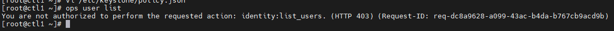
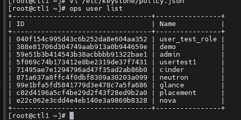

# Policy

## File ```policy.json```

Người dùng trên hệ thống được khởi tạo sẽ lưu vào database và được sử dụng để xác thực và làm việc với API. Điều đó là chuyện bình thường nhưng để phục vụ nhiều bài toán hơn thì OPS sử dụng chức năng role để giải quyết bài toán RBAC, là nguyên nhân tạo nên policy trong OPS

Mỗi service OPS, identity, networking, compute,... đều có 1 cơ chế quản lý quyền RBAC riêng của chúng. Các role-based này được chúng sử dụng để xác định 1 người dùng nào có thể truy cập vào 1 object nào trong chúng, và các policy này được định nghĩa tại file ```policy.json```

Khi một lời gọi tới API, các policy trên service sẽ được sử dụng để kiểm tra và chấp nhận các request này. Mỗi khi cập nhật 1 rule trên file policy.json thì sẽ có tác dụng ngay lập tức trong khi service đang chạy

Một file ```policy.json``` được viết dưới định dạng JSON. Mỗi policy sẽ được định nghĩa theo format sau:

```sh
"<target>" : "<rule>"
```

Với target sẽ là 1 action, đại diện cho 1 API có thể là ```os_compute_api:servers:create```. Các action name này sẽ tùy theo từng loại dịch vụ sẽ có các đặc tính đi kèm, và được đặt tại file ```/etc/{service_name}/policy.json``` để các service hiểu được đây là các action cần được kiểm tra

Với rule sẽ thường được sử dụng để xác định 1 role hay người dùng nào được làm việc hay không làm việc với API target.

VD: Cho phép người dùng khởi tạo 1 user mới, thì sẽ chỉ rõ role test sẽ được khởi tạo

```sh
"identity:create_user" : "role: test"
```

Ngoài ra còn có thể sử dụng chức năng alias để tạo 1 rule định nghĩa sẵn, rule này như 1 hằng được sử dụng nhiều lần trên các target có cùng rule giống nhau.

```sh
"admin_required": "role:admin or is_admin:1",
"owner" : "user_id:%(user_id)s",
"admin_or_owner": "rule:admin_required or rule:owner",
"identity:change_password": "rule:admin_or_owner"
```

## File ```policy.yaml```

Hiện tại các phiên bản như Queens, Train đổi sang sử dụng định dạng yaml chứ không phải json

```sh
oslopolicy-policy-generator --namespace keystone --output-file /etc/keystone/policy.yaml
oslopolicy-policy-generator --namespace glance --output-file /etc/glance/policy.yaml
oslopolicy-policy-generator --namespace nova --output-file /etc/nova/policy.yaml
oslopolicy-policy-generator --namespace neutron --output-file /etc/neutron/policy.yaml
oslopolicy-policy-generator --namespace cinder --output-file /etc/cinder/policy.yaml
```

Và để sử dụng ```.yaml``` làm policy thì ta chỉnh trong file cấu hình keystone:

```sh
[oslo_policy]
policy_file = policy.yaml
```

Restart httpd

```sh
systemctl restart httpd
```

### Lab thêm policy

Thêm thử dòng sau vào file ```policy.yaml``` để cho role ```test``` có quyền list user

```sh
"identity:list_users" : "role:test"
```



Thêm

```sh
"identity:list_users" : "role:vpc or role:admin"
```

