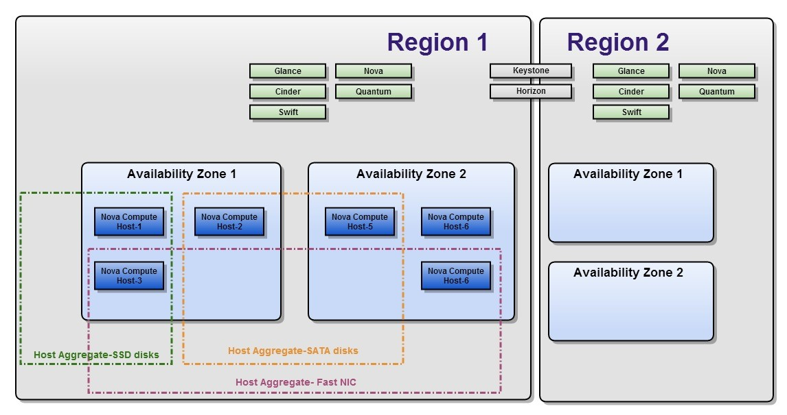
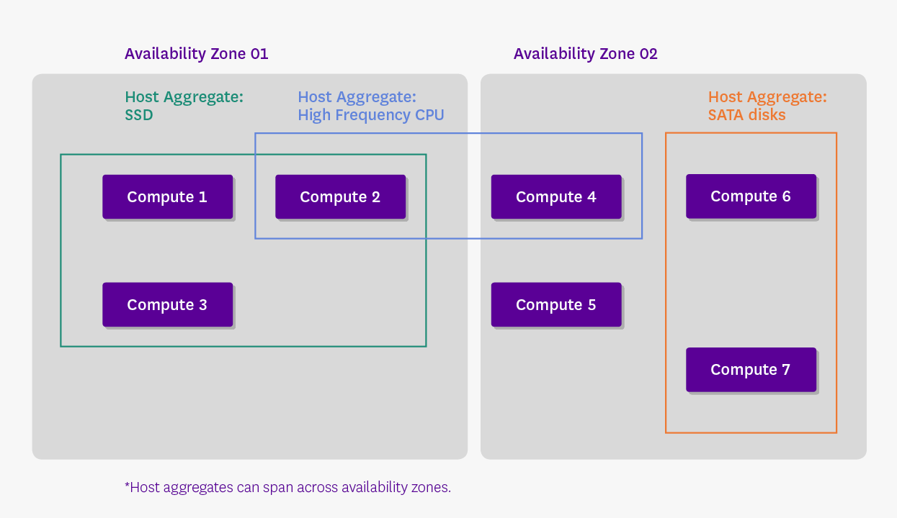

# Region - Domain - Role

## I. Region

Openstack được tạo ra từ việc kết hợp mở rộng của hàng ngàn node và trải rộng ra nhiều DC khác nhau và các miền địa lý (region) khác nhau. Vì lý do này, hệ thống OPS có thể chia ra 3 khái niệm chính về việc phân cấp zone như sau: Regions, Availability Zones và Host Agreegates



### 1. Khái niệm

Mỗi Region là 1 cụm OPS hoàn chỉnh, bao gồm các API endpoint, network và các tài nguyên compute của nó

Các Region khác nhau chia sẻ thiết lập chung dịch vụ Keystone và Horizon, để cung cấp khả năng truy cập điều khiển và giao diện web tương tác với hệ thống

Khái niệm Region thì giống như là một nhóm các tài nguyên vật lý được gộp nhóm theo khu vực địa lý trong môi trường OPS. Nếu bạn có 2 trung tâm dữ liệu khác nhau, bạn nên đặt một khu vực vào region A và khu còn lại vào region B

Khái niệm region ngày càng trở nên hữu dụng nhanh chóng, đặc biệt là khi đi cùng với khái niệm cell và domain. Region được sử dụng khi triển khai mô hình cloud lớn, trải dài trên nhiều trung tâm dữ liệu ở nhiều vùng địa lý.

### 2. Availability Zone

Bên trong một Region, các node compute có thể được nhóm logic vào các Availability Zones (AZ): khi chạy 1 máy ảo, chúng ta có thể xác định AZ mà muốn cài đặt máy ảo tại đó, hoặc thậm chí một node xác định trong một AZ khi chạy một VM

Việc gộp các nhóm logic các host dựa trên các yếu tố tùy chọn như:
- Location (country, datacenter, rack,...)
- Network layout
- Power source

Một trong những phức tạp của việc sử dụng AZ là mỗi project trong OPS thực hiện các dịch vụ theo cách của riêng nó (không phải tất cả). Nếu bạn có kết hoạch sử dụng AZ, bạn nên đánh giá các project OPS mà bạn sẽ hỗ trợ.

### 3. Host Aggregates

Bên cạnh AZ, các node compute cũng có thể gộp nhóm vào các Host Aggregates

Là khái niệm dùng để gộp chung thành nhóm các host dựa trên metadata

Host Aggregates có metadata được gán vào các nhóm của các node compute (ví dụ: các node với ổ cứng SSD có thể thuộc về một Host Aggregate, trong khi một Host Aggregate có thể bao gồm tất cả các node với 10GB NICs)

Một node compute có thể được đặt trong cả một Host Aggregate và một Availability Zone cùng lúc, chúng sẽ không bị xung đột. Hơn nữa, một node compute có thể thuộc về một hoặc nhiều hơn một Host Aggregate. Các Host Aggregate chỉ có thể được xem bởi admin và cũng có thể được sử dụng để mix các hypervisor trong cùng 1 AZ, ví dụ để tiết kiệm chi phí giấy phép, các provider có thể cung cấp các guests free hypervisor



## II. Domain

### 1. Giới thiệu

Domain trong Keystone là khái niệm về các tài nguyên mà được giới thiệu trong Keystone API version 3

Một domain là 1 tập hợp các user và project tồn tại trong môi trường OPS

Theo truyền thống, nguồn tài nguyên mapping có thể được tóm tắt bằng cách nói rằng: "Một user có một role trên 1 project" (a user has a role in a project). Một user thường là một cá nhân mà giao tiếp với các dịch vụ cloud, gửi các request để tạo và hủy các nền tảng theo yêu cầu. Một project là một container được sử dụng để gộp nhóm và cô lập các tài nguyên từ các phần còn lại khác. Với mô hình mapping thông thường này, khi 1 role admin được gán cho 1 user, user sẽ trở thành nhà quản trị cloud, chứ không chỉ đơn giản là quản trị project mà user đó được gán vào như dự định

Với khái niệm domain, các tài nguyên được mapping có thể được hiểu theo cách nói là "Domain được tạo thành từ các user và project, trong đó, các user có các role tại project và ở mức level domain" (domain is made up of users and projects, wherein users can have roles at the project and domain level). Với mô hình này, một user admin trên một domain, cho phép user đó quản lý các tài nguyên như user và project trên một domain xác định, nhưng một user cũng có role của họ trên project cụ thể, giống như mô hình trước đó

Khái niệm domain mà Keystone cung cấp triển khai OPS với khả năng linh hoạt khi chia môi trường của chúng vào các phân vùng logic mà sẽ được sử dụng bởi các thành viên của các phòng ban khác nhau của một tổ chức hoặc các tổ chức khác nhau hoàn toàn. Kết quả của mô hình này là cho phép cung cấp sự kết hợp tuyệt vời khả năng tự phục vụ khi vẫn đảm bảo sự phân lập giữa các user và project của họ

### 2. Một số lợi ích

Có khả năng định nghĩa và gán các quyền điều khiển truy cập (RBAC)

Tạo người dùng quản trị cloud với khả năng ủy nhiệm các khả năng cho user khác

Hỗ trợ thiết lập các tài nguyên (project) với tên giống nhau trong các domain khác nhau

Khả năng phân chia cho các tổ chức khác nhau tận dụng các backend khác nhau. VD, 1 bên sử dụng dựa trên SQL trong khi bên khác sử dụng dựa trên LDAP

## III. Role

### 1. Giới thiệu role

Mỗi dịch vụ của Openstack như Identity, Compute, Networking,... đều có các quy tắc truy cập dựa trên role. Chúng quyết định xem các user nào được truy cập tới project nào theo cách nào đó, và được định nghĩa trong các file **policy.json** của các dịch vụ

Bất cứ khi nào một lời gọi API tới dịch vụ của OPS được tạo ra, các cơ chế policy của dịch vụ sẽ sử dụng các định nghĩa trong file policy để quyết định xem các lời gọi nào được chấp nhận

Bất kỳ thay đổi nào trong file **policy.json** đều có hiệu lực ngay lập tức, nó cho phép các quy tắc mới được thực hiện trong khi dịch vụ vẫn đang chạy

Đường dẫn của file policy trong từng dịch vụ của OPS thường là ```/etc/<project>/policy.json```, với tên project là tên từng dịch vụ như: **keystone**, **nova**, **neutron**, **glance**,...

File ```policy.json``` là một file text định dạng JSON (Javascript Object Notation). Mỗi policy được định nghĩa trên 1 dòng theo định dạng ```<target> : <rule>```

Policy target, cũng được gọi là ```action```, đại diện cho 1 lời gọi API như là "Bật máy ảo" hay "Gán vào một volume",...

Tên các action thông thường sẽ đủ ý nghĩa để hiểu action đó làm gì. VD, các lời gọi API đặc trưng của dịch vụ Compute là liệt kê các máy ảo, volume, và network. Trong file ```/etc/nova/policy.json```, những API đó được đại diện cho bởi ```compute:get_all```, ```volume:get_all```, hay ```network:get_all```

Các policy rule quyết định các trường hợp lời gọi API nào được chấp thuận. Thông thường, việc này liên quan tới user tạo nên lời gọi API đó (gọi là API user) và đôi khi là đối tượng mà API hoạt động. Một rule thông thường kiểm tra nếu API user là chủ của nó hay không.

### 2. Cấu trúc file policy.json

Một file ```policy.json``` bao gồm các policies và các alias theo form như sau: ```target:rule``` hoặc ```alias:definition```, phân cách bởi dấu ```:``` và đặt trong dấu ngoặc nhọn ```{}``` như sau:

```sh
{
    "alias 1" : "definition 1",
    "alias 2" : "definition 2",
    ...
    "target 1" : "rule 1",
    "target 2" : "rule 2",
    ...
}
```

Các target là các API được viết như sau: ```"service:API``` hoặc đơn giản là ```"API"```

VD: ```"compute:create"``` hoặc ```"add_image"```

Các rule quyết định xem các API nào được phép thực hiện

Các rule có thể là:
- always true (luôn đúng): các action thì luôn luôn được chấp nhận. Có thể được viết như sau: "" (chuỗi trống), [], hoặc "@"
- always false (luôn sai): các action không bao giờ được chấp nhận. Được viết như sau: "!"
- a special check
- a comparison of two values
- boolean expressions based on simpler rules

Trong đó:
- Special check là:
   - ```<role>:<role name>```: kiểm tra API credentials chứa role này không
   - ```<rule>:<rule name>```: định nghĩa alias
   - ```http:<target URL>```: chuyển việc kiểm tra cho 1 remote server. API được xác thực khi server này trả về True
   - Có thể tự định nghĩa thêm nhiều special checks khác
- 2 giá trị được so sánh theo cách so sánh 2 value ```value1 : value2```, trong đó value có thể là:
   - ```constants```: strings, numbers, true, false
   - Thuộc tính của API: bao gồm ```project_id```, ```user_id``` hoặc ```domain_id```
   - target object attributes: là các trường mô tả object được lưu trong database. VD trong trường hợp API ```"compute:start"```, object là máy ảo được bật. Policy cho việc bật máy ảo có thể sử dụng thông số ```%(project_id)s```, đó là project mà sở hữu máy ảo này. Ký tự ```s``` sau đó cho thấy đó là kiểu string
   - cờ ```is_admin```: cho thấy là quyền admin được gán thông qua token admin. Token admin cho phép khởi tạo identity database trước khi role admin tồn tại

Cấu trúc alias cho phép nhiều thuận lợi. Alias là cách đặt tên ngắn hơn cho các rule phức tạp hoặc khó để hiểu. Nó được định nghĩa giống như cách định nghĩa policy:

```sh
alias name: alias definition
```

Một alias được định nghĩa, sử dụng từ khóa rule để sử dụng các policy rule được định nghĩa sẵn

### 3. Ví dụ

- Một rule đơn giản như sau:

```sh
"compute:get_all": ""
```

Policy này định nghĩa API liệt kê tất cả các máy ảo của dịch vụ Compute. Rule này để trống nghĩa là ```"always"``` (bất kỳ ai có role này được thực hiện API này)

- Nhiều API có thể được gọi bởi người dùng admin. Điều này có thể được mô tả bởi rule ```"role:admin"```. Policy sau đảm bảo rằng chỉ người dùng admin có thể được tạo một user mới trong database dịch vụ identity:

```sh
"identity:create_user" : "role:admin"
```

- Ta có thể hạn chế các API tới một vài role. VD: dịch vụ Orchestration định nghĩa một role tên là **heat_stack_user**. Bất kỳ ai có role này không được phép tạo stack:

```sh
"stacks:create" : "not role:heat_stack_user"
```

- Ta có thể định nghĩa alias cho rule:

```sh
"deny_stack_user" : "not role:heat_stack_user"
```

Policy lúc này hiểu rằng ```"deny_stack_user``` không phải là 1 API mà đại diện cho 1 Alias. Chính sách tạo stack trên có thể viết như sau:

```sh
"stacks:create" : "rule:deny_stack_user"
```

- Rule có thể so sánh các thuộc tính của API với thuộc tính của object target như sau:

```sh
"os_compute_api:servers:start" : "project_id%(project_id)s"
```

Policy này cho biết việc bật các máy ảo chỉ được thực hiện với những user gọi API với project ID trùng với project ID của máy ảo

- Một ví dụ về việc định nghĩa các policy và alias trong file ```/etc/keystone/policy.json``` như sau:

```sh
"admin_required": "role:admin or is_admin:1",
"owner": "user_id:%(user_id)s",
"admin_or_owner": "rule:admin_required or rule:owner",
"identity:change_password": "rule:admin_or_owner"```

