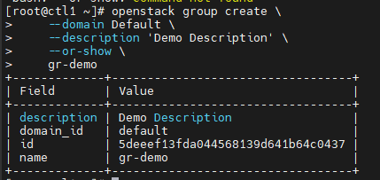

# Các lệnh thông dụng với Keystone

## I. Khởi tạo biến môi trường

File này chứa thông tin đăng nhập của user

Tạo file khởi tạo biến môi trường (tên file sao cũng được nhưng nên đặt cho dễ nhớ)

```sh
vi admin-openrc
```

Nội dung

```sh
export OS_USERNAME=admin
export OS_PASSWORD=Welcome123
export OS_PROJECT_NAME=admin
export OS_USER_DOMAIN_NAME=Default
export OS_PROJECT_DOMAIN_NAME=Default
export OS_AUTH_URL=http://10.10.31.166:5000/v3
export OS_IDENTITY_API_VERSION=3
export OS_IMAGE_API_VERSION=2
```

Khởi chạy môi trường

```sh
source admin-openrc
```

Kiểm tra

```sh
env | grep OS
```

Check token

```sh
openstack token issue
```

## II. Các lệnh làm việc với user, project, group, role, domain

### 1. User

#### List Users

```sh
openstack user list
```

Lọc theo group

```sh
openstack user list --group <group-name>
```

#### Create User

```sh
openstack user create <user_name> --password <password>
```

#### Show user detail

```sh
openstack user show <user>
```

#### Disable user

```sh
openstack user set <user> --disable
```

#### Enable user

```sh
openstack user set <user> --enable
```

#### Update user

```sh
openstack user set <user> --name <user-name-new> 
```

#### Delete user

```sh
openstack user delete <user>
```

### 2. Project

#### List Project

```sh
openstack project list
```

#### Create project

```sh
openstack project create --description '<Description>' <project-name> --domain <domain-name>
```

#### Dissable project

```sh
openstack project set <project> --disable
```

#### Enable project

```sh
openstack project set <project> --enable
```

#### Change project name

```sh
openstack project set <project> --name <project-new-name>
```

#### Show project detail

```sh
openstack project show <project>
```

#### Delete project

```sh
openstack project delete <project>
```

### 3. Group

#### Tạo group

```sh
openstack group create \
    [--domain <domain>] \
    [--description <description>] \
    [--or-show] \
    <group-name>
```

VD

```sh
openstack group create \
    --domain Default \
    --description 'Demo Description' \
    --or-show \
    gr-demo
```



#### List group

```sh
openstack group list
```

#### Add user into group

```sh
openstack group add user \
    [--group-domain <group-domain>] \
    [--user-domain <user-domain>] \
    <group> \
    <user> \
    [<user> ...]
```

#### Check if user is in group

```sh
openstack group contains user \
    [--group-domain <group-domain>] \
    [--user-domain <user-domain>] \
    <group> \
    <user>
```

#### Remove user from group

```sh
openstack group remove user \
    [--group-domain <group-domain>] \
    [--user-domain <user-domain>] \
    <group> \
    <user> [<user> ...]
```

#### Update group

```sh
openstack group set \
    [--domain <domain>] \
    [--name <name>] \
    [--description <description>] \
    <group>
```

#### Group show

```sh
openstack group show \
    [--domain <domain>] \
    <group>
```

### 4. Role

#### List available role

```sh
openstack role list
```

#### Create a role

```sh
openstack role create <role-name>
```

**Lưu ý:** Nếu sử dụng Identity v3 thì cần có option ```--domain``` với 1 domain cụ thể

#### Assign role

```sh
openstack role add --user <user> --project <project-name> <role-name>
```

#### List role assignment

```sh
openstack role assignment list [--user <user>] [--project <project>] --names
```

#### Remove role

```sh
openstack role remove --user <user> --project <project> <role>
```

VD:

```sh
openstack role remove --user user_test_role --project Default user
```