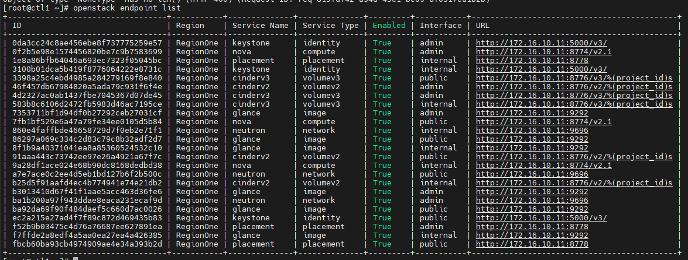
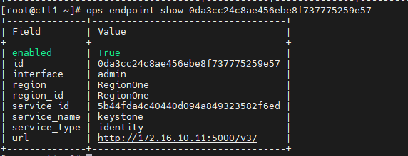
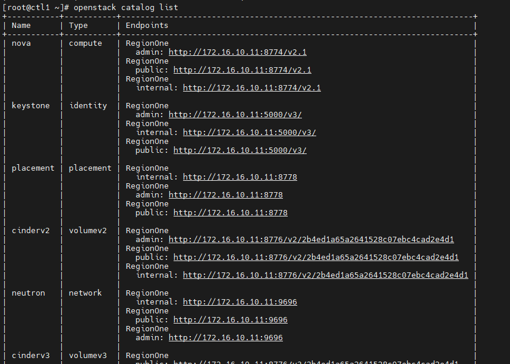
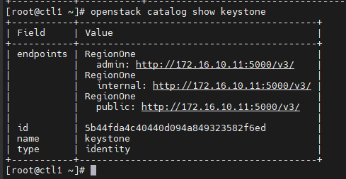

# Endpoint và Catalog trong Keystone

## Endpoint

Endpoint trong Keystone là một URL có thể được sử dụng để truy cập dịch vụ trong OPS

1 endpoint giống như 1 điểm liên lạc để người dùng sử dụng dịch vụ của OPS

Có 3 loại endpoint:
- ```adminurl```: Dùng cho quản trị viên
- ```internalurl```: Là những gì các dịch vụ khác sử dụng để giao tiếp với nhau
- ```publicurl```: Là những gì mà người khác truy cập vào endpoint sử dụng dịch vụ

Show list các endpoint:

```sh
openstack endpoint list
```



Kiểm tra chi tiết 1 endpoint:

```sh
openstack endpoint show <endpoint>
```



## Catalog

Catalog trong OPS là 1 tập hợp các danh mục sẵn sàng sử dụng mà khách hàng có thể sử dụng trong OPS

Service catalog cung cấp cho người dùng về các dịch vụ có sẵn trong OPS, cùng với thông tin bổ sung về các vùng, phiên bản API và các project có sẵn

Catalog làm cho việc tìm kiếm dịch vụ hiệu quả, chẳng hạn như cách định cấu hình liên lạc giữa các dịch vụ

Liệt kê các catalog:

```sh
openstack catalog list
```



Kiểm tra thông tin của catalog

```sh
openstack catalog show <catalog>
```

