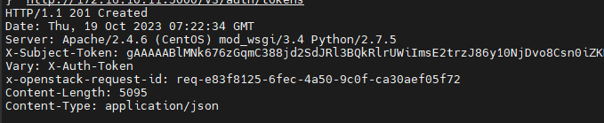

# API trong Keystone

## Lấy token

Dùng **curl** với method là **POST**:

```sh
curl -X POST -i \
-H "Content-Type: application/json" \
-d \
'{ "auth": {
    "identity": {
        "methods": ["password"],
        "password": {
            "user": {
              "name": "admin",
              "domain": { "name": "Default" },
              "password": "Welcome123"
            }
          }
        },
        "scope": {
          "project": {
            "name": "admin",
            "domain": { "name": "Default" }
          }
        }
  }
}' \
http://localhost:5000/v3/auth/tokens
```

Trong đó:
- ```-i``` (--include): Output sẽ chứa cả HTTP-Header
- ```-H``` (--header): Kết hợp với Content-Type để xác định kiểu dữ liệu truyền vào header. Tại đây là dạng json
- ```-d``` (--data): Dữ liệu truyền vào body



Token nhận được ở tham số ```X-Subject-Token```

Để ý các giá trị:
- ```"expires_at"```: thời điểm hết hạn Token
- ```"issued_at"```: thời điểm token được tạo

Ta thấy thời gian tồn tjai mặc định của token là 1h

Export token để thuận tiện sử dụng

```sh
export OS_TOKEN=<token-value>
```

## Một vài lệnh curl API cơ bản

### List user

```sh
curl -X GET -H "X-Auth-Token: $OS_TOKEN" http://localhost:5000/v3/users | python -mjson.tool
```

```sh

```