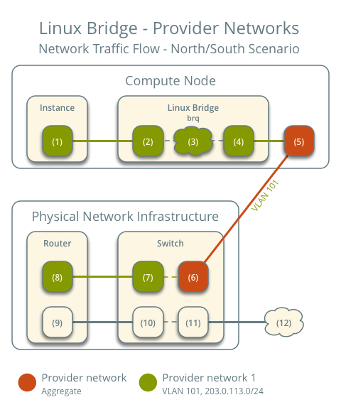
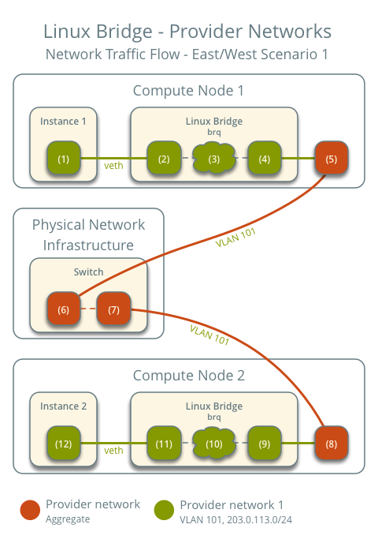
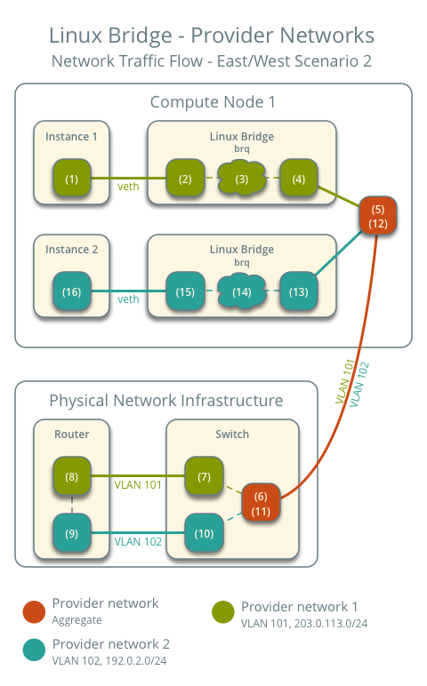
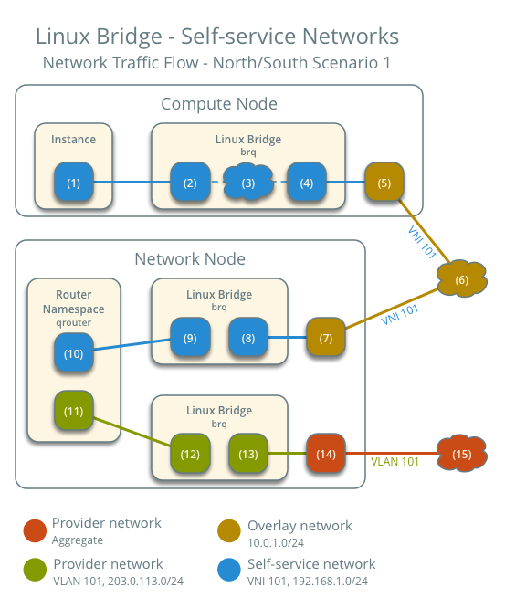
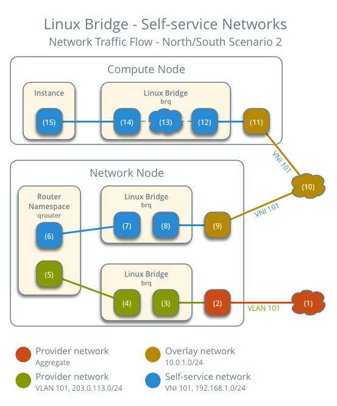

# Network traffic trong Linux Bridge

## I. Provider network

### 1. North - South (Bắc - Nam): instance with IP floating

- Instance nằm trên node Compute 1 và sử dụng provider network 1
- Instance gửi packet đến một máy chủ khác trên Internet



**Các bước thực hiện trên node compute 1:**
- Instance interface (1) forward packet tới instance port tương ứng trên provider bridge (2) thông qua ```veth``` pair
- Các rules của Security group (3) trên provider bridge sẽ xử lý firewall và theo dõi kết nối của packet
- Các sub-interface (4) trên provider bridge sẽ foward packet tới physical interface (5)
- Physical interface (5) sẽ gắn thêm tag VLAN 101 vào packet và forward nó tới switch ngoài hạ tầng (6)

**Các bước thực hiện liên quan đến hạ tầng vật lý (physical network infrastructure):
- Switch sẽ bỏ tag VLAN 101 khỏi packet và forward tới router (7)
- Router (7) sẽ định tuyến cho packet từ provider network (8) tới external network - mạng ngoài (9) và forward packet tới switch - mạng ngoài (10)
- Switch (10) forward packet ra mạng ngoài external network (11)
- Mạng ngoài - external network (12) sẽ nhận packet để tiếp tục thực hiện gửi tới host đích

### 2. East - West (Đông - Tây): Instances on the same network

Các instance trên cùng 1 mạng giao tiếp trực tiếp giữa các node compute chứa các instance đó:
- Instance 1: nằm trên node Compute 1 và sử dụng provider network 1
- Instance 2: nằm trên node Compute 1 và sử dụng provider network 2
- Instance 1: gửi packet tới instance 2



**Các bước liên quan đến node Compute 1:**
- Instance interface (1) forward packet tới instance port tương ứng trên provider bridge (2) thông qua ```veth``` pair
- Các rule của Security group (3)
- Các sub-interface (4) trên provider bridge sẽ forward packet tới physical interface (5)
- Physical interface (5) sẽ gắn thêm tag VLAN 101 vào packet và forward nó tới switch ngoài hạ tầng (6)

**Các bước liên quan đến cơ sở hạ tầng vật lý:**
- Switch forward packet từ compute 1 đến compute 2

**Các bước liên quan đến node Compute 2:**
- Physical interface của node node Compute 2 (8) bỏ VLAN tag 101 khỏi packet và forward nó đến sub-interface (9) trên provider bridge
- Các rules của Security group (10) trên provider bridge sẽ xử lý firewall và theo dõi kết nối của packet
- Instance port trên provider bridge (11) forward packet đến interface của instance 2 (12) thông qua ```veth``` pair

### 3. East - West (Đông - Tây): Instances on different networks

Các instance khác mạng sẽ giao tiếp thông qua Router trên hạ tầng mạng vật lý

- Instance 1 nằm trên node Compute 1 và sử dụng provider network 1
- Instance 2 nằm trên node Compute 1 và sử dụng provider network 2
- Instance 1 gửi packet tới instance 2



**Các bước thực hiện trên node Compute:**
- Instance interface (1) forward packet tới instance port tương ứng trên provider bridge (2) thông qua ```veth``` pair
- Các rules của Security group (3) trên provider bridge sẽ xử lý firewall và theo dõi kết nối của packet
- Các sub-interface (4) trên provider bridge sẽ forward packet tới physical interface (5)
- Physical interface (5) sẽ thêm tag VLAN 101 vào trong packet và forward nó tới switch ngoài hạ tầng (6)

**Các bước liên quan đến cơ sở hạ tầng vật lý:**
- Switch (6) bỏ tag VLAN 101 trên packet và forward nó đến Router (7)
- Router (7) định tuyến đường đi cho packet từ provider network 1 (8) tới provider network 2 (9)
- Router forward packet tới switch (10)
- Switch (10) thêm tag VLAN 102 vào packet và forward tới node Compute 1 (11)

**Các bước thực hiện trên node Compute:**
- Physical interface (12) gỡ tag VLAN 102 khỏi packet và forward nó đến VLAN sub-interface (13) trên provider bridge
- Các rules của Security group (14) trên provider bridge sẽ xử lý firewall và theo dõi kết nối của packet
- Instance port tương ứng trên provider bridge (15) sẽ forward packet tới interface của instance 2 (16) thông qua ```veth``` pair

## II. Self service

Trong self-service các instance sẽ sử dụng IPv4. Để truy cập được interface, networking service sẽ làm nhiệm vụ SNAT (Source Network Address Translation) để truy cập ra mạng external. Để từ các mạng có thể truy cập, các instance yêu cầu có một floating IP. Networking service thực hiện DNAT (Destination Network Address Translation) từ IP Floating sang IP self-service

### 1. North - South: Instance with a fixed IP address

Với các instance kèm IPv4 Floating, trên network service node sẽ thực hiện SNAT để self-service có thể giao tiếp với mạng bên ngoài
- Instance ở Compute 1 và sử dụng mạng self-service 1
- Instance gửi packet tới host ngoài internet



**Các bước liên quan đến node Compute 1:**
- Instance interface (1) forward packet tới port tương ứng trên self-service bridge (2) thông qua ```veth``` pair
- Các rules của Security group (3) trên self-service bridge sẽ xử lý firewall và theo dõi kết nối của packet
- Self-service bridge forward packet tới VXLAN interface trên bridge (4) kèm VNI
- Physical interface (5) cho phép mạng VXLAN interface forward packet tới node Network thông qua overlay network (6)

**Các bước liên quan đến node Network:**
- Physical network (7) nhận packet từ Overlay network VXLAN interface sau đó forward tới self-service bridge port (8)
- Self-service bridge router port (9) forward packet tới self-service network interface (10) trong router namespace. Đối với IPv4, router thực hiện SNAT trên packet thay đổi IP nguồn thành địa chỉ IP của router trên provider network và gửi nó đến địa chỉ IP gateway của provider network thông qua gateway interface trên provider network (11)
- Router forward packet tới provider bridge router port (12)
- VLAN sub-interface port (13) trên provider bridge sẽ forward packet tới physical network interface (14)
- Provider physical network interface (14) gán tag VLAN 101 vào packet và forward nó ra internet thông qua physical network infrastructure (15)

### 2. North-south: Instance with a floating IPv4 address

- Instance nằm trên node Compute 1 và sử dụng self-service network 1
- Máy chủ trên internet gửi 1 packet tới instance



**Các bước liên quan đến node Network:**
- Physical network infrastructure