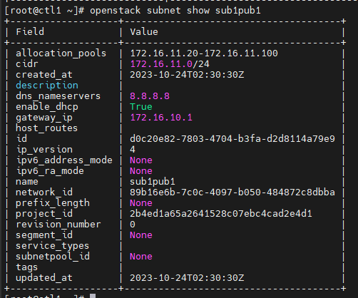
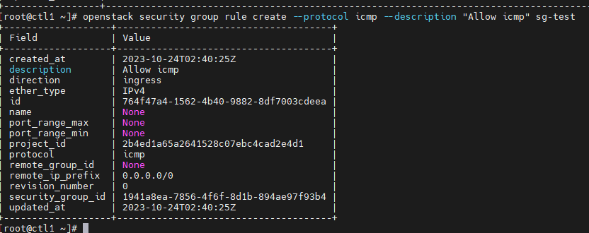
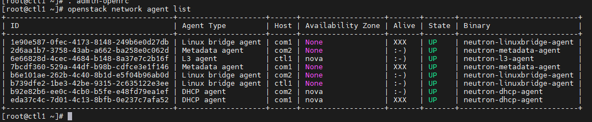

# Neutron Commands

## Network

### List network

```sh
openstack network list
```

### List subnet

```sh
openstack subnet list
```

### Create network

```sh
openstack network create \
--share --provider-physical-network <provider-network-name> \
--provider-network-type <network-type> <network-name>
```

Trong đó:
- ```--provider-physical-network```: Tên mạng vật lý mà mạng ảo được triển khai
- ```--provider-network-type```: Cơ chế vật lý mà mạng ảo được thực hiện: flat, geneve, gre, local, vlan, vxlan

VD:

```sh
openstack network create \
--share --provider-physical-network provider \
--provider-network-type flat public1
```

### Create subnet

Tạo subnet cho network vừa tạo, tại đây ta khai báo dải mạng cấp dhcp và dns, gateway cho network

**Lưu ý:** đối với external network thì dải mạng khai báo phải trùng với provider để máy ảo kết nối được với internet

```sh
openstack subnet create --network <network-name> \
--allocation-pool start=<start-ip>, end=<end-ip> \
--dns-nameserver <DNS-server> --gateway <gateway-ip> \
--subnet-range <subnet-address-range> \
```

VD:

```sh
openstack subnet create --network public1 \
--allocation-pool start=172.16.11.20,end=172.16.11.100 \
--dns-nameserver 8.8.8.8 --gateway 172.16.10.1 \
--subnet-range 172.16.11.0/24 \
sub1pub1
```

### Show network information

```sh
openstack network show <network-name>
```

### Show subnet information

```sh
openstack subnet show <subnet-name>
```



### List security group

```sh
openstack security group list
```

### Create security group

```sh
openstack security group create
    [--description <description>]
    [--project <project>]
    [--stateful | --stateless]
    [--project-domain <project-domain>]
    [--tag <tag> | --no-tag]
    <name>
```

VD:

```sh
openstack security group create sg-test
```

### Create rule in a security group

```sh
openstack security group rule create
    [--remote-ip <ip-address> | --remote-group <group>]
    [--dst-port <port-range>]
    [--protocol <protocol>]
    [--description <description>]
    [--icmp-type <icmp-type>]
    [--icmp-code <icmp-code>]
    [--ingress | --egress]
    [--ethertype <ethertype>]
    [--project <project>]
    [--project-domain <project-domain>]
    <group>
```

VD: 

```sh
openstack security group rule create \
--protocol icmp \
--description "Allow icmp" \
sg-test
```



### List rules in a security group

```sh
openstack security group rule list <security-group-name>
```

### Delete 1 security group

```sh
openstack security group delete <group>
```

### Attach security group to a VM

```sh
nova add-secgroup <instance-name> <security-group-name>
```

VD:

```sh
nova add-secgroup vm01 sg-test
```

### Rid security group of VM

```sh
nova remove-secgroup <instance-name> <security-group-name>
```

VD:

```sh
nova remove-secgroup vm01 default
```

### List a VM's port(s)

```sh
openstack port list --server <instance-name>
```

### Request a new IP for VM

Ngắt kết nối và xóa port với VM

```sh
nova interface-detach <instance-name> <port-id>
openstack port delete <port-id>
```

VD:

```sh
nova interface-detach vm01 ae7c0409-a4b1-4379-be19-3c2c9aeea571
openstack port delete ae7c0409-a4b1-4379-be19-3c2c9aeea571
```

Tạo port mới

```sh
openstack port create --fixed-ip subnet=<subnet> --network <network> <port-name>
```

VD:

```sh
openstack port create --fixed-ip subnet=sub1pub1 --network public1 port01
```

Gán port mới tạo cho VM:

```sh
nova interface-attach --port-id <port-id> <instance-name>
```

```sh
nova interface-attach --port-id 3089b3a0-442f-48d6-bbf9-cfec14885069 vm01
```

Restart instance

```sh
openstack server reboot <instance-name>
```

## Router

Trước khi tạo router, chúng ta cần cấu hình plugin và l3-agent trước

**Cấu hình plugins:**

Sửa file ```neutron.conf``` trên node Controller

```sh
vi /etc/neutron/neutron.conf
```

```sh
[DEFAULT]
service_plugins = router
```

**Bật service l3-agent trên node controller**

```sh
systemctl enable neutron-l3-agent --now
```

Kiểm tra agent

```sh
openstack network agent list
```



Cấu hình file ```l3_agent.ini```

```sh
vi /etc/neutron/l3_agent.ini
```

```sh
[DEFAULT]
interface_driver = linuxbridge
```

### Create self-service network

```sh
openstack network create self-net
```

Tạo subnet cho self-service network vừa tạo

```sh
openstack subnet create --subnet-range 192.168.1.0/24 --gateway 192.168.1.1 --dns--nameserver 8.8.8.8 --network self-net subnet-self-net
```

### Create router

```sh
openstack router create <router-name>
```

VD:

```sh
openstack router create router1
```

Gắn external network làm gateway để truy cập internet, còn các mạng self-service cắm vào các interface để tham gia định tuyến

```sh
openstack router set <router-name> --external-gateway <external-network-name>
openstack router add subnet <router-name> <subnet-self-service-name>
```

VD:

```sh
openstack router set router1 --external-gateway public1
openstack router add subnet router1 subnet-self-net
```

## Remove subnet out of Router

```sh
openstack router remove subnet router1 03292a0d-e685-4c78-a8bc-702fa8e89ca0
```