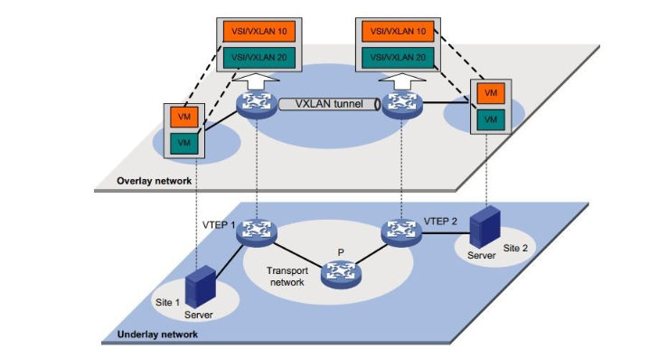
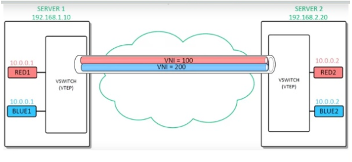
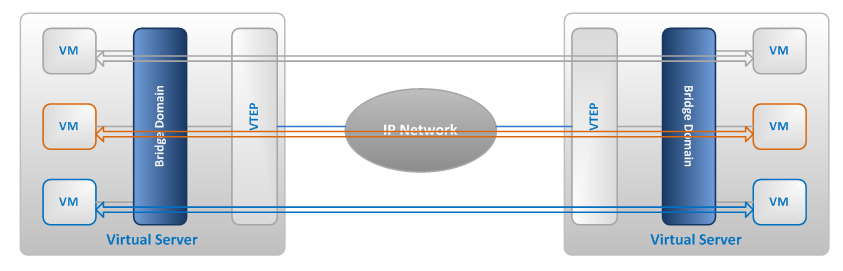
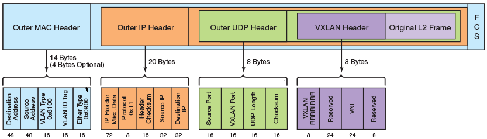
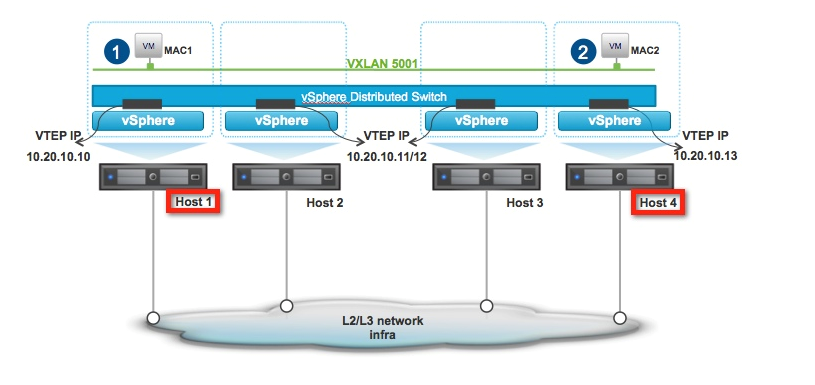
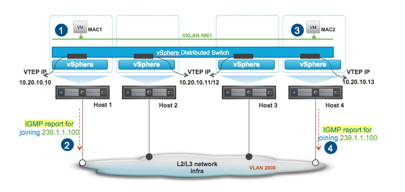
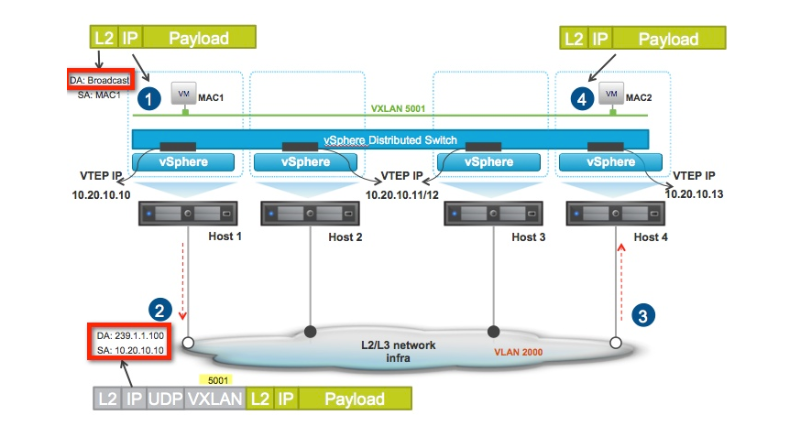
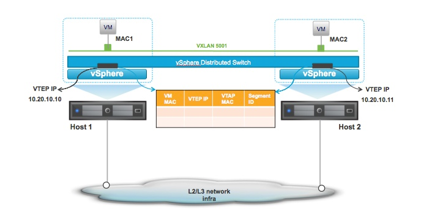
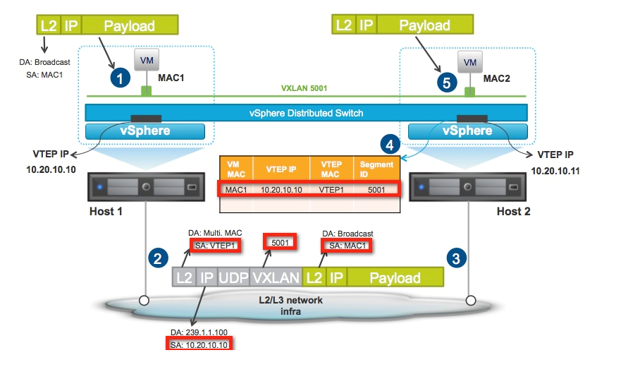

# Tìm hiểu VXLAN - Virtual Extensible LAN

## I. Tổng quan về VXLAN

### 1. Tại sao cần mở rộng VLAN

VLAN sử dụng Spanning Tree Protocol (STP) để ngăn loop, bằng cách chặn các đường dẫn dư thừa. Ngược lại, VXLAN packet được truyền qua mạng dựa trên layer 3 của nó và tận dụng tối đa lợi thế của layer 3 là routing, ECMP, giao thức link aggregation sử dụng các đường dẫn có sẵn.

VLAN vẫn đang được chạy trong các DC nhiều năm nay, nhưng với sự phát triển mạng mẽ của các công nghệ ảo hóa như hiện nay, nhu cầu về VM của khách hàng đang ngày càng tăng. Với VLAN, số lượng ID tối đa là 4096 (12 bit), chưa tính các ID dự trữ và mặc định, thì số lượng này không đủ để đáp ứng cho nhu cầu hiện nay. ID của VXLAN có 24 bit nên số lượng ID lớn hơn nhiều so với VLAN, khoảng 16 triệu ID.

Ngoài ra còn vì sự giới hạn của STP như vấn đề về hội tụ các link/path để xử lý, kích thước bảng MAC và một số đường mạng đang được sử dụng. Trong khi đó, với VXLAN, nó là một giao thức đóng gói MAC trong UDP, được sử dụng để mở rộng một overlay network layer 2 hoặc layer 3 qua layer 3 infrastructure đang tồn tại sẵn.

VXLAN đóng gói cung cấp 1 VNI, được sử dụng để cung cấp segmentation của các data traffic layer2 và layer3.

Để có thể nhận dạng được các VNI này qua layer 3 network, virtual tunnel endpoint (VTEP) được sử dụng. VTEP là một thực thể kết thúc một VXLAN tunnel end points. Nó maps layer 2 frames thành 1 VNI để có thể được sử dụng trong mạng overlay network

### 2. Khái niệm

VXLAN (Virtual extensible LAN) là một công nghệ ảo hóa mạng được ra đời để giải quyết các vấn đề về khả năng mở rộng liên quan đến việc triển khai một mô hình cloud computing lớn. Nó sử dụng một công nghệ đóng gói (encapsulation) giống như VLAN để đóng gói các Ethernet frames của layer 2 trong mô hình OSI bên trong datagrams UDP của layer 4, sử dụng 4789 như destination UDP port number được chỉ định bởi IANA

VXLAN sử dụng IP (cả unicast và multicast) để truyền đi trong mạng. Sự phổ biến của mạng IP và các thiết bị đầu cuối sẽ cho phép khả năng mở rộng vượt trội so với VLAN đang sử dụng 802.1q hiện nay. Không có gì có thể phủ nhận rằng các công nghệ khác có thể mở rộng phạm vi của VLAN, nhưng cũng không thể phủ nhận khả năng triển khai phổ biến của mạng IP

### 3. Một số khái niệm trong VXLAN

#### VXLAN Network Identifier (VNI)

VXLAN hoạt động trên cơ sở hạ tầng hiện có và cung cấp một phương tiện để mở rộng 1 mạng lớp 2. Tóm lại VXLAN là một mạng layer 2 overlay trên mạng layer 3. Mỗi lớp mạng như vậy được gọi là VXLAN segment. Chỉ các máy ảo trong cùng một VXLAN segment mới có thể giao tiếp với nhau

Mỗi VXLAN segment được xác định thông qua một ID có kích thước 24 bit, gọi là VXLAN Network Identifier (VNI)

VNI xác định phạm vi của inner MAC frame sinh ra bởi các máy ảo, do đó ta có thể overlapping địa chỉ MAC thông qua segment để không bị nhầm lẫn giữa các traffic, vì chúng đã được cô lập bởi các VNI. VNI sẽ nằm trong header được đóng gói với các inner MAC sinh ra bởi VM

#### Encapsulation và VLAN Tunnel Endpoint

VXLAN là công nghệ overlay qua lớp mạng. Overlay Network có thể được định nghĩa như là 1 mạng logic mà được tạo trên 1 nền tảng mạng vật lý đã có sẵn. VXLAN tạo 1 mạng vật lý layer 2 trên lớp mạng IP. Dưới đây là 2 từ khóa được dùng trong công nghệ overlay network:
- **Encapsulate:** Đóng gói những gói tin Ethernet trong một header mới
- **VTEP:** Việc liên lạc được thiết lập giữa 2 đầu tunnel endpoints (đường ống)

Trong VXLAN, các frame MAC được đóng gói vào 1 UDP header. Tất cả các host tham gia vào VXLAN hoạt động như 1 tunnel endpoint, chúng được gọi là Virtual Tunnel Endpoints (VTEPs)

VTEPs là các node mà cung cấp các chức năng Encapsulation và De-encapsulation. Chúng biết rõ được làm thế nào mà VTEPs encap và de-encap lưu lượng từ bất kỳ máy ảo kết nối với một mạng VXLAN dựa trên mạng vật lý layer 2

VXLAN đọc tất cả các địa chỉ MAC của máy ảo và việc kết nối nó tới VTEP IP thì được thực hiện thông qua sự hỗ trợ của mạng vật lý. Một trong những giao thức được sử dụng trong mạng vật lý là IP multicast. VXLAN sử dụng giao thức của IP multicast để cư trú trong bảng forwarding trong VTEP

Do sự đóng gói (encapsulation) này, VXLAN có thể được gọi là thiết lập đường hầm (tunneling) để kéo dài mạng lớp 2 thông qua lớp 3. Điểm cuối các tunnel này - (VXLAN Tunnel Endpoint hoặc VTEP) nằm trong hypervisor trên server máy chủ của các VM. Do đó, VNI và VXLAN liên quan tới các khái niệm đóng gói header tunnel được thực hiện bởi VTEP - và trong suốt đối với VM

#### VXLAN packet format

VXLAN packet không có gì nhiều hơn một MAC-in-UDP được đóng gói trong packet. VXLAN header sẽ được thêm frame layer 2 gốc và được đặt trong UDP-IP packet

VXLAN header dài 8 bytes bao gồm 24 bits VNI và một vài bits dành riêng

Frame Ethernet thông thường bao gồm địa chỉ MAC nguồn, MAC đích, Ethernet type và thêm phần VLAN_ID (802.1q) nếu có. Các frame này sẽ được đóng gói sử dụng VXLAN và thêm phần header

Phần header (8 bytes) bao gồm các trường quan trọng sau:
- **VXLAN header:**
   - **Flags:** 8 bits, trong đó bit thứ 5 được thiết lập để chỉ ra đó là một frame có VNI có giá trị. 7 bits còn lại được dùng để dự trữ và tất cả đều bằng 0
   - **VNI:** 24 bits cung cấp định danh duy nhất cho VXLAN segment. Các VM trong các VXLAN khác nhau không thể giao tiếp với nhau
- **Outer UDP Header:** port nguồn của outer UDP được gán tự động và sinh ra bởi VTEP và port đích thông thường được sử dụng là 4789 (có thể chọn port khác)
- **Outer IP header:** Cung cấp địa chỉ nguồn của VTEP, nguồn kết nối với VM bên trong, Địa chỉ IP outer đích là địa chỉ IP của VTEP nhận frame
- **Outer Ethernet Header:** cung cấp địa chỉ MAC nguồn của VTEP có khung frame ban đầu. Địa chỉ MAC đích là địa chỉ của hop tiếp theo được định tuyến bởi VTEP. Outer Ethernet header có thể được gắn tag theo chuẩn 802.1q trong quá trình vận chuyển trong mạng

### 2. Cách hoạt động của VXLAN

VXLAN hoạt động dựa trên việc gửi các frame thông qua giao thức IP multicast

Trong quá trình cấu hình VXLAN, cần cấp phát địa chỉ IP multicast để gán với VXLAN sẽ tạo. Mỗi IP multicast sẽ đại diện cho 1 VXLAN

Dưới đây là hoạt động chi tiết các frame đi qua VTEP và đi qua mạng vật lý trong mạng. VXLAN triển khai trên một mạng logic với mô hình như sau:

#### VM gửi request tham gia vào group multicast

Giả sử một mạng logic trên 4 host như hình. Topo mạng vật lý cung cấp một VLAN 2000 để vận chuyển các lưu lượng VXLAN. Trong trường hợp này, chỉ IGMP snooping và IGMP querier được cấu hình trên mạng vật lý. Một vài bước sẽ được thực hiện trước khi các thiết bị trên mạng vật lý có thể xử lý các gói tin multicast

**IGMP packet flows**

- Máy ảo VM (MAC1) trên Host 1 được kết nối tới một mạng logical layer 2 mà có VXLAN 5001 ở đó
- VTEP trên Host 1 gửi bản tin IGMP để join vào mạng và join vào nhóm multicast 239.1.1.100 để kết nối tới VXLAN 5001
- Tương tự, máy ảo VM (MAC2) trên host 4 được kết nối tới mạng mà có VXLAN 5001
- VTEP trên Host 4 gửi bản tin IGMP join vào mạng và join vào nhóm multicast 239.1.1.100 để kết nối tới VXLAN 5001

Host 2 và Host 3 VTEP không join nhóm multicast bởi vì chúng không có máy ảo chạy trên nó và cần kết nối tới VXLAN 5001. Chỉ VTEP nào cần tham gia vào nhóm multicast mới gửi request join vào nhóm

**Multicast Packet flow:**

- Máy ảo VM (MAC1) trên Host 1 sinh ra một frame broadcast
- VTEP trên host 1 đóng gói frame broadcast này vào một UDP header với IP đích là địa chỉ IP multicast 239.1.1.100
- Mạng vật lý sẽ chuyển các gói tin này tới Host 4 VTEP, vì nó đã join vào nhóm multicast 239.1.1.100. Host 2 và 3 VTEP sẽ không nhận được frame broadcast này
- VTEP trên host 4 đầu tiên đối chiếu header được đóng gói, nếu 24bit VNI trùng với ID của VXLAN. Nó sẽ de-capsulated lớp gói được VTEP host 1 đóng vào và chuyển tới máy ảo VM đích (MAC2)

#### VTEDP học và tạo bảng forwarding

Ban đầu, mỗi VTEP sau khi join vào nhóm IP multicast đều có 1 bảng forwarding table như dưới đây:

Các bước sau sẽ thực hiện để VTEP học và ghi vào bảng forwarding table:
- Đầu tiên, 1 bản tin ARP request được gửi từ VM MAC1 để tìm địa chỉ MAC của máy ảo đích nó cần gửi tin đến là VM MAC2 trên Host 2. ARP request là bản tin broadcast

Host 2 VTEP - Forwarding table entry:
- VM trên Host 1 gửi bản tin ARP request với địa chỉ MAC đích là 