# Low-level network implementation model

## I. Lời nói đầu

Một số người nói rằng Neutron khó học, và nếu tôi không tin vào ma quỷ, tôi phải xuyên thủng phần Neutron này.

Loạt bài này sẽ giới thiệu kiến trúc triển khai của Neutron, mô hình triển khai mạng, mô hình tài nguyên cấp trên, hỗ trợ kỹ thuật cơ bản, mục đích thiết kế và các trường hợp thực tế nói chung. Mục đích là để nắm tình hình tổng thể của Neutron. Bài viết có tham khảo và trích dẫn số lượng lớn tài liệu, sách báo,...

## II. Sự phát triển từ mạng truyền thống lên mạng ảo

**Mạng truyền thống**

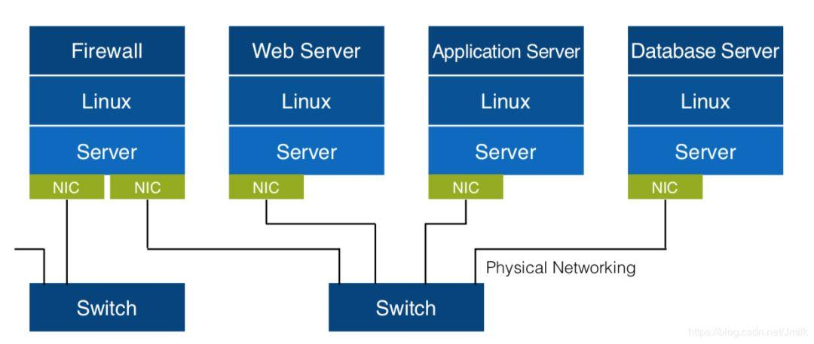

**Mạng ảo**

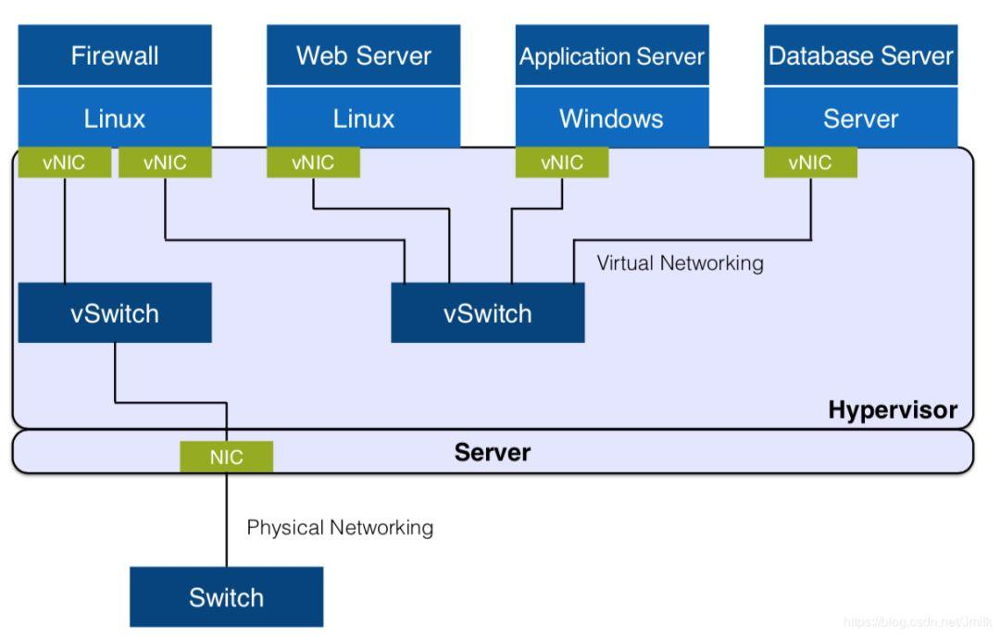

**Mạng ảo phân tán**

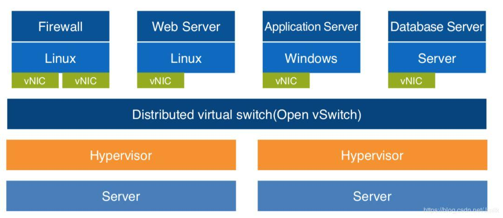

## III. Sự phát triển từ Single plane network tới hybrid plane network

**Single plane tenant sharing network**

Tất cả tenant chia sẻ 1 mạng (IP address pool) và chỉ có thể có 1 loại mạng duy nhất (VLAN hoặc Flat)
- Không có private network
- Không cô lập tenant
- Không có định tuyến Layer 3

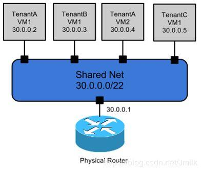

**Multi plane tenant shared network**

Có nhiều mạng chia sẻ (shared networks) để tenant lựa chọn
- Không có private network
- Không cô lập tenant
- Không định tuyến layer 3

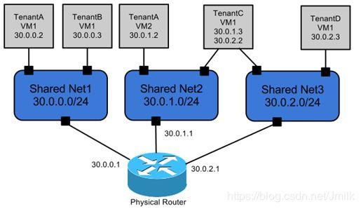

**Mixed plane (shared/private) network**

Sự kết hợp của share network và tenant private network
- Có private network
- Không cô lập tenant
- Không định tuyến layer

**Lưu ý:** Vì nhiều tenant vẫn dựa vào share network (VD cần truy cập external network) nên tenant không đạt được sự cô lập hoàn toàn

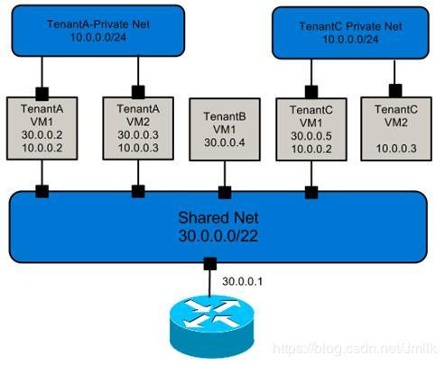

**Multi plane tenant private network based on the operator's routing function**

Mỗi tenant đều có private network của riêng mình, và thông tin liên lạc layer 3 giữa các network thông qua bộ router (public)
- Có private network
- Cô lập tenant
- Chia sẻ định tuyến Layer 3

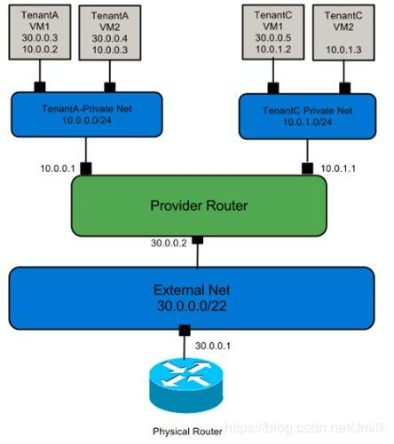

**Multi plane tenant private multi-network based on private routers**

Mỗi tenant có thể có vô số private network và router. Tenant có thể sử dụng các router private để có được thông tin liên lạc layer 3 giữa các private network
- Có private network
- Cô lập tenant
- Có định tuyến layer 3

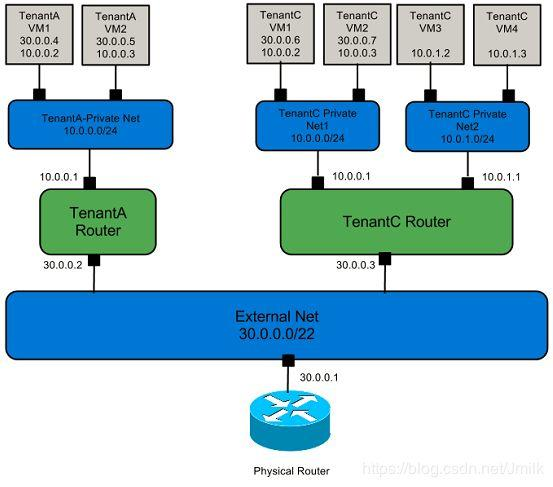

## IV. Sơ lược về Neutron

Neutron trong OPS là 1 project cung cấp "Network connectivity as a service" giữa các interface device (VD vNICs) được quản lý bởi các service trong OPS (VD: Nova). OPS Networking service (Neutron) cung cấp 1 API cho phép người dùng thiết lập và xác định kết nối mạng và địa chỉ trong cloud

Project code name cho dịch vụ Networking là **Neutron**

OPS networking xử lý việc tạo và quản lý cơ sở hạ tầng virtual network, bao gồm network, switches, subnet, router cho thiết bị quản lý bởi Nova. Các dịch vụ nâng cao như firewall hay VPN cũng có thể được sử dụng

Neutron là 1 project cung cấp Network Connectivity as a Service cho OPS. Tất nhiên, Neutron có thể được tách ra khỏi hệ thống Keystone như 1 phần mềm trung gian SDN độc lập
- **As a OPS component:** Cung cấp network service cho máy ảo OPS, baremetal và container
- **As SDN middleware:** Northbound (hướng Bắc) cung cấp tài nguyên interface trừu tượng, thống nhất (unified abstract resource interface). Và Southbound (hướng Nam) với bộ điều khiển SDN không đồng nhất

**Mục tiêu Neutron theo đuổi:** the distributed virtualized network in the cloud computing era and the multi-tenant isolated private multi-plane network

Từ góc độ phát triển sản phẩm, không khó để các nhà phát triển quen thuộc với lưu ý của neutron: Trước tiên, Neutron team phải thiết kế mô hình Core API Model (mô hình tài nguyên cốt lõi) và sau đó triển khai chúng. Đây cũng là phong cách triển khai của nhiều dự án OPS và rất đáng học hỏi. Khi thiết kế kiến trúc của phần mềm, đừng vội code, mà trước tiên phải suy nghĩ thật rõ ràng về ý nghĩa của Service đó, **nó là gì, cho đối tượng nào, cung cấp dịch vụ gì và làm điều đó như thế nào?** Bản chất của Network as a Service cung cấp bởi Neutron là các tenant chỉ cần quan tâm đến service, không cần phải chi tiết triển khai và nội dung của service là định nghĩa của loại tài nguyên (API). Chỉ ở bản ổn định, tương thích và chuyển đổi ổn định của các API có thể kích hoạt APIs economy (1 hệ sinh thái xung quanh open APIs), cho phép các phần mềm tồn tại trong thị trường open source khốc liệt

Hơn nữa, ý định ban đầu của người thiết kế Neutron là định nghĩa phần mềm thuần túy, không cần thiết kế phần cứng mới, nhưng có thể phù hợp với các phần cứng hiện có. Đây là 1 ý tưởng thiết kế thực dụng. Các phần tử mạng physical/virtual network bên dưới được gọi thông qua plugin-driver. Chức năng cung cấp sự hỗ trợ cho các service cấp trên. Đặc điểm này giúp neutron nhận được sự quan tâm rộng rãi trong ngành.

## V. Mô hình triển khai mạng Neutron

Trong quá trình tìm hiểu mô hình triển khai mạng Neutron, chúng ta chủ yếu tìm ra 3 câu hỏi:
- Làm thế nào để Neutron hỗ trợ nhiều loại network (VLAN, VXLAN)
- Làm cách nào để các máy ảo giữa các node compute giao tiếp trong cùng 1 tenant network ?
- Cách máy ảo truy cập vào mạng external ?

**Tổng quan về mô hình triển khai mạng của Neutron**

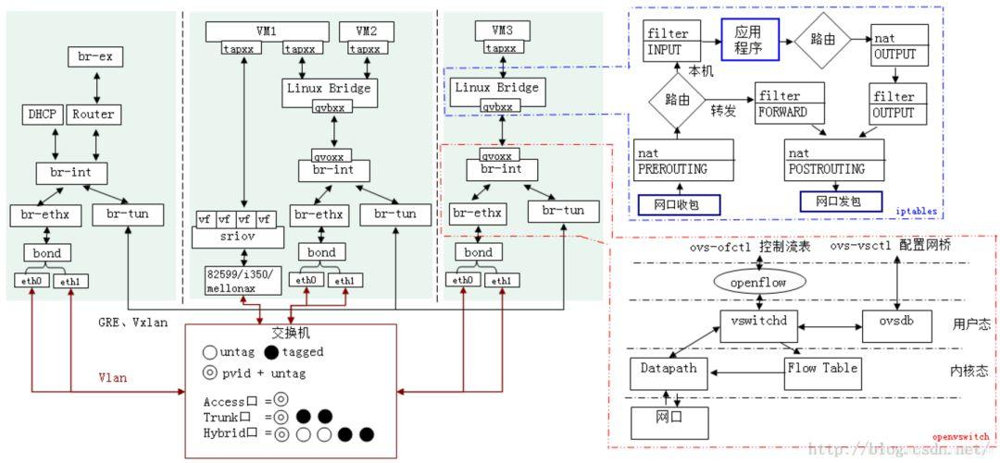

**Mô hình triển khai Computing node Network**

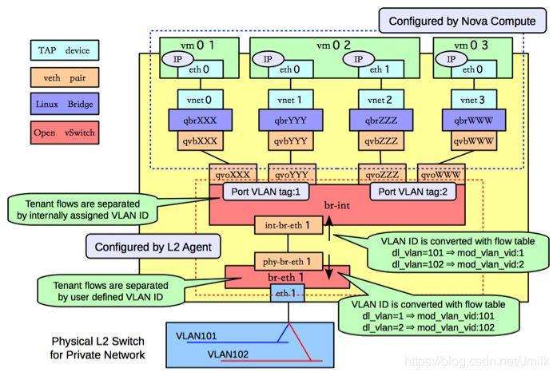

Quá trình VM traffic trên node compute được gửi ra khỏi node:

**Bước 1:** Lưu lượng được chuyển đến card mạng ảo vNIC thông qua TCP/IP stack kernel của VM để xử lý. vNIC là tap device cho phép các user mode program (GuestOS, qemu process) đưa dữ liệu vào kernel TCP/IP protocol stack. Tap device có thể chạy trên GuestOS và cung cấp các chức năng chính xác như physical NIC

**Bước 2:** vNIC (tap device) của máy ảo không được kết nối trực tiếp với OvS Bridge, nhưng được chuyển tiếp đến OvS br-int (bridge tích hợp) thông qua Linux Bridge. Tại sao vNIC không kết nối trực tiếp với br-int? Điều này là do OvS có các quy tắc tường lửa tĩnh trước v2.5 và không hỗ trợ stateful firewall rules. Các rule này là sự hỗ trợ cơ bản của Neutron Security Group, cung cấp port (vNIC) level security cho các máy ảo. Do đó, Linux Brdige được giới thiệu như 1 lớp bảo mật và iptables được sử dụng để lọc các stateful packet. Trong số đó, Linux Bridge ```qbr``` là tên viết tắt của quantum bridge

**Bước 3:** Linux Bridge và OvS được kết nối thông qua veth pair (cáp mạng ảo). 1 đầu của cáp được đặt tên là ```qvb``` (quantum veth bridge) và đầu còn lại là ```qvo``` (quantum veth ovs). Veth pair device luôn tồn tại thành từng cặp và được sử dụng để kết nối 2 thiết bị mạng ảo (virtual network device) nhằm mô phỏng quá trình truyền và nhận dữ liệu giữa các thiết bị ảo (virtual devices). Nguyên lý hoạt động của veth pair là đảo ngược hướng của dữ liệu liên lạc. Dữ liệu cần gửi sẽ được chuyển đổi thành dữ liệu cần nhận và sau đó gửi tới kernel TCP/IP protocol stack để xử lý, và cuối cùng được chuyển hướng đến target device (network cable ở 1 phía khác)

**Bước 4:** OvS br-int là 1 network bridge tích hợp, như thiết bị local virtual switch của node compute, để hoàn thành việc xử lý lưu lượng máy ảo cục bộ được chuyển tiếp trực tiếp trên br-int và nhận bởi port với cùng VLAN tag

**Bước 5:** Lưu lượng được truyền từ local VM đến remote VM (hoặc gateway) được gửi tới OvS ```br-ethX``` thông qua port ```int-br-eth1``` (thiết bị ngang hàng với OvS) trên OvS ```br-int```. Cần lưu ý rằng br-ethX không phải static: khi network type là Flat, VLAN hãy sử dụng ```br-ethX```; khi network type là Tunnel (VxLAN, GRE), ```br-tun``` sẽ thay thế ```br-ethX```. Ví dụ trên là sử dụng VLAN network. Ta gọi chung ```br-ethX``` và ```br-tun``` như 1 tenant network layer bridge (TNB) để dễ mô tả

**Lưu ý:**
- qbr-xxx và OvS br-int được kết nối bằng veth pair device, ```br-int``` và ```br-ethX/br-tun``` được kết nối bởi 1 thiết bị vá lỗi ngang hàng (patch peer device). Cả 2 đều là virtual network cables, sự khác biệt là trước đây là 1 Linux virtual network device, còn sau này là 1 virtual network device được thực hiện bởi OvS
- Nếu tenant bridge là ```br-tun``` thay vì ```br-ethX```, thì sẽ có port: ```patch-int``` trên ```br-tun```, port: ```patch-tun``` trên ```br-int```, thông qua ```patch-int``` và ```patch-tun``` nhận ra giao tiếp giữa tenant bridge ```br-tun``` và local bridge ```br-int```

**Bước 6:** Khi lưu lượng máy ảo chuyển giữa OvS ```br-int``` và OvS ```br-ethX```, 1 hành động quan trọng và phức tạp là required-internal (yêu cầu nội bộ) và chuyển đổi VID bên ngoài. Đây là design concept tương thích nhiều lớp (layered compability), lưu ý: tất cả các vấn đề máy tính có thể được giải quyết bằng cách đưa vào 1 lớp trung gian. Vấn đề của Neutron là nó hỗ trợ nhiều network type (Flat, VLAN, VXLAN, GRE)

**Bước 7:** Cuối cùng, lưu lượng máy ảo được gửi đến physical network thông qua physical card ```ethX``` được gắn trên TNB (br-ethX / br-tun). Mối liên hệ giữa OvS ```br-int``` và OvS ```br-ethX``` cũng được thực hiện qua veth pair

**Bước 8:** Sau khi lưu lượng của máy ảo vào mạng vật lý, những gì còn lại là traditional network. Các network packet được chuyển tiếp dưới các node network và compute khác bằng switch hoặc các thiết bị bridge khác (điều này phụ thuộc vào cấu trúc liên kết mạng triển khai cụ thể, nói chung lưu lượng máy ảo sẽ chỉ được nhận bởi các node compute trong cùng 1 mạng)

## VI. VID Conversion inside and outside

Từ góc nhìn của lớp network, mô hình network của node compute có thể được chia thành: tenant network layer và local network layer

Local network layer phân chia các máy ảo (port) trong các mạng khác nhau trong ```br-int``` theo VLAN ID. Local network chỉ hỗ trợ kiểu VLAN; trong khi tenant network layer cần hỗ trợ loại mạng non-tunnel kiểu network là Flat để thực hiện các yêu cầu của multi-type hybrid plane, VLAN (```br-ethX```) và tunnel network VXLAN, GRE (```br-tun```). Rõ ràng là phải có 1 lớp chuyển đổi giữa local network layer và tenant network layer. Đây là cái gọi là chuyển đổi VID.

VID là 1 khái niệm logic và có nhiều loại VID khác nhau cho các tenant network type khác nhau:

|LOCAL NETWORK LAYER|TENANT NETWORK LAYER|
|:-|:-|
|VLAN(ID)|VLAN(ID)|
|VLAN(ID)|VXLAN(VNI)|
|VLAN(ID)|GRE(key)|

Cần lưu ý rằng range của VID được xác định bởi tenant - Tenant flows được phân tách bởi người dùng VLAN ID (VID của tenant network được xác định bởi **User defined**, tại ví dụ này là VLAN). Cái gọi là **User defined** là range được cấu hình bởi người dùng cho các type network thông qua cấu hình Neutron ```/etc/neutron/plugins/ml2/ml2_conf.ini```

```sh
[ml2_type_vlan]
network_vlan_ranges = public:3001:4000

[ml2_type_vxlan]
vni_ranges = 1:1000

[ml2_type_gre]
tunnel_id_ranges = 1:1000
```

**Một lần nữa, VLAN ID của local network được chỉ định bởi thuật toán logic, trong khi VID của tenant network được tùy chỉnh bởi người dùng**

Bạn có thể tự hỏi tại sao cần thực hiện chuyển đổi VID nội bộ và VID external khi tenant network và local network có cùng loại VLAN?

Để trả lời câu hỏi này, bạn chỉ cần suy nghĩ về nó 1 cách biện chứng: điều gì sẽ xảy ra nếu bạn tham gia mà không có sự chuyển đổi của VID nội bộ và VID ngoại bộ? Câu trả lời là sẽ có conflict giữa VID nội bộ và ngoại bộ trong kịch bản của tenant network với sự kết hợp của VLAN và VXLAN

**Giả sử ta có:**

**Network 1:** VID của tenant network VLAN là 100, và chuyển đổi VID nội bộ và external VID không được thực hiện, thì local network VLAN ID cũng là 100

**Network 2:** VID của tenant network là 1000. Đối với chuyển đổi VID nội bộ là external, local network VLAN 100 cũng có thể là 100

Điều này xảy ra do khi mạng VXLAN thực hiện chuyển đổi VID internal và VID external, nó không biết được VID của VLAN. Nó sẽ chỉ biết được sau khi VLAN thực hiện chuyển đổi VID internal và VID external. Bởi vì, chuyển đổi VID được ghi lại và thực thi bởi OvS Flow table - VLAN ID được chuyển đổi với flow table.

Do đó, việc chuyển đổi internal VID và external VID của VLAN type network cũng cần thiết để ngăn chặn xung đột internal VID và external VID trong trường hợp sử dụng kết hợp cả VLAN và VXLAN tenant network

Tại thười điểm này, chúng ta đã có thể trả lời được 2 câu hỏi ở đầu:
- Làm thế nào để Neutron hỗ trợ nhiều kiểu mạng
- Làm cách nào để các máy ảo trên các node compute giao tiếp trong cùng 1 tenant network

## VII. Mô hình thực hiện mạng node network

Chức năng cốt lõi được thực hiện bởi node network là giải quyết vấn đề giao tiếp giữa VM và external network (VD: internet). Xung quanh vấn đề này, chúng ta hãy hình dung làm thế nào để thực hiện hóa nó trong traditional network?

1. Để truy cập internet, tất cả các máy ảo trong node compute phải đi qua node network, đóng vai trò là gateway vào layer đầu tiên

2. Node network sẽ tới gateway của DC thông qua 1 thiết bị (switch hoặc router) trong 1 mạng vật lý được kết nối tới DC. Thiết bị này được gọi là gateway layer thứ 2. Tất nhiên, node network có thể kết nối trực tiếp với gateway DC (nếu DC gateway có thể điều khiển được). Tại thời điểm này, gateway layer thứ 2 là không cần thiết

3. DC gateway sau đó được kết nối với internet

Có thể thấy rằng những thứ mà node network phải xử lý là những thứ được xử lý bởi first-level gateway, cái mà kết nối các traffic của tất cả các node compute ở west và thiết bị gateway của physical network (layer 2) ở east. Để đạt được điều này, phần tử bắt buộc của node network là L3 Router. Cần lưu ý rằng L3 Router được đề cập ở đây không phải là vRouter (virtual router trong SDN), mà là chính node network (1 máy chủ Linux có thể sử dụng như 1 router). Bản thân máy chủ Linux bằng phương tiện chuyển tiếp tuyến đường để node network trở thành node nói ở trên: nhu cầu truy cập external network của first layer gateway

Từ quan điểm phân lớp, mô hình triển khai mạng của node network có thể được chia thành 4 layer:
- **Tenant network layer:** đóng gói tất cả các node (compute, controller, network), hỗ trợ nhiều loại mạng
- **Local network layer:** dựa trên cơ chế chuyển đổi internal VID và external VID, local VLAN tag được sử dụng để phân biệt mạng mà packet thuộc về
- **Service network layer:** cung cấp L3 Router và DHCP service
- **External network layer:** kết nối tới external network (VD: Internet)

Node network cung cấp L3 router service, và cũng cung cấp dịch vụ DHCP cho từng tenant network cần thiết (do người dùng mở theo cách thủ công). Để thực hiện việc cô lập tài nguyên multi-tenant network, công nghệ Network namespace do Linux cung cấp áp dụng. Mỗi khi một L3 Router resource object được tạo, 1 ```qrouter-XXX``` namespace được thêm vào; mỗi lần DHCP service được bật cho tenant network, 1 ```qdhcp-XXX``` namespace được thêm vào.

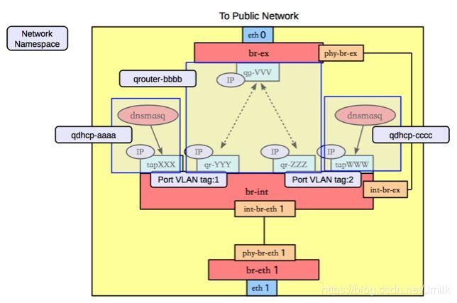

Như hình, ta có thể thấy DHCP service thực sự được cung cấp bởi dnsmasq service process, 1 port DHCP (tap device) sẽ được thêm vào bảng ```qdhcp-XXX``` namespace. DHCP port này được kết nối tới br-int và có cùng tenant network như tenant network tương ứng. Local VLAN tag (và tenant network VID)

Ngoài ra, bạn cũng có thể thấy rằng 2 bridge device là ```br-int``` và ```br-ex``` trong namespace ```qrouter-XXX``` được kết nối với nhau thông qua cặp ```veth-pair```. Hơn nữa, cổng ```qr-XXX``` cũng có tag VLAN local. Các tenant network khác nhận ra sự tách biệt của cấu hình Router (routing table, iptables) thông qua các Network namespace khác nhau. Kích hoạt iptables trong qrouter - chủ yếu là chức năng NAT và hỗ trợ chức năng liên quan đến IP của Neutron

**Những người dùng khác nhau có thể cài đặt ```qrouter-xxx``` và ```qdhcp-xxxx``` khác nhau**

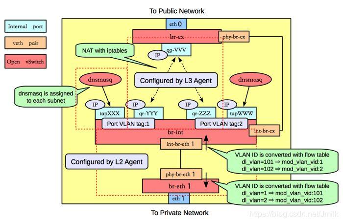

Các traffic máy ảo được gửi ra external network:

**Bước 9:** Card mạng vật lý ethX (OvS br-ethX / br-tun) nhận lưu lượng truy cập external network từ máy ảo trên node compute từ physical network, đầu tiên thực hiện chuyển đổi internal VID và external VID, sau đó truyền nó đến OvS br thông qua veth pair

**NOTE:** Đối với mỗi tenant network, VID ở tenant network layer phải giống nhau, nhưng ID VLAN local trên các node (compute, network) khác nhau có thể không giống nhau. Bởi vì, tất cả những điều này nằm dưới sự kiểm soát OvS flow table, trước tiên, chúng ta hãy có ấn tượng về vấn đề này.

**Bước 10:** Trên node network, OvS ```br-int``` được kết nối với các Network namespace khác nhau, ```qrouter-XXX``` nhận lưu lượng truy cập phân đoạn cross-network trong nội bộ và lưu lượng truy cập public network thông qua port ```qr-XXX```
- **Cross-network access traffic:** Sau khi port ```qr-XXX``` nhận được traffic, kernel TCP/IP protocol stack định tuyến lưu lượng truy cập cross-network theo routing rules trong ```qrouter-XXX```, ghi lại MAC address và chuyển tiếp lưu lượng thông qua ```qr-YYY``` interface. OvS br-int truyền các gói dữ liệu, nhận ra định tuyến và chuyển tiếp giữa các segment network khác nhau
- **Public network access traffic:** Sau khi port qr-XXX nhận được traffic, kernel TCP/IP protocol stack sẽ thực hiện translate network address trên traffic theo NAT rules của iptables trong ```qrouter-XXX``` (nguyên tắc triển khai của Floating IP), và sau đó chuyển qua ```qg-XXX``` interface gửi data packet tới OvS ```br-ex```

**Bước 11:** Cuối cùng, card mạng vật lý ethX được kết nối với second-level gateway gắn trên ```br-ex``` sẽ được gửi đến Internet router

## VIII. Mô hình thực hiện mạng của Node Controller

Mô hình triển khai mạng của node Controller khá dễ hiểu, vì node Controller không chịu trách nhiệm về data plane, vì vậy nó không triển khai các chức năng của mạng cụ thể. Điều chúng ta cần quan tâm là service process của neutron-server. Neutron không có tên rõ ràng cho neutron-api service process, nhưng neutron-server cung cấp webserver service. North nhận các REST API request và South sẽ chuyển tiếp cho Neutron Agent service process trên node thông qua giao thức RPC. Đây là mô hình triển khai mạng của Neutron trên node Controller

Tới đây, chúng ta đã giới thiệu xong mô hình triển khai mạng của Neutron trên các node Conpute, network và controller riêng biệt

Trước tiên, chúng ta hãy đặt OPS và Neutron sang 1 bên, và đơn giản hãy tưởng tượng cách sử dụng công tắc ảo (virtual switches) để đạt được giao tiếp máy ảo trên nhiều máy chủ và nhu cầu về máy ảo để truy cập ra external network? Câu trả lời vô cùng đơn giản. Nếu bạn áp dụng OvS, nó sẽ tạo 1 thiết bị Bridge (như ```br-int```) trên mỗi node, ở ngoài br-ex, br-ethX/br-tun, Linux Bridge, và nhiều thứ nữa

Nếu bạn sử dụng Linux Bridge, nó sẽ phức tạp hơn 1 chút

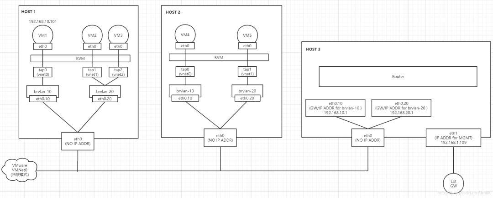

Nhưng nếu bạn cho rằng những gì cần được triển khai là "multi-tenant multi-plane network on a cloud platform", sau đó mọi thứ sẽ trở nên khá phức tạp. Một nền tảng cloud linh hoạt và khả thi đòi hỏi quá nhiều loại mạng để hỗ trợ, và Neutron vẫn đang cố gắng làm điều đó. Trong điều kiện đó, đòi hỏi cấp thiết phải thiết kế 1 kiến trúc phần mềm với "trừu tượng và thống nhất ở lớp trên, tính tương thích ko đồng nhất ở lớp dưới", và kiểu thiết kế kiến trúc này chúng ta thường gọi là kiến trúc phân lớp. Đề án thiết kế luôn phụ thuộc và việc lựa chọn sự hỗ trợ bên dưới. Kiến trúc phân lớp của mô hình triển khai mạng Neutron được hưởng lợi từ chức năng Open vSwitch (OpenFlow switch) Flow Table