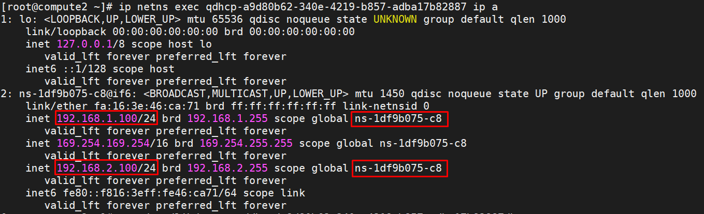
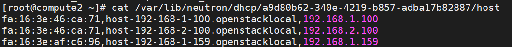
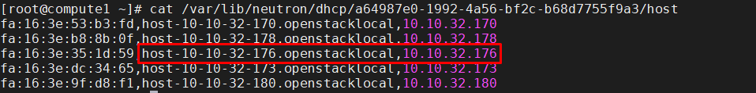

# Principle analysis of openstack DHCP

## I. Mô tả ngắn gọn về nguyên tắc của DHCP

**DHCP** hay Dynamic Host Configuration Protocol là giao thức điều khiển các dải IP để tự động cấp phát IP cho các client yêu cầu nó

**Luồng hoạt động:**

1. Client tạo ra bản tin DISCOVER để yêu cầu cấp phát địa chỉ IP và gửi đi tới các Server (Do chưa biết chính xác địa chỉ Server cấp IP cho mình nên gói tin sẽ gửi ở dạng Broadcast)

2. Các Server nhận bản tin DISCOVER của Client sẽ:
- Kiểm tra địa chỉ IP nào phù hợp để cấp cho Client
- Server tạo bản tin OFFER (chứa thông tin về IP và các thông số cấu hình khác mà Client yêu cầu để có thể sử dụng để truy cập Internet)
- Các Server sẽ gửi bản tin OFFER dưới dạng broadcast

3. Client nhận các gói OFFER
- Client chọn OFFER (có thể là gói tin đầu tiên nhận được, hoặc là gói có chứa IP mà nó đã từng dùng trước đó). Còn nếu không nhận được gói OFFER nào thì nó sẽ gửi lại gói DISCOVER 1 lần nữa
- Tạo gói REQUEST và gửi dưới dạng broadcast. Nếu nó nhận OFFER từ Server nào thì gói REQUEST gửi về Server đó sẽ mang ý nghĩa đồng ý nhận IP, còn các Server khác thì thông báo là không nhận OFFER đó

4. Server nhận bản tin REQUEST (đối với các server không được nhận OFFER thì sẽ bỏ qua gói tin này)
- Server xử lý gói tin REQUEST: kiểm tra xem IP này còn sử dụng được không
- Nếu còn sử dụng được thì nó ghi lại thông tin và gửi lại gói tin ACK cho Client. Nếu không thì sẽ gửi lại PNAK để quay lại bước 1

## II. Tổng quan về neutron-dhcp-agent

Khi OPS tạo 1 máy ảo, nó sẽ tự động gán địa chỉ IP cho máy ảo thông qua service Neutron DHCP. Thành phần đó là neutron-dhcp-agent service chạy trên các node network

## III. File cấu hình

File cấu hình DHCP service trên node network

```sh
cat /etc/neutron/dhcp_agent.ini
```

```sh
[DEFAULT]
interface_driver = neutron.agent.linux.interface.BridgeInterfaceDriver
enable_isolated_metadata = True
dhcp_driver = neutron.agent.linux.dhcp.Dnsmasq
force_metadata = True
```

- ```dhcp_driver```: mặc định sử dụng ```neutron.agent.linux.dhcp.Dnsmasq```
- ```interface_driver```: sử dụng LinuxBridge để quản lý các interface của máy ảo

Khi mạng được tạo và dhcp function của subnet tương ứng được bật, Neutron sẽ bắt đầu tiến trình dnsmasq trển node network để cung cấp dhcp service cho mạng

- ```--interface```: port được dnsmasq sử dụng để theo dõi các request/response để cung cấp DHCP service
- ```--dhcp-hostsfile```: file lưu thông tin DHCP server. DNSmasq sẽ nhận được sự tương ứng giữa port và MAC address từ file này

## IV. Network namespace

Neutron cung cấp DHCP độc lập cho mỗi mạng thông qua namespace. Cho phép tenant tạo ra các mạng overlapping network

Namespace tương ứng với DHCP được đặt tên theo dạng: ```qdhcp-<network_id>```

Có thể kiểm tra qua lệnh ```ip netns``` (trên node network)

```sh
ip netns
```

## V. OPS DHCP obtain ip process analysis

Khi khởi tạo VM1, Neutron sẽ cấp phát 1 port cho nó và đồng bộ thông tin MAC và IP của nó vào file host của dnsmasq, ví dụ:

```sh
cat /var/lib/neutron/dhcp/a64987e0-1992-4a56-bf2c-b68d7755f9a3/host

fa:16:3e:53:b3:fd,host-10-10-32-170.openstacklocal,10.10.32.170
fa:16:3e:b8:8b:0f,host-10-10-32-178.openstacklocal,10.10.32.178
fa:16:3e:35:1d:59,host-10-10-32-176.openstacklocal,10.10.32.176
fa:16:3e:dc:34:65,host-10-10-32-173.openstacklocal,10.10.32.173
```

Đồng thời, nova-compute cũng tạo 1 file XML của instance có phần network như sau:

```sh
virsh edit instance-00000002

<interface type='bridge'>
    <mac address='fa:16:3e:dc:34:65'/>
    <source bridge='brqa64987e0-19'/>
    <target dev='tapbb3e0086-70'/>
    <model type='virtio'/>
    <mtu size='1500'/>
    <address type='pci' domain='0x0000' bus='0x00' slot='0x03' function='0x0'/>
</interface>
```

**Khởi động máy ảo lần đầu tiên:**

1. Khi máy ảo VM1 khởi động lần đầu tiên, nó sẽ gửi 1 message dhcpdiscover broadcast, message sẽ được nhận trong toàn bộ mạng (vlan)

2. dhcpdiscover broadcast message sẽ được gửi tới tại tap2c6747c1-2a và dnsmasq sẽ lắng nghe sự kiện này. Dnsmasq lúc này kiểm tra file host của mạng tương ứng và tìm các tùy chọn phù hợp, từ đó, dnsmasq sẽ dùng dhcpoffer message để set IP, subnetmask,... và gửi thông tin đó tới VM1

3. VM1 gửi 1 dhcprequest message (broadcast) để chấp nhận IP từ dhcpoffer message

4. Dnsmasq gửi lại dhcpack message để xác nhận dhcprequest message của VM1. Sau khi nhận được dhcpack message, VM1 bắt đầu sử dụng IP được nhận và toàn bộ quá trình kết thúc

5. VM1 khởi tạo ARP broadcast để lấy địa chỉ gateway MAC

6. Tương tác với địa chỉ nội bộ 169.254.169.254

7. VM1 sẽ gửi icmp đến gateway. Sau khi xác nhận, toàn bộ quá trình kết thúc

**Quá trình khởi động lại máy ảo**

1. Khi khởi động lại, VM1 sẽ sử dụng địa chỉ cuối cùng để gửi direct broadcast dhcprequest message yêu cầu tiếp tục sử dụng địa chỉ IP. Sau khi dnsmasq xác nhận, nó sẽ gửi dhcpack message để xác nhận, và VM1 sẽ nhận dhcpack message để tiếp tục sử dụng IP

2. VM1 khởi tạo 1 ARP broadcast để lấy gateway MAC

3. Tương tác với địa chỉ nội bộ 169.254.169.254

4. VM1 sẽ gửi ICMP đến gateway. Sau khi xác nhận, toàn bộ quá trình kết thúc

## VI. Các tình huống nhiều subnet trong mạng

1. Khi có nhiều subnet trong mạng và dhcp được bật, Neutron sẽ cấu hình nhiều IP tương ứng trên tap device (network: dhcp port) trong namespace của mạng



2. Đồng thời, cập nhật file host dhcp thông qua neutron database (2 IP được cấu hình cùng địa chỉ MAC)



3. Cuối cùng, khởi động lại dnsmasq process trên node network, và update ```-dhcp-range``` và ```-dhcp-hostsfile``` để làm cho quá trình hoạt động trên nhiều dải dhcp đạt được 1network và nhiều subnet dhcp service

## VII. VM được truy cập thông qua tên miền

Dnsmasq là 1 phần mềm nguồn mở hỗ trợ chức năng DHCP và DNS. Neutron hỗ trợ chức năng phân giải tên miền của các máy ảo trong cùng mạng bằng cách gọi dnsmasq

1. Khi tạo VM1, Neutron sẽ cấp phát 1 port cho nó và đồng bộ domain name và thông tin IP đến file host của dnsmasq

```sh
cat /var/lib/neutron/dhcp/a64987e0-1992-4a56-bf2c-b68d7755f9a3/host
```



2. Tên miền tương ứng của ```10.10.32.176``` là ```host-10-10-32-176.openstacklocal```

3. Sau khi VM được bật, Neutron sẽ cập nhật ```/etc/resolv.conf``` của VM và sử dụng IP của dhcp port như là DNS address (dnsmasq sẽ lắng nghe từ địa chỉ này) để thực hiện chức năng dns

## VIII. Phân tích triển khai DHCP HA

Sau khi triển khai dhcp agent hoàn tất, dhcp đã chạy trên node network và state đã ok:

1. Tạo 1 network, neutron sẽ tạo 1 namespace và tap device tương ứng trên các node network

2. Khi tạo máy ảo, Neutron sẽ assign 1 port cho nó. Trong kịch bản HA, thông tin địa chỉ MAC và IP sẽ được cập nhật vào file host của các node network. Nói cách khác, các file host sử dụng các node network như nhau

3. Khi máy ảo khởi động, nó sẽ gửi broadcast dhcpdiscover message và tất cả các tap device trên node network sẽ nhận được message, vì vậy tất cả dnsmasq sẽ gửi lại response dhcpoffer

4. Máy ảo phản hồi dhcpoffer message đầu tiên nhận được bằng broadcast. dhcprequest message sẽ chứa IP của dnsmasq, vì vậy chỉ có dnsmasq tương ứng sẽ gửi message dhcpack để xác nhận, và các dnsmasq khác sẽ không xử lý message sau khi nhận được

5. Sau khi nhận được message dhcpack xác nhận, máy ảo sẽ kiểm tra IP có thể sử dụng hay không, nếu có, nó sẽ cập nhật thông tin và bắt đầu sử dụng IP