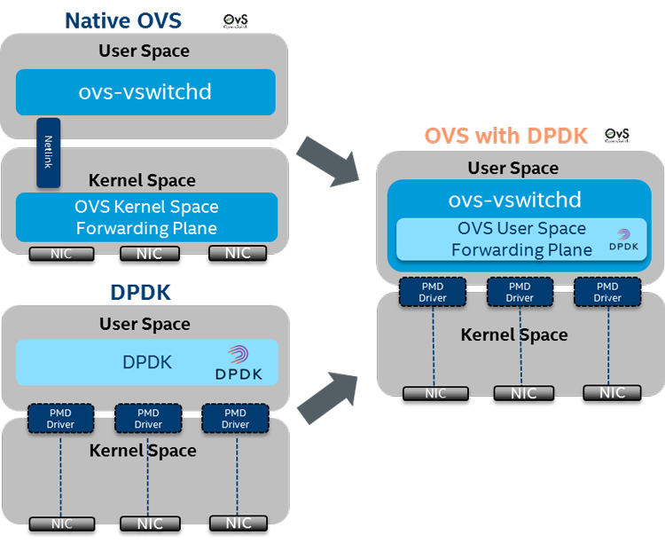
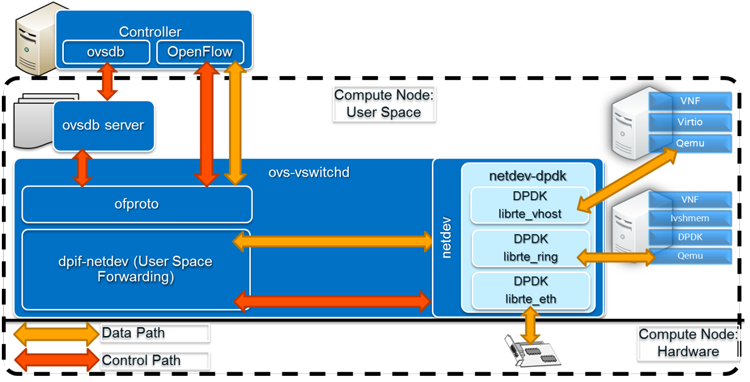

# Sử dụng ovs-dpdk trong Openstack

Tài liệu này mô tả về các yêu cầu để cài đặt ovs-dpdk và sử dụng driver vhost-user cho NIC của máy ảo trong OpenStack.

Open vSwitch (OVS) với Data Plane Development Kit (DPDK) cung cấp hiệu suất mạng cao hơn so với OVS kernel thông thường, bằng việc cho phép QEMU giao tiếp trực tiếp với OVS-DPDK qua socket unix trong userspace, giảm tải cho hypervisor và tăng tốc độ xử lý mạng.

## Mô hình hoạt động

OVS hoạt động trong kernel của Linux gây ra độ trễ lớn do phải xử lý interrupt, sau đó dữ liệu lại phải chuyển từ kernelspace vào userspace gây ra overhead không cần thiết.

DPDK là công cụ của intel cho phép bypass kernel bằng cách tạo ra 1 ứng dụng mà được phép toàn quyền kiểm soát card mạng của máy chủ. Lợi thế chính của DPDK bao gồm:

- Sử dụng **Poll mode drivers** (PMD): thay vì chờ interrupt, DPDK chủ động thăm dò liệu có gói tin nào mới gửi đến nic hay không
- Sử dụng **Hugepage** để tối ưu hóa truy cập bộ nhớ
- Không cần sao chép gói tin qua lại giữa userspace và kernelspace





## Yêu cầu

**Phiên bản phần mềm**

|Application|Version|
|:-|:-|
|Open vSwitch|>=2.4|
|DPDK|>=2.0|
|QEMU|>=2.1.0|
|libvirt|>=1.2.13|

**Compute Driver**: Phải sử dụng libvirt với hypervisor KVM/QEMU.

**NIC hỗ trợ DPDK**: Cần NIC được liệt kê trong danh sách hỗ trợ DPDK , đặc biệt nếu sử dụng cổng vật lý. Kiểm tra tại [đây](https://core.dpdk.org/supported/nics/).

Sử dụng driver tương thích với DPDK cho NIC:

```sh
dpdk-devbind.py --bind=vfio_pci <interface>
```

Hoặc

```sh
dpdk-devbind.py --bind=uio_pci_generic <interface>
```

**Hỗ trợ huge pages**: Hệ thống phải hỗ trợ huge pages.

**Kernel Linux** cũng cần đáp ứng các yêu cầu sau:

Phiên bản kernel **4.19** hoặc cao hơn, với **IOMMU** được kích hoạt thông qua grub cmdline cho VFIO driver.

I/O Memory Management Unit (IOMMU) cung cấp khả năng ánh xạ địa chỉ bộ nhớ (memory) cho các thiết bị I/O. Nó hỗ trợ dịch địa chỉ (address translation) giữa bộ nhớ của máy ảo và bộ nhớ thật, cũng như bảo vệ truy cập bộ nhớ hệ thống đối với các truy cập bộ nhớ trực tiếp (direct memory access) từ thiết bị ngoại vi

**DPDK**: DPDK cần phải được cài đặt, nếu build từ source thì sẽ có 1 vài requirement như: 

Một vài công cụ phát triển bao gồm C compiler như GCC hay Clang:

```sh
apt install build-essential -y
```

Python 3.6 trở lên, ```meson```, ```ninja-build```, ```pyelftools```, ```libnuma-dev```

```sh
pip3 install meson ninja
apt install python3-pyelftools libnuma-dev -y
```

**OVS-DPDK**: Cần build OVS với hỗ trợ DPDK, sử dụng tùy chọn ```--with-dpdk``` trong quá trình cấu hình.

```sh
./configure --with-dpdk=static
```

**OVS-vswitchd**: ovs-vswitchd cần thêm 1 vài cấu hình đặc biệt để DPDK hoạt động. Các đối số cấu hình DPDK có thể được truyền vào ovs-vswitchd thông qua cột ```other_config``` của bảng ```Open_vSwitch```. Ví dụ:

```sh
export PATH=$PATH:/usr/local/share/openvswitch/scripts
export DB_SOCK=/usr/local/var/run/openvswitch/db.sock
ovs-vsctl --no-wait set Open_vSwitch . other_config:dpdk-init=true
ovs-ctl --no-ovsdb-server --db-sock="$DB_SOCK" start
```

**DPDK-Bridge**: Cần cấu hình bridge để tận dụng DPDK-backed ports, ví dụ thêm 1 bridge sử dụng DPDK như sau:

```sh
ovs-vsctl add-br br0 -- set bridge br0 datapath_type=netdev
```

**DPDK vhost-user port**

Để tương tác với máy ảo trong khi xử lý traffic ở userspace thì OVS cần sử dụng vhost-user port. vhost-user sử dụng mô hình client-server, server tạo/quản lý/xóa vhost-user socket, còn client thì cần kết nối đến server để hoạt động. OVS cung cấp 2 loại vhost-user port:

- **vhost-user** (dpdkvhostuser): OVS là server, qemu là client
- **vhost-user-client** (dpdkvhostuserclient): OVS là client, qemu là server

Để add port ```dpdkvhostuserclient``` vào bridge ```br0```, ta có thể sử dụng lệnh:

```sh
ovs-vsctl add-port br0 dpdkvhostclient0 \
    -- set Interface dpdkvhostclient0 type=dpdkvhostuserclient \
       options:vhost-server-path=/tmp/dpdkvhostclient0
```

Để add port ```dpdkvhostuser``` vào bridge ```br0```, ta có thể sử dụng lệnh:

```sh
ovs-vsctl add-port br0 vhost-user-1 -- set Interface vhost-user-1 type=dpdkvhostuser
```

Lệnh trên sẽ tạo 1 socket tại ```/usr/local/var/run/openvswitch/vhost-user-1```, socket này sau đó sẽ phải cung cấp cho VM thông qua QEMU

**Thêm vhost-user ports vào VM (sử dụng libvirt)**

Thêm cấu hình sau vào ```/etc/libvirt/qemu.conf``` sau đó restart libvirtd:

```sh
user = "root"
group = "root"
```

**HugePages Flavor**: Máy ảo phải yêu cầu huge pages thông qua flavor, ví dụ:

```sh
openstack flavor set m1.large --property hw:mem_page_size=large
```

vhost-user yêu cầu bộ nhớ chia sẻ dựa trên file descriptor, chỉ có thể thực hiện qua huge pages. Huge pages giảm overhead bộ nhớ và tăng hiệu suất, đặc biệt trong môi trường mạng cao tải.

## Tài liệu tham khảo

https://www.intel.com/content/www/us/en/developer/articles/technical/open-vswitch-with-dpdk-overview.html

https://docs.openvswitch.org/en/stable/intro/install/dpdk/

https://docs.openvswitch.org/en/stable/topics/dpdk/bridge/

https://docs.openvswitch.org/en/stable/topics/dpdk/vhost-user/#dpdk-vhost-user-xml

https://doc.dpdk.org/guides/linux_gsg/sys_reqs.html

https://docs.openstack.org/ocata/networking-guide/config-ovs-dpdk.html

https://doc.dpdk.org/guides/linux_gsg/linux_drivers.html