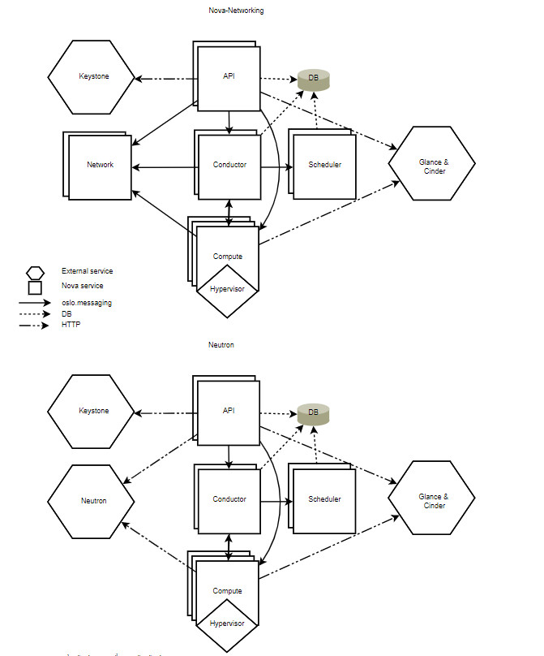

# Tổng quan về Nova

## I. Giới thiệu về Nova

Nova bao gồm nhiều tiến trình trên server, mỗi tiến trình thực hiện các chức năng khác nhau

Nova cung cấp REST API để tương tác với user, các thành phần trong Nova truyền thông với nhau thông qua RPC message

API server xử lý các REST request, thường liên quan đến việc đọc ghi database, tùy chọn gửi RPC messages đến các Nova service khác, và tạo ra các trả lời cho REST calls. RPC message thực hiện thông qua thư viện ```oslo.messages```

Hầu hết các thành phần chính của Nova có thể chạy trên nhiều server, và có các manager lắng nghe RPC messages, ngoại trừ nova-compute, tiến trình duy nhất chạy trên hypervisor mà nó quản lý (trừ khi sử dụng VMware hoặc Ironic drivers)

Nova có thể sử dụng central database được chia sẻ giữa tất cả các thành phần. Tuy nhiên, để hỗ trợ upgrade, DB được truy cập thông qua 1 object layer để đảm bảo các thành phần control đã upgrade có thể giao tiếp với nova-compute chạy ở phiên bản trước. Để làm điều này, nova-compute ủy quyền các yêu cầu tới database thông qua RPC tới 1 trình quản lý trung tâm, chính là dịch vụ nova-conductor

## II. Các dịch vụ và thành phần của Nova

### 1. Các dịch vụ của Nova

- **API server:** Nơi tiếp nhận và phản hồi các compute calls từ user. Nơi thực hiện các lệnh và điều khiển hypervisor, storage và networking sẵn có đến user
   - API endpoint cơ bản là HTTP web services, xử lý các authentication, và các câu lệnh cơ bản chức năng điều khiển sử dụng API interface khác nhau của Amazon, Rackspace và các mô hình liên quan khác. Điều này cho phép sự tương thích API với nhiều bộ tool để tương tác với các vendor khác nhau

- **Message queue:** Được coi là môi trường tương tác giữa các compute nodes, networking controller, API endpoint, scheduler (xác định physical hardware cần phân bố cho tài nguyên ảo) và thành phần tương tự
   - Giao tiếp đến và từ cloud controller được xử lý bởi HTTP Request thông qua nhiều API endpoints
   - Một sự kiện bắt đầu khi mà API server nhận được request từ user. API server chứng thực user và đảm bảo user được phép đưa ra lệnh đó. Nếu các object liên quan đến yêu cầu có sẵn thì yêu cầu sẽ được chuyển đến queueing engine cho những worker liên quan. Workers liên tục lắng nghe queue dựa trên các role của họ. Khi đến lượt yêu cầu thực hiện, worker phân công nhiệm vụ và thực hiện yêu cầu. Sau khi hoàn thành, phản hồi được gửi đến queue được nhận bởi API server và chuyển tiếp tới server. Các thao tác truy vấn, nhập, xóa là cần thiết trong quá trình

- **Compute worker:** Quản lý computing instance trên host machine. API truyền lệnh đến compute worker để hoàn thành các tác vụ:
   - Run instances
   - Delete instances
   - Reboot instances
   - Attach volumes
   - Detach volumes
   - Get console output

- **Network Controller:** Quản lý tài nguyên networking trên host machine. API server gửi các lệnh thông qua message queue, sau đó được xử lý bởi Network Controllers
   - Cấp phát IP
   - Cấu hình VLANs cho projects
   - Cấu hình network cho compute node

### 2. Các thành phần của Nova



OPS Compute bao gồm các thành phần:
- **Nova-api service:** Tiếp nhận và trả lời các compute API call của end user. Service hỗ trợ OPS Compute API, Amazon EC2 API, và Admin API đặc biệt cho user thực hiện các tác vụ quản trị. Nó thực hiện 1 số chính sách và khởi tạo hầu hết các hoạt động điều phối, chẳng hạn như tạo máy ảo.
- **Nova-api-metadata service:** Tiếp nhận yêu cầu lấy metadata từ instance. Được sử dụng khi bạn chạy chế độ multi-host và nova-network
- **Nova-compute service:** Một worker daemon quản lý vòng đời của máy ảo như tạo, hủy thông qua hypervisor APIs. VD:
   - XenAPI cho XenServer/XCP
   - libvirt cho KVM hoặc QEMU
   - VMwareAPI cho VMware

Xử lý các tiến trình là 1 quá trình phức tạp. Daemon chấp nhận hành động từ queue và thực hiện 1 loạt các lệnh hệ thống như khởi tạo 1 KVM instance và update trạng thái nó trong database
- **nova-placement-api service:** Lần đầu tiên xuất hiện tại bản Newton, placement api được dùng để theo dõi thống kê và mức độ sử dụng của mỗi một resource provider (cung cấp tài nguyên). Provider ở đây có thể là compute node, share storage pool hoặc IP allocation pool. VD, để 1 máy ảo có thể được khởi tạo và lấy RAM, CPU từ compute node, lấy disk từ storage bên ngoài và lấy địa chỉ IP từ pool resource
- **Nova-scheduler service:** Xác định các yêu cầu từ máy ảo đặt vào queue và xem chúng được đặt tại server nào
- **Nova-conductor module:** Trung gian tương tác giữa nova-compute và databases. Nó loại bỏ truy cập trực tiếp vào cloud databases được thực hiện bởi nova-compute service nhằm mục đích bảo mật, tránh trường hợp máy ảo bị xóa mà không có chủ ý của người dùng
- **Nova-cert module:** Một server daemon phục vụ Nova Cert service cho X509 certificates. Được sử dụng khi tạo certificates cho euca-bundle-image, chỉ cần cho EC2 API
- **Nova-consoleauth daemon:** Ủy quyền token cho user mà console proxies cung cấp. Dịch vụ này phải chạy với console proxies để làm việc
- **Nova-spicehtml5proxy daemon:** Cung cấp proxy truy cập instance đang chạy thông qua kết nối SPICE. Hỗ trợ browser dựa trên HTML5 Client
- **Nova-novncproxy daemon:** Cung cấp proxy truy cập instance đang chạy thông qua kết nối VNC. Hỗ trợ browser dựa trên novnc clients
- **Nova-xvpvncproxy daemon:** Cung cấp proxy cho việc truy cập instance đang chạy thông qua kết nối VNC. Hỗ trợ OPS-specific java client
- **The queue:** Trung tâm giao tiếp giữa các daemons. Thường sử dụng RabbitMQ, cũng có thể thực hiện với một AMQP message queue khác là zeroMQ
- **SQL database:** Lưu trữ các trạng thái build-time và run-time của hạ tầng cloud, bao gồm:
   - Các loại máy ảo có thể chạy
   - Các máy ảo đang được dùng
   - Network khả dụng
   - Projects

Về lý thuyết, openstack compute hỗ trợ bất kỳ database nào mà SQL Alchemy hỗ trợ ví dụ như SQLite3, MySQL, MariaDB và PostgreSQL
- DB: sql database để lưu trữ dữ liệu
- API: Thành phần để nhận HTTP request, chuyển đổi các lệnh và giao tiếp thành phần khác thông qua oslo.messaging queues hoặc http
- Scheduler: Quyết định máy chủ được chọn để chạy máy ảo
- Compute: Quản lý giao tiếp với hypervisor và virtual machines
- Conductor: Xử lý các yêu cầu cần phối hợp (build/resize), hoạt động như 1 proxy cho CSDL hoặc đối tượng cần chuyển đổi
- Placement: theo dõi tài nguyên còn lại và đã sử dụng

