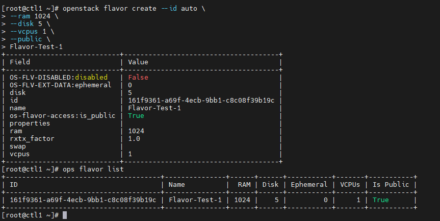
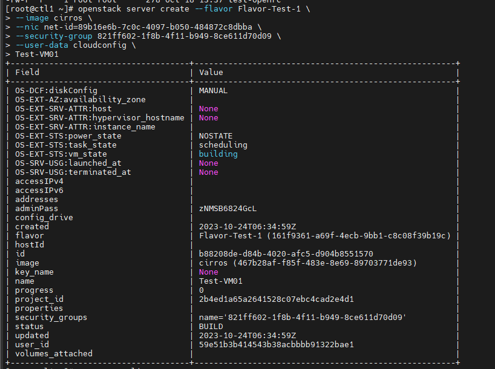

# Các câu lệnh thường dùng trong Nova

## Flavor

### List flavor

```sh
openstack flavor list
```

### Tạo mới 1 flavor

```sh
openstack flavor create
    [--id <id>]
    [--ram <size-mb>]
    [--disk <size-gb>]
    [--ephemeral-disk <size-gb>]
    [--swap <size-mb>]
    [--vcpus <num-cpu>]
    [--rxtx-factor <factor>]
    [--public | --private]
    [--property <key=value> [...] ]
    [--project <project>]
    [--project-domain <project-domain>]
    <flavor-name>
```

**Lưu ý:** Nên đặt tên flavor viết liền, không dấu

VD:

```sh
openstack flavor create --id auto \
--ram 1024 \
--disk 5 \
--vcpus 1 \
--public \
Flavor-Test-1
```



### Xóa flavor

Cú pháp:

```sh
openstack flavor delete <tên hoặc ID của flavor>
```

### Update thuộc tính của flavor

Cú pháp

```sh
openstack flavor set
    [--no-property]
    [--property <key=value> [...] ]
    [--project <project>]
    [--project-domain <project-domain>]
    <flavor>
```

```--no-property```: Xóa tất cả các thuộc tính

VD:

```sh
# Chỉ gán project được đối với flavor private
openstack flavor set --project demo Flavor-Test-1
```

```access_project_ids```: ID của project được gán

### Bỏ một thuộc tính

```sh
openstack flavor unset
    [--property <key> [...] ]
    [--project <project>]
    [--project-domain <project-domain>]
    <flavor>
```

VD: 

```sh
openstack flavor unset --project demo Flavor-Test-1
```

## Server (VM / Instance)

### Tạo VM từ image hoặc volume

Cú pháp

```sh
openstack server create
    (--image <image> | --volume <volume>)
    --flavor <flavor>
    [--security-group <security-group>]
    [--key-name <key-name>]
    [--property <key=value>]
    [--file <dest-filename=source-filename>]
    [--user-data <user-data>]
    [--availability-zone <zone-name>]
    [--block-device-mapping <dev-name=mapping>]
    [--nic <net-id=net-uuid,v4-fixed-ip=ip-addr,v6-fixed-ip=ip-addr,port-id=port-uuid,auto,none>]
    [--network <network>]
    [--port <port>]
    [--hint <key=value>]
    [--config-drive <config-drive-volume>|True]
    [--min <count>]
    [--max <count>]
    [--wait]
    <server-name>
```

VD: Ta tạo VM từ image với cloud-init config:

```sh
cat cloudconfig

#cloud-config
password: Welcome123
chpasswd: {expire: False}
ssh_pwauth: True
```

Tạo VM với password truyền vào từ file cloud-config

```sh
openstack server create --flavor Flavor-Test-1 \
--image cirros \
--nic net-id=89b16e6b-7c0c-4097-b050-484872c8dbba \
--security-group 821ff602-1f8b-4f11-b949-8ce611d70d09 \
--user-data cloudconfig \
Test-VM01
```



### Show thông tin VM

```sh
openstack server show [--diagnostics] <tên hoặc ID của VM>
```

```--diagnostics```: Hiển thị thông tin chuẩn đoán của VM

### Thao tác với VM

```sh
openstack <start|stop|reboot|suspend|resume VM> <tên hoặc ID máy>
```

### Xóa VM

```sh
openstack server delete [--wait] <tên hoặc ID server>
```

```--wait```: Wait for delete to complete

### List danh sách hypervisor

```sh
openstack hypervisor list
```

## Snapshot (xem ở bài Cinder CLI)

### Tạo snapshot

```sh
openstack volume snapshot create
    [--volume <volume>]
    [--description <description>]
    [--force]
    [--property <key=value>]
    [--remote-source <key=value>]
    <snapshot-name>
```

Trong đó:
- ```--volume```: Volume cần snapshot (tên hoặc ID)
- ```--description```: Mô tả của snapshot
- ```--force```: Tạo 1 snapshot đã gắn với 1 máy ảo. Mặc định là false
- ```--property <key=value>```: Thiết lập 1 thuộc tính cho snapshot này
- ```remote-source <key=value>```: The attribute(s) of the existing remote volume snapshot (admin required). VD: ```--remote-source source-name=test_name --remote-source source-id=test_id```
- ```snapshot-name```: tên bản snapshot mới

### Xóa snapshot

```sh
openstack volume snapshot delete [--force] <snapshot> [<snapshot> ...]
```

### Liệt kê snapshot

```sh
openstack volume snapshot list
    [--sort-column SORT_COLUMN]
    [--sort-ascending | --sort-descending]
    [--all-projects]
    [--project <project>]
    [--project-domain <project-domain>]
    [--long]
    [--marker <volume-snapshot>]
    [--limit <num-snapshots>]
    [--name <name>]
    [--status <status>]
    [--volume <volume>]
```

### Thiết lập thuộc tính của snapshot

```sh
openstack volume snapshot set
    [--name <name>]
    [--description <description>]
    [--no-property]
    [--property <key=value>]
    [--state <state>]
    <snapshot>
```

### Hiển thị thuộc tính snapshot

```sh
openstack volume snapshot show <snapshot>
```

### Unset thuộc tính snapshot

```sh
openstack volume snapshot unset [--property <key>] <snapshot>
```

