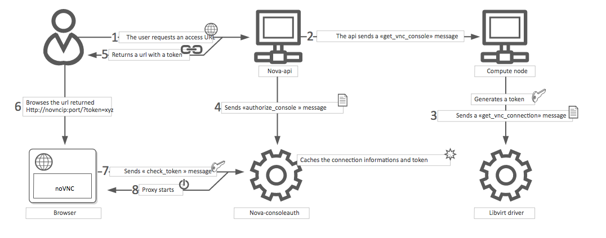

# Luồng khởi tạo và quản lý VNC (virtual network computing) trong Nova

VNC là một giao diện điều khiển đồ họa với sự hỗ trợ rộng rãi giữa nhiều hypervisor và client. noVNC cung cấp hỗ trợ VNC thông qua trình duyệt web

## VNC console connection workflow

Quá trình kết nối VNC dựa trên noVNC

1. User kết nối với API và lấy được access_url có dạng ```http://ip:port/?path=%3Ftoken%3Dxyz```

2. User dùng URL trong trình duyệt hoặc sử dụng nó làm client parameter

3. Trình duyệt hoặc client kết nối với proxy

4. Proxy sẽ đưa thêm token cho user và maps token đến private host và port của máy chủ VNC

Host compute sẽ chỉ định địa chỉ mà proxy nên sử dụng để kết nối thông qua tùy chọn ```vnc.server_proxyclient_address```. Theo cách này, proxy VNC hoạt động như 1 cầu nối giữa public network và private host network

5. Proxy bắt đầu kết nối với VNC server và tiếp tục proxy cho đến khi phiên kết thúc

Có nghĩa là, một triển khai điển hình VNC console với noVNC gồm 2 thành phần sau:
- 1 hoặc nhiều dịch vụ ```nova-novncproxy```. Hỗ trợ noVNC trên trình duyệt. Đơn giản nhất là dịch vụ này thường chạy trên cùng 1 máy như ```nova-api``` vì nó hoạt động như 1 proxy giữa public network và private compute host network
- 1 hoặc nhiều dịch vụ ```nova-compute```. Host các instance cho console được cung cấp

## Sơ đồ quá trình khởi tạo VNC



1. User sẽ gửi request truy cập URL tới ```nova-api```

2. ```nova-api``` gửi message báo cho compute node với nội dung ```get_vnc_console```

3. ```compute node``` sinh token gửi message ```get_vnc_connection``` tới ```libvier driver```

4. ```nova-api``` gửi message ```authorize_console``` đến ```nova_consoleauth```

5. ```nova-api``` trả về cho user URL truy cập noVNC kèm token

6. User sử dụng URL và token để truy cập trên trình duyệt

7. Trình duyệt gửi message ```check_token``` tới ```nova-consoleauth``` để kiểm tra

8. Sau khi xác nhận đúng, proxy khởi động và user sẽ được truy cập console của VM

## VNC configure options

```sh
[vnc]
enabled = true
server_listen = $my_ip
server_proxyclient_address = $my_ip
```

## Thời gian hết hạn token

Mặc định là 600, được thiết lập tại ```/etc/nova/nova.conf```

```sh
[consoleauth]
token_ttl=600
```