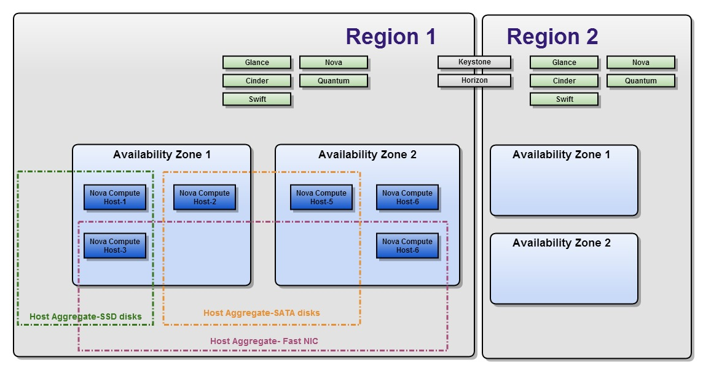
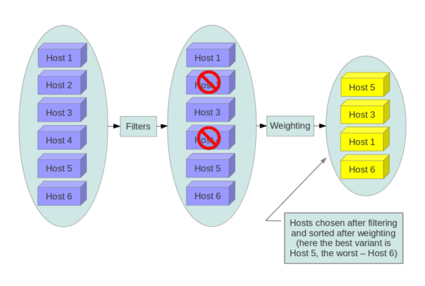
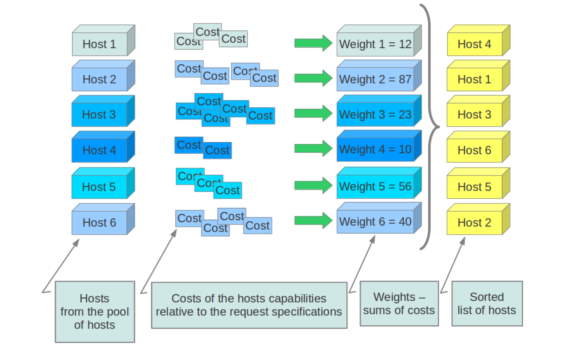
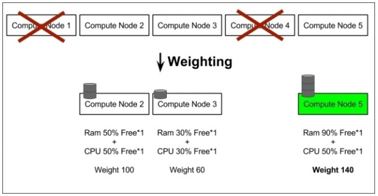

# Nova-Scheduler

## I. Host aggregate vs Availability zone



### 1. Host aggregate

Là một cơ chế tạo ra một nhóm logic các phân vùng ```availability zone```, ```host aggregate``` trong OPS tập hợp các compute node được chỉ định và liên kết với metadata. Trong khi các ```availability zones``` được hiển thị cho các users thì ```host aggregate``` chỉ hiển thị cho Administrator

Host aggregates bắt đầu như cách sử dụng Xen hypervisor resource pool, nhưng đã được khái quát để cung cấp cơ chế cho phép admin chỉ định key-value pairs cho các group. Mỗi node có thể có nhiều aggregates, mỗi aggregates có thể có nhiều key-value pairs, và các key-value giống nhau có thể chỉ định cho nhiều aggregate. Thông tin này có thể được sử dụng trong scheduler để cho phép scheduling nâng cao, để thiết lập các XEN hypervisor resources pool hoặc định nghĩa các logical groups cho migration

Các metadata trong các host aggregate thường được sử dụng để cung cấp thông tin trong quá trình nova-scheduler để xác định được host đặt các máy ảo. Metadata quy định trong một host aggregate sẽ chỉ định host chạy các instance mà có flavor cùng metadata

Người quản trị sử dụng host aggregate để xử lý cân bằng tải, dự phòng, resource pool, nhóm các server cùng thuộc tính. Các host aggregate sẽ không được public ra cho các end-user mà thay vào đó sẽ được gắn vào các flavor

VD: có thể tạo 1 tập các compute node tùy vào vị trí địa lý như ```DC FPT HN```, hoặc các host trên rack sử dụng SSD như ```RACK 1 SSD```

### 2. Availability Zones (AZs)

**Availability Zones** là visible logical abstraction của end-user cho việc phân vùng một đám mây mà không biết về kiến trúc hạ tầng vật lý của nó

Availability zone là một metadata cụ thể được gắn vào 1 host aggregate. Việc thêm 1 metadata vào 1 host aggregate sẽ khiến cho các aggregate này bị nhìn thấy bởi end-user, do đó cần nhờ nova-scheduler làm việc với 1 host aggregate cụ thể

Availability zone cho phép các end-user chọn 1 host aggregate để chạy máy ảo. VD: sử dụng availability zone, người dùng có thể khởi tạo máy ảo chạy trên DC FPT ở HCM

**Aggregate và Availability zones?**
- Một host có thể nằm trong nhiều aggregates, nhưng chỉ có thể thuộc về 1 availability zone
- Mặc định thì một host sẽ là thành viên của default availability zone ngay cả khi nó không thuộc aggregate nào (tùy chọn cấu hình là ```default_availability_zone```)

### 3. Cấu hình scheduler để hỗ trợ host aggregate

Một trường hợp sử dụng chung cho host aggregates là khi bạn muốn hỗ trợ scheduling instances để 1 tập gồm 1 số các compute hosts có cùng khả năng cụ thể. VD, bạn có thể muốn cho phép người dùng request compute host có SSD driver nếu họ cần tốc độ disk I/O cao hơn, hoặc cho phép compute host có GPU cards

Khi nhận được yêu cầu từ người dùng, nova-scheduler sẽ filter những host phù hợp để launch máy ảo, những host không phù hợp sẽ bị loại. Sau đó nó dùng tiếp weighting để xác định xem đâu là host phù hợp nhất

Để thiết lập scheduler hỗ trợ host aggregates, thì ```scheduler_default_filters``` phải chứa ```AggregateInstanceExtraSpecsFilter``` ngoài các filters khác được sử dụng bởi scheduler. Thêm các dòng dưới đây vào ```/etc/nova/nova.conf``` trên host chạy nova-scheduler service để cho phép host aggregates filtering, cũng như các filter khác:

```sh
[filter_scheduler]
enabled_filters=AvailabilityZoneFilter, ComputeFilter, ComputeCapabilitiesFilter, ImagePropertiesFilter, ServerGroupAntiAffinityFilter, ServerGroupAffinityFilter, AggregateInstanceExtraSpecsFilter
```

## II. Nova-scheduler

Nova-scheduler service xác định compute node nào sẽ thực hiện chạy instance

- Scheduler sử dụng ```filter scheduler``` để lập kế hoạch cho việc khởi tạo máy ảo. Trong filter scheduler hỗ trợ 2 cơ chế filtering và weighting để có thể xác định được node compute chạy máy ảo
- Khi filter scheduler nhận được một request sẽ thực hiện ```filtering``` các host compute, loại bỏ các host không phù hợp, sau đó sẽ thực hiện ```weighting```, bằng cách dùng các thuật toán tính toán sẽ chọn ra được node compute phù hợp nhất (weight cao nhất) để tạo máy ảo

### 1. Filtering



Trong quá trình làm việc, Filter Scheduler lặp đi lặp lại trên nodes compute được tìm thấy, mỗi lần lặp sẽ đánh giá lại các host, tìm ra danh sách kết quả các node đủ điều kiện, sau đó sẽ được sắp xếp theo thứ tự bởi ```weighting```. Scheduler sẽ dựa vào đó để chọn một host có weight cao nhất để launch instance.

Nếu scheduler không thể tìm thấy host phù hợp cho instance, nó có nghĩa là không có hosts thích hợp cho việc tạo instance.

Filter scheduler khá linh hoạt, hỗ trợ nhiều cách ```filtering``` và ```weighting``` cần thiết. Nếu vẫn chưa thấy linh hoạt thì ta có thể tự định nghĩa một giải thuật filtering cho chính mình

**Tiêu chuẩn filter classes (nova.scheduler.filters)**
- ```AllHostsFilter```: không lọc. Chấp nhận tất cả các available host
- ```ImagePropertiesFilter```: lọc dựa trên các thuộc tính xác định trên image. Chấp nhận các host có thể hỗ trợ các thuộc tính đó
- ```AvailabilityZoneFilter```: lọc theo availability zone. Chấp nhận các host phù hợp với availability zone được chỉ định. Sử dụng dấu ```,``` để chỉ định nhiều zone
- ```ComputeCapabilitiesFilter```: kiểm tra host compute service có thể đáp ứng bất kỳ thông số kỹ thuật nào liên quan đến type instance hay không. Nếu thỏa mãn thì host compute được chấp nhận

Nếu một extra specs key bao gồm dấu hai chấm ```:``` thì trước dấu ```:``` được coi là 1 namespace, sau đó sẽ là 1 khóa phù hợp. Ngược lại, nếu 1 key không bao gồm dấu ```:``` thì nội dung của key đó rất quan trọng. Nếu key này là 1 thuộc tính thể hiện trạng thái của host như ```free_disk_mb```, thì filter sẽ coi extra specs key như một key phù hợp (matched). Nếu không filter sẽ bỏ qua key này.

Một vài các thuộc tính được sử dụng như useful key và giá trị của chúng gồm:
- ```free_ram_mb``` (compared with a number, values like ">= 4096")
- ```free_disk_mb``` (compared with a number, values like ">=10240")
- ```host``` (compared with a string, values like: "<in> compute", "s == compute_01")
- ```hypervisor_type``` (compared with a string, values like: "s == QEMU", "s == powervm")
- ```hypervisor_version``` (compared with a number, values like: ">= 1005003", "== 2000000")
- ```num_instances``` (compared with a number, values like: "<= 10")
- ```num_io_ops``` (compared with a number, values like: "<= 5")
- ```vcpus_total``` (compared with a number, values like: "= 48", ">= 24")
- ```vcpus_used``` (compared with a number, values like: "= 0", "<= 10")

Các tiêu chuẩn khác lọc khác:
- ```AggregateInstanceExtraSpecsFilter```: kiểm tra xem metadata có thỏa mãn các thông số kỹ thuật bổ sung liên quan đến type instance. Nếu thỏa mãn, host đó có thể tạo type instance được chỉ định. Các thông số kỹ thuật bổ sung có thể đi cùng là ```ComputeCapabilitiesFilter```. Để chỉ định nhiều giá trị cho 1 key, ta có thể sử dụng dấu phẩy ```,```
- ```ComputeFilter```: lọc ra những host compute đang hoạt động

Tham khảo thêm tại: [Scheduler Filter](https://docs.openstack.org/nova/latest/admin/scheduling.html)

**Cấu hình filtering trong ```/etc/nova/nova.conf```**

Để sử dụng filter ta sẽ có 2 setting cụ thể:
- ```filter_scheduler.available_filters```: xác định các lớp bộ lọc có sẵn cho scheduler. Thiết lập này có thể được sử dụng nhiều lần
- ```filter_scheduler.enabled_filters```: trong các bộ lọc có sẵn, xác định những bộ lọc mà scheduler sử dụng theo mặc định

Các giá trị mặc định trong ```nova.conf``` là:

```sh
--filter_scheduler.available_filters = nova.scheduler.filters.all_filters
--filter_scheduler.enabled_filters = ComputeFilter,AvailabilityZoneFilter,ComputeCapabilitiesFilter,ImagePropertiesFilter,ServerGroupAntiAffinityFilter,ServerGroupAffinityFilter
```

Với cấu hình như trên thì tất cả các filter trong ```nova.scheduler.filters``` đều sẵn sàng và mặc định sẽ là ```ComputeFilter```, ```AvailabilityZoneFilter```, ```ComputeCapabilitiesFilter```, ```ImagePropertiesFilter```, ```ServerGroupAntiAffinityFilter``` và ```ServerGroupAffinityFilter``` sẽ được sử dụng

### 2. Weights

Là cách chọn máy chủ phù hợp nhất từ một nhóm các máy chủ hợp lệ bằng cách tính toán và đưa ra trọng số weights cho tất cả các máy chủ trong danh sách

Để ưu tiên 1 weight so với các weight khác, tất cả các weighter phải xác định multiplier (hay nói các khác là đánh trọng số) sẽ được áp dụng khi tính toán weight cho node. Tất cả weights được chuẩn hóa trước khi multiplier có thể được áp dụng. Do đó, weight cuối cùng của object sẽ là:

```sh
weight = w1_multiplier * norm(w1) + w2_multiplier * norm(w2) + ...
```

Tất cả các trọng số được chuẩn hóa trước khi được tổng hợp. Host có trọng số lớn nhất được ưu tiên cao nhất





Thông tin tham khảo: [Weights](https://docs.openstack.org/nova/train/admin/configuration/schedulers.html#weights)