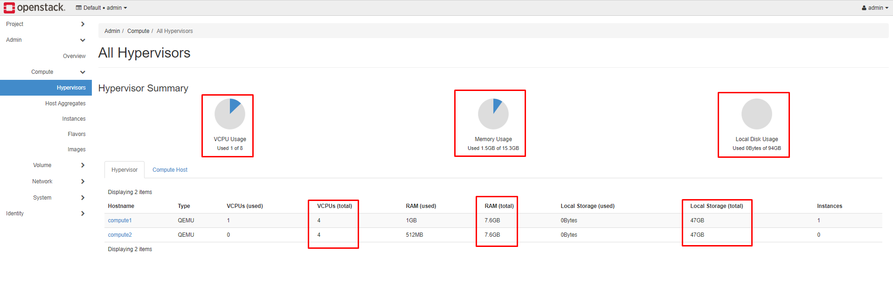

# Overcommit RAM & CPU

## Khái niệm

OpenStack cho phép ta khai báo vượt quá CPU và RAM trên các node Compute. Điều này có thể giúp tăng số lượng instance có thể chạy trên cloud

Mặc định, compute service cho phép tỉ lệ sau:
- **CPU:** 16:1
- **RAM:** 1.5:1

Công thức tính số lượng các máy ảo trên compute node là **(ORxPC)/VC**, trong đó:
- **OR**: CPU overcommit ratio (virtual cores tương ứng với mỗi physical core)
- **PC**: Số physical cores
- **VC**: Số virtual cores mỗi instance

## Cấu hình

Cấu hình chỉ số ratio cho CPU và RAM ở file ```/etc/nova/nova.conf``` trên node **Controller**

```sh
[DEFAULT]
cpu_allocation_ratio = 0.0
ram_allocation_ratio = 0.0
disk_allocation_ratio = 0.0
```

Nếu ta để ratio là 0.0 thì chỉ số ratio mặc định của cpu, ram, disk là ```16.0```, ```1.5```, ```1.0```

Sau khi cấu hình, restart lại dịch vụ của nova

```sh
systemctl restart openstack-nova-api
systemctl restart openstack-nova-scheduler
systemctl restart openstack-nova-novncproxy
systemctl restart openstack-nova-conductor
```

**Lưu ý: Openstack chỉ hiển thị thông số tài nguyên thật, không hiển thị thông số tài nguyên ảo**



Thông số RAM và DISK sử dụng được sẽ ít hơn tổng RAM, DISK 1 chút

VD: Như hình trên, tổng RAM là 15.3GB thì sẽ sử dụng được tầm 15GB. Như vậy nếu chỉ ratio là 2 thì chỉ sử dụng được tầm 30GB