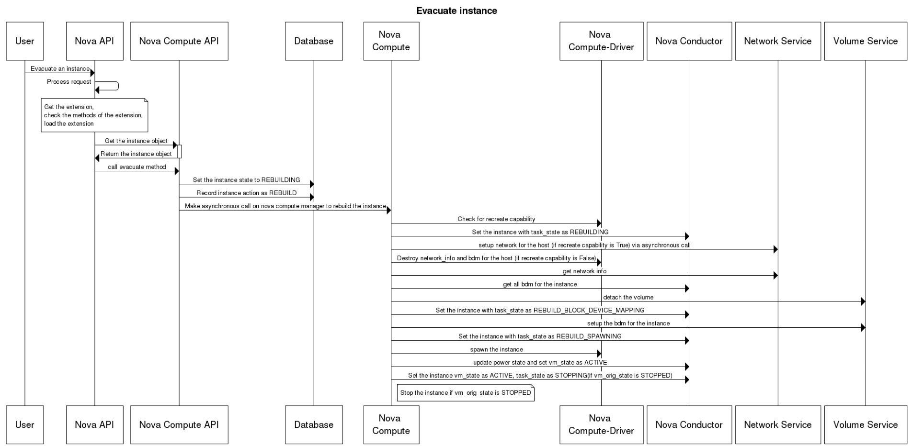

# Evacuate - Rebuild máy ảo trong trường hợp Compute bị chết

## I. Giới thiệu

Evacuation là một kỹ thuật được dùng để chuyển máy ảo từ 1 node compute đã chết hoặc bị tắt sang 1 node compute khác ở trong cùng 1 môi trường. Vì thế nó chỉ có tác dụng khi máy ảo sử dụng shared storage hoặc block storage bởi nếu không thì ổ cứng của máy ảo sẽ không thể được truy cập từ bên ngoài trong trường hợp host bị chết. Trong trường hợp rebuild máy ảo được boot từ local sử dụng ephemeral disk thì một máy mới sẽ được tạo mang cùng thông số của máy ảo cũ (IP, ID, flavor,...) nhưng ổ đĩa lúc này đã mất đồng nghĩa với việc dữ liệu cũng không còn nữa.

Evacuation cho phép người dùng lựa chọn host mới, nếu không thì host sẽ được lựa chọn bởi scheduler

Lưu ý rằng bạn chỉ có thể evacuate máy ảo khi host đã bị tắt.

Một số kỹ thuật khác được dùng để vận chuyển máy ảo:
- Tạo một bản copy của máy ảo cho mục đích backup hoặc copy nó tới môi trường / hệ thống mới, sử dụng snapshot (nova image-create)
- Di chuyển máy ảo ở trạng thái static tới host trên cùng 1 môi trường / hệ thống, sử dụng cold migrate (nova migrate)
- Di chuyển máy ảo ở trạng thái đang chạy tới host mới trên cùng 1 môi trường/hệ thống, sử dụng live migrate (nova live-migration)

## II. Workflow khi evacuate máy ảo



1. User gửi yêu cầu evacuate máy ảo tới Nova API

2. Nova API tiếp nhận yêu cầu, kiểm tra các tùy chọn

3. Nova API gửi yêu cầu lấy instance object tới Nova Compute API, sau khi lấy được, nó sẽ gọi tới phương thức evacuate

4. Nova Compute API đặt trạng thái cho máy ảo là ```rebuilding``` và ghi lại ```action``` của máy ảo là ```rebuild``` vào database

5. Nova Compute API yêu cầu Nova compute manager tạo lại máy ảo

6. Nova compute check lại tài nguyên

7. Nova Compute đặt trạng thái instance là ```rebuilding``` trong database thông qua nova conductor

8. Nếu capacity ok thì nó sẽ bắt đầu yêu cầu neutron setup network cho máy ảo. Trường hợp capacity không ok thì những thông tin về network và block device mapping (bdm) sẽ bị xóa bởi nova-compute driver

9. Nova compute lấy network info từ network service

10. Nova compute lấy tất cả các thông tin của bdm thông qua nova conductor

11. Sau khi có được thông tin, nó sẽ yêu cầu volume service gỡ volume ra khỏi máy ảo cũ

12. Nova compute sau đó thiết lập trạng thái ```REBUILD_BLOCK_DEVICE_MAPPING``` cho máy ảo thông qua nova conductor

13. Nova compute yêu cầu thiết lập bdm cho máy ảo mới

14. Trạng thái của máy ảo bắt đầu được chuyển thành ```REBUILD_SPAWNING```

15. Cùng lúc đó, nova compute yêu cầu nova compute driver spawn máy ảo với những thông tin đã có sẵn

16. Trạng thái của máy ảo chuyển thành ```ACTIVE```

## III. Sự khác biệt giữa evacuate, migrate, và live-migrate

|Evacuate|Migrate|Live-migrate|
|:-|:-|:-|
|Rebuild máy ảo đang ở trên 1 compute node sang một compute node **đã down** khác|Rebuild máy ảo đang ở trên 1 compute node **đang chạy** sang 1 compute node khác|Di chuyển máy ảo tới một compute node khác mà không có downtime (hoặc downtime không đáng kể)|

## IV. Hướng dẫn evacuate một máy ảo

Câu lệnh:

```sh
nova evacuate [--password pass] [--on-shared-storage] instance_name [target_host]
```

Trong đó:
- ```--password pass```: admin password cho instance sau khi evacuate (không thể sử dụng nếu đi kèm tùy chọn ```--on-shared-storage```). Nếu password không được chỉ định, một random password sẽ được generate sau khi quá trình evacuate kết thúc
- ```--on-shared-storage```: tất cả mọi file của máy ảo đều ở trên shared storage
- ```instance_name```: tên máy ảo cần evacuate
- ```target_host```: host chứa máy ảo sau khi rebuild, nếu không lựa chọn thì scheduler sẽ làm nhiệm vụ này