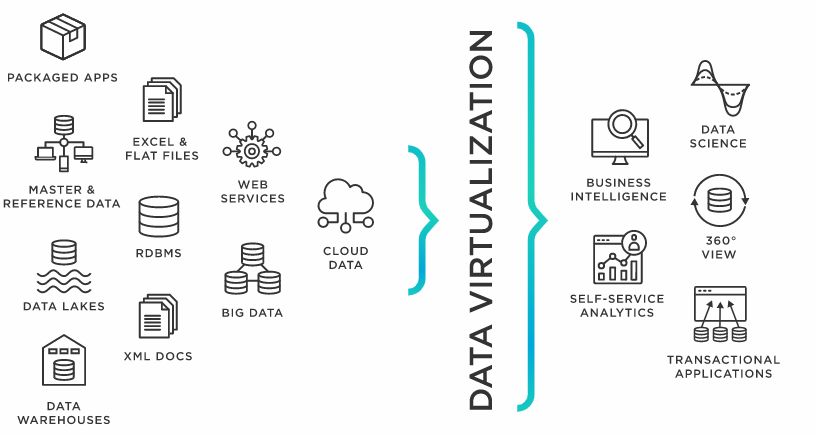
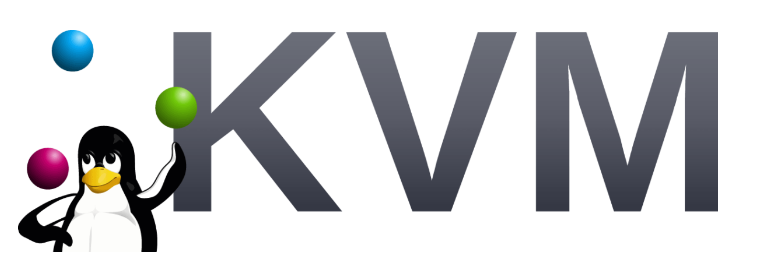
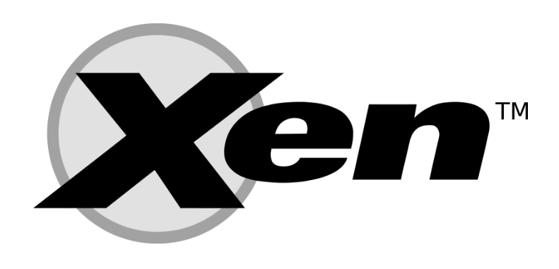

# Phần 1: Tổng quan về ảo hóa

## I. Ảo hóa là gì?

### 1. Khái niệm

Ngày nay, việc quản lý và sử dụng hạ tầng công nghệ thông tin là điều rất cần thiết với bất kỳ một doanh nghiệp nào. Tuy nhiên, việc sử dụng những phương pháp hay công nghệ cũ mang lại nhiều hạn chế khác nhau như:
- Mỗi máy chủ vật lý chỉ tương ứng cài đặt phục vụ cho 1 mục đích doanh nghiệp
- Việc đầu tư nhiều máy chủ nhưng không tận dụng hết năng lực của chúng dẫn đến phí phạm tài nguyên và từ đó công việc quản lý cũng trở nên khó khăn
- Các máy chủ vật lý được cài đặt trực tiếp hệ điều hành và ứng dụng gặp khó khăn trong việc sao lưu và phục hồi, thậm chí 1 số máy chủ vật lý đang hoạt động có những cơ chế đặc thù và gần như rất khó hoặc không thể thực hiện công việc trên
- Thời gian downtime của máy chủ vật lý thường rất lâu và dễ gặp trục trặc trong quá trình khởi động lại
- Khó khăn trong việc quản trị và giám sát tập trung khi số lượng máy chủ vật lý tăng lên

Công nghệ ảo hóa ra đời nhằm khai thác triệt để khả năng làm việc của 1 máy chủ vật lý. Ảo hóa cho phép vận hành nhiều máy ảo trên cùng 1 máy vật lý, dùng chung các tài nguyên của host như CPU, RAM, disk,... và nhiều tài nguyên khác. Các máy ảo khác nhau có thể sử dụng các hệ điều hành và ứng dụng khác nhau, từ đó tạo sự linh hoạt trong việc khai thác tài nguyên máy chủ.

Công nghệ ảo hóa cho phép hợp nhất và chạy nhiều khối lượng công việc như các máy ảo trên cùng 1 máy tính duy nhất. Một máy ảo là 1 máy tính được tạo ra bởi phần mềm, giống như 1 máy vật lý, chạy 1 hệ điều hành và các ứng dụng. Mỗi máy ảo có phần cứng ảo riêng của nó, bao gồm 1 CPU, bộ nhớ và card mạng ảo, giống như phần cứng cho hệ điều hành và ứng dụng.

Ví dụ, chúng ta có 3 máy chủ vật lý với những mục đích ứng dụng khác nhau. 1 cho email server, 1 web server, và máy chủ còn lại để chạy các ứng dụng cũ nội bộ của doanh nghiệp. Mỗi máy ta giả định sử dụng vào khoảng 30% tổng tài nguyên. Nhưng dù cho các ứng dụng này đã cũ, chúng vẫn quan trọng cho việc vận hành nội bộ, ta buộc phải giữ chúng cũng như máy chủ thứ 3 này.

Trên thực tế, rõ ràng việc sử dụng phương pháp truyền thống sẽ đơn giản và minh bạch hơn khi mỗi công việc chạy trên mỗi máy chủ khác nhau: 1 máy chủ, 1 hệ điều hành, 1 công việc. Với ảo hóa, ta có thể chia mail server thành 2 máy chủ riêng biệt và xử lý những công việc khác nhau. Nhờ đó, các ứng dụng vận hành nội bộ có thể chuyển qua cùng 1 server vật lý với máy chủ email, giúp tối ưu hóa chi phí vận hành.

### 2. Cách thức hoạt động

Các tài nguyên vật lý từ những môi trường ảo được phân chia bởi phần mềm gọi là **Hypervisors**. Hypervisors có thể đứng trên cùng của 1 hệ điều hành (như laptop) hay được cài đặt trực tiếp vào phần cứng (như server), đây cũng là cách mà các doanh nghiệp sử dụng ảo hóa. Hypervisors lấy các tài nguyên vật lý và chia chúng ra, nhờ đó mà môi trường ảo hóa có thể sử dụng những tài nguyên này.

Tài nguyên từ môi trường vật lý được phân chia nếu cần thiết đến những môi trường ảo. Người dùng từ đó tương tác và sử dụng tài nguyên bên trong môi trường ảo (thường được gọi là *máy khách* hay *máy ảo*). Máy ảo hoạt động như một tệp dữ liệu riêng lẻ và giống như bao tệp kỹ thuật số khác, chúng có thể di chuyển từ máy này sang máy khác, mở ra, và hoạt động như bình thường.

Khi môi trường ảo đang chạy và 1 người dùng hoặc chương trình đưa ra lệnh yêu cầu thêm tài nguyên từ môi trường vật lý, hypervisor chuyển tiếp yêu cầu đến hệ thống vật lý và lưu trữ các thay đổi. Tất cả những điều này được diễn ra gần với tốc độ thực tế (đặc biệt nếu yêu cầu được gửi thông qua một hypervisor mã nguồn mở như KVM hay máy ảo dựa trên kernel)

**Hypervisor/VMM (Virtual Machine Monitor)**

Hypervisor hay còn gọi là phần mềm giám sát máy ảo: là 1 chương trình phần mềm quản lý 1 hoặc nhiều máy ảo (VM). Nó được sử dụng để tạo, khởi động, dừng và reset các máy ảo. Các hypervisor cho phép mỗi VM hoặc Guest truy cập vào lớp tài nguyên phần cứng vật lý như CPU, RAM, storage. Nó cũng có thể giới hạn số lượng tài nguyên hệ thống mà mỗi máy ảo có thể sử dụng để đảm bảo cho nhiều máy ảo cùng sử dụng đồng thời trên cùng 1 hệ thống.

Hypervisor tạo nên 1 nền tảng ảo hóa (virtual platform) trên máy chủ, và dựa trên đó các máy ảo hoạt động và được quản lý.

Hypervisor có 2 loại chính là:
- **Dedicated virtualization:** (Bare-Metal Hypervisor) với loại này, hypervisor sẽ tương tác trực tiếp với phần cứng máy chủ để quản lý, phân phối và cấp phát tài nguyên. Loại ảo hóa này bao gồm các giải pháp như VMware ESXi, Microsoft Hyper-V, Xen Server, KVM.
- **Hosted Architecture:** đây là loại ảo hóa hypervisor giao tiếp với phần cứng thông qua hệ điều hành. Hypervisor lúc này được xem như 1 ứng dụng của hệ điều hành và các phương thức quản lý, cấp phát tài nguyên đều phải thông qua hệ điều hành. Loại ảo hóa này bao gồm các giải pháp như: VMware WorkStation, Oracle VirtualBox, Microsoft Virtual PC,....

Với loại thứ 1, hypervisor tương tác trực tiếp với phần cứng nên việc quản lý và phân phối tài nguyên được tối ưu và hiệu quả hơn so với loại 2, vì vậy trên thực tế, ảo hóa loại 1 được sử dụng cho mục đích doanh nghiệp, còn loại 2 sử dụng trong các trường hợp thử nghiệm hoặc học tập.

### 3. Các loại ảo hóa

#### a. Ảo hóa dữ liệu

Những dữ liệu phân tán từ nhiều nguồn có thể được kết hợp thành 1 nguồn duy nhất. Ảo hóa dữ liệu cho phép các công ty coi dữ liệu như 1 tài nguyên động - cung cấp khả năng xử lý giúp hợp nhất các dữ liệu từ nhiều nguồn và chuyển biến đổi chúng theo nhu cầu của người dùng.

Các công cụ ảo hóa dữ liệu đứng ở trước các nguồn dữ liệu và cho phép chúng coi dữ liệu như một nguồn duy nhất, vận chuyển những dữ liệu cần thiết (ở dạng yêu cầu) đến bất kỳ người dùng hay ứng nào vào đúng thời điểm

#### b. Ảo hóa máy tính

Ảo hóa máy tính để bàn cho phép 1 quản trị viên đứng ở trung tâm và tự động hóa triển khai môi trường máy tính giả lập đến hàng loạt máy vật lý cùng 1 thời điểm. 

Không giống như các môi trường máy tính truyền thống, thứ mà được cài đặt lên phần cứng, thiết lập, và cập nhật trên từng máy tính riêng biệt. Desktop virtualization cho phép quản trị viên thực hiện thiết lập, cập nhật, kiểm tra bảo mật đồng loại trên toàn bộ desktop.

#### c. Ảo hóa máy chủ

Máy chủ là máy tính được thiết kế để thực thi một lượng lớn các công việc đặc thù, nhờ đó mà các máy tính như laptop hay desktop có thể thực hiện các tác vụ khác. Ảo hóa máy chủ khiến nó còn thực hiện được nhiều chức năng hơn nữa bằng cách phân chia nó ra thành các thành phần để phục vụ các chức năng khác nhau.

**Đây là loại ảo hóa được đề cập và triển khai trong đề tài này**.

#### d. Ảo hóa hệ điều hành

Ảo hóa hệ điều hành được thực hiện ở kernel (trung tâm quản lý tác vụ của hệ điều hành). Việc sử dụng song song Linux và Windows trên cùng 1 máy vật lý có thể đem lại nhiều lợi ích. Doanh có thể đưa hệ điều hành và nhiều máy tính để:
- Giảm đồng loạt chi phí về phần cứng do máy tính không yêu cầu về khả năng xử lý quá cao
- Tăng cường bảo mật, khi tất cả các máy ảo đều có thể theo dõi và cách ly
- Giảm thời gian bỏ ra để thực hiện các công việc liên quan đến IT như cập nhật phần mềm

#### e. Ảo hóa chức năng mạng

Ảo hóa chức năng mạng chia 1 những chức năng quan trọng của mạng ra (như directory service, file sharing, và thiết lập IP), nhờ đó chúng có thể được phân tán giữa nhiều môi trường. Một khi chức năng phần mềm được độc lập với máy tính vật lý chúng đang nằm trên, các chức năng đặc thù có thể được đóng gói lại với nhau và di chuyển cũng như cấp phát cho một môi trường mới. Ảo hóa mạng giảm số lượng các thành phần vật lý như switch, router, dây mạng hay hub chuyển.

## II. Tại sao nên sử dụng ảo hóa?

Có nhiều lý do khác nhau để các công ty hay tổ chức đầu tư vào ảo hóa ngay từ hôm nay, thế nhưng hãy giả sử rằng, tài chính là động lực lớn nhất để sử dụng ảo hóa. Vậy trong phần dưới đây sẽ là cái nhìn tổng quan về những lợi ích của ảo hóa xoay quanh vấn đề kể trên.

### 1. Tối ưu hóa tài nguyên

Tài nguyên máy tính cấp doanh nghiệp ngày nay rất mạnh mẽ và thường vượt quá nhu cầu sử dụng. Bằng việc ảo hóa phần cứng và phân chia từng thành phần dựa trên nhu cầu sử dụng thực sự của người dùng hay ứng dụng. Nhờ đó mà sức mạnh tính toán, dung lượng lưu trữ, và băng thông mạng có thể được sử dụng hiệu quả hơn. Máy tính sẽ không còn bị bỏ không hay hoạt động dưới khả năng của chúng nữa.

Máy ảo cung cấp cho những nhà phát triển phần mềm tính độc lập, hạn chế, những môi trường kiểm thử. Tốt hơn nhiều so với việc mua phần cứng vật lý mới, máy ảo có thể được tạo trên phần cứng có sẵn. Vì mỗi máy ảo là độc lập và cách biệt với toàn bộ các máy chủ còn lại, lập trình viên có thể chạy ứng dụng mà không lo lắng về việc ảnh hưởng đến các ứng dụng, hay thành phần bên ngoài nào ảnh hưởng đến việc thực thi code.

### 2. Sự hợp nhất

Việc sử dụng nhiều máy tính riêng lẻ cho một ứng dụng là rất phổ biến. Nếu một vài ứng dụng chỉ sử dụng một lượng nhỏ khả năng tính toán, quản trị viên có thể hợp nhất một vài máy tính lại thành 1 máy chủ chạy nhiều môi trường ảo. Với những tổ chứ sở hữu hàng trăm hay hàng ngàn máy chủ, việc gộp chúng lại có thể giảm thiểu nhiều tài nguyên như không gian, điện năng, chi phí làm mát,.... Điều này có nghĩa là chi phí vận hành sẽ giảm đáng kể nhờ sử dụng ít server hơn, ít không gian sàn và tủ rack hơn, kéo theo điện năng tiêu hao và chi phí xử lý khí thải carbon cũng giảm xuống

### 3. Tối ưu hóa uptime

Sự nhanh nhẹn là tổng hoà của việc thích nghi với thay đổi một cách nhanh chóng và linh hoạt. Ảo hóa mang đến những khả năng mới cho quản trị viên cơ sở dữ liệu, mang đến cho người dùng:
- Sự đảm bảo về thời gian uptime của server và ứng dụng. Sự phục hồi nhanh chóng nếu xảy ra lỗi quy mô lớn
- Triển khai máy ảo nhanh chóng hoặc thậm chí tăng tốc thông qua cài đặt template sẵn sàng
- Tính linh hoạt, tức là tài nguyên được cung cấp đến đúng nơi đúng thời điểm thay vì giữ chúng ở trạng tháng luôn bật
- Thiết lập lại môi trường điện toán đang chạy mà không làm ảnh hưởng đến người dùng

### 4. Tự động bảo vệ ứng dụng khỏi lỗi máy chủ

Ảo hóa máy chủ cung cấp cho phép ta có thể thực hiện những phương thức replication mà không phải đầu tư thêm phần cứng. Nói một cách đơn giản là khi một server, vì một lý do nào đó, không còn khả dụng nữa, khi đó một server khác với tài nguyên ứng dung/dịch vụ tưng tự sẽ được thay thế vào. Nhờ đó giảm thiểu sự gián đoạn dịch vụ. Nhìn chung có 2 điều cần chú ý:
- Khi 1 hệ thống không khả dụng, hệ thống khác sẽ thay thế
- Việc chạy các hệ thống trên cùng 1 phần cứng sẽ không hiệu quả bằng việc sử dụng nhiều phần cứng khác nhau do lỗi về mặt vật lý là hoàn toàn có thể xảy ra

### 5. Dễ dàng di chuyển dữ liệu nếu nhu cầu thay đổi

Sự di chuyển có ngĩa là chuyển dời môi trường của server này đến một server khác. Với hầu hết giải pháp ảo hóa thì việc này là khả thi, trong khi nếu sử dụng máy chủ vật lý thì việc di chuyển sẽ chỉ làm được nếu server cũ và mới có chung 1 cấu hình phần cứng và hệ điều hành. 

Sự di chuyển thường được sử dụng để tăng tính tin cậy và sẵn sàng: trong trường hợp phần cứng gặp vấn đề thì máy ảo có thể được di chuyển đến một phần cứng khác thay vì chịu downtime kéo dài. Điều này cũng hữu dụng khi máy ảo cần mở rộng vượt qua khả năng của phần cứng vật lý, và ta buộc phải thay bằng một phần cứng khác tốt hơn

### 6. Bảo vệ sự đầu tư vào những hệ thống cũ

Phần cứng máy chủ sẽ dần dần trở nên lỗi thời, và chuyển từ hệ thống này đến hệ thống khác có thể có những hạn chế nhất định. Để tiếp tục cung cấp dịch vụ hoạt động trên các hệ thống cũ, ta có thể chạy nó như một máy ảo trên phần cứng mới, hiện đại trong khi dịch vụ thì vẫn hoạt động tương tự.

Từ góc nhìn của một ứng dụng, không có gì thay đổi. Trên thực tế, hiệu suất của nó có thể sẽ tốt hơn nhờ phần cứng mới đáng tin cậy hơn. Điều này cho phép tổ chức có thời gian để chuyển đổi đến những tiến trình mới mà không phải lo lắng về vấn đề phần cứng, đặc biệt trong trường hợp nhà sản xuất các thiết bị cũ không còn hoạt động hoặc không thể sửa chữa phần cứng bị hỏng.

## II. Đôi nét về quá trình phát triển của ảo hóa

Quá trình phát triển của ảo hóa đã trải qua nhiều giai đoạn từ những năm đầu tiên của ngành công nghệp máy tính. Một số những bước phát triển chính của ảo hóa có thể liệt kê như:

**1. 1960s: Sự khởi đầu của ảo hóa**

Quá trình phát triển của ảo hóa bắt đầu vào những năm 1960, khi các nhà nghiên cứu tại IBM phát triển ra hệ thống ảo hóa Time-Sharing Option (TSO) và máy chủ ảo CP/CMS. Mục tiêu của việc phát triển những công nghệ này là để tận dụng hiệu quả hơn tài nguyên máy tính và cho phép nhiều người dùng sử dụng cùng một hệ thống.

**2. 1970s và 1980s: Ảo hóa phần cứng**

Trong giai đoạn này, các công ty như Digital Equipment Corporation (DEC) và Intel bắt đầu phát triển các hệ thống ảo hóa phần cứng. Điều này cho phép một máy chủ vật lý chạy nhiều hệ điều hành khác nhau song song, giúp tăng hiệu suất và giảm chi phí.

**3. 1990s: Ảo hóa phần mềm**

Trong thập niên 1990, VMware được thành lập và trở thành công ty tiên phong trong lĩnh vực ảo hóa phần mềm. Họ phát triển ra sản phẩm đầu tiên là VMware Workstation, cho phép người dùng chạy nhiều hệ điều hành khác nhau trên một máy tính cá nhân.

**4. 2000s: Ảo hóa máy chủ và điện toán đám mây**

Trong thập niên 2000, ảo hóa máy chủ trở nên phổ biến hơn, giúp tăng cường hiệu suất, tính linh hoạt và giảm chi phí cho các doanh nghiệp. Công nghệ này cũng là nền tảng cho sự ra đời của điện toán đám mây, với các dịch vụ như Amazon Web Services (AWS), Google Cloud Platform và Microsoft Azure.

**5. 2010s: Ảo hóa hạ tầng và container** 

Trong thập niên 2010, xu hướng ảo hóa hạ tầng (Infrastructure as a Service - IaaS) và container (như Docker) bắt đầu phát triển mạnh mẽ. Container giúp ảo hóa ứng dụng và môi trường chạy, đem lại hiệu suất cao hơn so với ảo hóa máy chủ truyền thống.

**6. 2020s: Ảo hóa edge và ứng dụng trong AI**

Trong kỷ nguyên số, ảo hóa tiếp tục phát triển trong các môi trường edge computing và ứng dụng của trí tuệ nhân tạo (AI). Việc ảo hóa tài nguyên phần cứng và phần mềm giúp tận dụng tối đa hiệu năng và tính linh hoạt cho các ứng dụng AI.

## III. Các công nghệ ảo hóa phổ biến ngày nay

### 1. Hyper-V

Ra mắt năm 2008, Hyper-V là công nghệ ảo hóa của Microsoft trên các phiên bản Windows Server. Hyper-V là lựa chọn ảo hóa tốt nhất dành cho các máy ảo chạy Windows. Tuy nhiên bạn vẫn có thể cài đặt nhiều hệ điều hành khác trên nền tảng ảo hóa này.

Hyper-V được tích hợp sẵn trong Windows 10. Bạn chỉ cần kích hoạt thêm tính năng Hyper-V Role để biến máy tính thành 1 máy chủ Hyper-V

Ngoài ra, Hyper-V được đi kèm miễn phí cùng Windows Hyper-V Server 2019. Hyper-V cũng là nền tảng ảo hóa cốt lõi của dịch vụ Azure Cloud của Microsoft

### 2. KVM

KVM (Kernel-based Virtual Machine) là 1 công nghệ ảo hóa mã nguồn mở được phát triển bởi Red Hat. Nó được tích hợp vào Linux kernel 2.6.20 từ năm 2007 và nhanh chóng phát triển thành nền tảng ảo hóa mã nguồn mở được sử dụng phổ biến nhất hiện nay

Do được tích hợp sẵn vào nhân Linux, bạn có thể sử dụng KVM trên mọi hệ điều hành Linux phổ biến như: Ubuntu, Debian, CentOS,... Tuy nhiên, để tiện việc thiết lập và quản lý máy ảo, đa số mọi người dùng sẽ sử dụng **Proxmox** - hđh thuộc nhánh Debian được tối ưu cho ảo hóa

KVM là sự lựa chọn của các công ty cung cấp dịch vụ Cloud VPS lớn như Google Compute Engine, Vultr, Linode, DigitalOcean, OVH,...

### 3. Xen

Xen là công nghệ ảo hóa Hypervisor Type-1 được phát triển từ năm 2003 bởi Computer Laboratory của đại học Cambridge - Hoa Kỳ. Từ 2013, Xen được phát triển bởi Linux Foundation với sự hỗ trợ từ Amazon, AMD, Bromium, CA Technologies, Calxeda, Cisco, Citrix, Google, Intel, Oracle, Samsung và Verizon

Hiện tại, Xen được chia thành 2 phân nhánh:
- **Citrix Hypervisor:** phát triển bởi Citrix - công ty đã mua Xen Source từ năm 2007, và ra mắt Xen Server. Tháng 12/2017, Citrix thay đổi chính sách bản quyền, loại bỏ các tính năng cao cấp ra khỏi bản miễn phí của Xen Server, đồng thời không mở mã nguồn cho các tính năng mới
- **XCP-ng:** (Xen Cloud Platform - New Generation) là dự án mã nguồn mở miễn phí được phát triển bởi Vates (1 startup đến từ Pháp) dựa trên mã nguồn của Xen Server 7.3. XCP-ng mang đến những tính năng mà Citrix đã loại bỏ khỏi bản miễn phí, mang đến giải pháp ảo hóa Xen mã nguồn mở không bị giới hạn bởi bản quyền và tính năng cho cộng đồng

Xen là công nghệ ảo hóa được AWS (Amazon Web Services) và Alibaba Cloud lựa chọn

### 4. VMware vSphere

vSphere là nền tảng ảo hóa của VMware - công ty lớn nhất và nổi tiếng nhất trong thế giới ảo hóa. vSphere là 1 bộ sản phẩm gồm nhiều tính năng giúp xây dựng và quản lý hạ tầng ảo hóa dành cho doanh nghiệp: ESXi hypervisor, vCompute, vCenter, vStorage, vNetwork,... Nó là nền tảng ảo hóa được sử dụng phổ biến nhất thế giới

Thành phần cốt lõi của vSphere là ESXi hypervisor - được cài đặt trực tiếp lên máy chủ vật lý để thiết lập máy ảo. ESXi có thể được dùng thử trong 60 ngày với đầy đủ tính năng. Sau thời gian này, bạn cần phải nhập key miễn phí để tiếp tục sử dụng, nhưng sẽ bị hạn chế tính năng

VMware vSphere là sự lựa chọn hàng đầu của các doanh nghiệp nhờ vào khả năng triển khai nhanh chóng, sự ổn định, tên tuổi của VMware và đội ngũ hỗ trợ chuyên nghiệp

### 5. Docker

Docker là nền tảng phần mềm cho phép bạn dựng, kiểm thử và triển khai ứng dụng một cách nhanh chóng. Docker đóng gói phần mềm vào các đơn vị tiêu chuẩn hóa được gọi là container, nó có mọi thứ mà phần mềm cần để chạy, trong đó có thư viện, công cụ hệ thống, mã và thời gian chạy. Bằng cách sử dụng Docker, ta có thể nhanh chóng triển khai và thay đổi quy mô ứng dụng vào bất kỳ môi trường nào và biết chắc rằng mã của ta sẽ chạy được.

Docker cũng hợp tác với AWS, GCP và nhiều nhà cung cấp dịch vụ điện toán đám mây khác để nhanh chóng đưa ứng dụng hiện đại lên đám mây. Sự hợp tác này giúp nhà phát triển sử dụng Docker Compose và Docker Desktop để tận dùng cùng một quy trình làm việc cục bộ mà họ sử dụng ngày nay để triển khai các ứng dụng trên Amazon ECS và AWS Fargate một cách liền mạch.

### 6. Kubernetes

Kubernetes hay K8s là một nền tảng điều phối container mã nguồn mở. Ta có thể dùng Kubernetes để tự động hóa nhiều quy trình thủ công liên quan đến việc deploy, quản lý và mở rộng các ứng dụng trong container. Nói cách khác, ta có thể tập hợp các nhóm host đang chạy Linux container với nhau. Từ đó, Kubernetes có thể giúp dễ dàng quản lý các nhóm đó một cách hiệu quả nhất.

Ngoài ra, cluster Kubernetes có thể mở rộng các host trên các cloud tại chỗ public, private hay hybrid. Do đó, Kubernetes là một nền tảng lý tưởng để host các ứng dụng cloud-native yêu cầu khả năng mở rộng nhanh chóng. Chẳng hạn như truyền dữ liệu theo thời gian thực thông qua Apache Kafka.

Ban đầu, Kubernetes được phát triển và thiết kế bởi các kỹ sư tại Google. Do đó, Google chính là một trong những người đóng góp đầu tiên cho công nghệ container của Linux. Đây cũng chính là công nghệ đằng sau các dịch vụ cloud của Google. Tính đến nay, Google tạo ra đến hơn 2 tỷ container mỗi tuần. Tất cả đều được cung cấp bởi nền tảng nội bộ Borg - tiền thân của K8s.

