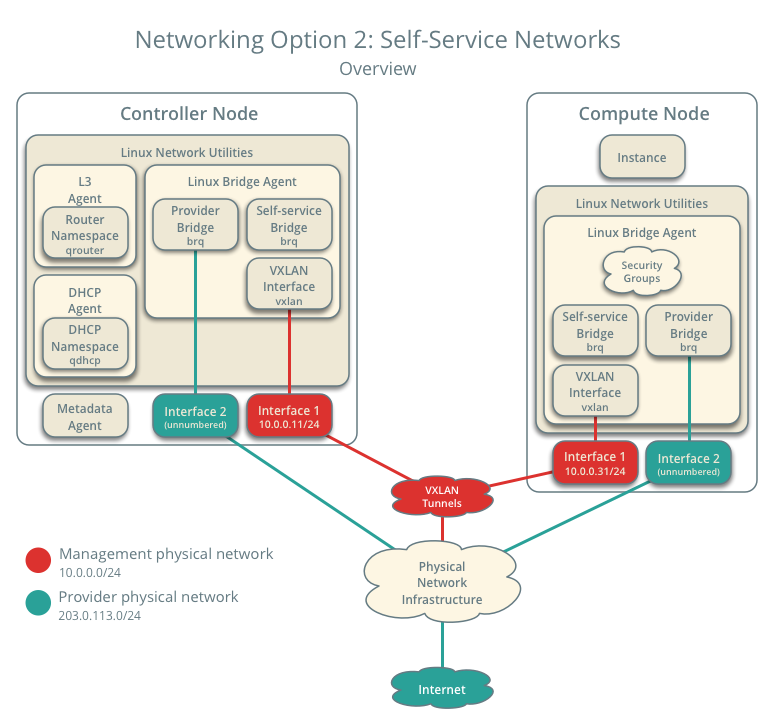

# Mô tả hệ thống OpenStack

Trong bối cảnh cuocj cách mạng công nghệ 4.0 đang dần phủ sóng với quy mô toàn cầu, các xu hướng công nghệ như trí tuệ nhân tạo (AI), Internet of Things (IOT), Big Data... đang dần chiếm lĩnh thị trường công nghệ thế giới. Các bài toán công nghệ dù có thể diễn giải theo nhiều cách khác nhau, nhưng chúng đều có một tham số chung: Điện toán đám mây.

Được hình thành từ năm 2010, OpenStack là một sản phẩm mã nguồn mở, dùng để triển khai Cloud Computing, bao gồm private cloud và public cloud. Tài liệu này cung cấp thông tin tổng quan về giải pháp OpenStack, các kiến trúc và thành phần bên trong OpenStack, đồng thời cung cấp cho người đọc các kiến thức cần thiết để xây dựng một hệ thống OpenStack cơ bản.

## I. Tổng quan

### 1. Openstack

OpenStack là một phần mềm mã nguồn mở cho phép bạn xây dựng hệ thống Cloud IaaS. OpenStack được thiết kế cho việc mở rộng, vì vậy bạn có thể dễ dàng thêm mới tài nguyên Compute và Storage cho hệ thống.

### 2. Đối tượng ngời đọc

Để có thể tham khảo tài liệu này một cách tốt nhất, người đọc cần chuẩn bị các kiến thức như:
- Làm quen với các hđh Unix-based như Ubuntu hay CentOS
- Người đọc cần nắm được các kiến thức về Linux cơ bản (lý thuyết và các câu lệnh thực hành), SQL database và ảo hóa
- Người đọc có thể cấu hình quản lý các máy Linux cho việc thiết lập networking cơ bản
- Người đọc có thể cài đặt và quản lý MySQL database, biết cách sử dụng câu lệnh truy vấn SQL cơ bản
- Các kiến thức liên quan đến network như DHCP, Linux bridge, VLANs, Iptables cũng cần thiết
- Ngoài ra độc giả cũng cần cấu hình network cơ bản cho router và switch để đáp ứng được yêu cầu cho hệ thống cloud OpenStack

### 3. Thông tin tham khảo 

Document OpenStack được cộng đồng OpenStack đóng góp tại trang [OpenStack Document](http://docs.openstack.org/)

OpenStack Operations Guild cung cấp kiến thức và hướng dẫn quan trọng để người đọc có thể cân nhắc về thiết kế cho hệ thống Cloud của mình. Bạn có thể tìm các thông tin về cách cài, cấu hình, hướng dẫn cho người dùng và thậm chí cả cách phát triển ứng dụng và contribute code của mình cho OpenStack

Kiến trúc nâng cao của OpenStack như kiến trúc về HA được đề cập chi tiết ở trang [OpenStack High Availability](https://docs.openstack.org/ha-guide/)

### 4. Kiến trúc phần mềm (Software architecture)

OpenStack được thiết kế để có thể mở rộng dễ dàng theo chiều ngang, cho phép tất cả các dịch vụ được phân tán rộng rãi. Tuy nhiên, để người đọc có thể dễ dàng tiếp cận, trong tài liệu này sẽ chỉ đề cập tới các dịch vụ trung tâm và quan trọng

|Function|Code Name|Description|
|Block Storage|Cinder|OpenStack Block Storage cung cấp việc lưu trữ dưới dạng block level cho các thiết bị lưu trữ. Hệ thống lưu trữ block quản lý việc tạo, attach và detach các thiết bị block tới server. Block storage volume được tích hợp sẵn với OpenStack Compute và Dashboard cho phép người dùng quản lý các lưu trữ riêng của họ|
|Compute|Nova|OpenStack cloud operating system, dịch vụ cung cấp việc phục vụ các tài nguyên theo nhu cầu bằng việc cung cấp và quản lý các máy ảo. Các tài nguyên compute được truy cập thông qua API cho các nhà phát triển hoặc người dùng, hoặc qua giao diện Web|
|Dashboard|Horizon|OpenStack Dashboard cung cấp cho người quản trị và người dùng một giao diện đồ họa để truy cập, cung ứng và tự động hóa các tài nguyên nằm trên cloud. Thiết kế mở rộng giúp việc kết hợp với các sản phẩm của bên thứ 3 dễ dàng hơn|
|Identity|Keystone|Identity service cung cấp xác thực cho người dùng khi muốn kết nối tới các dịch vụ OpenStack. Keystone đóng vai trò như hệ thống xác thực thông qua môi trường cloud và có thể tích hợp với các dịch vụ backend directory đã có sẵn|
|Networking|Neutron|Neutron cung cấp việc quản lý mạng và địa chỉ IP cho hệ thống OpenStack. Cũng giống như các hệ điều hành khác, Neutron có thể sử dụng bởi người quản trị và người dùng để làm tăng thêm giá trị tài nguyên vốn có của datacenter|
|Orchestration|Heat|OpenStack Orchestration giúp người quản trị tạo ra các template có sẵn, cho phép các nhà phát triển ứng dụng mô tả và tự động hóa việc triển khai hạ tầng. Yếu tố linh hoạt của template được thể hiện trong việc người dùng có thể chỉ định cấu hình compute, storage và networking cũng như mô tả chi tiết các hoạt động cần làm trước khi triển khai, mục tiêu là để tự động hoàn toàn việc cung cấp hạ tầng cũng như các ứng dụng và dịch vụ|
|Telemetry|Ceilometer|OpenStack Telemetry tính toán việc sử dụng dữ liệu và hiệu suất thông qua các service được triển khai trong OpenStack. Ceilometer giúp người quản trị có góc nhìn sâu hơn vào việc sử dụng metric bên trong hệ thống thông qua rất nhiều data point|
|Image Service|Glance|OpenStack Image Service cung cấp khả năng tìm kiếm, đăng ký và thu hồi virtual disk image. Image Service API server cung cấp giao diện REST chuẩn cho việc truy vấn thông tin về virtual disk image được lưu trữ tại các backend|

## II. Kiến trúc network trong OpenStack

### 1. Các thành phần và phân loại network

Đối với hệ thống Cloud được xây dựng với OpenStack, Networking là một dịch vụ độc lập thông thường được triển khai dưới dạng các process chạy trên một số node. Các process này tương tác với nhau và với các dịch vụ OpenStack khác. Process chính của dịch vụ OpenStack Networking là neutron-server, một Python daemon sử dụng OpenStack Networking  API và cho phép các tenant request tới các plugin phù hợp

Các thành phần OpenStack Networking:

|Component Name|Description|
|neuton-server|Dịch vụ này chạy trên network node cung cấp Networking API và các mở rộng. Neutron-server yêu cầu kết nối không trực tiếp tới một database bền vững. Điều này được thực hiện thông qua các plugin giao tiếp với database thông qua AMQP|
|plugin agent|Chạy trên mỗi node cumpute để quản lý cấu hình vswitch. Plugin này cho phép bạn chỉ định agent nào được chạy|
|DHCP agent|Cung cấp dịch vụ DHCP tới các tenant network. Dịch vụ này chịu trách nhiệm cho việc quản lý cấu hình DHCP|
|L3 agent|Cung cấp việc forwarding (L3/NAT) cho các VM trên tenant network ra bên ngoài|
|Network provider (SDN server/service)|Cung cấp các dịch vụ networking mở rộng tới tenant network. SDN service có thể tương tác với neutron-server, neutron-plugin, và các plugin-agent thông qua các kênh giao tiếp như REST APIs|

Với OpenStack Networking, có thể chia network traffic dựa theo các luồng làm việc như sau:
- **Management network:** Được dùng cho việc giao tiếp bên trong giữa các thành phần OpenStack. Các địa chỉ IP trong mạng này chỉ nên được dùng bên trong data center và được coi như là Management Security Domain
- **Guest network:** Được dùng cho việc giao tiếp dữ liệu VM bên trong hệ thống Cloud. Các yêu cầu về việc đánh địa chỉ IP của network này phụ thuộc vào OPS Networking plugin đang sử dụng và các lựa chọn cấu hình mạng của các virtual network được tạo bởi tenant. Network này được coi như là Guest Security Domain
- **External network:** Được sử dụng để cung cấp các VM được phép truy cập Internet trong một số ngữ cảnh triển khai;. Các địa chỉ IP trong network này có thể truy cập từ Internet. Network này được coi như là Public Security Domain
- **API network:** Phơi tất cả các OpenStack API, bao gồm cả OpenStack Networking API tới các tenant. Các địa chỉ IP trong mạng này có thể truy cập từ Internet. API network có thể cũng là External network và được coi như là Public Security Domain

### 2. Phân loại mô hình network khi triển khai

Trong thực tế, có thể phân loại mô hình network OpenStack thành 2 dạng:
- **Networking Option 1: Provider Network**

Với Provider network, một máy ảo sẽ sử dụng một provider (external) network mà kết nối tới hạ tầng mạng vật lý thông qua layer2 (bridging/switching). Network bao gồm DHCP server để cung cấp địa chỉ IP tới máy ảo

- **Network Option 2: Self-service Network**

Với network option 2, bạn có thể tạo một self-service (private) network, thông qua cơ chế NAT để kết nối tới hạ tầng mạng bên ngoài. Network bao gồm một DHCP server cung cấp địa chỉ IP cho các máy ảo. Một máy ảo trong mạng này có thể tự động truy cập các dải mạng bên ngoài như Internet. Tuy nhiên, để có thể truy cập tới mạng ngoài (như Internet) thì mỗi máy ảo cần có địa chỉ IP floating.

### 3. Các lớp mạng của OpenStack

**Mạng MGNT + API + Horizon**

Manament network (MGNT) là mạng được sử dụng cho việc giao tiếp nội bộ giữa các thành phần OpenStack.

API network là mạng được sử dụng để các tenant có thể truy xuất các dịch vụ của OpenStack thông qua các APIs của những dịch vụ đó. Mạng MGNT là mạng nội bộ của các máy controller và compute nên cần đảm bảo tính riêng tư.

Horizon network là dải mạng được dùng để truy cập vào GUI của OpenStack được cung cấp bởi dịch vụ Horizon. Thông qua dải mạng này, tenant có thể truy cập vào máy ảo thông qua giao diện của GUI bằng cách sử dụng VNC (virtual network computing)

**Mạng DataVM**

DataVM network là dải mạng nội bộ (private), được sinh ra với mục tiêu giúp các máy ảo trong cùng một project trong OpenStack có thể kết nối với nhau một cách riêng tư, phục vụ cho một số bài toán cluster cần một đường mạng riêng

**Mạng Storage**

Hay còn được gọi là mạng lưu trữ (storage network) cung cấp sự truy cập (access) tới các thiết bị lưu trữ sử dụng công nghệ lưu trữ tập trung như SAN, Ceph, LVM... Với OpenStack chúng ta sử dụng thành phần Cinder để giao tiếp với hệ thống share storage.

**Dải mạng Provider**

Dải mạng Provider cung cấp cho máy ảo các cách kết nối tới môi trường bên ngoài như FLAT, VLAN, VXLAN,...

Kiểu kết nối thông dụng nhất là VLAN. Hệ thống OpenStack có thể nhận được trực tiếp các VLAN được chia từ hạ tầng vật lý bên ngoài và cung cấp cho máy ảo.

Để nâng cao tốc độ của các máy VM, thì các server compute khuyến cáo sử dụng công nghệ bonding (gộp 2 interface), kết hợp với các cấu hình như EtherChannel phía switch, để tăng hiệu năng và tăng độ an toàn của hệ thống.