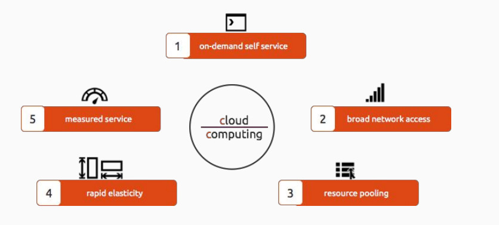
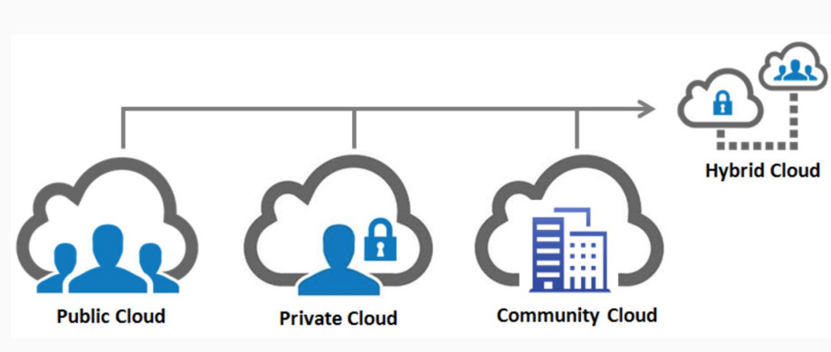
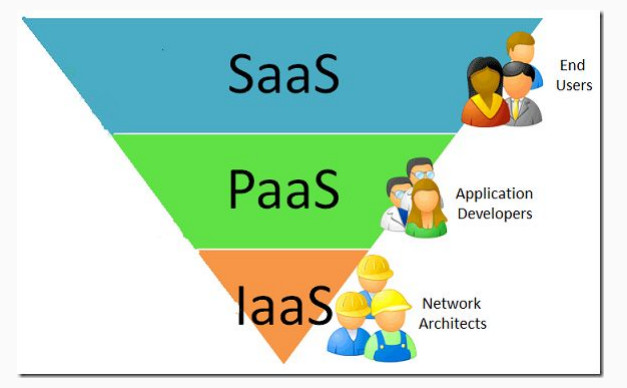
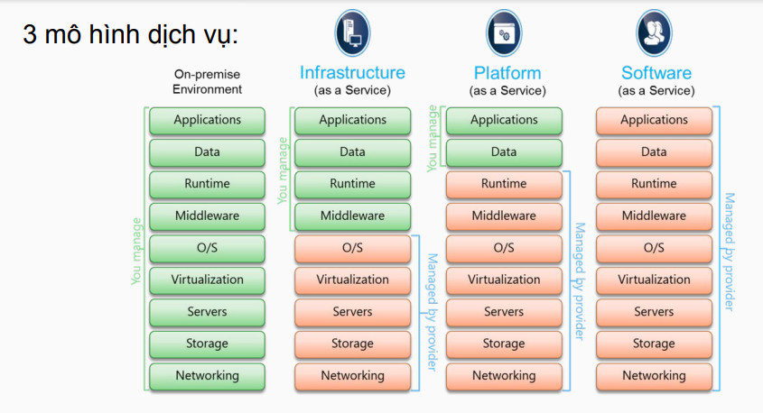
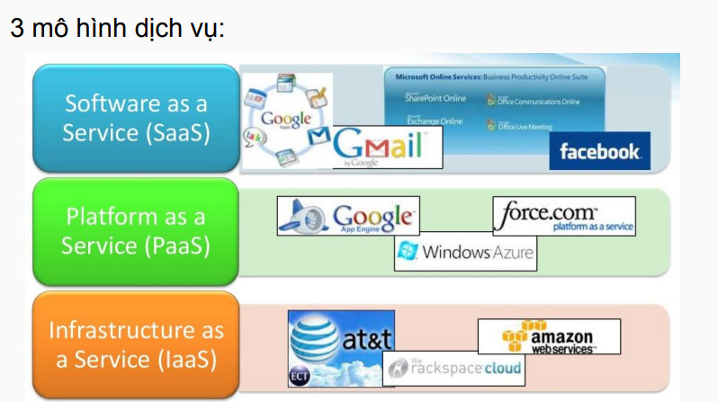
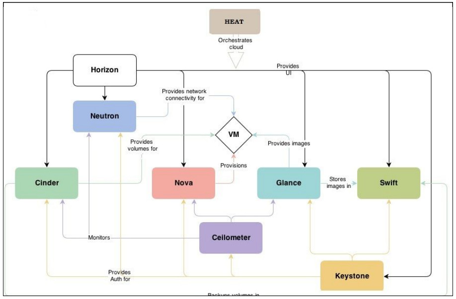
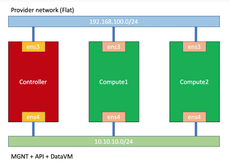

# Cloud Computing - OPS

## I. Cloud Computing

### 1. Khái niệm

Cloud computing là mô hình cho phép truy cập qua mạng để lựa chọn và sử dụng tài nguyên có thể tính toán (máy chủ lưu trữ, ứng dụng, dịch vụ) theo nhu cầu 1 cách thuận lợi và nhanh chóng. Đồng thời khi kết thúc dịch vụ sẽ giải phóng tài nguyên 1 cách dễ dàng, giảm thiểu giao tiếp với nhà cung cấp

### 2. Mô hình 5-4-3 (5 tính chất - 4 mô hình - 3 dịch vụ)

**a. 5 tính chất**

- **On-demand self service:** Dịch vụ điện toán đám mây cung cấp cho người dùng các tài nguyên bao gồm mạng, server, lưu trữ, dịch vụ,... Người dùng chủ động sử dụng mà không cần phụ thuộc vào nhà cung cấp
- **Broad network access:** Chỉ cần có internet, có thể truy cập tài khoản điện toán đám mây ở bất kỳ nơi nào
- **Resource pooling:** Là nền tảng của điện toán đám mây gồm các máy chủ vật lý và các trung tâm lưu trữ (data center). Là cơ sở hạ tầng để đảm bảo những khả năng hoạt động của điện toán đám mây.
- **Rapid elasticity:** Cho phép người dùng chủ động nâng cấp và/hoặc giảm tài nguyên sử dụng theo nhu cầu từng thời điểm. Chiều ngang có thể là mở rộng các node, trong khi chiều dọc là tăng tài nguyên ram/disk/cpu
- **Measured service:** Dịch vụ cloud có hệ thống ghi và báo cáo lưu lượng sử dụng của khách hàng. Nhờ đó khách hàng biết được chính xác lưu lượng đã sử dụng để có thể đưa ra phương án xử lý. Dịch vụ thanh toán theo thời gian sử dụng

**b. 4 mô hình triển khai**

- **Public Cloud:** Dùng các cá nhân hay tổ chức thuê sử dụng, dùng chung tài nguyên
- **Private Cloud:** Với mục đích dùng nội bộ cho 1 cơ quan hoặc 1 doanh nghiệp, không chia sẻ với người dùng bên ngoài
- **Community Cloud:** Được các công ty cùng hợp tác và xây dựng để cung cấp dịch vụ cho cộng đồng
- **Hybrid Cloud:** Là mô hình kết hợp giữa Public và Private Cloud

**c. 3 mô hình dịch vụ**

- **IaaS:** Là dịch vụ hạ tầng, cung cấp các máy ảo như một dịch vụ để người dùng có thể truy cập đến phần cứng như mạng máy tính. Nó cung cấp toàn bộ các tài nguyên cần thiết để vận hành hệ thống lưu trữ và chia sẻ như CPU, RAM, Disk (cung cấp tài nguyên và cho người sử dụng toàn quyền)
- **PaaS:** Là dịch vụ nền tảng, cung cấp API cho phát triển ứng dụng. Pass cung cấp môi trường thực thi lập trình, các hđh, CSDL, máy chủ web mà không cần bất kỳ thao tác tải hay cài đặt phần mềm
- **SaaS:** Là dịch vụ phần mềm giúp bạn dễ dàng truy cập đến nền tảng điện toán đám mây mà không cần quan tâm đến hạ tầng hay nền tảng nó đang sử dụng

## II. OpenStack

### 1. Khái niệm

OpenStack là nền tảng mã nguồn mở được phát triển dựa trên công nghệ điện toán đám mây. Bao gồm các thành phần có liên quan với nhau kiểm soát các nhóm phần cứng đa dạng, đa nhà cung cấp về tài nguyên xử lý, lưu trữ và kết nối mạng.

### 2. Kiến trúc logic của OpenStack

### 3. Các project cốt lõi của OpenStack

- Keystone
- Glance
- Neutron
- Nova
- Cinder
- Horizon

### 4. Xây dựng hệ thống OpenStack với mô hình 3 node

- 1 node controller
- 2 node compute

