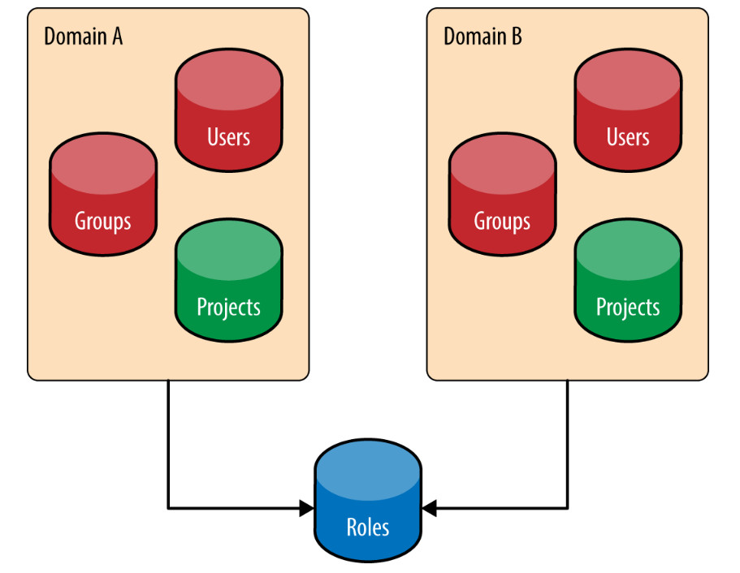
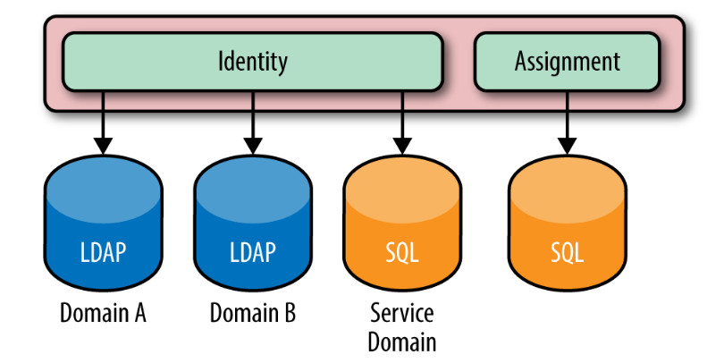
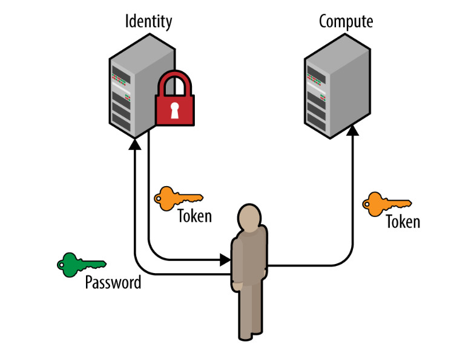
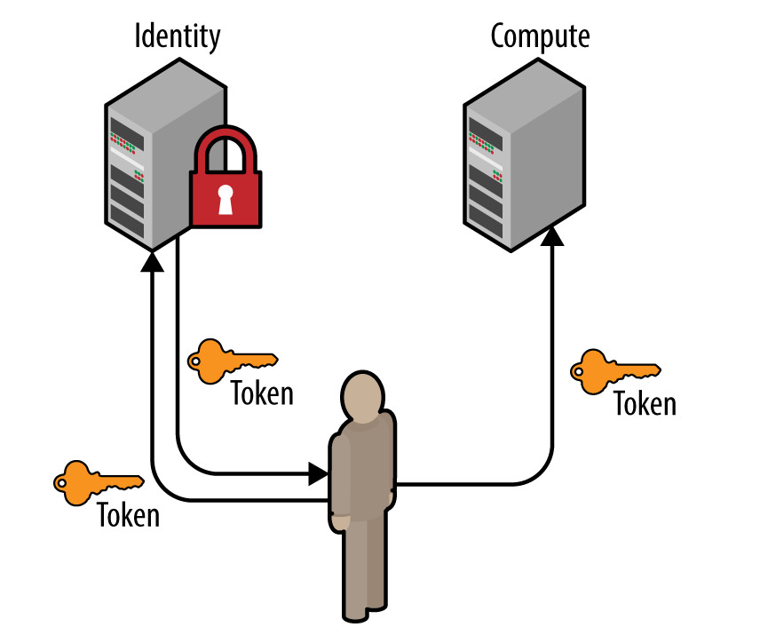
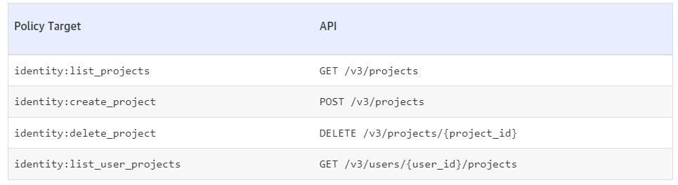
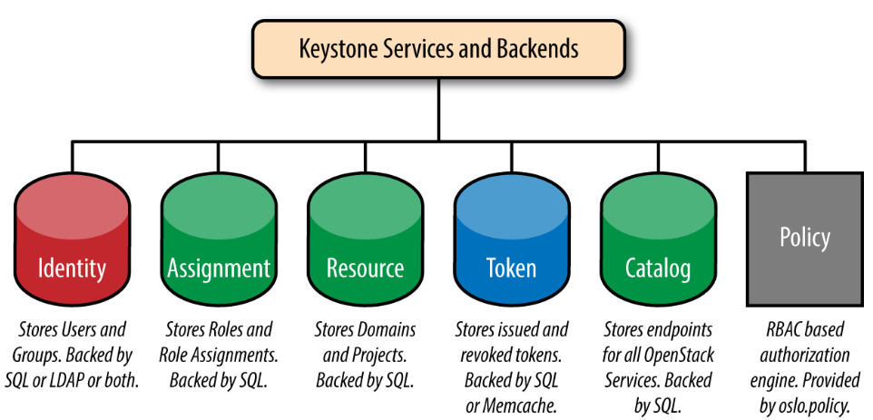
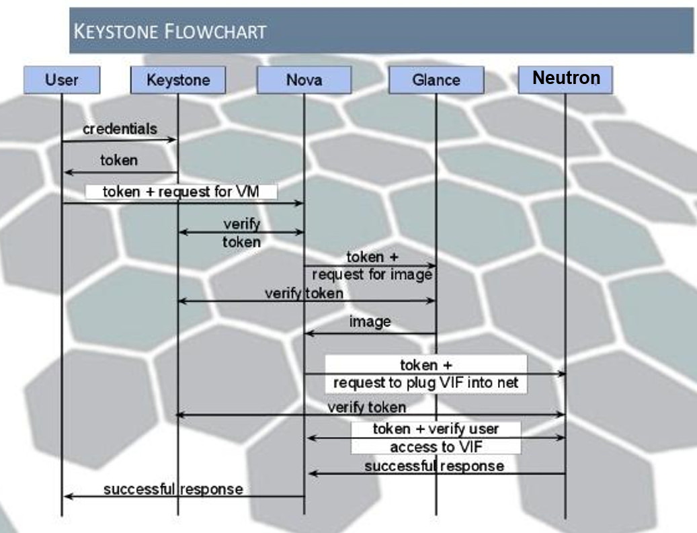

# Tổng quan về Keystone

## I. Khái niệm Keystone

Keystone là một OPS project cung cấp các dịch vụ Identity, Token, Catalog, Policy cho các dịch vụ khác trong OPS. 2 tính năng chính của Keystone:
- **User Management:** Keystone giúp xác thực tài khoản người dùng và chỉ định xem người dùng đó có quyền gì
- **Service Catalog:** Cung cấp 1 danh mục các dịch vụ sẵn sàng cùng với các API endpoint để truy cập các dịch vụ đó

## II. Một số khái niệm liên quan

- **Authentication:** Là quá trình xác minh danh tính của người dùng dựa trên thông tin đăng nhập của người đó (credential). Khi xác định được danh tính người dùng, Keystone cấp cho người đó 1 token xác thực, nhờ vậy mà người này có thể cung cấp token cho mỗi request sau này
- **Credentials:** Là thông tin để xác thực người dùng. Có thể là username, password, API key hay token được cung cấp
- **Domain:** Là 1 đối tượng APIv3 thuộc dịch vụ xác minh danh tính. Domains là 1 tập hợp của các project và người dùng mà định nghĩa danh giới cho việc quản lý các đối tượng xác minh. Domain có thể đại diện cho 1 cá nhân, tổ chức, hoặc 1 operator-owned space. Chúng expose administrative activies trực tiếp đến người dùng hệ thống. User có thể được cấp quyền quản trị cho 1 domain. 1 người quản trị domain có thể tạo projects, users và groups trong 1 domain và cấp quyền cho user và group trong domain đó
- **Endpoint:** 1 địa chỉ có thể truy cập được từ mạng bên ngoài, thường là 1 URL cho phép ta truy nhập 1 service. Nếu ta sử dụng 1 extension cho templates, ta có thể tạo 1 endpoint template mà đại diện cho template của tất cả consumable service mà khả dụng giữa nhiều region
- **Group:** 1 đối tượng APIv3 thuộc dịch vụ xác minh danh tính. Group là 1 tập hợp uer được sở hữu bởi 1 domain. 1 group role, được gán cho 1 domain hoặc project, áp dụng tất cả user trong group đó. Thêm hoặc xóa user vào hoặc khỏi 1 group sẽ cấp hoặc loại bỏ role và authentication của chúng đến domain hoặc project
- **OpenStackClient:** 1 CLI cho 1 vài dịch vụ OPS bao gồm Identity API. Ví dụ, 1 user có thể chạy lệnh ```openstack service create``` và ```openstack endpoint create``` để đăng ký các dịch vụ trong cụm OPS.
- **Project:** 1 container mà nhóm hoặc cô lập tài nguyên hoặc đối tượng identity. Phụ thuộc vào service operator, 1 project có thể ánh xạ đến 1 customer, account, organization, hoặc tenant
- **Region:** 1 đối tượng APIv3 cho dịch vụ xác minh danh tính. Đại diện 1 cho 1 bộ phận chung trong OpenStack. Ta có thể tổ chức 0 hoặc nhiều sub-regions để tạo thành 1 cấu trúc dạng cây hierarchy. Mặc dù 1 region không có ý nghĩa về mặt địa lý, 1 triển khai OPS có thể sử dụng tên địa lý cho 1 region, chẳng hạn như **us-east**
- **Role:** được định nghĩa là 1 tập các quyền và privileges để người dùng thực hiện các hành động đặc thù. 1 identity service đưa cho người dùng 1 token mà bao gồm 1 danh sách các roles. Khi người dùng gọi 1 service, service kiểm tra role của người dùng này và xác định những hành động hoặc tài nguyên mà người dùng có thể truy nhập
- **Service:** 1 OPS service, chẳng hạn như Compute (NOVA), Object Storage (Swift), hoặc Image service (Glance), mà cung cấp 1 hoặc nhiều endpoint để người dùng có thể truy nhập và thực hiện các operations
- **Token:** 1 xâu văn bản dạng chữ số mà enable access đến OpenStack APIs và resources. 1 token có thể được loại bỏ bất kỳ lúc nào và chỉ khả dụng trong khoảng thời gian có hạn. Trong khi OpenStack Identity hỗ trợ token-based authentication trong phiên bản này, nó vẫn sẽ hỗ trợ các giao thức mới nữa trong tương lai. Openstack Identity là 1 dịch vụ tích hợp mà không mong muốn trở thành 1 giải pháp lưu trữ và quản lý danh tính chính thức
- **User:** 1 đại diện dạng digital cho người dùng, hệ thống, hoặc dịch vụ mà sử dụng OPS cloud services. Indentity service xác thực rằng incoming request được tạo bởi người dùng mà đưa ra lệnh gọi đó. Users có 1 login và có thể truy nhập tài nguyên bằng cách sử dụng tokens được cấp. Users có thể được assigned trực tiếp vào 1 project cụ thể và behave như là họ là 1 phần của project đó

### 1. Users và User Groups (Actors)

Trong Keystone, User và User Groups là những đối tượng được cấp phép truy cập tới các nguồn tài nguyên được cô lập trong domains và projects

Users và Users Groups được gọi là **Actors**

Mối quan hệ giữa domains, projects, users và user groups được thể hiện trong ảnh sau:



### 2. Roles

Roles được dùng để thực hiện việc cấp phép trong keystone, một Actor có thể có nhiều Roles đối với từng project khác nhau

### 3. Assignment

Role Assignment là sự kết hợp của Actor, target và roles.

Role assignment được cấp phát, thu hồi và có thể được kế thừa giữa các users, groups, projects, và domains

### 4. Targets

Projects và Domains đều giống nhau ở chỗ cả 2 đều được role gán lên, vì thế chúng được gọi là **Targets**

### 5. Token

Để user truy cập bất kỳ OpenStack API nào thì user cần chứng minh họ là ai và ai được phép gọi tới API. Để làm được điều này, họ cần có token và gán chúng vào ```API call```. Keystone chính là service chịu trách nhiệm tạo ra tokens

Sau khi xác thực thành công bởi Keystone thì user sẽ được cấp token. Token sẽ chứa các thông tin ủy quyền của user trên cloud

```Token``` gồm có ```ID``` và ```Payload```. Phần ```ID``` là duy nhất trên cloud và phần ```Payload``` chứa dữ liệu về người dùng

### 6. Catalog

Chứa URLs và endpoints của các service khác nhau

Nếu không có Catalog, users và các ứng dụng sẽ không biết được nơi cần chuyển yêu cầu để tạo máy ảo hoặc lưu dữ liệu

Catalog được chia thành 1 danh sách các endpoints, mỗi 1 endpoint sẽ chứa admin URL, internal URL và public URL

## III. Identity service

**Identity service** (dịch vụ xác minh danh tính) trong Keystone cung cấp bởi các Actor. Nó có thể tới từ nhiều dịch vụ như SQL, LDAP, Federated Identity Providers

### 1. SQL

Keystone có tùy chọn cho phép lưu các Actor trong SQL. Nó hỗ trợ các database như MySQL, PostgreSQL, và DB2

Keystone lưu trữ các thông tin user, password, description

Các cấu hình của database được đề cập trong file config của keystone

Keystone hoạt động như 1 Identity Provider. Vì thế đây sẽ không phải là lựa chọn tốt nhất trong 1 vài trường hợp, nhất là đối với các khách hàng là doanh nghiệp

Ưu điểm:
- Dễ dàng thiết lập
- Quản lý user và group thông qua OPS APIs
Nhược điểm:
- Keystone không cấu hình SQL để làm một Identity Provider
- Hỗ trợ cả mật khẩu yếu (không lưu chuyển mật khẩu để xác thực được, không khôi phục mật khẩu được)
- Phải ghi nhớ username và password
- Hầu hết các doanh nghiệp đều không sử dụng cách này

### 2. LDAP

Keystone có tùy chọn truy xuất và lưu trữ actor trong Lightweight Directory Access Protocol (LDAP)

Keystone sẽ truy cập tới LDAP như các ứng dụng khác sử dụng LDAP (System Login, Email, Web App,...)

Các cài đặt để kết nối với LDAP được cấu hình trong file config ```keystone.conf```, các cài đặt này có những tùy chọn Keystone có thể ghi vào LDAP hay chỉ đọc dữ liệu từ LDAP

Trường hợp lý tưởng, LDAP chỉ thực hiện thao tác đọc, ví dụ như tìm kiếm users, groups và xác thực

Ưu điểm:
- Không cần duy trì các bản sao của tài khoản người dùng
- Keystone không cấu hình LDAP để trở thành Identity Provider
Nhược điểm:
- Các tài khoản dịch vụ vẫn cần phải được lưu trữ ở đâu đó và admin LDAP không muốn lưu trữ trong LDAP
- Keystone vẫn "thấy" mật khẩu người dùng vì mật khẩu nằm trong yêu cầu xác thực. Keystone chỉ chuyển tiếp yêu cầu này. Nhưng lý tưởng nhất là Keystone không bao giờ muốn xem mật khẩu người dùng

### 3. Multiple Backends

Hỗ trợ từ phiên bản Juno, với Identity API v3

Triển khai các backend riêng biệt cho mỗi domain Keystone. Trong đó các "default" domain sử dụng SQL backend để lưu trữ các service account (tài khoản của các dịch vụ khác trong OpenStack tương tác với Keystone)

LDAP backend bổ sung có thể được lưu trữ trên domain riêng của họ. Thông thường LDAP của hệ thống quản trị OpenStack khác với LDAP của từng công ty

LDAP thường bị hạn chế thường chỉ sử dụng cho thông tin nhân viên. Một lợi ích khác của việc phân chia hợp lý Identity backend và domain là ta có thể sử dụng nhiều LDAPs. Vì vậy trong trường hợp sáp nhập công ty hoặc các phòng ban có LDAPs khác nhau, 1 doanh nghiệp vẫn có thể được represent



Ưu điểm:
- Hỗ trợ hệ thống LDAPs cho nhiều tài khoản user, SQL lưu trữ service accounts, còn LDAP lưu thông tin
Nhược điểm:
- Cài đặt phức tạp
- Xác thực tài khoản người dùng trong phạm vi domain

### 4. Identity Providers

Kể từ bản phát hành Icehouse, Keystone có thể sử dụng xác thực có liên kết thông qua module Apache cho nhiều Identity Provider (nhà cung cấp dịch vụ xác thực) khác nhau

Những user này không được lưu trữ trong Keystone và được coi là tạm thời

Từ góc nhìn Keystone, các Identity provider được coi là tài nguyên lưu trữ danh tính, có thể là các hệ thống backends (LDAP, DA, MongoDB) hoặc các tài khoản mạng xã hội (Google, Facebook). Thông qua hệ thống Identity Manager các thuộc tính người dùng sẽ được chuyển sang định dạng giao thức nhận dạng liên kết tiêu chuẩn (SAML, OpenID Connect)

Ưu điểm:
- Có thể tận dụng cơ sở hạ tầng và phần mềm hiện có để có thể xác thực và truy xuất thông tin về người dùng
- Tách biệt hơn giữa Keystone và xử lý identity information
- Mở cửa cho những khả năng mới của lĩnh vực liên kết, như đăng nhập 1 lần (single sign-on) và hybrid cloud
- Keystone không thấy được mật khẩu của người dùng
- Identity provider xử lý hoàn toàn việc xác thực và không liên quan đến Keystone
Nhược điểm:
- Việc cài đặt các Identity sources rất phức tạp

### 5. Các use case sử dụng Identity Backends

|Identity|Use case|
|:-|:-|
|SQL|Sử dụng cho thử nghiệm hoặc phát triển OPS cho 1 nhóm nhỏ. Tài khoản dành riêng cho OPS (service user - nova, glance,...)|
|LDAP|Sử dụng trong môi trường doanh nghiệp. Chỉ sử dụng LDAP nếu có thể tạo các tài khoản dịch vụ cần thiết trong LDAP|
|Multiple Backends|Cách tiếp cận hợp lý cho hầu hết các doanh nghiệp. Sử dụng trong trường hợp LDAP không cho phép lưu service account|
|Identity Provider|Khi muốn sử dụng mô hình Federated Identity (nhận dạng liên kết). Sử dụng nếu các Identity provider đã có sẵn. Keystone không được phép truy cập LDAP. Không có LDAP Identity. Sử dụng nếu tương tác với LDAP được chuyển tới nền tảng cơ bản và Webserver|

## IV. Authentication

Có nhiều cách để xác thực với Keystone service, 2 cách phổ biến nhất là sử dụng mật khẩu và sử dụng token

### 1. Password

Sử dụng password là 1 cách phổ biến dùng để xác thực người dùng và dịch vụ

Payload bên dưới là 1 yêu cầu POST với Keystone:

```sh
{
    "auth": {
        "identity": {
            "methods": [
                "password"
            ],
            "password": {
                "user": {
                    "domain": {
                        "name": "example.com"
                    },
                    "name": "Joe",
                    "password": "secretsecret"
                }
            }
        },
        "scope": {
            "project": {
                "domain": {
                    "name": "example.com"
                },
                "name": "project-x"
            }
        }
    }
}
```

Trong payload của request chứa đủ các thông tin để xác định thông tin đó có tồn tại hay không, xác thực người dùng nếu người dùng tồn tại, thu thập danh mục các dịch vụ dựa trên các quyền hạn của user trên 1 phạm vi project

Trong phần user phải xác định thông tin domain của người dùng (domain name hoặc ID), trừ khi cung cấp ID là duy nhất và nó đủ nhận dạng người dùng. Điều này là do khi triển khai nhiều tên miền thì có thể có các user giống nhau

```scope``` là tùy chọn nhưng thường được sử dụng để thu thập các danh mục dịch vụ. Section xác định người dùng có quyền truy cập vào project hay không để từ đó có thể cho truy cập hoặc từ chối. Section này cần mang đủ thông tin để tìm ra nó, gồm thông tin về domain, bởi project có thể trùng tên giữa các domain khác nhau. Trường hợp được cung cấp ID project (unique) thì không cần thông tin domain



### 2. Token

Tương tự như password, ta có thể dùng ```token``` để xác thực người dùng và dịch vụ

User có thể yêu cầu cung cấp token mới bằng cách cung cấp token hiện tại. Token mới được cấp để thay cho token sắp hết hạn hoặc thay đổi token không có phạm vi thành token có phạm vi (domain, project) và roles với các token ban đầu



## V. Access Management và Authorization

Access Management và Authorization cho phép người dùng có thể sử dụng những APIs nào

Keystone tạo RBAC policy được thực thi trên các public API endpoint. Các policy này thường được lưu dưới file tên ```policy.json``` trên disk

File ```policy.json``` gồm có các targets và rules

```sh
{
    "admin_required": "role:admin or is_admin:1",
    "owner": "user_id:%(user_id)s",
    "admin_or_owner": "rule:admin_requred or rule:owner",

    "identity:list_projects": "rule:admin_required",
    "identity:create_project": "rule:admin_required",
    "identity:delete_project": "rule:admin_required",

    "identity:list_user_projects": "rule:admin_or_owner"
}
```

Trên đây là một ví dụ, các target nằm ở bên trái, các rules nằm ở bên phải. Ở đầu tệp, các target được thiết lập để đánh giá các targets khác. Tại đây, xác định việc trở thành admin, owner hoặc cả 2

Rule ```identity: protected controller dùng để quản lý các APIs```

Full 1:1 mapping giữa Policy target và APIs



## VI. Backends và Services

Tổng quan về Services và Backends mà Keystone hỗ trợ:



## VII. Keystone flowchart

