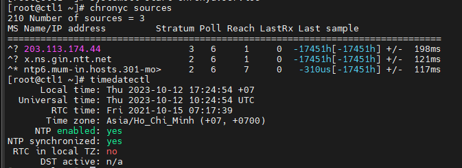

# Cài đặt OpenStack Queens CentOS 7 (ko HA, ko Ceph)

## I. Cài đặt trên node controller

### 1. Cài đặt các thành phần cơ bản

Cấu hình IP, tắt selinux

Update

```sh
yum -y update
```

Cấu hình các mode sysctl: chỉnh sửa trong file ```/etc/sysctl.conf```

```sh
echo 'net.ipv4.conf.all.arp_ignore = 1'  >> /etc/sysctl.conf
echo 'net.ipv4.conf.all.arp_announce = 2'  >> /etc/sysctl.conf
echo 'net.ipv4.conf.all.rp_filter = 2'  >> /etc/sysctl.conf
echo 'net.netfilter.nf_conntrack_tcp_be_liberal = 1'  >> /etc/sysctl.conf

cat << EOF >> /etc/sysctl.conf
net.ipv4.ip_nonlocal_bind = 1
net.ipv4.tcp_keepalive_time = 6
net.ipv4.tcp_keepalive_intvl = 3
net.ipv4.tcp_keepalive_probes = 6
net.ipv4.ip_forward = 1
net.ipv4.conf.all.rp_filter = 0
net.ipv4.conf.default.rp_filter = 0
EOF
```

Kiểm tra:

```sh
sysctl -p
```

Khai báo các host

```sh
cat << EOF > /etc/hosts
172.16.10.11 ctl1
172.16.10.12 com1
172.16.10.13 com2
EOF
```

Tạo SSH key và copy sang các node compute khác:

```sh
ssh-keygen
ssh-copy-id root@172.16.10.12
ssh-copy-id root@172.16.10.13
scp /root/.ssh/id_rsa root@172.16.10.12:/root/.ssh/
scp /root/.ssh/id_rsa root@172.16.10.13:/root/.ssh/
```

Đứng từ node control ssh sang node com không cần password là ok

Tiếp theo, cài đặt các gói cần thiết:

```sh
yum -y install centos-release-openstack-queens
yum -y install crudini wget
yum -y install python-openstackclient openstack-selinux python2-PyMySQL
```

### 2. Đồng bộ thời gian

```sh
yum -y install chrony
sed -i 's/server 0.centos.pool.ntp.org iburst/ \
server 1.vn.pool.ntp.org iburst \
server 0.asia.pool.ntp.org iburst \
server 3.asia.pool.ntp.org iburst/g' /etc/chrony.conf
sed -i 's/server 1.centos.pool.ntp.org iburst/#/g' /etc/chrony.conf
sed -i 's/server 2.centos.pool.ntp.org iburst/#/g' /etc/chrony.conf
sed -i 's/server 3.centos.pool.ntp.org iburst/#/g' /etc/chrony.conf
sed -i 's/#allow 192.168.0.0\/16/allow 172.16.10.0\/24/g' /etc/chrony.conf
```

Đồng bộ thời gian

```sh
systemctl enable chronyd.service
systemctl start chronyd.service
chronyc sources
```



### 3. Cài đặt và cấu hình memcache

Cài đặt

```sh
yum install -y memcached
sed -i "s/-l 127.0.0.1,::1/-l 172.16.10.11/g" /etc/sysconfig/memcached

systemctl enable memcached.service
systemctl restart memcached.service
```

### 4. Cài đặt và cấu hình MariaDB

Add repo MariaDB

```sh
curl -LsS -O https://downloads.mariadb.com/MariaDB/mariadb_repo_setup
sudo bash mariadb_repo_setup --mariadb-server-version=10.2
```

Cài đặt MariaDB 10.2