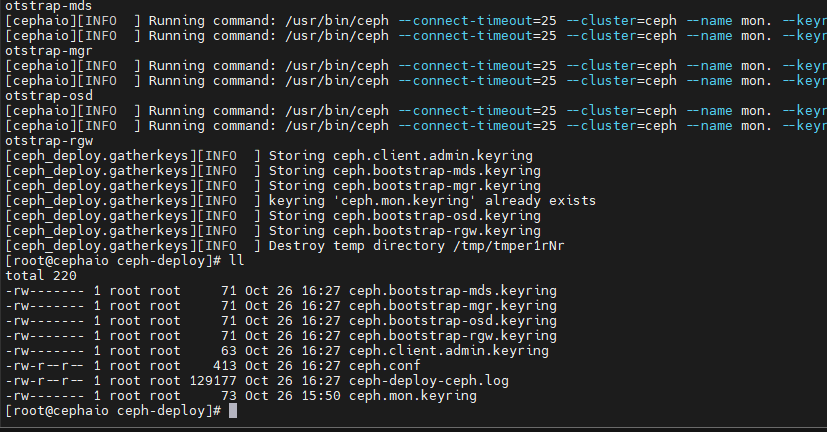
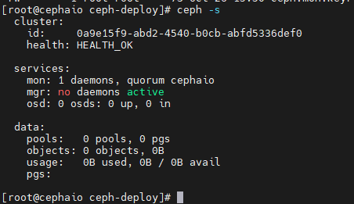
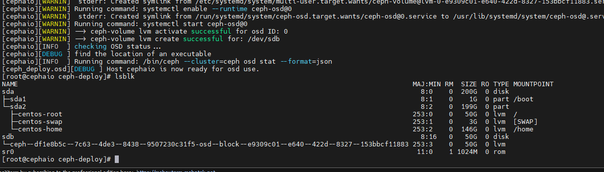
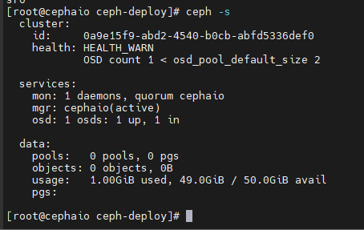
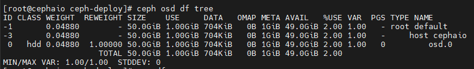
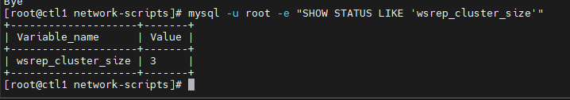
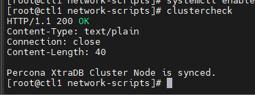
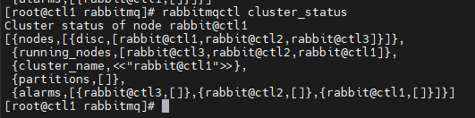
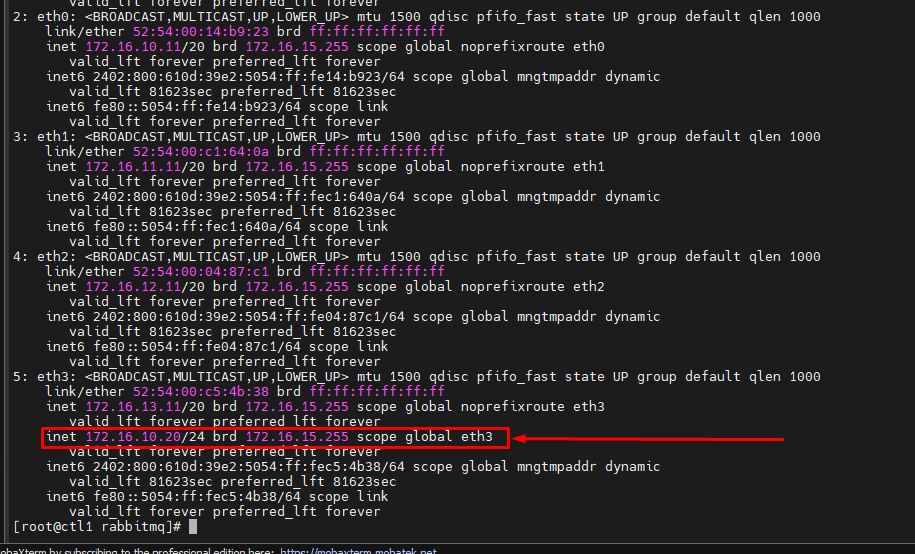

# Cài đặt node CEPH AIO (Luminous)

## Phần 1 - Chuẩn bị

**Phân hoạch IP:**
- Đường Management: eth0 - 172.16.10.19 - Sử dụng để truy cập vào quản trị, cài đặt
- Đường CephCOM: eth2 - 172.16.12.19 - Sử dụng để client kết nối đến
- Đường CephREP: eth1 - 172.16.11.19 - Sử dụng để cụm CEPH đồng bộ dữ liệu với nhau

**Setup node:**

```sh
hostnamectl set-hostname cephaio

sed -i 's/SELINUX=enforcing/SELINUX=disabled/g' /etc/sysconfig/selinux
sed -i 's/SELINUX=enforcing/SELINUX=disabled/g' /etc/selinux/config
systemctl stop firewalld
systemctl disable firewalld
```

Thêm IP đường CEPH-COM vào file hosts:

```sh
echo "172.16.12.19 cephaio" >> /etc/hosts
```

Cấu hình chrony

```sh
yum -y install chrony
VIP_MGNT_IP='172.16.10.10'
sed -i '/server/d' /etc/chrony.conf
echo "server $VIP_MGNT_IP iburst" >> /etc/chrony.conf
systemctl enable chronyd.service
systemctl restart chronyd.service
chronyc sources
```

## Phần 2 - Cài đặt CEPH

Thêm user ```cephuser```, pass ```Welcome123```

```sh
useradd -d /home/cephuser -m cephuser
passwd cephuser

echo "cephuser ALL = (root) NOPASSWD:ALL" | sudo tee /etc/sudoers.d/cephuser
chmod 0440 /etc/sudoers.d/cephuser
```

Bổ sung repo cài đặt CEPH

```sh
cat <<EOF> /etc/yum.repos.d/ceph.repo
[ceph]
name=Ceph packages for $basearch
baseurl=https://download.ceph.com/rpm-luminous/el7/x86_64/
enabled=1
priority=2
gpgcheck=1
gpgkey=https://download.ceph.com/keys/release.asc

[ceph-noarch]
name=Ceph noarch packages
baseurl=https://download.ceph.com/rpm-luminous/el7/noarch
enabled=1
priority=2
gpgcheck=1
gpgkey=https://download.ceph.com/keys/release.asc

[ceph-source]
name=Ceph source packages
baseurl=https://download.ceph.com/rpm-luminous/el7/SRPMS
enabled=0
priority=2
gpgcheck=1
gpgkey=https://download.ceph.com/keys/release.asc
EOF

yum update -y
```

Cài đặt python-setuptools và ceph-deploy

```sh
yum install python-setuptools ceph-deploy -y
```

Cấu hình SSH-key

```sh
ssh-keygen

cat <<EOF> /root/.ssh/config
Host cephaio
    Hostname cephaio
    User cephuser
EOF

ssh-copy-id cephaio
```

### Cấu hình CEPH

Tạo thư mục ```ceph-deploy``` để thao tác và cài đặt vận hành Cluster

```sh
mkdir /home/ceph-deploy && cd /home/ceph-deploy
```

Khởi tạo file cấu hình cho cụm với node quản lý là ```cephaio```

```sh
ceph-deploy new cephaio
```

Cấu hình file ```ceph.conf```

```sh
cat << EOF >> ceph.conf
osd pool default size = 2
osd pool default min size = 1
osd pool default pg num = 128
osd pool default pgp num = 128

osd crush chooseleaf type = 0

public network = 172.16.12.19/24
cluster network = 172.16.11.19/24
EOF
```

Trong đó:
- ```public network```: là đường CephCOM
- ```cluster network```: là đường CephRep

### Cài đặt Ceph qua Ceph deploy

Cài đặt

```sh
ceph-deploy install --release luminous cephaio
```

Kiểm tra

```sh
ceph -v
```


Khởi tạo cluster với các node mon dựa trên file ```ceph.conf```

```sh
ceph-deploy mon create-initial
```



Để node ```cephaio``` có thể thao tác với cluster, chúng ta cần gán cho node ```cephaio``` với quyền admin bằng cách bổ sung cho node này ```admin.keyring```

```sh
ceph-deploy admin cephaio
```

Kiểm tra:

```sh
ceph -s
```



### Khởi tạo MGR

Ceph-mgr là thành phần cài đặt yêu cầu cần khởi tạo từ bản Luminous, có thể cài đặt trên nhiều node hoạt động theo cơ chế Active-Passive

Cài đặt ceph-mgr trên cephaio

```sh
ceph-deploy mgr create cephaio
```

Ceph-mgr hỗ trợ dashboard để quan sát trạng thái của cluster, enable mgr dashboard trên host cephaio

```sh
ceph mgr module enable dashboard
ceph mgr services
```

Truy cập

```sh
http://<ip-cephaio>:7000
```

### Tạo OSD

```sh
ceph-deploy disk zap cephaio /dev/sdb

ceph-deploy osd create --data /dev/sdb cephaio
```



Điều chỉnh Crush để có thể Replicate trên OSD thay vì trên HOST

```sh
cd /home/ceph-deploy
ceph osd getcrushmap -o crushmap
crushtool -d crushmap -o crushmap.decom
sed -i 's|step choose firstn 0 type osd|step chooseleaf firstn 0 type osd|g' crushmap.decom
crushtool -c crushmap.decom -o crushmap.new
ceph osd setcrushmap -i crushmap.new
```

### Kiểm tra lại trạng thái và OSD

Trạng thái

```sh
ceph -s
```



OSD

```sh
ceph osd df tree
```



# Cài đặt các node Controller

Các dải IP sử dụng trong bài lab:
- **172.16.10.0/24**: Management - dùng để truy cập vào node để quản trị
- **172.16.11.0/24**: Provider - dùng cho Neutron cung cấp internet cho VM
- **172.16.12.0/24**: CephCOM - dùng để kết nối truyền dữ liệu với CEPH
- **172.16.13.0/24**: DataVM - dùng để đồng bộ dữ liệu giữa các node

## Phần 1 - Thiết lập ban đầu

Set hostname:

```sh
hostnamectl set-hostname ctl1
```

Cấu hình network, tắt selinux, tắt firewalld, cấu hình chronyd, cấu hình file hosts.

Setup keypair:

```sh
ssh-keygen
```

```sh
ssh-copy-id -o StrictHostKeyChecking=no -i /root/.ssh/id_rsa.pub root@ctl2
ssh-copy-id -o StrictHostKeyChecking=no -i /root/.ssh/id_rsa.pub root@ctl3
```

Cấu hình sysctl

```sh
echo 'net.ipv4.conf.all.arp_ignore = 1'  >> /etc/sysctl.conf
echo 'net.ipv4.conf.all.arp_announce = 2'  >> /etc/sysctl.conf
echo 'net.ipv4.conf.all.rp_filter = 2'  >> /etc/sysctl.conf
echo 'net.netfilter.nf_conntrack_tcp_be_liberal = 1'  >> /etc/sysctl.conf

cat << EOF >> /etc/sysctl.conf
net.ipv4.ip_nonlocal_bind = 1
net.ipv4.tcp_keepalive_time = 6
net.ipv4.tcp_keepalive_intvl = 3
net.ipv4.tcp_keepalive_probes = 6
net.ipv4.ip_forward = 1
net.ipv4.conf.all.rp_filter = 0
net.ipv4.conf.default.rp_filter = 0
EOF

modprobe ip_conntrack

sysctl -p
```

### Lặp lại các bước tương tự với CTL2 và CTL3 !!!

## Phần 2: Setup Galera Cluster

### Setup repo và cài đặt MariaDB

**Trên tất cả các node CTL**, thực hiện:

```sh
cat << EOF >> /etc/yum.repos.d/MariaDB.repo
[mariadb]
name = MariaDB
baseurl = http://yum.mariadb.org/10.3/centos7-amd64
gpgkey=https://yum.mariadb.org/RPM-GPG-KEY-MariaDB
gpgcheck=1
EOF

yum -y update

yum install -y mariadb mariadb-server
systemctl stop mariadb
```

### Cấu hình

**Trên node CTL1**, cấu hình:

```sh
cp /etc/my.cnf.d/server.cnf /etc/my.cnf.d/server.cnf.bak

echo '[server]
[mysqld]
bind-address=172.16.10.11

[galera]
wsrep_on=ON
wsrep_provider=/usr/lib64/galera/libgalera_smm.so
wsrep_cluster_address="gcomm://172.16.10.11,172.16.10.12,172.16.10.13"
binlog_format=row
default_storage_engine=InnoDB
innodb_autoinc_lock_mode=2
wsrep_cluster_name="galera_cluster"
bind-address=172.16.10.11
wsrep_node_address="172.16.10.11"
wsrep_node_name="ctl1"
wsrep_sst_method=rsync

skip-name-resolve
max_connections = 10240
innodb_locks_unsafe_for_binlog=1
query_cache_size=0
query_cache_type=0
innodb_log_file_size=100M
innodb_file_per_table
innodb_flush_log_at_trx_commit=2
[embedded]
[mariadb]
[mariadb-10.3]
' > /etc/my.cnf.d/server.cnf
```

**Trên node CTL2**, cấu hình:

```sh
cp /etc/my.cnf.d/server.cnf /etc/my.cnf.d/server.cnf.bak

echo '[server]
[mysqld]
bind-address=172.16.10.12

[galera]
wsrep_on=ON
wsrep_provider=/usr/lib64/galera/libgalera_smm.so
wsrep_cluster_address="gcomm://172.16.10.11,172.16.10.12,172.16.10.13"
binlog_format=row
default_storage_engine=InnoDB
innodb_autoinc_lock_mode=2
wsrep_cluster_name="galera_cluster"
bind-address=172.16.10.12
wsrep_node_address="172.16.10.12"
wsrep_node_name="ctl2"
wsrep_sst_method=rsync

skip-name-resolve
max_connections = 10240
innodb_locks_unsafe_for_binlog=1
query_cache_size=0
query_cache_type=0
innodb_log_file_size=100M
innodb_file_per_table
innodb_flush_log_at_trx_commit=2
[embedded]
[mariadb]
[mariadb-10.3]
' > /etc/my.cnf.d/server.cnf
```

**Trên node CTL3**, cấu hình:

```sh
cp /etc/my.cnf.d/server.cnf /etc/my.cnf.d/server.cnf.bak

echo '[server]
[mysqld]
bind-address=172.16.10.13

[galera]
wsrep_on=ON
wsrep_provider=/usr/lib64/galera/libgalera_smm.so
wsrep_cluster_address="gcomm://172.16.10.11,172.16.10.12,172.16.10.13"
binlog_format=row
default_storage_engine=InnoDB
innodb_autoinc_lock_mode=2
wsrep_cluster_name="galera_cluster"
bind-address=172.16.10.13
wsrep_node_address="172.16.10.13"
wsrep_node_name="ctl3"
wsrep_sst_method=rsync

skip-name-resolve
max_connections = 10240
innodb_locks_unsafe_for_binlog=1
query_cache_size=0
query_cache_type=0
innodb_log_file_size=100M
innodb_file_per_table
innodb_flush_log_at_trx_commit=2
[embedded]
[mariadb]
[mariadb-10.3]
' > /etc/my.cnf.d/server.cnf
```

### Khởi tạo cluster

**Trên node CTL1**, thực hiện:

```sh
galera_new_cluster
systemctl start mariadb
systemctl enable mariadb
```

**Trên node CTL2 và CTL3**, thực hiện:

```sh
systemctl start mariadb
systemctl enable mariadb
```

### Kiểm tra

Trên node CTL bất kỳ, thực hiện:

```sh
mysql -u root -e "SHOW STATUS LIKE 'wsrep_cluster_size'"
```



### Đặt mật khẩu và phân quyền cho MariaDB

**Trên CTL1:**

```sh
password_galera_root=Welcome123
cat << EOF | mysql -uroot
GRANT ALL PRIVILEGES ON *.* TO 'root'@'%' IDENTIFIED BY '$password_galera_root';FLUSH PRIVILEGES;
GRANT ALL PRIVILEGES ON *.* TO 'root'@'localhost' IDENTIFIED BY '$password_galera_root';FLUSH PRIVILEGES;
GRANT ALL PRIVILEGES ON *.* TO 'root'@'172.16.10.11' IDENTIFIED BY '$password_galera_root';FLUSH PRIVILEGES;
GRANT ALL PRIVILEGES ON *.* TO 'root'@'172.16.10.12' IDENTIFIED BY '$password_galera_root';FLUSH PRIVILEGES;
GRANT ALL PRIVILEGES ON *.* TO 'root'@'172.16.10.13' IDENTIFIED BY '$password_galera_root';FLUSH PRIVILEGES;
GRANT ALL PRIVILEGES ON *.* TO 'root'@'127.0.0.1' IDENTIFIED BY '$password_galera_root';FLUSH PRIVILEGES;

GRANT ALL PRIVILEGES ON *.* TO 'root'@'ctl1' IDENTIFIED BY '$password_galera_root';FLUSH PRIVILEGES;
GRANT ALL PRIVILEGES ON *.* TO 'root'@'ctl2' IDENTIFIED BY '$password_galera_root';FLUSH PRIVILEGES;
GRANT ALL PRIVILEGES ON *.* TO 'root'@'ctl3' IDENTIFIED BY '$password_galera_root';FLUSH PRIVILEGES;
EOF
```

### Cấu hình HAProxy check Mysql

**Trên node CTL1**, cài đặt và cấu hình plugin check Mysql

```sh
yum install rsync xinetd crudini git -y
git clone https://github.com/thaonguyenvan/percona-clustercheck
cp percona-clustercheck/clustercheck /usr/local/bin

cat << EOF >> /etc/xinetd.d/mysqlchk
service mysqlchk
{
      disable = no
      flags = REUSE
      socket_type = stream
      port = 9200
      wait = no
      user = nobody
      server = /usr/local/bin/clustercheck
      log_on_failure += USERID
      only_from = 0.0.0.0/0
      per_source = UNLIMITED
}
EOF
```

Tạo service:

```sh
echo 'mysqlchk 9200/tcp # MySQL check' >> /etc/services
```

Tạo tài khoản check mysql

```sh
mysql -uroot -pWelcome123
GRANT PROCESS ON *.* TO 'clustercheckuser'@'localhost' IDENTIFIED BY 'clustercheckpassword!';
FLUSH PRIVILEGES;
EXIT
```

Bật xinetd

```sh
systemctl enable xinetd --now
```

Kiểm tra:

```sh
clustercheck
```



**Làm tương tự với 2 node CTL2 và CTL3 !!!**

## Phần 3: Cài đặt RabbitMQ Cluster

### Cài đặt môi trường và RabbitMQ Cluster

**Thực hiện trên cả 3 node CTL:**

```sh
yum -y install epel-release
yum -y install erlang socat wget

wget https://github.com/rabbitmq/rabbitmq-server/releases/download/rabbitmq_v3_6_15/rabbitmq-server-3.6.15-1.el7.noarch.rpm
rpm --import https://www.rabbitmq.com/rabbitmq-release-signing-key.asc
rpm -Uvh rabbitmq-server-3.6.15-1.el7.noarch.rpm

systemctl enable rabbitmq-server --now
systemctl status rabbitmq-server

rabbitmq-plugins enable rabbitmq_management
chown -R rabbitmq:rabbitmq /var/lib/rabbitmq/
```

### Cấu hình Cluster RabbitMQ

**Trên Node CTL1**, khởi tạo RabbitMQ Cluster:

```sh
rabbitmqctl add_user openstack Welcome123
rabbitmqctl set_permissions openstack ".*" ".*" ".*"
rabbitmqctl set_user_tags openstack administrator
rabbitmqctl set_policy ha-all '^(?!amq\.).*' '{"ha-mode": "all"}'

scp -p /var/lib/rabbitmq/.erlang.cookie ctl2:/var/lib/rabbitmq/.erlang.cookie
scp -p /var/lib/rabbitmq/.erlang.cookie ctl3:/var/lib/rabbitmq/.erlang.cookie

rabbitmqctl start_app
rabbitmqctl cluster_status
```

**Trên node CTL2 và CTL3**, thực hiện join cluster:

```sh
chown rabbitmq:rabbitmq /var/lib/rabbitmq/.erlang.cookie
chmod 400 /var/lib/rabbitmq/.erlang.cookie

systemctl restart rabbitmq-server.service

rabbitmqctl stop_app
rabbitmqctl join_cluster rabbit@ctl1
rabbitmqctl start_app
```



## Phần 4: Triển khai PCS

### Chuẩn bị

**Trên tất cả các node CTL, cài đặt pacemaker corosync:**

```sh
yum install pacemaker corosync haproxy pcs fence-agents-all resource-agents psmisc policycoreutils-python -y

echo Welcome123 | passwd --stdin hacluster

systemctl enable pcsd pacemaker corosync haproxy

systemctl start pcsd
```

### Cấu hình Cluster

**Trên node CTL1:**

```sh
pcs cluster auth ctl1 ctl2 ctl3 -u hacluster -p Welcome123
pcs cluster setup --name ha_cluster ctl1 ctl2 ctl3

pcs cluster enable --all
pcs cluster start --all

pcs property set stonith-enabled=false
pcs property set no-quorum-policy=ignore
pcs property set default-resource-stickiness="INFINITY"

pcs resource create vip_public ocf:heartbeat:IPaddr2 ip=172.16.10.20 cidr_netmask=20 nic=eth0 \
meta migration-threshold=3 failure-timeout=60 resource-stickiness=1 \
op monitor interval=5 timeout=20 \
op start interval=0 timeout=30 \
op stop interval=0 timeout=30

pcs resource create p_haproxy systemd:haproxy \
meta migration-threshold=3 failure-timeout=120 target-role=Started \
op monitor interval=30 timeout=60 \
op start interval=0 timeout=60 \
op stop interval=0 timeout=60

pcs constraint colocation add vip_public with p_haproxy score=INFINITY
pcs constraint order start vip_public then start p_haproxy
```



### Cấu hình HAProxy

**Thực hiện trên cả 3 node CTL1, CTL2, CTL3:**

```sh
cp /etc/haproxy/haproxy.cfg /etc/haproxy/haproxy.cfg.org 
rm -rf /etc/haproxy/haproxy.cfg

cat >> /etc/haproxy/haproxy.cfg << EOF
global
    daemon
    group  haproxy
    log  /dev/log local0
    log /dev/log    local1 notice
    maxconn  16000
    pidfile  /var/run/haproxy.pid
    stats  socket /var/lib/haproxy/stats
    tune.bufsize  32768
    tune.maxrewrite  1024
    user  haproxy


defaults
    log  global
    maxconn  8000
    mode  http
    option  redispatch
    option  http-server-close
    option  splice-auto
    retries  3
    timeout  http-request 20s
    timeout  queue 1m
    timeout  connect 10s
    timeout  client 1m
    timeout  server 1m
    timeout  check 10s

listen stats
    bind 172.16.10.20:8080
    mode http
    stats enable
    stats uri /stats
    stats realm HAProxy\ Statistics

listen mysqld 
    bind 172.16.10.20:3306
    balance  leastconn
    mode  tcp
    option  httpchk
    option  tcplog
    option  clitcpka
    option  srvtcpka
    timeout client  28801s
    timeout server  28801s    
    server ctl1 172.16.10.11:3306 check port 9200 inter 5s fastinter 2s rise 3 fall 3 
    server ctl2 172.16.10.12:3306 check port 9200 inter 5s fastinter 2s rise 3 fall 3 backup
    server ctl3 172.16.10.13:3306 check port 9200 inter 5s fastinter 2s rise 3 fall 3 backup


listen keystone-5000
    bind 172.16.10.20:5000 
    option  httpchk
    option  httplog
    option  httpclose
    balance source
    server ctl1 172.16.10.11:5000  check inter 5s fastinter 2s downinter 2s rise 3 fall 3
    server ctl2 172.16.10.12:5000  check inter 5s fastinter 2s downinter 2s rise 3 fall 3
    server ctl3 172.16.10.13:5000  check inter 5s fastinter 2s downinter 2s rise 3 fall 3

listen keystone-35357
    bind 172.16.10.20:35357
    option  httpchk
    option  httplog
    option  httpclose
    balance source
    server ctl1 172.16.10.11:35357  check inter 5s fastinter 2s downinter 2s rise 3 fall 3
    server ctl2 172.16.10.12:35357  check inter 5s fastinter 2s downinter 2s rise 3 fall 3
    server ctl3 172.16.10.13:35357  check inter 5s fastinter 2s downinter 2s rise 3 fall 3


listen nova-api-8774
    bind 172.16.10.20:8774 
    option  httpchk
    option  httplog
    option  httpclose
    timeout server  600s
    server ctl1 172.16.10.11:8774  check inter 5s fastinter 2s downinter 3s rise 3 fall 3
    server ctl2 172.16.10.12:8774  check inter 5s fastinter 2s downinter 3s rise 3 fall 3
    server ctl3 172.16.10.13:8774  check inter 5s fastinter 2s downinter 3s rise 3 fall 3

listen nova-metadata-api
    bind 172.16.10.20:8775 
    option  httpchk
    option  httplog
    option  httpclose
    server ctl1 172.16.10.11:8775  check inter 5s fastinter 2s downinter 3s rise 3 fall 3
    server ctl2 172.16.10.12:8775  check inter 5s fastinter 2s downinter 3s rise 3 fall 3
    server ctl3 172.16.10.13:8775  check inter 5s fastinter 2s downinter 3s rise 3 fall 3

listen nova-novncproxy
	bind 172.16.10.20:6080
    balance  source
    option  httplog
    server ctl1 172.16.10.11:6080  check
    server ctl2 172.16.10.12:6080  check
    server ctl3 172.16.10.13:6080  check
    
listen nova_placement_api
    bind 172.16.10.20:8778
    balance source
    option tcpka
    option tcplog
    http-request del-header X-Forwarded-Proto
    server ctl1 172.16.10.11:8778 check inter 2000 rise 2 fall 5
    server ctl2 172.16.10.12:8778 check inter 2000 rise 2 fall 5
    server ctl3 172.16.10.13:8778 check inter 2000 rise 2 fall 5    
    
listen glance-api
    bind 172.16.10.20:9292
    option  httpchk /versions
    option  httplog
    option  httpclose
    timeout server  11m
    server ctl1 172.16.10.11:9292  check inter 5s fastinter 2s downinter 3s rise 3 fall 3
    server ctl2 172.16.10.12:9292  check inter 5s fastinter 2s downinter 3s rise 3 fall 3
    server ctl3 172.16.10.13:9292  check inter 5s fastinter 2s downinter 3s rise 3 fall 3

listen glance-registry
    bind 172.16.10.20:9191 
    timeout server  11m
    server ctl1 172.16.10.11:9191  check
    server ctl2 172.16.10.12:9191  check
    server ctl3 172.16.10.13:9191  check

listen neutron
    bind 172.16.10.20:9696 
    option  httpchk
    option  httplog
    option  httpclose
    balance source
    server ctl1 172.16.10.11:9696  check inter 5s fastinter 2s downinter 3s rise 3 fall 3
    server ctl2 172.16.10.12:9696  check inter 5s fastinter 2s downinter 3s rise 3 fall 3
    server ctl3 172.16.10.13:9696  check inter 5s fastinter 2s downinter 3s rise 3 fall 3

listen cinder-api
    bind 172.16.10.20:8776 
    option  httpchk
    option  httplog
    option  httpclose
    server ctl1 172.16.10.11:8776  check inter 5s fastinter 2s downinter 3s rise 3 fall 3
    server ctl2 172.16.10.12:8776 backup check inter 5s fastinter 2s downinter 3s rise 3 fall 3
    server ctl3 172.16.10.13:8776 backup check inter 5s fastinter 2s downinter 3s rise 3 fall 3

  
listen horizon
    bind 172.16.10.20:80
    balance  source
    mode  http
    option  forwardfor
    option  httpchk
    option  httpclose
    option  httplog
    stick  on src
    stick-table  type ip size 200k expire 30m
    timeout  client 3h
    timeout  server 3h
    server ctl1 172.16.10.11:80  weight 1 check
    server ctl2 172.16.10.12:80  weight 1 check
    server ctl3 172.16.10.13:80  weight 1 check
EOF
```

### Restart service

**Thực hiện trên CTL1:**

```sh
pcs resource restart p_haproxy
pcs resource cleanup
```

Kiểm tra:

```sh

```