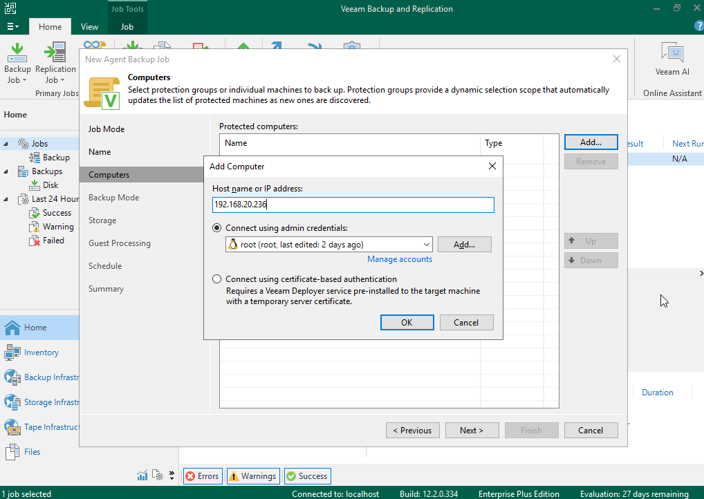
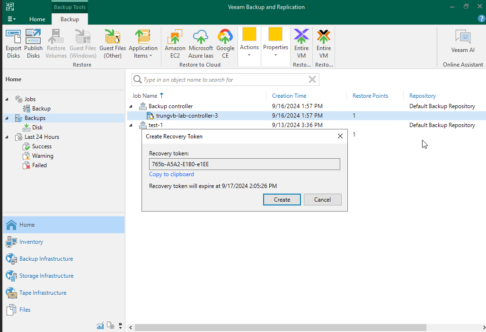

# Thay thế Controller node

Tài liệu này mô tả các bước cần thực hiện để thêm và xóa controller node trên 1 cụm openstack được cài đặt bởi Kolla Ansible. 

Lưu ý rằng, các bước cần thiết có thể khác nhau tùy thuộc vào dịch vụ nào đang chạy trên chúng.

## Thêm Controller node

Chạy bootstrap cho server(s) mới, lệnh này thêm các entry cần thiết vào ```/etc/hosts``` cũng như 1 vài dịch vụ khác như RabbitMQ. Nếu sử dụng tùy chọn ```limit``` thì hãy đảm bảo là chỉ định **tất cả** các node controller có trong cụm:

```sh
kolla-ansible -i multinode bootstrap-servers --limit <control>
```

Pull về các container images cho host mới:

```sh
kolla-ansible -i multinode pull --limit <new-nodes>
```

Thực hiện precheck, lệnh này sẽ thực hiện các bước kiểm tra chẳng hạn như xem các port sử dụng cho openstack services đã bị sử dụng chưa:

```sh
kolla-ansible -i multinode prechecks --limit <new-nodes>
```

Để bootstraps được keystone, ta sẽ phải chạy kolla-ansible mà bao gồm tất cả các keystone hosts, do đó, ta có thể deploy keystone trước với lệnh sau:

```sh
kolla-ansible -i multinode deploy --tags keystone
```

Deploy containers trên host mới:

```sh
kolla-ansible -i multinode deploy --limit <new-nodes>
```

Sau khi lệnh trên hoàn thành (mà không gặp lỗi) thì controller mới đã được deploy rồi. Ta nên kiểm tra lại 1 vòng các dịch vụ để đảm bảo chúng vẫn hoạt động.

Một vài tài nguyên có thể không tự động được cân bằng trên host mới. Ta nên cân bằng thủ công các tài nguyên này. Ví dụ như các networks được quản lý bởi DHCP Agent, và routers của L3 Agent. Phần dưới đây sẽ đề cập đến cách thực hiện chi tiết.

## Xóa Controller node

Khi loại bỏ controllers hay bất kỳ node nào khác khỏi cụm. hãy đảm bảo là số lượng nodes còn lại vẫn đủ để tạo nên 1 quorum. VD, trong 1 hệ thống có 3 controllers, ta chỉ nên loại bỏ 1 controller cùng lúc.

Trước khi loại bỏ controller khỏi cụm, hãy đảm bảo ta đã di chuyển các tài nguyên đang đặt trên đó, phần dưới đây sẽ đề cập đến networks và routers, các tài nguyên khác có thể được cân nhắc tùy vào mô hình.

Với mỗi node controller bị loại bỏ, hãy thực hiện:

```sh
source_host=<host>
target_host=<target host>
l3_id=$(openstack network agent list --host $source_host --agent-type l3 -f value -c ID)
target_l3_id=$(openstack network agent list --host $target_host --agent-type l3 -f value -c ID)
openstack router list --agent $l3_id -f value -c ID | while read router; do
  openstack network agent remove router $l3_id $router --l3
  openstack network agent add router $target_l3_id $router --l3
done
openstack network agent set $l3_id --disable
```

Thực hiện tương tự với DHCP agents:

```sh
dhcp_id=$(openstack network agent list --host $source_host --agent-type dhcp -f value -c ID)
target_dhcp_id=$(openstack network agent list --host $target_host --agent-type dhcp -f value -c ID)
openstack network list --agent $dhcp_id -f value -c ID | while read network; do
  openstack network agent remove network $dhcp_id $network --dhcp
  openstack network agent add network $target_dhcp_id $network --dhcp
done
```

Dừng tất cả dịch vụ chạy trên host mà sẽ bị loại bỏ:

```sh
kolla-ansible -i <inventory> stop --yes-i-really-really-mean-it --limit <removed_node>
```

**Loại bỏ hosts trên khỏi Kolla-Ansible inventory**

Deploy lại rabbitmq cluster, tại mỗi host controller còn lại, thực hiện:

```sh
docker rm -f rabbitmq
cp -Rv /var/lib/docker/volumes/rabbitmq/_data/mnesia{,.bk$(date +%F)}
rm -rf /var/lib/docker/volumes/rabbitmq/_data/mnesia/
```

Tại Kolla node, deploy rabbitmq:

```sh
kolla-ansible -i <inventory> deploy --tags rabbitmq
```

Cấu hình lại các controllers còn lại để cập nhật thông tin về các thành viên có trong cụm, chẳng hạn như cụm Mariadb. Sử dụng 1 limit phù hợp trong lệnh này, chẳng hạn như ```--limit control```

```sh
kolla-ansible -i <inventory> deploy --limit control
```

Với mỗi host bị loại bỏ, dọn dẹp service nó để lại như sau:

```sh
openstack network agent list --host <host> -f value -c ID | while read id; do
  openstack network agent delete $id
done

openstack compute service list --os-compute-api-version 2.53 --host <host> -f value -c ID | while read id; do
  openstack compute service delete --os-compute-api-version 2.53 $id
done
```

Nếu node cũng chạy dịch vụ ```etcd```, hãy đặt tham số ```etcd_remove_deleted_members``` thành ```yes``` trong ```globals.yml```


# Thay thế Controller node sử dụng Veeam

Phần thứ 2 của tài liệu này mô tả các bước để thay thế node controller của cluster Openstack sử dụng **Veeam Backup & Replication**.

**Lưu ý**: bài này sử dụng môi trường ảo hóa để thực hiện, có nhiều bước sẽ khác so với khi thực hiện với máy chủ vật lý.

## Cài đặt máy chủ Veeam Backup

Ở đây chúng ta sẽ sử dụng veeam backup trên windows, việc cài đặt Veeam không nằm trong phạm vi của bài này.

## Backup

Đầu tiên, hãy thực hiện backup toàn bộ server cũ:

- Tạo job


- Next


- Đặt tên cho job


- Chọn Add


- Nhập IP và thêm tài khoản (hoặc key) để ssh, sau đó OK và Next



- Chọn ```Entire computer```


- Chọn nơi lưu trữ backup, có thể sử dụng local disk luôn cho đơn giản


- Next


- Do chúng ta chỉ cần backup 1 lần nên không chọn schedule


- Finish


- Right click vào job và chọn ```Start``` để tiến hành backup


- Sau khi backup xong, chuột phải vào bản backup và chọn ```Create recovery token```


- Lưu bản token lại và chọn ```Create```



## Restore

- Xóa node controller cũ và kiểm tra dịch vụ


Có thể thấy do quorum vẫn còn nên API vẫn hoạt động, các service liên quan đến node vừa xóa đã down.

- Tạo node controller mới với tên như cũ và disk sử dụng iso veeam như sau


- Chọn lại port, security group,... sao cho giống server cũ và nhấn ```Launch instance```

- Gắn disk vào node vừa tạo để restore vào


- Truy cập vào console, chấp nhận ĐKSD và chọn ```Continue```


- Restore volume


- Add VBR Server


- Nhập IP Address và Recovery Token


- Chọn bản backup


- Chọn ổ đã gắn vào để restore và nhấn Enter


- Chọn ```Restore from...```


- Chọn ```vda```


- Nhấn phím ```S``` để tiến hành restore


- Veeam sẽ tóm tắt các bước mà nó sẽ thực hiện ở màn hình này, sau khi đã chắc chắn, ta có thể nhấn ```Enter``` để bắt đầu


- Done


- Giờ ta xóa server vừa tạo và tạo lại 1 server mới với root disk là disk vừa được restore

- Sau khi tạo xong, ssh vào server và kiểm tra


- Hầu hết các container đã hoạt động, riêng mariadb thì có thể bị bất đồng bộ, ta có thể xử lý bằng cách truy cập server kolla và thực hiện lệnh sau:

```sh
kolla-ansible -i ~/multinode mariadb_recovery
```

- Done


