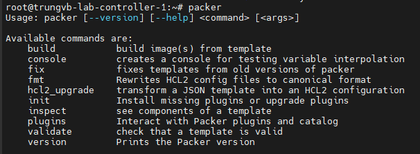

# Build Image with Openstack Packer

Đối với vai trò nhà cung cấp dịch vụ đám mây, việc cung cấp các dịch vụ như Cloud Server nhanh chóng đòi hỏi quá trình triển khai nhanh chóng.

Quá trình build image cho Cloud Server cũng vậy. Cần tự động hóa, nâng cao bảo mật và đảm bảo sự đồng nhất trong đội ngũ quản trị.

Xây dựng images cho Cloud cũng đặt ra nhiều phương pháp:

  - Xây dựng thủ công sử dụng công cụ như virt-manager hoặc virt-install.
  - Tự động hóa bằng cách sử dụng các công cụ như Packer, Terraform, Ansible, disk-image-builder.

Packer là một công cụ phổ biến, hỗ trợ nhiều nền tảng, và nhận được sự hỗ trợ và cập nhật đầy đủ từ cộng đồng lớn.

## I. Install KVM/QEMU

Server dùng để cài đặt Packer cần có KVM để build image, ta có thể cài đặt nó ở **Ubuntu** với lệnh sau đây:

```sh
# Update packages
sudo apt update
 
# Install
sudo apt install qemu-kvm libvirt-clients libvirt-daemon-system bridge-utils virt-manager
 
# Startup
sudo systemctl enable --now libvirtd
 
# Add user current to group
sudo adduser `id -un` libvirt
sudo adduser `id -un` libvirt-qemu
```

## II. Install Packer

Packer có thể cài đặt trên nhiều nền tảng khác nhau, trong bài này mình sẽ thực hiện trên Ubuntu 22.04:

```sh
curl -fsSL https://apt.releases.hashicorp.com/gpg | sudo apt-key add -
sudo apt-add-repository "deb [arch=amd64] https://apt.releases.hashicorp.com $(lsb_release -cs) main"
sudo apt-get update && sudo apt-get install packer
```

Sau khi cài đặt xong thì có thể sử dụng lệnh ```packer```:



## III. Build an image

Để cho đơn giản thì chúng ta sẽ khởi đầu với việc build 1 image, do đó hãy chắc chắn là server đã được cài đặt Docker.

### 1. Write Packer template

1 Packer template là 1 tệp cấu hình mà định nghĩa bạn sẽ build image gì và build nó như thế nào. Packer template sử dụng Ngôn ngữ cấu hình Hashicorp (Hashicorp Configuration Language - HCL)

Tạo 1 đường dẫn mới với tên ```packer_tutorial```:

```sh
mkdir packer_tutorial && cd packer_tutorial
```

Tạo 1 tệp ```docker-ubuntu.pkr.hcl```

```sh
touch docker-ubuntu-pkr-hcl
```

Thêm đoạn cấu hình sau vào file:

```sh
packer {
  required_plugins {
    docker = {
      version = ">= 1.0.8"
      source = "github.com/hashicorp/docker"
    }
  }
}

source "docker" "ubuntu" {
  image  = "ubuntu:jammy"
  commit = true
}

build {
  name    = "learn-packer"
  sources = [
    "source.docker.ubuntu"
  ]
}
```

Trên đây là 1 Packer template hoàn chỉnh mà ta sẽ sử dụng để xây dựng 1 Ubuntu Docker image. Trong section tiếp theo, ta sẽ đào sâu vào phân tích từng thành phần của nó.

### 2. Packer Block

```packer {}``` block chứa các cấu hình của Packer, bao gồm chỉ định phiên bản Packer version.

Thêm vào đó, bạn sẽ thấy ```required_plugins``` block trong Packer block, nó chỉ định tất cả các plugins cần thiết để build image. Mặc dù Packer được đóng gói vào 1 binary duy nhất, nó phụ thuộc vào các plugins cho rất nhiều chức năng khác nhau. 1 vài plugins này, như Docker Builder, đã được build, maintain, và phát hành bởi HashiCorp, nhưng bất kỳ ai cũng có thể viết và sử dụng plugins.

Mỗi plugin block sẽ bao gồm 1 phiên bản và thuộc tính ```source```. Packer sẽ sử dụng những thuộc tính này để download plugin tương ứng.
  - Thuộc tính ```source``` chỉ cần thiết khi sử dụng plugin bên ngoài HashiCorp domain. Bạn có thể tìm thấy danh sách các plugins của HashiCorp cũng như của công đồng tại đường dẫn này [Packer Builders](https://developer.hashicorp.com/packer/docs/builders)
  - Thuộc tính ```version``` là tùy chọn, nhưng chúng ta nên sử dụng nó để ràng buộc plugin version, nhờ đó Packer không cài đặt 1 version mà không phù hợp với template của bạn. Nếu bạn không chỉ định plugin version, Packer sẽ tự động tải version mới nhất khi khởi tạo

Trong ví dụ template trên, Packer sử dụng ```Docker builder plugin``` mà phiên bản cao hơn hoặc bằng ```1.0.8```

### 3. Source block

```Source``` block cấu hình 1 plugin ```builder``` cụ thể, thứ mà sau đó được gọi tới bởi ```build``` block. ```Source``` block sử dụng builder và communication để định nghĩa loại ảo hóa để sử dụng, cách để khởi chạy image, và cách để kết nối đến nó.

Buidlers và communicators được gộp chung với nhau và cấu hình side-by-side trong 1 ```source``` block. 1 ```source``` có thể được tái sử dụng trong nhiều builds, và ta có thể sử dụng nhiều ```source``` trong 1 build.

Một ```builder``` plugin là 1 thành phần của Packer mà chịu trách nhiệm cho việc tạo 1 machine và chuyển machine thành image.

1 ```source``` block có 2 nhãn quan trọng: ```builder type``` và ```name```. 2 labels này giúp 